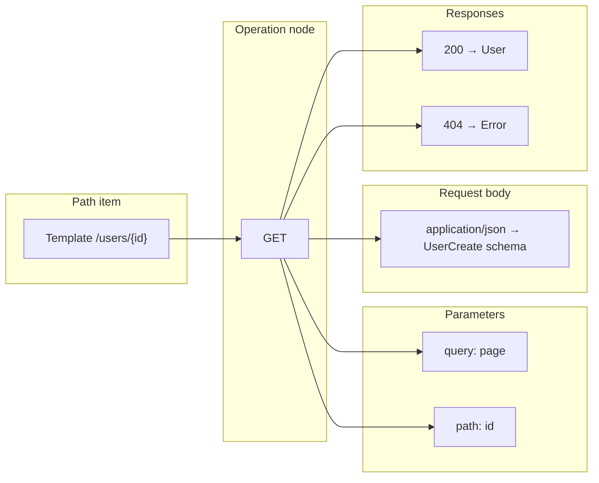

# Objectified: Paths OpenAPI 3.2 Designer — Planned Feature Roadmap

This document defines **epics and ordered, single-scope issues** to deliver a **Paths** UI/UX for authoring **OpenAPI 3.2.0** `paths` (and nested operation objects) against **schema versions** created in the **Designer** canvas. Work is scoped to the **Paths experience** only: **no unrelated refactors or cross-app changes** are listed here. Integration points (shared header, settings entry, design tokens) are described as **reuse of existing Studio chrome**, not as separate issues elsewhere.

## GitHub tracking (`KenSuenobu/objectified-commercial`)

**Label pack:** `paths`, `mvp`, `ui`, `openapi`, `data-model`, `v2`, `roadmap-paths` (use **≤5 labels per issue**).

### Epics (parent issues)

| Epic | GitHub | Scope |
|------|--------|--------|
| E1 — Studio shell & Designer parity | [#2633](https://github.com/KenSuenobu/objectified-commercial/issues/2633) | P-00 — P-03 |
| E2 — React Flow canvas & operations | [#2634](https://github.com/KenSuenobu/objectified-commercial/issues/2634) | P-04 — P-07, P-14 |
| E3 — Parameters & bodies | [#2635](https://github.com/KenSuenobu/objectified-commercial/issues/2635) | P-08 — P-10 |
| E4 — Responses & composition | [#2636](https://github.com/KenSuenobu/objectified-commercial/issues/2636) | P-11 — P-13 |
| E5 — Code, export, PATH QUALITY | [#2637](https://github.com/KenSuenobu/objectified-commercial/issues/2637) | P-15 — P-17 |
| E6 — V2 & OpenAPI gap closure | [#2638](https://github.com/KenSuenobu/objectified-commercial/issues/2638) | P-18, V2-01 — V2-05 |

### Roadmap ID → GitHub issue

| ID | Issue | MVP |
|----|------|-----|
| P-00 | [#2639](https://github.com/KenSuenobu/objectified-commercial/issues/2639) (shipped) | Yes |
| P-01 | [#2640](https://github.com/KenSuenobu/objectified-commercial/issues/2640) (shipped) | Yes |
| P-02 | [#2641](https://github.com/KenSuenobu/objectified-commercial/issues/2641) (shipped) | Yes |
| P-03 | [#2642](https://github.com/KenSuenobu/objectified-commercial/issues/2642) (shipped) | Yes |
| P-04 | [#2643](https://github.com/KenSuenobu/objectified-commercial/issues/2643) (shipped) | Yes |
| P-05 | [#2644](https://github.com/KenSuenobu/objectified-commercial/issues/2644) **(shipped)** | Yes |
| P-06 | [#2645](https://github.com/KenSuenobu/objectified-commercial/issues/2645) **(shipped)** | Yes |
| P-07 | [#2646](https://github.com/KenSuenobu/objectified-commercial/issues/2646) **(shipped)** | Yes |
| P-08 | [#2647](https://github.com/KenSuenobu/objectified-commercial/issues/2647) | Yes |
| P-09 | [#2648](https://github.com/KenSuenobu/objectified-commercial/issues/2648) | Yes |
| P-10 | [#2649](https://github.com/KenSuenobu/objectified-commercial/issues/2649) | Yes |
| P-11 | [#2650](https://github.com/KenSuenobu/objectified-commercial/issues/2650) | Yes |
| P-12 | [#2651](https://github.com/KenSuenobu/objectified-commercial/issues/2651) | Yes |
| P-13 | [#2652](https://github.com/KenSuenobu/objectified-commercial/issues/2652) | Yes |
| P-14 | [#2653](https://github.com/KenSuenobu/objectified-commercial/issues/2653) | Yes |
| P-15 | [#2654](https://github.com/KenSuenobu/objectified-commercial/issues/2654) | Yes |
| P-16 | [#2655](https://github.com/KenSuenobu/objectified-commercial/issues/2655) | Yes |
| P-17 | [#2656](https://github.com/KenSuenobu/objectified-commercial/issues/2656) | Yes |
| P-18 | [#2657](https://github.com/KenSuenobu/objectified-commercial/issues/2657) | No (V2 / backlog) |
| V2-01 | [#2658](https://github.com/KenSuenobu/objectified-commercial/issues/2658) | No |
| V2-02 | [#2659](https://github.com/KenSuenobu/objectified-commercial/issues/2659) | No |
| V2-03 | [#2660](https://github.com/KenSuenobu/objectified-commercial/issues/2660) | No |
| V2-04 | [#2661](https://github.com/KenSuenobu/objectified-commercial/issues/2661) | No |
| V2-05 | [#2662](https://github.com/KenSuenobu/objectified-commercial/issues/2662) | No |

### Epic feature charts (issues by number, MVP vs V2)

**E1 — [#2633](https://github.com/KenSuenobu/objectified-commercial/issues/2633)**

| # | Issue | MVP |
|---|--------|-----|
| ~~2639~~ | ~~P-00 Navigation: header “Paths” + Home grid card~~ **(shipped)** | Yes |
| ~~2640~~ | ~~P-01 Paths shell: header, PATH QUALITY placeholder, Canvas/Code~~ **(shipped)** | Yes |
| ~~2641~~ | ~~P-02 Canvas defaults parity with Designer~~ **(shipped)** | Yes |
| ~~2642~~ | ~~P-03 Persist canvas JSON per version~~ **(shipped)** | Yes |

**E2 — [#2634](https://github.com/KenSuenobu/objectified-commercial/issues/2634)**

| # | Issue | MVP |
|---|--------|-----|
| ~~2643~~ | ~~P-04 Palette drag GET/PUT/PATCH/DELETE/OPTIONS~~ **(shipped)** | Yes |
| ~~2644~~ | ~~P-05 Path nodes + persist `version_path` / `path_operation`~~ **(shipped)** | Yes |
| ~~2645~~ | ~~P-06 Operation inspector (operationId, tags, …)~~ **(shipped)** | Yes |
| ~~2646~~ | ~~P-07 Edges path/op/attachments~~ **(shipped)** | Yes |
| 2653 | P-14 OPTIONS first-class | Yes |

**E3 — [#2635](https://github.com/KenSuenobu/objectified-commercial/issues/2635)**

| # | Issue | MVP |
|---|--------|-----|
| 2647 | P-08 Path/query parameters + schema | Yes |
| 2648 | P-09 Request body + content types | Yes |
| 2649 | P-10 Header/cookie parameters | Yes |

**E4 — [#2636](https://github.com/KenSuenobu/objectified-commercial/issues/2636)**

| # | Issue | MVP |
|---|--------|-----|
| 2650 | P-11 Responses + content map | Yes |
| 2651 | P-12 allOf/anyOf/oneOf composer | Yes |
| 2652 | P-13 Reuse / `$ref` pickers | Yes |

**E5 — [#2637](https://github.com/KenSuenobu/objectified-commercial/issues/2637)**

| # | Issue | MVP |
|---|--------|-----|
| 2654 | P-15 Monaco Code mode + preview | Yes |
| 2655 | P-16 OpenAPI 3.2 export + validation gate | Yes |
| 2656 | P-17 PATH QUALITY score + dialog | Yes |

**E6 — [#2638](https://github.com/KenSuenobu/objectified-commercial/issues/2638)**

| # | Issue | MVP |
|---|--------|-----|
| 2657 | P-18 OpenAPI 3.2 gap matrix & follow-ups | No |
| 2658 | V2-01 Large graph virtualization | No |
| 2659 | V2-02 Collaboration | No |
| 2660 | V2-03 Diff / review | No |
| 2661 | V2-04 Mock server / negotiation | No |
| 2662 | V2-05 Security, callbacks, webhooks | No |

**Tech alignment:** Next.js App Router, **React Flow**, **Radix UI** (dialogs, dropdowns, tabs, toggle group, scroll area, tooltips, etc.), Tailwind, TypeScript, Monaco where a **Code** view is required.

**Existing persistence (already in the database):** paths design is backed by tables such as `odb.version_path`, `odb.path_operation`, `odb.path_operation_description`, `odb.shared_path_parameter`, `odb.path_operation_parameter_link`, `odb.shared_path_request_body`, `odb.shared_path_request_body_content`, `odb.path_operation_request_body_link`, `odb.shared_path_response`, `odb.path_operation_response_link`, and related content/header linkage. Issues below **prefer mapping UI state to these tables** before proposing new columns.

---

## Tag vocabulary (GitHub labels)

Use **at most five labels per issue**. Create any missing label from this set; reuse across issues.

| Label | Meaning |
|--------|---------|
| `paths` | Paths designer / OpenAPI paths surface |
| `mvp` | Required for first shippable Paths MVP |
| `ui` | Primarily frontend UX and React Flow |
| `openapi` | OpenAPI 3.2 document shape, validation, export |
| `data-model` | Persistence, schema mapping, DB/API contracts |

**Optional (V2 only, replaces `mvp` where applicable):** `v2` — enterprise / scale / phase-2 features.

---

## MVP vs V2 (summary)

| Horizon | Focus |
|---------|--------|
| **MVP** | OpenAPI 3.2–aligned **paths** authoring: operations **get, put, patch, delete, options** as canvas nodes; **parameters** (path/query at minimum for MVP) tied to **version schema** and **properties**; **request/response** bodies and content types referencing **classes** and **inline/composite** schemas; **Canvas/Code** switcher; **shared Studio header** (project/version, settings); **PATH QUALITY** score; **edges** that communicate flow and attachments; **Radix**-based editors and panels; export/validate **OpenAPI 3.2** paths object + minimal global context. |
| **V2** | Large-spec performance, collaboration, advanced security/callbacks/webhooks polish, diff/merge between path revisions, codegen pipelines, mock servers, granular RBAC, A/B layouts, plugin extensions. |

---

## Visual language (target look)

### Application shell (ASCII)

```
┌────────────────────────────────────────────────────────────────────────────── Studio ──┐
│ [ Project ▾ ] [ Version ▾ ] [ PATH QUALITY 72 B ] | Canvas / Code       [ ⚙ Settings ] │
├────────────┬───────────────────────────────────────────────────────────────────────────┤
│  Palette   │  React Flow canvas (same grid/snap/guides behavior as Designer)           │
│  ┌──────┐  │     ┌─────────────┐      edges      ┌──────────────┐                      │
│  │ GET  │  │     │  /users     │────────────────▶│ GET users    │                      │
│  └──────┘  │     │  path node  │                 │  operation   │                      │
│  ┌──────┐  │     └─────────────┘                 └──────┬───────┘                      │
│  │ PUT  │  │                                            │ edges to param/body/response │
│  └──────┘  │     ┌────────────┐    ┌──────────────┐   ┌──────────────┐                 │
│  …         │     │ query: page│    │ requestBody  │   │ 200 UserDTO  │                 │
│            │     └────────────┘    └──────────────┘   └──────────────┘                 │
└────────────┴───────────────────────────────────────────────────────────────────────────┘
```

### Data-flow diagram (Mermaid)



---

## Epics (issue groups)

| Epic ID | Title | Issues |
|---------|--------|--------|
| **E1** | Studio shell & Designer parity | P-00 — P-03 |
| **E2** | React Flow canvas & operations | P-04 — P-07 |
| **E3** | Parameters, properties & bodies | P-08 — P-11 |
| **E4** | Responses, classes & composition | P-12 — P-14 |
| **E5** | Code view, OpenAPI 3.2 & quality | P-15 — P-17 |
| **E6** | V2 — Enterprise & scale | V2-01 — V2-05 |

---

## Ordered issues (complete in this order)

Each issue is intentionally small enough to ship independently. After each issue, the Paths experience should show a **visible, testable improvement**.

---

### P-00 — Navigation: Studio header “Paths” link and Home grid card ✅

**Epic:** E1 · **GitHub:** [#2639](https://github.com/KenSuenobu/objectified-commercial/issues/2639) · **Labels:** `paths`, `mvp`, `ui`, `roadmap-paths` · **Status:** shipped

**Title:** Add Paths navigation in Studio header and a four-wide Home card grid entry to the right of Designer

**Description:**  
Expose **Paths** next to **Designer** in the top Studio selector row (**“Paths”** text link to the right of **Designer**). On the **Home** dashboard, use a **four-column** card grid and place a **Paths** card **immediately to the right of** the **Designer** card so users can discover the Paths editor. **Mandatory** navigation chrome touch; keep visual parity with existing cards.

**Acceptance criteria:** See GitHub issue body [#2639](https://github.com/KenSuenobu/objectified-commercial/issues/2639).

---

### P-01 — Paths page shell: shared header, PATH QUALITY, Canvas/Code ✅

**Epic:** E1 · **Labels:** `paths`, `mvp`, `ui` · **Status:** shipped

**Title:** Paths Studio shell with project/version, settings, PATH QUALITY label, Canvas/Code toggle

**Description:**  
Introduce the Paths editor **top header** so it **matches the Designer pattern**: project and version dropdowns, **settings** entry point using the **same settings surface** as the Designer (reuse; no duplicate settings implementation). Add a **Canvas | Code** toggle (Radix `ToggleGroup`) consistent with the Designer’s switcher. Replace “Schema quality” copy with **“PATH QUALITY”** and reserve space for a numeric score (stubbed until P-17).

**Acceptance criteria:**
- With a project and version selected, the Paths route shows **Project** and **Version** selectors and **Settings** affordance in the same structural positions as the Designer header pattern.
- **Canvas | Code** toggle persists the active mode for the session (and restores on navigation if the app already does this for Designer).
- Header shows **PATH QUALITY** as the metric title (not “Schema quality”), with a non-interactive placeholder until scoring lands.
- No regressions to navigation into/out of Paths.

**Technical details:**
- Radix: `ToggleGroup`, `DropdownMenu` / `Select` as used elsewhere for parity.
- Use existing Studio context/providers for project/version/settings where Paths is mounted.

**Database/API:** None.

---

### P-02 — Paths canvas defaults: parity with Designer canvas options

**Epic:** E1 · **Labels:** `paths`, `mvp`, `ui`

**Title:** Paths React Flow canvas uses the same canvas option set as the Designer

**Description:**  
Wire Paths canvas behavior to the **same controls** the Designer uses: grid, snap, guides, background, edge styling/routing/animation, LOD/focus behaviors **as applicable to Paths**. Persist user preferences **under paths-specific storage keys** so Designer and Paths do not clobber each other’s settings.

**Acceptance criteria:**
- Toggling grid, snap, guides, and edge options in Paths produces the same **categories** of behavior users see in the Designer (within React Flow constraints).
- Paths preferences are isolated from Designer keys; switching between Designer and Paths preserves each surface’s last settings.
- Empty canvas still renders performantly at 1080p.

**Technical details:**
- Mirror Designer’s React Flow `defaultEdgeOptions`, `connectionLineStyle`, `snapGrid`, and any `onMove`/`fitView` conventions.
- Namespaced local storage or context branch: e.g. `studio.paths.*` vs `studio.designer.*`.

**Database/API:** None.

---

### P-03 — Persist Paths canvas layout (nodes, edges, viewport) per version

**Epic:** E1 · **Labels:** `paths`, `mvp`, `data-model`

**Title:** Save and restore Paths canvas graph state for the active API version

**Description:**  
Operation definitions already live in **`odb.version_path`** / **`odb.path_operation`** and related tables; **React Flow** layout (node positions, edge list, viewport) is not automatically derived. Persist a **canonical JSON blob** of `{ nodes, edges, viewport }` for the **Paths** editor **scoped to `version_id`**.

**Why this database work matters:**  
Without persisted graph state, users lose drag-and-drop layout on refresh and cannot iterate on API design visually. Storing layout **separately** from OpenAPI semantic tables keeps **source-of-truth** operations in normalized tables while allowing **free-form** canvas metadata.

**Acceptance criteria:**
- After arranging nodes and reloading the Paths page for the same version, **positions and edges** restore within tolerance (same node `id` set).
- Clearing a version’s paths data (if supported) clears layout consistently.
- Conflict strategy: last-write-wins with optimistic UI; no silent merge in MVP.

**Technical details:**
- **Proposed schema (choose one in implementation; document in migration):**
  - **Option A:** `ALTER TABLE odb.versions ADD COLUMN paths_canvas_metadata JSONB DEFAULT '{}'::jsonb;` with GIN optional.
  - **Option B:** New table `odb.version_paths_canvas(version_id PK/FK, canvas JSONB, updated_at)`.
- REST: `GET/PUT .../versions/{id}/paths-canvas` (paths-scoped), tenant-safe.

**Database/API:** **Yes** — new column or table as above; **reason:** persist React Flow state per version without overloading `version_path.metadata` (which is path-row scoped).

---

### P-04 — Node palette: draggable operation primitives (GET, PUT, PATCH, DELETE, OPTIONS)

**Epic:** E2 · **Labels:** `paths`, `mvp`, `ui`

**Title:** Left palette with HTTP method nodes drag-and-drop onto React Flow

**Description:**  
Provide a **palette** listing operation methods **GET, PUT, PATCH, DELETE, OPTIONS** as draggable items. Dropping onto the canvas creates an **operation node** with that method; default styling matches Designer’s modern **card** look (borders, shadows, dark mode).

**Acceptance criteria:**
- Drag from palette → drop creates a node with correct **HTTP method** badge.
- Nodes are movable, selectable, and deletable; method is immutable after create unless explicitly changed via inspector (P-06).
- Keyboard: Delete removes selected nodes.

**Technical details:**
- React Flow: custom node type `http-operation`; `onDrop` / `onDragOver` with `dataTransfer` method.
- Radix: `ScrollArea` for palette if method list grows.

**Database/API:** None until P-05 persists.

---

### P-05 — Path item authoring: create `/pathname` and bind operations (CRUD to existing tables)

**Epic:** E2 · **Labels:** `paths`, `mvp`, `data-model`

**Title:** Path template nodes and persistence to `version_path` + `path_operation`

**Description:**  
Add a **Path** node representing the OpenAPI **path template** (e.g. `/users/{id}`). Associate palette-created operations with a Path node. On save, create/update rows in **`odb.version_path`** and **`odb.path_operation`** via existing REST patterns. Enforce **unique (`version_path_id`, `operation`)** at the API layer with a clear error.

**Acceptance criteria:**
- User can create a path, set **pathname**, attach **at most one of each** HTTP method operation per path (OpenAPI constraint).
- Reload shows the same paths and operations from the server.
- Invalid pathname segments (unbalanced `{}`) show validation errors before save.

**Technical details:**
- Map React Flow path node `id` ↔ `version_path.id`; operation node ↔ `path_operation.id`.
- Store stable UUIDs in node `data` to survive reload.

**Database/API:** Uses existing tables; **no new tables** if P-03 already stores canvas layout.

---

### P-06 — Operation inspector (Radix): summary, operationId, tags, deprecated, description **(shipped)**

**Epic:** E2 · **Labels:** `paths`, `mvp`, `ui`, `openapi`

**Title:** Side panel or sheet to edit operation metadata per OpenAPI Operation Object

**Description:**  
Selecting an operation opens an **inspector** (Radix `Tabs` + `Sheet` or docked panel) to edit **summary**, **description** (markdown optional), **operationId**, **tags**, **deprecated** — fields persisted via **`path_operation_description`** / operation metadata as already modeled in the REST API.

**Acceptance criteria:**
- Changes persist and reload correctly.
- **operationId** uniqueness is validated **per OpenAPI document scope** for the version (MVP: enforce across all operations in the version).
- Empty optional fields omit cleanly from export (P-15).

**Technical details:**
- Wire to existing endpoints for descriptions/metadata.
- OpenAPI 3.2: field names align with **Operation Object** in OAS 3.2.

**Database/API:** Uses existing endpoints; no structural DB change.

---

### P-07 — Graph edges: operation ↔ path, operation ↔ attachments **(shipped)**

**Epic:** E2 · **Labels:** `paths`, `mvp`, `ui`

**Title:** Edges express flow between path, operation, parameters, bodies, responses

**Description:**  
Introduce **edges** from **Path → Operation**, and from **Operation → Parameter / RequestBody / Response** attachment nodes. Edge labels show **role** (e.g. `hasParam`, `requestBody`, `response 200`). Auto-create edges when children are linked; allow manual reconnect only where semantically valid (MVP: manual drag connect optional if complexity high—**prefer auto**).

**Acceptance criteria:**
- Visual graph clearly shows **which operation** owns which attachments.
- Deleting an operation offers to delete dangling attachment nodes or blocks delete with explicit unlink steps.
- Exported OpenAPI does **not** depend on edge geometry—edges are **presentational**.

**Technical details:**
- React Flow `Edge` types; keep `source`/`target` ids stable.
- Avoid cycles that confuse layout; attachment nodes are **trees** from operations.

**Database/API:** None beyond P-03 canvas JSON including edges.

---

### P-08 — Parameters (path/query): types from class properties & custom schemas

**Epic:** E3 · **Labels:** `paths`, `mvp`, `data-model`, `openapi`

**Title:** Parameter nodes with `in: path|query`, required, schema from property or inline

**Description:**  
For **path** and **query** parameters, implement editors that bind to **`odb.shared_path_parameter`** and **`path_operation_parameter_link`**. **Type** selection prefers **existing version properties** (reuse Designer property catalog) and supports **custom** JSON Schema fragments for parameters when needed.

**MVP OpenAPI coverage:** `name`, `in`, `required`, `schema`, `description`, `style`, `explode` where applicable for query; path params must match **template segments**.

**Acceptance criteria:**
- Path parameters include every `{var}` in the pathname; mismatch blocks save with actionable errors.
- Query parameters can be added/removed; schema references resolve to version classes/properties.
- Export writes valid **Parameter Object** lists under the operation.

**Technical details:**
- Parameter `schema` uses JSON Schema aligned with **OpenAPI 3.2** schema objects (see OAS 3.2 Schema Object rules).
- Reuse property picker component patterns from Designer for consistency.

**Database/API:** Existing shared parameter tables; ensure `data` JSON holds OpenAPI-aligned schema extras when not expressible in columns.

---

### P-09 — Request body: shared body, content types, class ref & inline schema

**Epic:** E3 · **Labels:** `paths`, `mvp`, `data-model`, `openapi`

**Title:** Request body attachment with `content` map and `application/json` (+ optional types)

**Description:**  
Model **Request Body Object** per operation using **`shared_path_request_body`**, **`path_operation_request_body_link`**, and **`shared_path_request_body_content`**. UI supports at least **`application/json`**; architecture allows additional media types in MVP if trivial.

**Acceptance criteria:**
- Exactly one request body attachment per operation when present (matches unique constraint on link table).
- Each content type row selects **class** (`class_id`) **or** inline schema **or** ref string consistent with internal `$ref` strategy.
- Required toggle persists.

**Technical details:**
- Map `encoding` and `examples` columns when present.
- Validation: request body required for PUT/PATCH when server rules demand is **warning**, not hard error (configurable in V2).

**Database/API:** Existing tables.

---

### P-10 — Headers & cookies (MVP subset)

**Epic:** E3 · **Labels:** `paths`, `mvp`, `openapi`

**Title:** Parameter nodes for `header` and `cookie` locations

**Description:**  
Extend P-08 so `in` supports **header** and **cookie** with OpenAPI-accurate fields (`required`, `schema`, `style` where defined).

**Acceptance criteria:**
- Header/cookie parameters export under the operation’s `parameters` array with correct `in`.
- Cookie names and header names validate for allowed characters (surface-level validation).

**Technical details:**  
Reuse shared parameter rows with `in_location` discriminant.

**Database/API:** Existing `shared_path_parameter.in_location`.

---

### P-11 — Responses: status codes, description, headers, content map

**Epic:** E4 · **Labels:** `paths`, `mvp`, `data-model`, `openapi`

**Title:** Response nodes with status code, headers, and `content` per media type

**Description:**  
Implement **Response Object** editing using **`shared_path_response`**, response content tables (as present in DB), and **`path_operation_response_link`**. Support **default** response if DB supports; otherwise track as V2.

**Acceptance criteria:**
- Multiple responses per operation (e.g. 200, 400, 404) with separate nodes or grouped panel—**consistent UX** with clear binding.
- Each response supports **description** and per-media-type schema (class or inline).
- `responseHeaders` (OpenAPI) captured where modeled.

**Technical details:**  
Align status code storage with existing `status_code` column; include `4XX`/`5XX` ranges if supported by API.

**Database/API:** Existing tables; extend API payloads only if columns already exist for headers.

---

### P-12 — Response schemas as classes with `allOf` / `anyOf` / `oneOf`

**Epic:** E4 · **Labels:** `paths`, `mvp`, `openapi`, `data-model`

**Title:** Compositor UI for response schemas (class + inline combinators)

**Description:**  
Responses should be **classes** by default; advanced cases need **allOf / anyOf / oneOf** composition, analogous to Designer schema composition. Provide a **composer** (nested Radix accordions) producing a valid **Schema Object** for each content type, stored in `inline_schema` or decomposed into class refs per product conventions.

**Acceptance criteria:**
- User can build **oneOf** error union vs **allOf** pagination wrapper using explicit UI, not only raw JSON.
- Export matches OpenAPI 3.2 Schema Object semantics.
- Invalid combinations (e.g. contradictory types) are caught before save.

**Technical details:**  
Prefer storing canonical composed schema in `inline_schema` JSONB when no single class suffices; keep `$ref` to version classes when selected.

**Database/API:** Uses `inline_schema` / `class_id` columns on response content rows.

---

### P-13 — Reuse & references: `$ref` to version components and shared parameters

**Epic:** E4 · **Labels:** `paths`, `mvp`, `openapi`

**Title:** Picker for reusing schemas and parameters across operations

**Description:**  
Expose a **library** of reusable items: classes (components), shared parameters, shared responses—pulled from the **same version**. Drag from a **Reuse** mini-palette or pick via combobox (`Command` pattern).

**Acceptance criteria:**
- Selecting an existing class sets `$ref` (or internal id map) without duplicating schema.
- Changing a referenced class name updates references or surfaces broken ref errors on validate (minimum: validate catches).

**Technical details:**  
Centralize ref resolution against version’s schema registry.

**Database/API:** No new tables if refs resolve to existing class ids.

---

### P-14 — OPTIONS and `operationId` for CORS/preflight documentation

**Epic:** E2 · **Labels:** `paths`, `mvp`, `openapi`

**Title:** First-class OPTIONS operation authoring for documented preflight behavior

**Description:**  
Ensure **OPTIONS** operations can be modeled with responses (e.g. 204) and **parameters** as required; surface guidance text that **browser CORS** behavior is environment-specific—MVP documents **intent** in OpenAPI.

**Acceptance criteria:**
- OPTIONS appears in palette and exports.
- Validation differentiates OPTIONS without request body by default (warn-only if body attached).

**Technical details:**  
Map to `path_operation.operation = 'OPTIONS'`.

**Database/API:** Existing operation enum/check constraint—if DB restricts methods, migration may be required; **if so, add widening migration** to allow OPTIONS (some codebases uppercase methods—verify constraint).

---

### P-15 — Code mode: Monaco editor for OpenAPI paths fragment & full document preview

**Epic:** E5 · **Labels:** `paths`, `mvp`, `ui`, `openapi`

**Title:** Code view with synchronized YAML/JSON for paths and full spec preview

**Description:**  
Implement **Code** mode using Monaco. Show **editable** paths section where feasible **or** structured read-only with jump-to-node (choose simplest reliable approach for MVP). Always provide a **preview** of merged **OpenAPI 3.2** document containing **paths** + **components/schemas** from the version.

**Acceptance criteria:**
- Toggling Canvas ↔ Code does not lose unsaved edits; prompts if sync conflicts.
- Syntax highlighting for YAML/JSON; basic format toggle.
- Errors inline for parse failures.

**Technical details:**  
Debounce parse; on success, optionally offer **apply** to canvas (V2 if risky for MVP—**MVP may be preview-only** from canvas to code).

**Database/API:** None.

---

### P-16 — OpenAPI 3.2 export & validation gate (MVP requirements)

**Epic:** E5 · **Labels:** `paths`, `mvp`, `openapi`

**Title:** Export OpenAPI 3.2 document; block export on validation errors

**Description:**  
Assemble **openapi: 3.2.x** document with **`paths`** built from normalized tables + **components** from version classes. Run a **validator** appropriate for OAS 3.2 (adapter or schema-based). **MVP must cover:** unique `operationId`, valid parameter `in` + `name`, consistent path templating, each operation’s **responses** minimally **documented** (allow warning), **content** maps for bodies/responses where required by spec.

**Acceptance criteria:**
- Download **JSON** and **YAML**.
- Validation reports **errors** vs **warnings**; errors block export; warnings allow export with confirmation.
- Document includes **info** stub or project metadata if already available—**do not invent** server URLs if none configured (leave empty or omit per spec rules).

**Technical details:**  
If no stable OAS 3.2 validator exists in ecosystem at implementation time, ship with **best-available** validator + explicit version flag; **do not silently claim success**—document behavior in release notes (still **openapi** issue scope only).

**Database/API:** Read-only assembly from existing data; optional `export_jobs` **out of scope** for MVP.

---

### P-17 — PATH QUALITY score & breakdown dialog

**Epic:** E5 · **Labels:** `paths`, `mvp`, `ui`, `openapi`

**Title:** Replace placeholder with PATH QUALITY metric for paths completeness

**Description:**  
Compute a **0–100** score from weighted checks: missing descriptions, missing operationId, untyped parameters, missing error responses (4xx/5xx), broken `$ref`, duplicate path+method, empty response content, etc. Show **breakdown** in a Radix `Dialog` from the header chip (same interaction model as Designer’s quality dialog).

**Acceptance criteria:**
- Score updates when canvas or code changes (debounced).
- Dialog lists top issues with **click-to-focus** node when possible.
- Copy reflects **PATH QUALITY** branding.

**Technical details:**  
Purely client-side or lightweight REST `POST /paths/quality`—prefer client for MVP.

**Database/API:** None required.

---

## V2 issues (future)

### V2-01 — Large graphs: lazy rendering, virtualization, and subgraph bookmarks

**Labels:** `paths`, `v2`, `ui`

**Description:** Virtualize React Flow for hundreds of operations; bookmark “views” into subgraphs.

**Acceptance criteria:** 500-operation version remains usable on mid-range hardware.

---

### V2-02 — Collaborative editing & presence

**Labels:** `paths`, `v2`, `ui`

**Description:** Real-time cursors, locked nodes, merge semantics.

**Acceptance criteria:** Two users cannot corrupt the same operation without conflict UI.

---

### V2-03 — Diff & PR-style review between path revisions

**Labels:** `paths`, `v2`, `openapi`

**Description:** Structural diff for paths/components with reviewer workflow.

---

### V2-04 — Mock server & example negotiation

**Labels:** `paths`, `v2`, `openapi`

**Description:** Generate runnable mock from paths + examples; `406` content negotiation tests.

---

### V2-05 — Security schemes, callbacks, webhooks (full OpenAPI feature parity)

**Labels:** `paths`, `v2`, `openapi`, `data-model`

**Description:** Extend persistence & UI for security, callbacks, webhooks per OAS 3.2; may require **new tables** for OAuth2 flows and callback maps.

**Database:** Expect additive migrations; reason: not covered by current path-operation normalized tables alone.

---

## OpenAPI 3.2.0 — specification coverage not fully addressed by MVP (`P-00`–`P-17`)

The MVP issues intentionally deliver a **credible Paths authoring** experience for **Path Item**, **Operation**, **Parameter**, **Request Body**, and **Response** objects with **export** and **validation**. They do **not** by themselves guarantee **complete** coverage of every **OpenAPI 3.2.0** feature that touches or surrounds the `paths` object.

**Tracking issue (gap matrix + phased delivery):** [#2657](https://github.com/KenSuenobu/objectified-commercial/issues/2657) (`P-18`).

**Representative gaps (non-exhaustive; normative text is the OpenAPI 3.2.0 spec):**

| Area | MVP coverage | Follow-up |
|------|----------------|-----------|
| `servers` at document / path / operation | Partial or stub only via export rules in `P-16` | `P-18`, `V2-05` |
| `callbacks` | Not in MVP | `P-18`, `V2-05` |
| `links` | Not in MVP | `P-18`, `V2-03`+ |
| Webhooks root object / related runtime | Not in MVP | `P-18`, `V2-05` |
| Full `security` / `securitySchemes` depth | Not in MVP | `P-18`, `V2-05` |
| `trace` server | Unlikely in MVP | `P-18` |
| Path-level vs operation-level parameters | Partial (see `P-08`) | `P-18` |
| `default` response | Conditional on DB/API | `P-11`, `P-18` |
| External / multi-file `$ref` governance | Not in MVP | `P-18`, `V2` |

Closing these gaps is **explicitly** scoped to **`P-18`** and the **V2** issues so MVP delivery stays bounded.

---

## OpenAPI 3.2 MVP coverage checklist (non-exhaustive)

| Topic | MVP issue(s) | Notes |
|--------|----------------|-------|
| Paths object & templates | P-05, P-08 | `{var}` consistency |
| Operation object core | P-06, P-14 | Includes OPTIONS |
| Parameters | P-08, P-10 | path/query + header/cookie |
| Request body | P-09 | `content`, `required` |
| Responses | P-11, P-12 | Status codes, `content`, composition |
| Components / `$ref` | P-13 | Reuse Designer classes |
| Export / validate | P-16 | 3.2 document |
| UX parity | P-01 — P-03, P-17 | Header, canvas, quality |

**Deferred to V2 / `P-18`:** callbacks, comprehensive security schemes storytelling, link objects, advanced runtime expressions, multi-file external `$ref` governance, and other rows in the gap table above.

---

## Completion order (quick reference)

`P-00 → P-01 → P-02 → P-03 → P-04 → P-05 → P-06 → P-07 → P-08 → P-09 → P-10 → P-11 → P-12 → P-13 → P-14 → P-15 → P-16 → P-17` then `P-18` and `V2-01 … V2-05` as needed.

---

*Document version: 1.1 — Paths OpenAPI 3.2 designer roadmap (UI scope only); GitHub issues filed as epics #2633–#2638 and children #2639–#2662.*
