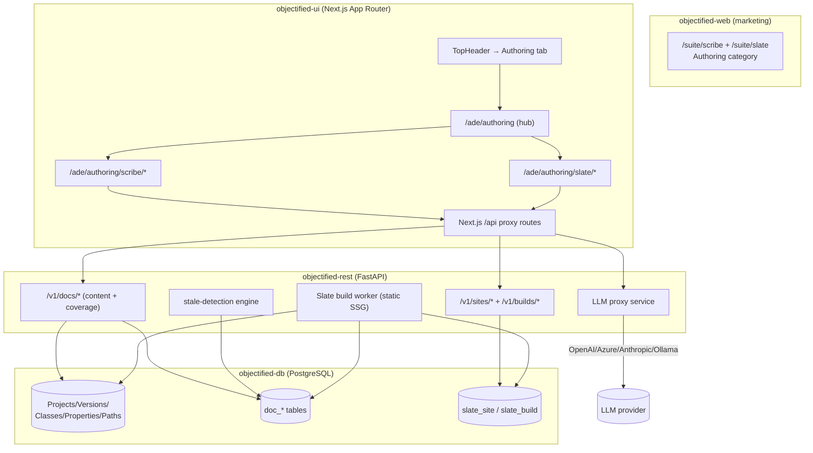
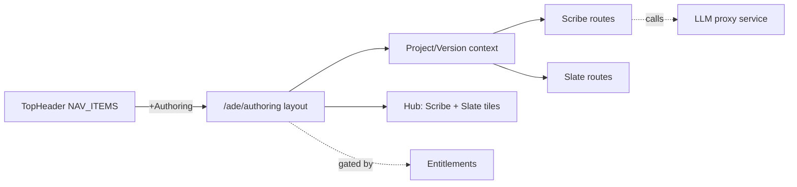
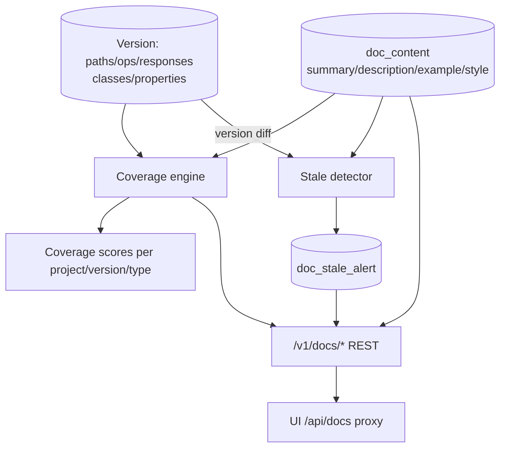
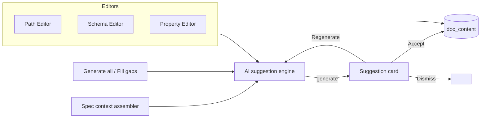
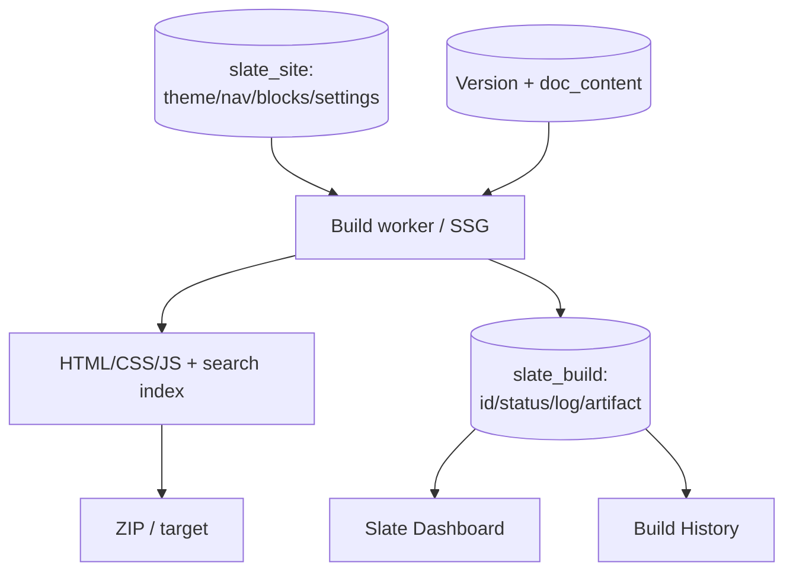
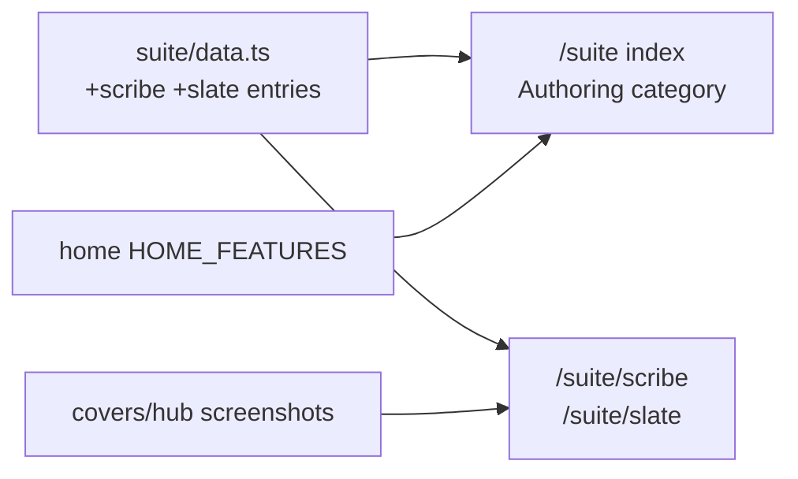
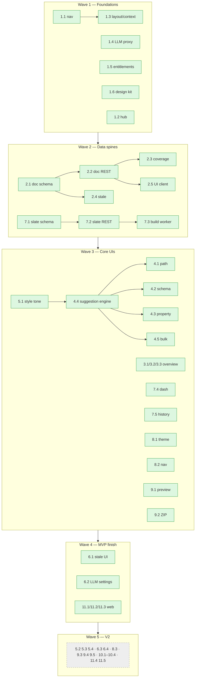

# Objectified Authoring Platform — Roadmap (Scribe + Slate)

## 1. Source Description

> Application that will work as a suite of applications on the Objectified platform. The
> objectified-ui project right now just has a main control panel dashboard, but it should
> have an additional tab at the top of the navigation section for **"Authoring"**. Under
> Authoring will be a new project called **"Slate"**, which provides a documentation site
> generator for Projects and Versions — a *"Clean Slate"* for documentation. Authoring will
> contain two projects: **Scribe** and **Slate**. Combine designs from
> `docs/planning/mockups/slate` and `docs/planning/mockups/scribe`, and create an authoring
> platform for Objectified. Identify features that will be there for the MVP, and those that
> are viable options for a V2 release. Include roadmap items to improve the objectified-web
> communication to show the authoring functionality as well, which should be a part of this
> roadmap.

This roadmap turns that brief into a buildable plan. It introduces a new **Authoring**
navigation surface in `objectified-ui` that hosts two products:

- **Scribe** — *AI-powered documentation writer*. Generates and maintains human-readable docs
  for every API path, schema class, and property; fills missing descriptions, writes example
  payloads, produces SDK guides and README stubs, and flags stale content as specs evolve.
  (Source: `docs/planning/mockups/scribe/*.html`.)
- **Slate** — *Branded static documentation site generator* (a "Clean Slate"). Publishes
  versioned, searchable, theme-branded developer portals as deploy-ready static assets
  (HTML/CSS/JS) for CDN, GitHub Pages, S3, or offline distribution, directly from Objectified
  Projects/Versions. (Source: `docs/planning/mockups/slate/*.html`.)

Both products operate on the existing core entities — **Tenants → Projects → Versions →
Classes/Properties → Paths/Operations/Responses** — already modeled in `objectified-db` and
served by `objectified-rest`.

---

## 2. MVP Definition

The MVP delivers a **working authoring loop end-to-end**: a user opens the Authoring tab,
selects a Project + Version, uses Scribe to AI-author the missing descriptions for paths,
schemas, and properties (tracking coverage), and then uses Slate to generate and download a
branded, versioned static documentation site (ZIP) from that same Version. The public
website advertises both products.

**In scope for MVP**

| Area | MVP capability |
|---|---|
| Shell | "Authoring" top-nav tab; Scribe/Slate sub-navigation; shared layout with Project/Version context selector; landing hub |
| Backend (shared) | LLM provider abstraction/proxy; entitlement gating |
| Scribe data | Documentation-content entities (path/schema/property descriptions, example payloads, style config); coverage computation & scoring; stale detection |
| Scribe UI | Dashboard (coverage + activity); Project Overview (per-type coverage, gaps); Path/Schema/Property editors with AI generate → accept/regenerate/dismiss; bulk "Generate all gaps"; Style Guide tone preset; LLM Settings; Stale Alerts queue |
| Slate data | Site + Build entities; static site generator build worker (core renderer) |
| Slate UI | Dashboard (sites + build metrics); Build History (logs/artifacts); Theme Editor; Navigation config; Preview (responsive); ZIP export; client-side full-text search index in the generated site |
| Web | Scribe + Slate suite entries; "Authoring" grouping on the suite index and home page |

**Deferred to V2** (designed now, built later)

| Area | V2 capability |
|---|---|
| Scribe | SDK Guide Generator (multi-language tabs); README Generator (sections tree + live preview + export); terminology rules + preview effect; auto-generation triggers (on save/publish); coverage thresholds + publish blocking; multi-provider LLM (Azure/Anthropic/Ollama) |
| Slate | Content Blocks (hero/badges/feature cards/footer); Version Switcher (multi-version URLs + latest alias); deploy targets beyond ZIP (GitHub Pages, S3 + CloudFront, CDN push); custom domain + DNS/TLS provisioning; CDN/edge provider config; SEO/social + analytics injection; access control (password/SSO) + robots.txt; embedded "Try-it-live" console |
| Web | Dedicated long-form Scribe/Slate landing pages with the gsap/three motion layer; screenshot galleries |

The MVP/V2 flag for every issue is in each epic table (**MVP** column) and summarized in §16.

---

## 3. System Architecture (target state)



**Conventions inherited from the existing codebase** (verified during research):

- UI: Next.js 16 App Router, React 19, Tailwind 4, Radix UI, Lucide, NextAuth (JWT),
  next-themes. Top nav defined in
  `objectified-ui/src/app/components/ade/TopHeader.tsx` (`NAV_ITEMS`). Routes live under
  `objectified-ui/src/app/ade/*`; client → Next.js `/api/*` proxy → `objectified-rest` with
  `createRestAuthHeaders()` (`objectified-ui/lib/rest-auth.ts`).
- REST: FastAPI, JWT/API-key auth via `validate_authentication()`, tenant-scoped
  `/v1/{feature}/{tenant_slug}/...` route convention.
- DB: PostgreSQL `odb` schema, UUID PKs, soft deletes (`deleted_at`), JSONB payloads;
  migration scripts in `objectified-db/scripts/<timestamp>.sql`.
- Web: Next.js 16 marketing site; product catalog is data-driven in
  `objectified-web/src/app/suite/data.ts`; `/suite/[slug]` auto-renders detail pages; glass/
  gradient + gsap/three motion components already exist.
- Brand tones (from mockups): **Scribe = violet/indigo**, **Slate = cyan**.

---

## 4. Epic Index

| # | Epic | Theme | Primary module(s) |
|---|---|---|---|
| 1 (#3379) | Authoring Platform Foundations | Nav shell, shared layout/context, LLM proxy, gating | objectified-ui, objectified-rest |
| 2 (#3380) | Scribe: Documentation Data & Coverage | DB entities, REST API, coverage + stale engines | objectified-db, objectified-rest, objectified-ui |
| 3 (#3381) | Scribe: Coverage Overview (UI) | Dashboard, Project Overview, quick actions | objectified-ui |
| 4 (#3382) | Scribe: AI Authoring (UI) | Path / Schema / Property editors, suggestion engine | objectified-ui, objectified-rest |
| 5 (#3383) | Scribe: Content Generation | Style guide, terminology, SDK guide, README | objectified-ui, objectified-rest |
| 6 (#3384) | Scribe: Quality & Configuration | Stale alerts, settings, triggers, thresholds | objectified-ui, objectified-rest |
| 7 (#3385) | Slate: Site Generation Core | Site/build DB+REST, SSG worker, dashboard, history | objectified-db, objectified-rest, objectified-ui |
| 8 (#3386) | Slate: Content & Theme (UI) | Theme editor, navigation, content blocks | objectified-ui |
| 9 (#3387) | Slate: Preview, Export & Versioning | Preview, export targets, version switcher, search | objectified-ui, objectified-rest |
| 10 (#3388) | Slate: Deployment & Settings | Custom domain/TLS, CDN, SEO/analytics, access control | objectified-rest, objectified-ui |
| 11 (#3389) | objectified-web Marketing | Scribe/Slate suite entries, Authoring category | objectified-web |

**Labels used across the roadmap.** Reused existing labels: `epic`, `mvp`, `enhancement`,
`documentation`, `ai-llm`, `ui`, `rest`, `versions`, `dashboard`, `export`, `portal`.
**New labels to create** (do not exist yet — verified against `gh label list`):

| Label | Color | Description |
|---|---|---|
| `authoring` | `#7C3AED` | Objectified Authoring platform (shell + shared services) |
| `scribe` | `#8B5CF6` | Objectified Scribe (AI documentation writer) |
| `slate` | `#06B6D4` | Objectified Slate (documentation site generator) |
| `slate-build` | `#0E7490` | Slate static-site build pipeline / worker |
| `roadmap-authoring` | `#BFDADC` | ROADMAP_AUTHORING_PLATFORM.md ticket pack |

---

## 5. Epic 1 — Authoring Platform Foundations

Stand up the navigation surface and the shared plumbing every authoring screen depends on:
the top-level **Authoring** tab, the shared layout with a Project/Version context selector,
the LLM provider abstraction (used first by Scribe), entitlement gating, and the shared
design tokens for the two product brands.



| Issue | Title | Summary | Labels | Parallel | MVP | Complexity | Affected Modules |
|---|---|---|---|:---:|:---:|---|---|
| 1.1 #3390 | Authoring top-nav tab & route group | Add "Authoring" to `NAV_ITEMS`; create `/ade/authoring` route group + layout | `authoring`,`ui`,`mvp`,`roadmap-authoring` | N | Y | M | objectified-ui |
| 1.2 #3391 | Authoring landing hub | Hub page with Scribe & Slate product tiles, status, deep links | `authoring`,`ui`,`mvp`,`roadmap-authoring` | Y | Y | S | objectified-ui |
| 1.3 #3392 | Shared layout + Project/Version context | Sidebar shell + project/version selector shared by both products | `authoring`,`ui`,`mvp`,`roadmap-authoring` | N | Y | M | objectified-ui |
| 1.4 #3393 | LLM provider abstraction service | REST service wrapping provider/model/temperature; OpenAI in MVP | `authoring`,`ai-llm`,`rest`,`mvp`,`roadmap-authoring` | Y | Y | L | objectified-rest |
| 1.5 #3394 | Authoring entitlements & feature gating | Gate Authoring/Scribe/Slate behind tenant entitlements | `authoring`,`rest`,`ui`,`roadmap-authoring` | Y | Y | S | objectified-rest, objectified-ui |
| 1.6 #3395 | Authoring design system tokens & shared components | Violet (Scribe) / cyan (Slate) tokens; shared cards, badges, generate-button, suggestion-card | `authoring`,`ui`,`mvp`,`roadmap-authoring` | Y | Y | M | objectified-ui |

### Issue 1.1 — Authoring top-nav tab & route group
- **Problem.** `objectified-ui` exposes only flat nav items (Home, Control Panel, Designer,
  Paths) in `TopHeader.tsx`; there is no Authoring surface.
- **Solution/Scope.** Add an `Authoring` entry to `NAV_ITEMS` in
  `objectified-ui/src/app/components/ade/TopHeader.tsx` with `isActive` matching
  `/ade/authoring`. Create the route group `objectified-ui/src/app/ade/authoring/` with a
  `layout.tsx` (auth-guarded like the other `ade` layouts) and an index `page.tsx`. Decide
  tab-with-sub-nav vs. dropdown (recommend a tab that routes to the hub, with Scribe/Slate as
  in-page sub-nav). Source: UI architecture report; mockup hubs
  (`scribe/index.html`, `slate/index.html`).
- **Acceptance Criteria.** Authoring appears in the top nav and highlights when active;
  `/ade/authoring` renders within the authenticated ADE shell; unauthenticated users are
  redirected to login as elsewhere.
- **Parallelism/Dependencies.** Foundational — blocks 1.2/1.3 and all Scribe/Slate UI.
- **Technical Stack.** Next.js App Router, React 19, Tailwind, Lucide.

### Issue 1.2 — Authoring landing hub
- **Problem.** Users entering Authoring need a launchpad describing the two products.
- **Solution/Scope.** Build the hub at `/ade/authoring` mirroring the mockup hubs: a Scribe
  tile (violet, "AI-powered documentation writer") and a Slate tile (cyan, "Branded static
  documentation site generator"), each with a short blurb and a deep link into the product.
  Show product status (e.g., "MVP"). Source: `scribe/index.html`, `slate/index.html`.
- **Acceptance Criteria.** Hub shows both tiles; clicking navigates to
  `/ade/authoring/scribe` and `/ade/authoring/slate`; respects entitlement gating (1.5).
- **Parallelism/Dependencies.** Depends on 1.1; parallel with 1.3.
- **Technical Stack.** Next.js, Tailwind, shared components (1.6).

### Issue 1.3 — Shared authoring layout + Project/Version context selector
- **Problem.** Every Scribe and Slate screen operates on a selected Project + Version, exactly
  like the Designer/Studio context (`StudioContext`). Without a shared selector each screen
  would re-implement it.
- **Solution/Scope.** Create an `AuthoringContext` provider + a shared left-sidebar layout
  (sections mirror the mockups: Scribe = Coverage Overview / AI Authoring / Content Generation
  / Quality & Config; Slate = Site Overview / Content & Theme / Preview & Export / Settings).
  Provide a Project/Version selector that reads from existing `/api/projects` and
  `/api/versions` and persists selection, reusing patterns from
  `objectified-ui/src/app/ade/studio/StudioContext.tsx` and `StudioHeader`.
- **Acceptance Criteria.** Selecting a Project/Version updates all child screens; read-only
  state honored for published versions; selection survives navigation between Scribe/Slate.
- **Parallelism/Dependencies.** Depends on 1.1; blocks Epics 3–10 UI.
- **Technical Stack.** React context, NextAuth session, existing project/version API clients.

### Issue 1.4 — LLM provider abstraction service
- **Problem.** Scribe generation (and later Slate niceties) need a server-side LLM gateway;
  there is no shared abstraction. The repo standardizes on the latest Claude models for AI
  features.
- **Solution/Scope.** Add a provider-agnostic service in `objectified-rest` exposing an
  internal `generate(prompt, system, params)` plus a thin authenticated endpoint
  (`POST /v1/llm/{tenant_slug}/generate`) used by Scribe proxy routes. MVP ships **Anthropic
  (Claude) and OpenAI** adapters; the interface must allow Azure OpenAI and Ollama later
  (Settings screen, Issue 6.2, lists all four). Support `model`, `temperature`, streaming, and
  per-tenant API-key storage (encrypted). Source: `scribe/settings.html` (Provider, Model,
  Temperature), `scribe/path-editor.html` (model/style shown in AI panel).
- **Acceptance Criteria.** A request with a configured provider returns a completion; provider/
  model/temperature are honored; secrets are never returned in plaintext; failures degrade
  gracefully with a typed error. Default model is the latest Claude when Anthropic is selected.
- **Parallelism/Dependencies.** Parallel with most of Epic 1; blocks Epic 4 (suggestion
  engine) and Epic 5 generation.
- **Technical Stack.** FastAPI, async LLM SDKs, encrypted secret storage in `odb`.

### Issue 1.5 — Authoring entitlements & feature gating
- **Problem.** Authoring should respect tenant entitlements (existing `entitlements_routes.py`).
- **Solution/Scope.** Add `authoring`, `scribe`, `slate` entitlement keys; gate the nav tab,
  hub tiles, and routes. Show a tasteful "not enabled" state when disabled.
- **Acceptance Criteria.** Tenants without the entitlement do not see/cannot reach the
  features; entitled tenants do.
- **Parallelism/Dependencies.** Parallel; soft-blocks 1.1/1.2 visibility.
- **Technical Stack.** FastAPI entitlements, Next.js session/entitlement checks.

### Issue 1.6 — Authoring design system tokens & shared components
- **Problem.** The mockups share recurring UI primitives (generate buttons with sparkles,
  AI-suggestion cards with Accept/Regenerate/Dismiss, status badges, coverage bars, toggles).
- **Solution/Scope.** Build a small shared component kit + brand tokens (Scribe violet/indigo,
  Slate cyan) under `objectified-ui/src/app/components/ade/authoring/`. Components:
  `GenerateButton`, `AiSuggestionCard`, `CoverageBar`, `StatusBadge` (Documented/Missing/Stale/
  AI-ready), `Toggle`, `SectionTree`. Source: shared patterns across all Scribe/Slate mockups.
- **Acceptance Criteria.** Components render in both light/dark; used by ≥3 downstream screens;
  consistent with existing Radix/Tailwind conventions.
- **Parallelism/Dependencies.** Parallel; accelerates Epics 3–10.
- **Technical Stack.** React, Tailwind, Radix, Lucide.

---

## 6. Epic 2 — Scribe: Documentation Data & Coverage

The data and service spine for Scribe: where descriptions/example payloads/style live, how
coverage is computed, and how stale content is detected when a spec changes. The existing
schema already stores most *structure* (paths, operations, responses, classes, properties)
with JSONB `metadata`/`data` — Scribe needs durable **documentation content** plus
**coverage/stale** state, and the UI proxy layer.



| Issue | Title | Summary | Labels | Parallel | MVP | Complexity | Affected Modules |
|---|---|---|---|:---:|:---:|---|---|
| 2.1 #3396 | Documentation content schema (DB) | Tables for path/schema/property docs, example payloads, style config | `scribe`,`documentation`,`mvp`,`roadmap-authoring` | N | Y | M | objectified-db |
| 2.2 #3397 | Documentation content REST API | CRUD for doc content scoped to tenant/version | `scribe`,`rest`,`mvp`,`roadmap-authoring` | N | Y | M | objectified-rest |
| 2.3 #3398 | Coverage computation & scoring engine | Compute documented/missing/stale per type + project score | `scribe`,`rest`,`mvp`,`roadmap-authoring` | N | Y | L | objectified-rest |
| 2.4 #3399 | Stale detection engine | Flag descriptions outdated by spec changes; suggest update | `scribe`,`rest`,`ai-llm`,`roadmap-authoring` | Y | Y | L | objectified-rest |
| 2.5 #3400 | Scribe UI API client + proxy routes | Next.js `/api/docs/*` proxies + typed client | `scribe`,`ui`,`mvp`,`roadmap-authoring` | N | Y | S | objectified-ui |

### Issue 2.1 — Documentation content schema (DB)
- **Problem.** No durable store exists for human-authored/AI-generated documentation content
  separate from the structural spec.
- **Solution/Scope.** Add `odb` tables (UUID PK, soft delete, tenant/version scoping):
  `doc_content` (polymorphic: `target_type` ∈ {path_operation, path_response, class,
  class_property}, `target_id`, fields `summary`, `description`, `request_narrative`,
  `response_narrative`, `example_payload` JSONB, `source` ∈ {human, ai, ai-edited},
  `status` ∈ {documented, missing, stale}, `model_used`, `updated_by`, `updated_at`);
  `doc_style_guide` (per project/tenant: `tone_preset`, `terminology` JSONB, `custom`);
  `doc_coverage_snapshot` (cached scores). Migration script in `objectified-db/scripts/`.
  Source: entity tags in `scribe/index.html` (path_operation, path_response, classes,
  class_properties, properties, versions, tags) and field sets in path/schema/property editors.
- **Acceptance Criteria.** Migration applies cleanly; FK integrity to versions/classes/etc.;
  soft delete + uniqueness `(target_type, target_id, field)` enforced.
- **Parallelism/Dependencies.** Blocks 2.2/2.3/2.4.
- **Technical Stack.** PostgreSQL, `odb` schema, SQL migration convention.

### Issue 2.2 — Documentation content REST API
- **Problem.** UI needs CRUD over doc content.
- **Solution/Scope.** Add `docs_routes.py` to `objectified-rest`:
  `GET/PUT /v1/docs/{tenant_slug}/{version_id}/content` (filter by target type/id),
  per-target upserts, and bulk upsert (for "Generate all"). Pydantic DTOs in `models.py`.
- **Acceptance Criteria.** Endpoints enforce `validate_authentication`/tenant scoping; round-
  trips a description; bulk upsert persists N items atomically.
- **Parallelism/Dependencies.** Depends on 2.1; blocks 2.5 and Epics 3–6 UI.
- **Technical Stack.** FastAPI, Pydantic, asyncpg/pg.

### Issue 2.3 — Coverage computation & scoring engine
- **Problem.** The Dashboard and Project Overview need accurate documented/missing/stale counts
  and a 0–100 score per project/version and per type (paths, schemas, properties).
- **Solution/Scope.** Build a coverage engine that joins structural entities against
  `doc_content`/status to produce: overall %, paths documented/total, schemas documented/total,
  properties documented/total, per-status (missing vs stale) breakdowns, and a per-project
  score with badge thresholds (green/amber/red). Expose
  `GET /v1/docs/{tenant_slug}/coverage` (org rollup) and
  `.../{version_id}/coverage` (project detail). Cache via `doc_coverage_snapshot`; recompute on
  doc/spec change. Source: `scribe/dashboard.html` (Overall Coverage, Paths/Schemas Documented,
  per-project table), `scribe/project-overview.html` (3 coverage bars with missing/stale).
- **Acceptance Criteria.** Numbers match a hand-computed fixture; org and project endpoints
  return consistent totals; recomputation is incremental, not full-table per request.
- **Parallelism/Dependencies.** Depends on 2.1/2.2; blocks Epic 3.
- **Technical Stack.** FastAPI, SQL aggregation.

### Issue 2.4 — Stale detection engine
- **Problem.** When a spec changes (new field, type change, new response/enum value),
  previously-good descriptions silently become wrong; mockups show explicit stale flagging
  with before/after suggestions.
- **Solution/Scope.** On version edit/publish, diff structural entities vs. the state at last
  documentation and flag affected `doc_content` as `stale`, recording a `change_summary`
  (e.g., "Response schema added capture_immediately field"). Optionally pre-compute a suggested
  rewrite via the LLM proxy (1.4). Persist to `doc_stale_alert` (project, target, field,
  change_summary, flagged_at, status ∈ {pending, dismissed, resolved, auto-resolved}). Reuse
  existing change-report/compatibility infrastructure (`change_report_routes.py`,
  `compatibility_engine.py`) where possible. Source: `scribe/stale-alerts.html`.
- **Acceptance Criteria.** A simulated spec change flags the right items with a human-readable
  change summary; dismiss/resolve transitions persist; counts feed the Dashboard's "Stale
  Alerts".
- **Parallelism/Dependencies.** Depends on 2.1; uses 1.4 for suggestions; feeds Epic 6.
- **Technical Stack.** FastAPI, diffing, LLM proxy.

### Issue 2.5 — Scribe UI API client + proxy routes
- **Problem.** Following the existing pattern, the browser must call Next.js `/api/*` routes
  that inject JWT auth and proxy to `objectified-rest`.
- **Solution/Scope.** Add `/api/docs/*` route handlers + a typed client in
  `objectified-ui/lib/api/` mirroring `rest-client.ts`, using `createRestAuthHeaders()`.
- **Acceptance Criteria.** Client functions cover content CRUD, bulk upsert, coverage, and
  stale alerts; errors surfaced as typed results.
- **Parallelism/Dependencies.** Depends on 2.2/2.3/2.4; blocks Epics 3–6 UI.
- **Technical Stack.** Next.js route handlers, TypeScript client.

---

## 7. Epic 3 — Scribe: Coverage Overview (UI)

The analytics surface: org-wide dashboard, per-project drill-down, and batch quick actions.

```
┌──────────── Scribe Dashboard ─────────────┐      ┌──── Project Overview ────┐
│ Overall 68%  Paths 142/209  Schemas 87/114 │      │ Inventory API v3.1.0 61% │
│ Stale 14     [Auto-fill] [Document] [Review]│ ───▶ │ Path 41/67  Schema 19/31 │
│ Per-project table  |  AI activity feed      │      │ Property 109/284          │
└────────────────────────────────────────────┘      │ Paths table / Schemas tbl │
                                                     └───────────────────────────┘
```

| Issue | Title | Summary | Labels | Parallel | MVP | Complexity | Affected Modules |
|---|---|---|---|:---:|:---:|---|---|
| 3.1 #3401 | Scribe Dashboard | Coverage stat cards, per-project table, AI activity feed | `scribe`,`ui`,`dashboard`,`mvp`,`roadmap-authoring` | N | Y | M | objectified-ui |
| 3.2 #3402 | Project Overview / coverage detail | Per-type coverage bars; paths & schemas gap tables | `scribe`,`ui`,`mvp`,`roadmap-authoring` | Y | Y | M | objectified-ui |
| 3.3 #3403 | Quick actions (batch auto-fill) | "Auto-fill missing summaries / document schemas / review stale" | `scribe`,`ui`,`ai-llm`,`mvp`,`roadmap-authoring` | Y | Y | M | objectified-ui |

### Issue 3.1 — Scribe Dashboard
- **Problem.** Users need an at-a-glance health view.
- **Solution/Scope.** Implement `/ade/authoring/scribe` dashboard: Overall Coverage card (with
  trend), Paths Documented, Schemas Documented, Stale Alerts; a Project Coverage table
  (Project, Version, Paths, Schemas, score badge); and an AI Activity feed. Data from coverage
  endpoint (2.3) + an activity source. Source: `scribe/dashboard.html`.
- **Acceptance Criteria.** Cards/table render live coverage; score badges color by threshold;
  empty/loading/error states; deep links into Project Overview and Stale Alerts.
- **Parallelism/Dependencies.** Depends on 1.3, 2.5, 3.x shared; parallel with 3.2/3.3.
- **Technical Stack.** Next.js, Tailwind, shared components (1.6).

### Issue 3.2 — Project Overview / coverage detail
- **Problem.** Per-project gap analysis is needed to drive authoring.
- **Solution/Scope.** Build the per-project view: 3 coverage bars (Path Summaries / Schema
  Overviews / Property Descriptions) each showing documented/total + missing/stale; a Paths
  table (method badge, path, status, Edit/Generate) and a Schemas table (name, props, coverage
  bar, View/Fill/Generate). Source: `scribe/project-overview.html`.
- **Acceptance Criteria.** Reflects coverage endpoint; row actions route to the right editor
  (Epic 4); status badges accurate.
- **Parallelism/Dependencies.** Depends on 1.3, 2.5; parallel with 3.1.
- **Technical Stack.** Next.js, Tailwind.

### Issue 3.3 — Quick actions (batch auto-fill)
- **Problem.** Mockups offer one-click batch generation from the dashboard/overview.
- **Solution/Scope.** Wire "Auto-fill missing path summaries", "Document undocumented
  schemas", "Review stale alerts", and per-project "Auto-fill all gaps" to the bulk generation
  job (4.5) and stale queue (6.1). Show progress + result toasts. Source:
  `scribe/dashboard.html`, `scribe/project-overview.html`.
- **Acceptance Criteria.** Triggering a batch enqueues generation, shows progress, and updates
  coverage on completion.
- **Parallelism/Dependencies.** Depends on 4.5; parallel with 3.1/3.2.
- **Technical Stack.** Next.js, async job polling.

---

## 8. Epic 4 — Scribe: AI Authoring (UI)

The core authoring editors and the suggestion engine that powers them. This is the heart of
Scribe's MVP.



| Issue | Title | Summary | Labels | Parallel | MVP | Complexity | Affected Modules |
|---|---|---|---|:---:|:---:|---|---|
| 4.1 #3405 | Path Editor with AI suggestions | Summary/description/request+response narratives + AI panel | `scribe`,`ui`,`ai-llm`,`mvp`,`roadmap-authoring` | N | Y | L | objectified-ui |
| 4.2 #3406 | Schema Editor + example payload | Class overview, property docs, AI example JSON | `scribe`,`ui`,`ai-llm`,`mvp`,`roadmap-authoring` | Y | Y | L | objectified-ui |
| 4.3 #3407 | Property Editor inline completion | Bulk inline property description completion | `scribe`,`ui`,`ai-llm`,`mvp`,`roadmap-authoring` | Y | Y | M | objectified-ui |
| 4.4 #3404 | AI suggestion engine + spec-context assembly | Build prompts from spec+style; generate/accept/regenerate/dismiss | `scribe`,`ai-llm`,`rest`,`mvp`,`roadmap-authoring` | N | Y | L | objectified-rest, objectified-ui |
| 4.5 #3408 | Bulk generation jobs | "Generate All" / "Fill All Gaps" batch over a version | `scribe`,`ai-llm`,`rest`,`mvp`,`roadmap-authoring` | Y | Y | M | objectified-rest, objectified-ui |

### Issue 4.4 — AI suggestion engine + spec-context assembly
- **Problem.** All three editors share one behavior: assemble spec context + style guide into a
  prompt, call the LLM, and present a suggestion with Accept/Regenerate/Dismiss.
- **Solution/Scope.** Implement a generation endpoint
  (`POST /v1/docs/{tenant_slug}/{version_id}/generate`) that, given a target
  (operation/response/class/property), gathers context — request/response schemas, security
  scopes, related responses, the org style guide/tone, and similar existing docs — and calls
  the LLM proxy (1.4). Return suggestion text (+ example payload for schemas). UI renders the
  suggestion card with action buttons and the "Spec context used" checklist. Source:
  `scribe/path-editor.html` (AI Suggestions panel + "Spec Context Used"),
  `scribe/property-editor.html` (inline suggestion states).
- **Acceptance Criteria.** A generate request returns a contextual suggestion; Accept persists
  to `doc_content` (source=ai/ai-edited); Regenerate re-prompts; Dismiss discards; the context
  checklist reflects what was actually used.
- **Parallelism/Dependencies.** Depends on 1.4, 2.2, 5.1 (style); blocks 4.1–4.3, 4.5.
- **Technical Stack.** FastAPI, LLM proxy, Next.js.

### Issue 4.1 — Path Editor with AI suggestions
- **Problem.** Operation docs (summary, description, request/response narratives) need an
  AI-assisted editor.
- **Solution/Scope.** Two-pane editor: left = fields (Summary [required], Description, Request
  Body Narrative, per-status Response Narratives with status badges) each with a Generate
  button + Save/Discard; right = AI Suggestions panel (model/style header, suggestion cards,
  "Spec Context Used"); Prev/Next across undocumented operations with an "N of M" counter.
  Source: `scribe/path-editor.html`.
- **Acceptance Criteria.** Loads an operation's existing docs; Generate fills via 4.4; Save
  persists; Prev/Next traverses the undocumented set; status updates coverage.
- **Parallelism/Dependencies.** Depends on 4.4, 2.5; parallel with 4.2/4.3.
- **Technical Stack.** Next.js, Tailwind, shared components.

### Issue 4.2 — Schema Editor + example payload generation
- **Problem.** Classes need an overview + per-property docs + an example payload.
- **Solution/Scope.** Left pane: Class Overview (Generate), Properties list with states
  (Documented / Missing / AI-suggestion-ready) and inline accept/dismiss; "Fill All Gaps".
  Right pane: Example Payload (Generate from schema / Copy) rendering JSON derived from
  property types/constraints. Source: `scribe/schema-editor.html`.
- **Acceptance Criteria.** Overview + property descriptions generate and save; example payload
  generates valid JSON consistent with constraints; coverage updates.
- **Parallelism/Dependencies.** Depends on 4.4, 2.5; parallel with 4.1/4.3.
- **Technical Stack.** Next.js, Tailwind.

### Issue 4.3 — Property Editor inline completion
- **Problem.** Bulk completion of many property descriptions for a schema.
- **Solution/Scope.** A list of properties with missing descriptions showing inline states:
  generating (animated), pending review (Accept/Edit-first/Try-again), accepted (green), and
  empty (Generate). Header "Generate All"; footer "Save All Accepted" with a progress counter.
  Source: `scribe/property-editor.html`.
- **Acceptance Criteria.** Generate All fans out generations; per-row accept/edit/retry works;
  Save All Accepted persists only accepted rows; progress accurate.
- **Parallelism/Dependencies.** Depends on 4.4, 2.5; parallel with 4.1/4.2.
- **Technical Stack.** Next.js, Tailwind.

### Issue 4.5 — Bulk generation jobs
- **Problem.** "Generate all gaps" must run across an entire version without blocking the UI.
- **Solution/Scope.** A batch endpoint that enqueues generation for all missing targets of a
  version (optionally filtered by type), with progress reporting and idempotent writes. Feeds
  Dashboard quick actions (3.3) and per-screen bulk buttons.
- **Acceptance Criteria.** Batch completes for a multi-class version; progress observable;
  partial failures reported without corrupting saved items.
- **Parallelism/Dependencies.** Depends on 4.4; feeds 3.3.
- **Technical Stack.** FastAPI background jobs, polling/streaming.

---

## 9. Epic 5 — Scribe: Content Generation

Style governance plus the higher-level generated artifacts. Style-guide tone is MVP (it feeds
the suggestion engine); terminology rules, SDK guide, and README are V2.

| Issue | Title | Summary | Labels | Parallel | MVP | Complexity | Affected Modules |
|---|---|---|---|:---:|:---:|---|---|
| 5.1 #3409 | Style Guide — tone presets | Technical/Friendly/Concise/Enterprise tone feeding generation | `scribe`,`ui`,`ai-llm`,`mvp`,`roadmap-authoring` | Y | Y | S | objectified-ui, objectified-rest |
| 5.2 #3410 | Terminology rules + preview effect | Preferred/avoid term table; before/after rewrite preview | `scribe`,`ui`,`ai-llm`,`roadmap-authoring` | Y | N | M | objectified-ui, objectified-rest |
| 5.3 #3411 | SDK Guide Generator | Multi-language code samples (curl/Python/JS/Go/Java) + export | `scribe`,`ui`,`ai-llm`,`export`,`roadmap-authoring` | Y | N | L | objectified-ui, objectified-rest |
| 5.4 #3412 | README Generator | Sections tree + drag reorder + live preview + .md export | `scribe`,`ui`,`ai-llm`,`export`,`roadmap-authoring` | Y | N | L | objectified-ui, objectified-rest |

### Issue 5.1 — Style Guide (tone presets) — MVP
- **Problem.** Generation must follow an org tone; the suggestion engine (4.4) reads it.
- **Solution/Scope.** Tone preset selector (Technical/Friendly/Concise/Enterprise) persisted in
  `doc_style_guide`; injected into prompts. Source: `scribe/style-guide.html` (Tone Preset).
- **Acceptance Criteria.** Selected tone persists per project and demonstrably changes
  generated prose; defaults to Technical.
- **Parallelism/Dependencies.** Depends on 2.1; consumed by 4.4.
- **Technical Stack.** Next.js, FastAPI.

### Issue 5.2 — Terminology rules + preview effect — V2
- **Problem.** Orgs enforce preferred terms (e.g., "payment intent" not "charge").
- **Solution/Scope.** Editable terminology table (preferred / avoid / scope) + a "Preview
  Effect" before/after rewrite of sample text. Rules injected into prompts and applied on
  re-apply. Source: `scribe/style-guide.html` (Terminology Rules, Preview Effect).
- **Acceptance Criteria.** Rules persist and influence generation; preview shows corrected
  output.
- **Parallelism/Dependencies.** Depends on 5.1, 4.4.
- **Technical Stack.** Next.js, FastAPI, LLM proxy.

### Issue 5.3 — SDK Guide Generator — V2
- **Problem.** Teams want multi-language usage guides per operation.
- **Solution/Scope.** Operation list + language tabs (curl/Python/JS/Go/Java), auth-style
  selector (Bearer/API key/OAuth2 PKCE), narrative + code + example response + notes, and
  "Export Markdown". Source: `scribe/sdk-guide.html`.
- **Acceptance Criteria.** Generates runnable-looking samples per language for a selected
  operation; export produces valid Markdown.
- **Parallelism/Dependencies.** Depends on 4.4; relates to Slate code-sample rendering.
- **Technical Stack.** Next.js, FastAPI, LLM proxy.

### Issue 5.4 — README Generator — V2
- **Problem.** Projects need an assembled README.
- **Solution/Scope.** Sections tree (Overview/Quick Start/Authentication/Endpoints/Error
  Handling/Rate Limits/Changelog) with add + drag-reorder + generated/ungenerated state, a live
  Markdown preview, and Copy/Export .md / Regenerate All. Source: `scribe/readme-generator.html`.
- **Acceptance Criteria.** Sections generate and reorder; preview matches export; .md exports.
- **Parallelism/Dependencies.** Depends on 4.4.
- **Technical Stack.** Next.js, FastAPI, LLM proxy.

---

## 10. Epic 6 — Scribe: Quality & Configuration

Stale-alert review and Scribe configuration. The stale queue + LLM settings are MVP; triggers
and publish-blocking thresholds are V2.

| Issue | Title | Summary | Labels | Parallel | MVP | Complexity | Affected Modules |
|---|---|---|---|:---:|:---:|---|---|
| 6.1 #3413 | Stale Alerts review queue | Queue with diff before/after, Update/Dismiss, bulk + summary tiles | `scribe`,`ui`,`ai-llm`,`mvp`,`roadmap-authoring` | Y | Y | M | objectified-ui |
| 6.2 #3414 | Scribe Settings — LLM provider | Provider/model/API key/temperature config | `scribe`,`ui`,`ai-llm`,`mvp`,`roadmap-authoring` | Y | Y | S | objectified-ui, objectified-rest |
| 6.3 #3415 | Auto-generation triggers | On spec save / on version publish / manual only | `scribe`,`rest`,`ai-llm`,`roadmap-authoring` | Y | N | M | objectified-rest |
| 6.4 #3416 | Coverage thresholds + publish blocking | Min path/schema/property %; block publish below | `scribe`,`rest`,`versions`,`roadmap-authoring` | Y | N | M | objectified-rest, objectified-ui |

### Issue 6.1 — Stale Alerts review queue — MVP
- **Problem.** Flagged-stale content (2.4) needs a review workflow.
- **Solution/Scope.** Queue UI: summary tiles (Flagged today / Pending / Dismissed 7d /
  Auto-resolved), filterable table (Project/Type, Field, Change summary, Flagged, Actions),
  expandable before/after diff, Update (regenerate via 4.4) / Dismiss, and bulk actions.
  Source: `scribe/stale-alerts.html`.
- **Acceptance Criteria.** Lists alerts from 2.4; Update regenerates and resolves; Dismiss
  transitions state; tiles reflect counts.
- **Parallelism/Dependencies.** Depends on 2.4, 4.4.
- **Technical Stack.** Next.js, Tailwind.

### Issue 6.2 — Scribe Settings — LLM provider — MVP
- **Problem.** Users configure the AI backend.
- **Solution/Scope.** Provider (OpenAI/Azure/Anthropic/Ollama), Model, masked API Key (Reveal),
  Temperature slider. MVP wires Anthropic + OpenAI through 1.4; others selectable but may be
  marked "coming soon". Source: `scribe/settings.html` (LLM Provider section).
- **Acceptance Criteria.** Settings persist per tenant; secrets masked; selection used by 4.4.
- **Parallelism/Dependencies.** Depends on 1.4.
- **Technical Stack.** Next.js, FastAPI, encrypted secrets.

### Issue 6.3 — Auto-generation triggers — V2
- **Problem.** Optionally auto-fill on spec save / version publish.
- **Solution/Scope.** Toggle set (On spec save / On version publish / Manual only) that hooks
  the version lifecycle to enqueue bulk generation (4.5). Source: `scribe/settings.html`.
- **Acceptance Criteria.** Enabling a trigger runs the configured generation at the event.
- **Parallelism/Dependencies.** Depends on 4.5, version lifecycle hooks.
- **Technical Stack.** FastAPI lifecycle hooks.

### Issue 6.4 — Coverage thresholds + publish blocking — V2
- **Problem.** Governance teams want quality gates on publish.
- **Solution/Scope.** Configure min path/schema/property coverage and "Block publish below
  threshold"; integrate with the version publish precheck (`versions_routes.py`). Source:
  `scribe/settings.html` (Coverage Thresholds).
- **Acceptance Criteria.** Below-threshold publish is warned or blocked per config; thresholds
  persist.
- **Parallelism/Dependencies.** Depends on 2.3, version publish precheck.
- **Technical Stack.** FastAPI publish precheck, Next.js.

---

## 11. Epic 7 — Slate: Site Generation Core

The Slate spine: site/build data model, REST API, the static-site generator build worker, and
the operational dashboard + build history.



| Issue | Title | Summary | Labels | Parallel | MVP | Complexity | Affected Modules |
|---|---|---|---|:---:|:---:|---|---|
| 7.1 #3417 | Slate site & build schema (DB) | `slate_site`, `slate_build` (+ config JSONB) tables | `slate`,`slate-build`,`mvp`,`roadmap-authoring` | N | Y | M | objectified-db |
| 7.2 #3418 | Slate site/build REST API | CRUD sites; trigger/list builds; fetch logs/artifacts | `slate`,`rest`,`mvp`,`roadmap-authoring` | N | Y | M | objectified-rest |
| 7.3 #3419 | Static site generator build worker | Render Version→branded static site + search index | `slate`,`slate-build`,`rest`,`mvp`,`roadmap-authoring` | N | Y | XL | objectified-rest |
| 7.4 #3420 | Slate Dashboard | Sites table + build metrics + recent build activity | `slate`,`ui`,`dashboard`,`mvp`,`roadmap-authoring` | Y | Y | M | objectified-ui |
| 7.5 #3421 | Build History + logs/artifacts | Filterable builds, expandable logs, ZIP artifact download | `slate`,`ui`,`slate-build`,`mvp`,`roadmap-authoring` | Y | Y | M | objectified-ui |

### Issue 7.1 — Slate site & build schema (DB)
- **Problem.** No store for site config or build records.
- **Solution/Scope.** `slate_site` (tenant/project/version scope, `name`, `theme` JSONB,
  `navigation` JSONB, `content_blocks` JSONB, `settings` JSONB, `deploy_target`, `domain`,
  soft delete); `slate_build` (`site_id`, `version_id`, `trigger` ∈ {version-publish, manual,
  scheduled}, `status` ∈ {success, building, failed}, `pages`, `duration_ms`, `log`,
  `artifact_ref`, timestamps). Source: `slate/dashboard.html`, `slate/build-history.html`.
- **Acceptance Criteria.** Migration applies; FK to versions; build log/artifact persisted.
- **Parallelism/Dependencies.** Blocks 7.2/7.3.
- **Technical Stack.** PostgreSQL `odb`.

### Issue 7.2 — Slate site/build REST API
- **Problem.** UI needs site CRUD + build orchestration.
- **Solution/Scope.** `sites_routes.py`: `CRUD /v1/sites/{tenant_slug}/...`;
  `POST /v1/sites/.../{site_id}/build` (enqueue), `GET /v1/builds/...` (list + filter),
  `GET /v1/builds/.../{build_id}/log` and `/artifact`. Source: dashboard/build-history mockups.
- **Acceptance Criteria.** Create a site, trigger a build, poll status, fetch log + artifact.
- **Parallelism/Dependencies.** Depends on 7.1; blocks 7.4/7.5 and Epics 8–10.
- **Technical Stack.** FastAPI, Pydantic.

### Issue 7.3 — Static site generator build worker
- **Problem.** The defining capability: turn a Version (+ Scribe docs) into a branded,
  versioned, searchable static site as the mockups depict (e.g., "483 pages = 38 paths × 5
  languages + landing + schemas + search index").
- **Solution/Scope.** A build worker that loads the spec + `doc_content`, applies the site's
  theme/navigation/content-blocks/settings, and renders static HTML/CSS/JS: landing page,
  per-endpoint pages with code samples, schema reference pages, on-this-page anchors, and a
  client-side full-text search index (lunr.js). Emits a ZIP artifact + structured build log
  with timing/page counts; updates `slate_build`. Designed so deploy targets (Epic 9/10) plug
  in after ZIP. Source: `slate/build-history.html` (build log), `slate/preview.html`,
  `slate/export.html` (export options: try-it-live, search index, language tabs, minify).
- **Acceptance Criteria.** Building a sample Version produces a self-contained static bundle
  that renders offline with working sidebar nav, code tabs, and client-side search; log
  records page count + duration; failures captured with a clear error.
- **Parallelism/Dependencies.** Depends on 7.1/7.2, core spec + (ideally) Scribe `doc_content`;
  blocks 7.4/7.5, Epic 9.
- **Technical Stack.** FastAPI worker/background job, a static templating/SSG approach,
  lunr.js index generation, ZIP packaging.

### Issue 7.4 — Slate Dashboard
- **Problem.** Operators need to monitor published sites and builds.
- **Solution/Scope.** `/ade/authoring/slate` dashboard: stat cards (Published sites, Total
  pages, Last build, CDN bandwidth 30d — bandwidth may be placeholder pre-deploy targets),
  Published Sites table (Site/Project, Version, Build status, Pages, Last deployed, Target,
  actions Preview/Rebuild/Logs/Retry), and Recent Build Activity. "New site" entry point.
  Source: `slate/dashboard.html`.
- **Acceptance Criteria.** Reflects sites/builds from 7.2; Rebuild triggers a build; statuses
  live-update.
- **Parallelism/Dependencies.** Depends on 1.3, 7.2; parallel with 7.5.
- **Technical Stack.** Next.js, Tailwind.

### Issue 7.5 — Build History + logs/artifacts
- **Problem.** Builds need an auditable history with logs and downloadable artifacts.
- **Solution/Scope.** Filterable table (Build ID, Site, Version, Trigger, Duration, Status,
  Started, Artifact) with expandable monospace logs and ZIP download. Filters: site, status,
  date. Source: `slate/build-history.html`.
- **Acceptance Criteria.** Lists builds; expands logs; downloads artifact; filters work.
- **Parallelism/Dependencies.** Depends on 7.2; parallel with 7.4.
- **Technical Stack.** Next.js, Tailwind.

---

## 12. Epic 8 — Slate: Content & Theme (UI)

Branding and structure configuration for the generated site. Theme + navigation are MVP;
content blocks are V2.

| Issue | Title | Summary | Labels | Parallel | MVP | Complexity | Affected Modules |
|---|---|---|---|:---:|:---:|---|---|
| 8.1 #3422 | Theme Editor | Logo, primary/accent colors, fonts, dark mode default, custom CSS + live preview | `slate`,`ui`,`mvp`,`roadmap-authoring` | Y | Y | M | objectified-ui |
| 8.2 #3423 | Navigation config | Global toggles + sidebar sections (auto/custom) with reorder | `slate`,`ui`,`mvp`,`roadmap-authoring` | Y | Y | M | objectified-ui |
| 8.3 #3424 | Content Blocks | Hero/badges/feature cards/footer editor + live landing preview | `slate`,`ui`,`roadmap-authoring` | Y | N | M | objectified-ui |

### Issue 8.1 — Theme Editor — MVP
- **Problem.** Sites must be brandable.
- **Solution/Scope.** Controls: logo upload (SVG/PNG), primary + accent color (presets + custom),
  body + code typeface, default color mode (Light/Dark/System), custom CSS variables; live
  preview pane. Persists to `slate_site.theme`. Source: `slate/theme-editor.html`.
- **Acceptance Criteria.** Theme persists and is honored by the build worker (7.3); preview
  reflects choices.
- **Parallelism/Dependencies.** Depends on 7.2; consumed by 7.3.
- **Technical Stack.** Next.js, Tailwind.

### Issue 8.2 — Navigation config — MVP
- **Problem.** Site sidebar/nav features must be configurable.
- **Solution/Scope.** Global toggles (search bar, version switcher, language selector,
  on-this-page anchors) and a sidebar sections tree (auto sections from spec: Getting Started/
  Authentication/Endpoints/Schemas; plus custom MDX/external link sections) with enable/disable
  + drag reorder. Persists to `slate_site.navigation`. Source: `slate/navigation.html`.
- **Acceptance Criteria.** Config persists and changes generated nav; custom sections supported.
- **Parallelism/Dependencies.** Depends on 7.2; consumed by 7.3.
- **Technical Stack.** Next.js, Tailwind.

### Issue 8.3 — Content Blocks — V2
- **Problem.** Landing-page composition (hero, badges, feature cards, footer).
- **Solution/Scope.** Block editor (add/reorder/enable) for Hero (title/subtitle/CTA), Badges,
  Feature Highlights, Quick-start sample, Footer; with a live landing preview. Persists to
  `slate_site.content_blocks`. Source: `slate/content-blocks.html`.
- **Acceptance Criteria.** Blocks persist and render in the generated landing page.
- **Parallelism/Dependencies.** Depends on 7.2/7.3.
- **Technical Stack.** Next.js, Tailwind.

---

## 13. Epic 9 — Slate: Preview, Export & Versioning

Preview the generated site, export it (ZIP for MVP; richer targets V2), manage multi-version
publishing, and the in-site search.

| Issue | Title | Summary | Labels | Parallel | MVP | Complexity | Affected Modules |
|---|---|---|---|:---:|:---:|---|---|
| 9.1 #3425 | Preview (responsive) | Browser-chrome preview with desktop/tablet/mobile frames | `slate`,`ui`,`mvp`,`roadmap-authoring` | Y | Y | M | objectified-ui |
| 9.2 #3426 | Export — ZIP bundle | Build & download self-contained ZIP + export options | `slate`,`ui`,`export`,`mvp`,`roadmap-authoring` | Y | Y | S | objectified-ui, objectified-rest |
| 9.3 #3427 | Export targets — GitHub Pages / S3 / CDN | Push to GitHub Pages, S3+CloudFront, CDN origin | `slate`,`export`,`rest`,`roadmap-authoring` | Y | N | L | objectified-rest, objectified-ui |
| 9.4 #3428 | Version Switcher | Multi-version URL structure + latest alias + dropdown | `slate`,`ui`,`versions`,`roadmap-authoring` | Y | N | M | objectified-ui, objectified-rest |
| 9.5 #3429 | In-site full-text search + try-it-live | lunr search index UX; embedded API console | `slate`,`slate-build`,`portal`,`roadmap-authoring` | Y | N | M | objectified-rest |

### Issue 9.1 — Preview (responsive) — MVP
- **Problem.** Users must verify the generated site before export.
- **Solution/Scope.** Browser-chrome preview frame with device selector (desktop/tablet/mobile)
  rendering the built site (header, sidebar, endpoint content, code tabs). Source:
  `slate/preview.html`.
- **Acceptance Criteria.** Preview renders the current build at three viewport sizes.
- **Parallelism/Dependencies.** Depends on 7.3.
- **Technical Stack.** Next.js, iframe/responsive frame.

### Issue 9.2 — Export — ZIP bundle — MVP
- **Problem.** The MVP deploy path is a downloadable static bundle.
- **Solution/Scope.** Deployment target = ZIP (selected by default) + export options (try-it-
  live, full-text search index, all language tabs, minify) wired to 7.3; "Build & Download ZIP"
  with estimated time/size. Source: `slate/export.html`.
- **Acceptance Criteria.** Triggers a build and downloads a working ZIP honoring the toggles.
- **Parallelism/Dependencies.** Depends on 7.3.
- **Technical Stack.** Next.js, FastAPI artifact streaming.

### Issue 9.3 — Export targets — GitHub Pages / S3 / CDN — V2
- **Problem.** Hosted deploy targets beyond ZIP.
- **Solution/Scope.** Implement GitHub Pages push, S3 upload + optional CloudFront
  invalidation, and generic CDN origin push (Cloudflare/Fastly/Akamai) with cache purge;
  credentials stored encrypted. Source: `slate/export.html` (target grid).
- **Acceptance Criteria.** Each target deploys a build and records the target on the site/build.
- **Parallelism/Dependencies.** Depends on 7.3/9.2; relates to 10.x credentials.
- **Technical Stack.** FastAPI, provider SDKs.

### Issue 9.4 — Version Switcher — V2
- **Problem.** Sites should serve multiple API versions with a latest alias.
- **Solution/Scope.** URL structure choice (subdirectory/subdomain/query), published-versions
  table (version, label, URL path, latest-alias radio, enabled toggle), dropdown preview, and
  latest→version redirect. "Save & Rebuild". Source: `slate/version-switcher.html`.
- **Acceptance Criteria.** Multiple versions build under chosen URL scheme; latest resolves to
  the designated version.
- **Parallelism/Dependencies.** Depends on 7.3, versions API.
- **Technical Stack.** Next.js, FastAPI, build worker.

### Issue 9.5 — In-site full-text search + try-it-live — V2 (search index is MVP within 7.3)
- **Problem.** Generated sites need search UX and an optional live API console. The lunr index
  itself is produced in 7.3 (MVP); this issue covers the in-site search **UX** and the embedded
  "Try-it-live" console.
- **Solution/Scope.** Search box + results rendering in the generated theme; "Try it live"
  console on endpoint pages. Source: `slate/preview.html` ("Try it live"), `slate/export.html`
  (search index, try-it-live console).
- **Acceptance Criteria.** Search returns results client-side; try-it-live issues a request and
  shows the response.
- **Parallelism/Dependencies.** Depends on 7.3.
- **Technical Stack.** lunr.js, generated-site JS.

---

## 14. Epic 10 — Slate: Deployment & Settings (V2)

Custom domains/TLS, CDN/edge config, SEO/analytics, and access control. All V2.

| Issue | Title | Summary | Labels | Parallel | MVP | Complexity | Affected Modules |
|---|---|---|---|:---:|:---:|---|---|
| 10.1 #3430 | Custom Domain + DNS/TLS | Domain verify, CNAME guidance, Let's Encrypt TLS auto-renew | `slate`,`rest`,`nginx`,`roadmap-authoring` | Y | N | L | objectified-rest, objectified-ui |
| 10.2 #3431 | CDN / edge provider config | Cloudflare/Fastly/custom origin credentials + purge | `slate`,`rest`,`roadmap-authoring` | Y | N | M | objectified-rest, objectified-ui |
| 10.3 #3432 | Slate Settings — SEO & analytics | Meta/OG templates; GA4 + Segment injection; code-sample defaults | `slate`,`ui`,`roadmap-authoring` | Y | N | M | objectified-ui, objectified-rest |
| 10.4 #3433 | Access control + robots.txt | Public/password/SSO gate; index vs noindex | `slate`,`rest`,`roadmap-authoring` | Y | N | L | objectified-rest, objectified-ui |

### Issue 10.1 — Custom Domain + DNS/TLS — V2
- **Solution/Scope.** Domain input + verify, CNAME record guidance (`sites.objectified.io`),
  Let's Encrypt issuance/renewal status (TLS 1.3, HSTS), checklist. Source:
  `slate/custom-domain.html`.
- **Acceptance Criteria.** Verified domain serves the site over auto-renewing TLS.
- **Dependencies.** Depends on a hosted target (9.3).
- **Technical Stack.** FastAPI, ACME/Let's Encrypt, DNS.

### Issue 10.2 — CDN / edge provider config — V2
- **Solution/Scope.** Provider selection (Cloudflare/Fastly/custom) + credential fields + purge
  on build. Source: `slate/custom-domain.html` (CDN/Edge section).
- **Acceptance Criteria.** Configured CDN purges on deploy; credentials encrypted.
- **Dependencies.** Depends on 9.3.
- **Technical Stack.** FastAPI, provider APIs.

### Issue 10.3 — Slate Settings — SEO & analytics — V2
- **Solution/Scope.** Meta title template + description, OG image URL, GA4 ID, Segment key,
  default code-sample language + remember preference. Injected by the build worker. Source:
  `slate/settings.html`.
- **Acceptance Criteria.** Settings persist and appear in generated HTML head/scripts.
- **Dependencies.** Depends on 7.3.
- **Technical Stack.** Next.js, FastAPI, build worker.

### Issue 10.4 — Access control + robots.txt — V2
- **Solution/Scope.** Access mode (None/Password/SSO SAML-OIDC) + robots.txt allow/disallow.
  Source: `slate/settings.html`.
- **Acceptance Criteria.** Password/SSO gate enforced on hosted sites; robots.txt reflects
  choice.
- **Dependencies.** Depends on 9.3/7.3.
- **Technical Stack.** FastAPI auth, build worker.

---

## 15. Epic 11 — objectified-web Marketing

Advertise the Authoring platform on the public site, data-driven via `suite/data.ts`.



| Issue | Title | Summary | Labels | Parallel | MVP | Complexity | Affected Modules |
|---|---|---|---|:---:|:---:|---|---|
| 11.1 #3434 | Scribe suite entry | Add Scribe to `suite/data.ts` (violet, AI doc writer) | `scribe`,`documentation`,`mvp`,`roadmap-authoring` | Y | Y | S | objectified-web |
| 11.2 #3435 | Slate suite entry | Add Slate to `suite/data.ts` (cyan, site generator) | `slate`,`documentation`,`mvp`,`roadmap-authoring` | Y | Y | S | objectified-web |
| 11.3 #3436 | Authoring category on suite index + home | Group Scribe/Slate as "Authoring"; surface on home | `authoring`,`documentation`,`mvp`,`roadmap-authoring` | Y | Y | M | objectified-web |
| 11.4 #3437 | Cover/hub screenshots & assets | Produce `/suite/scribe-*`, `/suite/slate-*` imagery | `authoring`,`documentation`,`roadmap-authoring` | Y | N | S | objectified-web |
| 11.5 #3438 | Cross-link & motion landing polish | Hero/features cross-links; gsap/three long-form polish | `authoring`,`documentation`,`roadmap-authoring` | Y | N | M | objectified-web |

### Issue 11.1 — Scribe suite entry — MVP
- **Solution/Scope.** Append a `Suite` object to `objectified-web/src/app/suite/data.ts`
  (slug `scribe`, tone violet/indigo, icon e.g. `PenLine`, status, summary, features, AI story,
  `modules` referencing the scribe mockup html names, highlights). `/suite/scribe` auto-renders.
  Source: `scribe/index.html`.
- **Acceptance Criteria.** `/suite/scribe` renders with accurate copy; appears on the index.
- **Dependencies.** None (data-only); parallel with all web issues.
- **Technical Stack.** Next.js, TypeScript data module.

### Issue 11.2 — Slate suite entry — MVP
- **Solution/Scope.** Same as 11.1 for Slate (slug `slate`, tone cyan, icon e.g. `LayoutTemplate`),
  modules referencing slate mockups. Source: `slate/index.html`.
- **Acceptance Criteria.** `/suite/slate` renders accurately; appears on the index.
- **Dependencies.** None; parallel.
- **Technical Stack.** Next.js, TypeScript.

### Issue 11.3 — Authoring category on suite index + home — MVP
- **Solution/Scope.** Group Scribe + Slate under an "Authoring" category on the suite index and
  add an Authoring highlight to `HOME_FEATURES` in `objectified-web/src/app/page.tsx`.
- **Acceptance Criteria.** Visitors discover Authoring from the home page and suite index.
- **Dependencies.** Depends on 11.1/11.2.
- **Technical Stack.** Next.js, Tailwind.

### Issue 11.4 — Cover/hub screenshots & assets — V2
- **Solution/Scope.** Produce cover/hub/detail imagery referenced by the suite entries.
- **Acceptance Criteria.** Images present and rendered on detail pages.
- **Dependencies.** Best after Scribe/Slate UIs exist for real screenshots.
- **Technical Stack.** Static assets.

### Issue 11.5 — Cross-link & motion landing polish — V2
- **Solution/Scope.** Optional dedicated long-form pages using the gsap/three/glass motion
  layer; cross-links from features/hero.
- **Acceptance Criteria.** Polished Authoring narrative with motion, consistent with the site.
- **Dependencies.** Depends on 11.1–11.3.
- **Technical Stack.** Next.js, GSAP, three.js, glass utilities.

---

## 16. MVP vs V2 Summary

**MVP issues (build first):** 1.1–1.6, 2.1–2.5, 3.1–3.3, 4.1–4.5, 5.1, 6.1, 6.2,
7.1–7.5, 8.1, 8.2, 9.1, 9.2, 11.1, 11.2, 11.3.

**V2 issues (designed now, built later):** 5.2, 5.3, 5.4, 6.3, 6.4, 8.3, 9.3, 9.4, 9.5,
10.1, 10.2, 10.3, 10.4, 11.4, 11.5.

---

## 17. Work Order (sequencing)

Dependencies drive order; many items inside a wave run in parallel.



1. **Wave 1 — Foundations (Epic 1).** Nav tab + route group (1.1) → shared layout/context
   (1.3); in parallel: hub (1.2), LLM proxy (1.4), entitlements (1.5), design kit (1.6).
2. **Wave 2 — Data spines (Epics 2 & 7 backend).** Scribe doc schema → REST → coverage +
   stale + UI client (2.1→2.2→2.3/2.4/2.5). In parallel, Slate schema → REST → build worker
   (7.1→7.2→7.3). These two tracks are independent and run concurrently.
3. **Wave 3 — Core UIs.** Style tone (5.1) → suggestion engine (4.4) → editors (4.1/4.2/4.3)
   + bulk (4.5); coverage overview screens (3.1/3.2/3.3); Slate dashboard/history (7.4/7.5),
   theme/nav (8.1/8.2), preview/ZIP export (9.1/9.2).
4. **Wave 4 — MVP finish.** Stale Alerts UI (6.1), LLM settings (6.2), and the web marketing
   entries (11.1/11.2/11.3). **MVP complete.**
5. **Wave 5 — V2.** Content generation extras (5.2–5.4), triggers/thresholds (6.3/6.4),
   content blocks (8.3), hosted export + versioning + search/console (9.3/9.4/9.5),
   deployment & settings (10.1–10.4), and web polish (11.4/11.5).

---

## 18. Issue Count & Naming

This roadmap defines **49 issues** across **11 epics** (34 MVP, 15 V2). When created, issues
follow the convention `<project>: [<epic#.issue#>] <title>`, e.g.:

- `Authoring: [1.1] Authoring top-nav tab & route group`
- `Scribe: [4.4] AI suggestion engine + spec-context assembly`
- `Slate: [7.3] Static site generator build worker`
- `Web: [11.1] Scribe suite entry`

Each epic additionally has an umbrella `epic`-labeled issue. No existing GitHub issues
cover Scribe/Slate/Authoring (verified), so there is no duplicate work to reconcile.

## 19. Created GitHub Issues (status: ✅ created)

All issues and the five new labels (`authoring`, `scribe`, `slate`, `slate-build`,
`roadmap-authoring`) were created in `objectified-project/objectified`. Each child issue is a
GitHub **sub-issue** of its epic.

**Epics (umbrella issues):** #3379 (E1), #3380 (E2), #3381 (E3), #3382 (E4), #3383 (E5),
#3384 (E6), #3385 (E7), #3386 (E8), #3387 (E9), #3388 (E10), #3389 (E11).

| Epic | Child issues (issue# → roadmap id) |
|---|---|
| #3379 E1 | #3390 (1.1), #3391 (1.2), #3392 (1.3), #3393 (1.4), #3394 (1.5), #3395 (1.6) |
| #3380 E2 | #3396 (2.1), #3397 (2.2), #3398 (2.3), #3399 (2.4), #3400 (2.5) |
| #3381 E3 | #3401 (3.1), #3402 (3.2), #3403 (3.3) |
| #3382 E4 | #3404 (4.4), #3405 (4.1), #3406 (4.2), #3407 (4.3), #3408 (4.5) |
| #3383 E5 | #3409 (5.1), #3410 (5.2), #3411 (5.3), #3412 (5.4) |
| #3384 E6 | #3413 (6.1), #3414 (6.2), #3415 (6.3), #3416 (6.4) |
| #3385 E7 | #3417 (7.1), #3418 (7.2), #3419 (7.3), #3420 (7.4), #3421 (7.5) |
| #3386 E8 | #3422 (8.1), #3423 (8.2), #3424 (8.3) |
| #3387 E9 | #3425 (9.1), #3426 (9.2), #3427 (9.3), #3428 (9.4), #3429 (9.5) |
| #3388 E10 | #3430 (10.1), #3431 (10.2), #3432 (10.3), #3433 (10.4) |
| #3389 E11 | #3434 (11.1), #3435 (11.2), #3436 (11.3), #3437 (11.4), #3438 (11.5) |

**Totals:** 11 epics + 49 child issues = **60 GitHub issues** (34 MVP, 15 V2).
