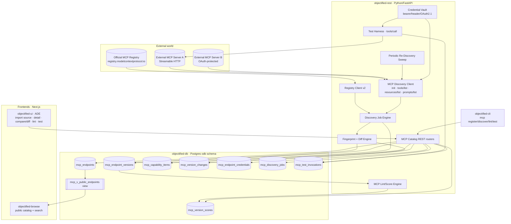
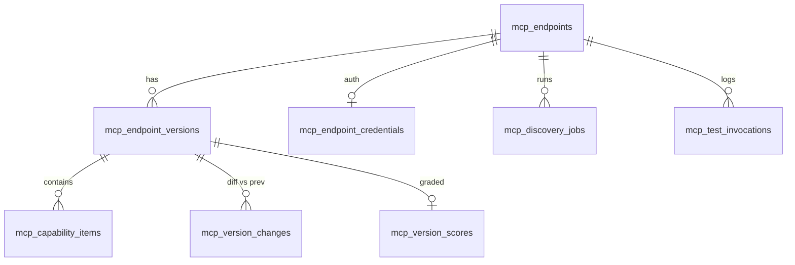
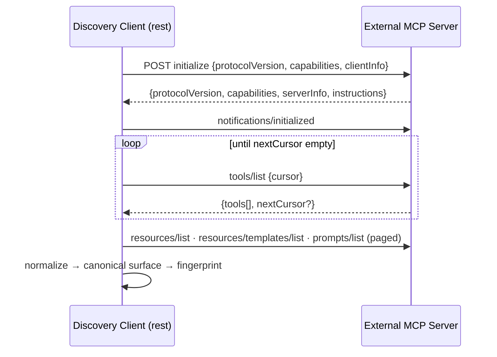
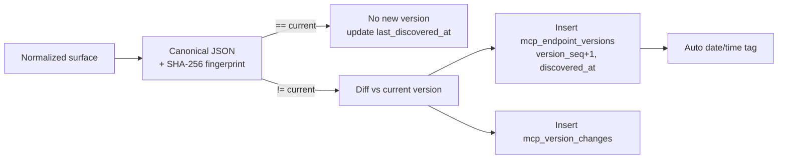
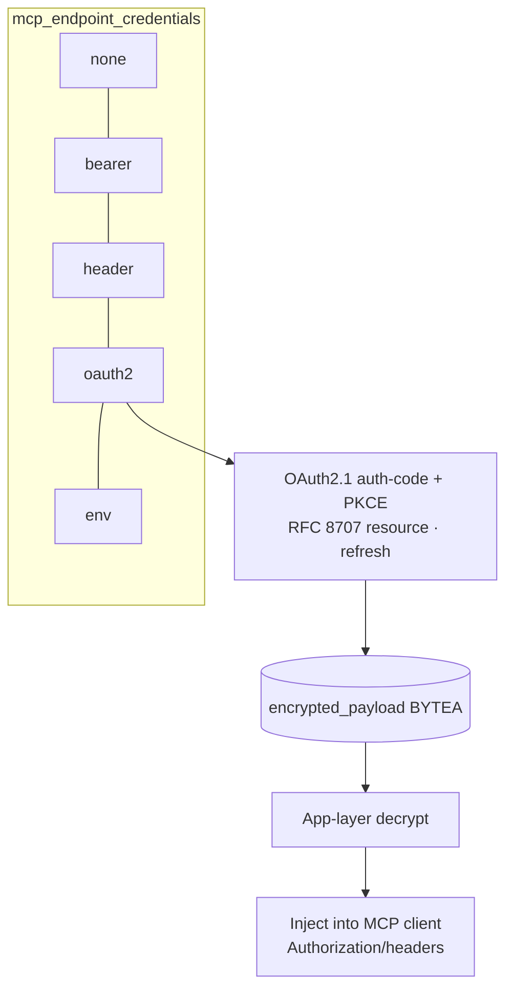
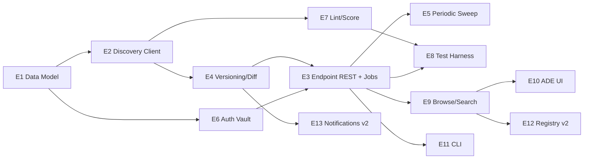

# Roadmap — MCP Cataloging, Versioning, Scoring & Browse

> **Status:** ✅ **Issues filed on `objectified-project/objectified`** — umbrella **#3637**,
> epics **#3638–#3650** (V2-MCP-EPIC-15…27), and 64 issues **#3651–#3714**. Each epic/issue
> heading below is annotated with its `#number`; epics track their children as GitHub
> sub-issues, all under umbrella #3637.
>
> **Positioning (decided):** this work is **folded into the existing V2-MCP roadmap**
> as a new *External MCP Catalog* track — it does **not** start a standalone line. The
> 13 epics below continue the V2-MCP epic sequence (the existing open epics are
> `V2-MCP-EPIC-7…14`, #3029–#3036), so they are created as **`V2-MCP-EPIC-15` … `V2-MCP-EPIC-27`**
> and carry the same V2-MCP roadmap label, each linked to the V2-MCP epic umbrella.
>
> **Document-local shorthand vs. created IDs.** To keep the dense cross-references in
> this design doc readable, epics/issues use a local `MCAT-<epic>.<issue>` shorthand
> (epics 1–13). The **mapping to the IDs actually created** is in §4
> (`MCAT-EPIC-1 → V2-MCP-EPIC-15`, …, `MCAT-EPIC-13 → V2-MCP-EPIC-27`).
> **GitHub title format:** `objectified: [<V2-MCP epic>.<issue>] <title>`
> (e.g. `objectified: [15.1] MCP catalog data model & migrations` for MCAT-1.1).

---

## 0. Source description (user request, verbatim)

> MCP cataloging tool that will go out to an MCP server in a registry that will
> catalog and categorize the different MCP services that the endpoint provides.
> Put this information into a database, and store the information as a version. On
> a periodic basis, the service will go back to the MCP service and re-query it for
> the services it provides through discovery. Any changes recorded will be reported
> as a new version in the MCP service catalog, with a tagged date and time so that
> the version history can be tracked. This service will also be available through
> our own browse catalog where the browser can show MCPs provided by a specific
> site, along with the ability to search for MCPs through the browser. Tenants can
> store MCP catalog information for each endpoint (given a name for cataloging
> purposes in the UI), and the information can be stored there. MCP data can be
> stored for private usage, or published as public MCP cataloged endpoints. MCP
> services that are imported need to be able to be graded and linted, given service
> scoring, and storing this information. There also needs to be a way to query and
> test the MCP that was stored, along with the ability to pass in any authentication
> data to the MCP services if one requires it.

---

## 1. Scope clarification — what this is, and what it is NOT

This repo **already** contains a large body of MCP work, but it is the **opposite
direction** of this request:

| Existing work | Direction | This roadmap |
|---|---|---|
| `objectified-mcp`, `MCP-EPIC-*` (#2815/#2816/#2818/#2820), `V2-MCP-EPIC-*` (#3029–#3036) | **objectified _is_ an MCP server** — it exposes its own specs/discovery actions to MCP clients | objectified **_consumes / catalogs_ external** MCP servers |
| #2878 "Action catalog browser", #2820 "MCP Onboarding & Catalog" | Browse **objectified's own** MCP actions | Browse **third-party** MCP endpoints registered by tenants |

**This roadmap = an MCP _aggregator / catalog_** — a downstream consumer that
connects out to arbitrary external MCP servers (and, in v2, the official MCP
Registry), discovers their tools/resources/prompts, versions and diffs that surface
over time, scores it, and exposes it through private + public browse with a live
test harness.

The MCP Registry team explicitly positions such downstream aggregators as the
intended consumers of the official registry
([registry/about](https://modelcontextprotocol.io/registry/about)).

**How this slots into the existing V2-MCP roadmap.** Although the *direction* is the
inverse of the current V2-MCP work (which hardens objectified's own MCP server), this
"consume external MCP servers" capability is being tracked **as part of the V2-MCP
roadmap line**, not as a separate program. Concretely: the 13 epics here are created
as **`V2-MCP-EPIC-15` … `V2-MCP-EPIC-27`** (continuing the `V2-MCP-EPIC-7…14`
sequence), share the V2-MCP roadmap label, and each links to the V2-MCP epic umbrella
and the most-related existing item (see §9). A new umbrella issue —
**"V2-MCP: External MCP Catalog (consume third-party MCP servers)"** — should be opened
to group epics 15–27, mirroring how #3029–#3036 are grouped.

### What already exists that we REUSE (do not rebuild)

| Capability | Where | Reuse for |
|---|---|---|
| Versioning + git-like tags | `versions`, `version_tags` (V003/V073) | Pattern for `mcp_endpoint_versions` + date/time tags |
| Quality score / grade / fingerprint columns | `versions.quality_score/quality_grade/quality_report_fingerprint` (V124) | Same shape on MCP version scores |
| Deterministic linter (pure fn → findings + score + grade + fingerprint) | `objectified-rest/.../schema_lint.py`, `lint_routes.py` | Template for `mcp_lint.py` |
| Public/private visibility + published flag + public read view | `visibility_type` enum (V006), `mcp_v_public_specs` (V095), `browse_public_routes.py` | `mcp_v_public_endpoints`, public browse |
| Async job engine (submit → poll → commit) | `spec_import_engine.py`, `spec_import_routes.py` | Discovery-job lifecycle |
| Periodic background sweep (cadence, change-detect, enqueue) | `repository_refresh_sweep.py`, `repository_import_spec` (RAR epic) | Periodic re-discovery sweep |
| Encrypted secrets / API keys per tenant | `api_keys`, tenant-scoping patterns | Credential vault for MCP auth |
| Browse app (search, tenant pages) | `objectified-browse` | Public MCP browse/search |
| Typer CLI + HTTP client + job polling | `objectified-cli` | `objectified mcp …` commands |

### The gaps this roadmap closes

1. No outbound **MCP protocol client** (Streamable HTTP / SSE, initialize handshake, `*/list` discovery).
2. No model of an **external MCP endpoint** owned by a tenant.
3. No **capability-surface versioning / diffing** for an external server (MCP has **no** built-in capability version/etag — the catalog MUST compute its own hash).
4. No **MCP-specific** linter/scorer (the existing one lints OpenAPI/JSON-Schema, not MCP tool hygiene).
5. No **outbound auth vault** (OAuth 2.1 / bearer / headers) for connecting to protected servers.
6. No **test harness** to invoke a discovered tool.
7. No **browse** surface for third-party MCP endpoints.

### Design decisions from the mockup review

These were settled while iterating on the design mockup
([`docs/planning/mockups/mcp-catalog/`](planning/mockups/mcp-catalog/)) and are reflected
in the issues below:

1. **Ingestion is an Import source, not a "register" action.** Adding an MCP server is a
   new **"MCP Server" source card in objectified-ui's existing `ImportDialog`** (alongside
   File/URL/Clipboard/Git/SwaggerHub/Postman) → endpoint URL + transport + auth → discovery
   commits catalog v1 via the spec-import job pipeline. (EPIC-17, EPIC-24.1)
2. **Lives in the sidebar under *Specifications › MCP Servers***, adopting the
   `DashboardSideNav` look & feel. (EPIC-24.1)
3. **Catalog is grade-led and grouped by site/host** by default. (EPIC-23.1, EPIC-24.1)
4. **Lint = a dedicated tab plus a compact grade summary on the Overview tab.** (EPIC-24.2/24.4)
5. **Version history can diff any two versions on demand** (base→target selectors or tick two
   in the list), not just consecutive versions. (EPIC-18.2/18.5, EPIC-24.3)
6. **Test is always available; tools with `destructiveHint` require an explicit confirm.** (EPIC-22)
7. **Public browse ranks grade-led.** (EPIC-23.6)

---

## 2. MVP definition

**MVP (v1) — "import → discover → version → score → browse → test, manually":**

1. A tenant **imports** an external MCP server through objectified-ui's existing Import flow (a new **"MCP Server" source**) with a **friendly catalog name**, URL, and transport; stored **private** by default. *(MCAT-1, MCAT-3, MCAT-10.1)*
2. The service connects via **Streamable HTTP**, performs the `initialize` handshake with **protocol-version negotiation**, and discovers `tools/list`, `resources/list`, `resources/templates/list`, `prompts/list` with **cursor pagination**. *(MCAT-2)*
3. The discovered surface is **normalized + fingerprinted** and stored as **version 1** (immutable snapshot, date/time tagged). *(MCAT-2, MCAT-4)*
4. **Manual re-discovery** re-queries, **diffs** against the current version, and on any change writes a **new dated version** + a **change report**. *(MCAT-4)*
5. **Lint + score** the discovered surface → 0–100 score, A–F grade, stored per version. *(MCAT-7)*
6. **Browse (private)**: reached via the sidebar's **Specifications › MCP Servers**; endpoints are grade-led and grouped by site/host. View an endpoint's tools/resources/prompts, version history, lint report, and **compare/diff any two versions** on demand. *(MCAT-9, MCAT-10)*
7. **Test harness (basic)**: invoke a discovered tool (`tools/call`) with **stored bearer/header auth**, capture result/latency/errors. *(MCAT-6 partial, MCAT-8)*
8. **CLI**: `objectified mcp register | discover | list | show | lint | test`. *(MCAT-11)*
9. **Periodic sweep (basic, single global cadence)** that re-discovers enabled endpoints and versions changes automatically. *(MCAT-5)* — included in MVP because "on a periodic basis" is a core requirement.

**v2 / later:**

- Full **OAuth 2.1** authorization flow (RFC 8707/9728 discovery, DCR, token refresh). *(MCAT-6 advanced)*
- **Public publishing** + **public browse/search** in `objectified-browse`, faceted search across tool/resource/prompt text. *(MCAT-9 advanced)*
- **Categorization / auto-categorization** of MCP services. *(MCAT-9.x)*
- **Official MCP Registry ingestion** (`registry.modelcontextprotocol.io /v0.1/servers`, `server.json`). *(MCAT-12)*
- **Webhooks / notifications** on version change; **observability**. *(MCAT-13)*
- **stdio / local** server introspection; advanced scoring; rate-limit-aware polling.

---

## 3. Label strategy

There is **no `mcp` label** in the repo today (MCP work is tracked by title prefix).
**Action:** create a `mcp-catalog` label (and reuse existing ones below). Until
created, issues use the closest existing labels.

Primary labels used across this roadmap: `mcp-catalog` *(new)*, `registry`,
`integrations`, `multi-protocol`, `linting`, `validation`, `version-control`,
`versions`, `browser`, `community`, `rest`, `ui`, `database`, `python`,
`typescript`, `auth`, `api-keys`, `security`, `automation`, `polling`, `webhook`,
`monitoring`, `analytics`, `testing`, `devex`, `epic`, `mvp`, `v2`.

---

## 4. Epics overview

The **Created-as** column is the real `V2-MCP-EPIC-*` number each epic gets when
filed (continuing the existing `V2-MCP-EPIC-7…14` sequence). The `MCAT-*` shorthand
is document-local only.

| Created as | Local | Theme | Issues | MVP weight |
|---|---|---|---|---|
| **V2-MCP-EPIC-15** | MCAT-EPIC-1 | Data Model & Persistence Foundation | 1.1–1.6 | ●●● core |
| **V2-MCP-EPIC-16** | MCAT-EPIC-2 | MCP Discovery Client & Capability Normalization | 2.1–2.6 | ●●● core |
| **V2-MCP-EPIC-17** | MCAT-EPIC-3 | Endpoint Registration & Management (REST + jobs) | 3.1–3.5 | ●●● core |
| **V2-MCP-EPIC-18** | MCAT-EPIC-4 | Versioning, Fingerprinting & Change Detection | 4.1–4.5 | ●●● core |
| **V2-MCP-EPIC-19** | MCAT-EPIC-5 | Periodic Re-Discovery Sweep | 5.1–5.4 | ●● MVP |
| **V2-MCP-EPIC-20** | MCAT-EPIC-6 | Authentication & Secret Vault (outbound) | 6.1–6.5 | ●● MVP+v2 |
| **V2-MCP-EPIC-21** | MCAT-EPIC-7 | Linting, Grading & Service Scoring | 7.1–7.5 | ●●● core |
| **V2-MCP-EPIC-22** | MCAT-EPIC-8 | Query & Test Harness | 8.1–8.4 | ●● MVP |
| **V2-MCP-EPIC-23** | MCAT-EPIC-9 | Browse Catalog, Search & Categorization | 9.1–9.6 | ●● MVP+v2 |
| **V2-MCP-EPIC-24** | MCAT-EPIC-10 | ADE UI | 10.1–10.6 | ●● MVP+v2 |
| **V2-MCP-EPIC-25** | MCAT-EPIC-11 | CLI | 11.1–11.4 | ●● MVP |
| **V2-MCP-EPIC-26** | MCAT-EPIC-12 | Official MCP Registry Integration | 12.1–12.4 | ○ v2 |
| **V2-MCP-EPIC-27** | MCAT-EPIC-13 | Notifications, Webhooks & Observability | 13.1–13.4 | ○ v2 |

**Total: 13 epics (V2-MCP-EPIC-15…27), 64 issues.** Issue `MCAT-E.N` is created as
`V2-MCP-(E+14).N` — e.g. MCAT-7.4 → `V2-MCP-21.4`, GitHub title
`objectified: [21.4] Scoring, grading & fingerprint persistence`.

### Issue index

| ID | Title | ID | Title |
|----|-------|----|----|
| 1.1 | MCP catalog data model & migrations | 7.1 | MCP lint rule engine (pure fn) |
| 1.2 | Capability-item normalized store | 7.2 | Tool/resource/prompt hygiene rules |
| 1.3 | Version + change-record tables | 7.3 | Annotation-consistency & error-design rules |
| 1.4 | Credential vault table (encrypted) | 7.4 | Scoring, grading & fingerprint persistence |
| 1.5 | Scores, discovery-jobs, test-log tables | 7.5 | Lint REST + re-lint endpoint |
| 1.6 | Public read views + visibility/publish | 8.1 | Tool invocation service (`tools/call`) |
| 2.1 | MCP transport client (Streamable HTTP) | 8.2 | Test-harness REST endpoints |
| 2.2 | Initialize handshake + version negotiation | 8.3 | Invocation logging & safety guards |
| 2.3 | Discovery list methods + pagination | 8.4 | CLI/UI test integration |
| 2.4 | Capability-surface normalization | 9.1 | Private browse: endpoints & detail |
| 2.5 | Legacy HTTP+SSE fallback transport | 9.2 | Capability search index & query |
| 2.6 | Discovery error taxonomy & resilience | 9.3 | Categorization model & manual tags |
| 3.1 | Endpoint CRUD REST | 9.4 | Auto-categorization heuristics |
| 3.2 | Manual discovery trigger + async job | 9.5 | Public publish workflow + guards |
| 3.3 | Endpoint Pydantic models & validation | 9.6 | objectified-browse public MCP pages |
| 3.4 | Discovery job status/polling API | 10.1 | ADE nav + endpoint list/registration wizard |
| 3.5 | Endpoint lifecycle (enable/disable/delete) | 10.2 | Endpoint detail: capabilities & metadata |
| 4.1 | Canonical surface fingerprint | 10.3 | Version history & compare/diff viewer |
| 4.2 | Surface diff engine | 10.4 | Lint report panel |
| 4.3 | Version creation on change | 10.5 | Test/query panel (auth-aware) |
| 4.4 | Date/time version tagging | 10.6 | Credential management UI |
| 4.5 | Change-report & compare API | 11.1 | CLI: register/list/show |
| 5.1 | Sweep scheduler & cadence config | 11.2 | CLI: discover + poll |
| 5.2 | Per-endpoint poll/diff/version step | 11.3 | CLI: lint + score |
| 5.3 | Failure handling, backoff & status | 11.4 | CLI: test/invoke |
| 5.4 | Sweep observability & metrics | 12.1 | Registry client (`/v0.1/servers`) |
| 6.1 | Auth-type model + none/bearer/header | 12.2 | server.json → endpoint import |
| 6.2 | Encryption-at-rest for credentials | 12.3 | Registry sync & namespacing |
| 6.3 | OAuth 2.1 discovery (RFC 9728/8414) | 12.4 | Federated search incl. registry |
| 6.4 | OAuth 2.1 auth-code+PKCE + refresh | 13.1 | Change-notification events |
| 6.5 | Credential REST + redaction | 13.2 | Webhook subscriptions on change |
| | | 13.3 | Health/uptime monitoring |
| | | 13.4 | Catalog analytics dashboard |

---

## 5. Architecture overview



---

# Epics & issues

> Each issue below uses the GitHub title format
> `objectified: [<epic>.<issue>] <title>`. Complexity ∈ {S, M, L, XL}.

---

## MCAT-EPIC-1 — Data Model & Persistence Foundation  ·  _created as **V2-MCP-EPIC-15**_  ·  **#3638**

Establishes every table, enum, index, and read view the feature needs. Pure
`objectified-db` Flyway migrations starting at **V126**, following existing
conventions (UUID PKs, `tenant_id` scoping, soft delete via `deleted_at`,
`created_at/updated_at`, JSONB metadata, composite indexes).



| ID | Title | Summary | Labels | Parallel | MVP | Complexity | Affected Modules |
|----|-------|---------|--------|----------|-----|-----------|------------------|
| 1.2 | Capability-item normalized store | `mcp_capability_items` (tool/resource/template/prompt rows + JSONB schemas) | mcp-catalog,database,mvp | N | Y | M | objectified-db |
| 1.3 | Version + change-record tables | `mcp_endpoint_versions`, `mcp_version_changes` (immutable snapshots + diffs) | mcp-catalog,database,version-control,mvp | N | Y | M | objectified-db |
| 1.4 | Credential vault table (encrypted) | `mcp_endpoint_credentials` (auth_type enum, encrypted payload, OAuth fields) | mcp-catalog,database,security,mvp | Y | Y | M | objectified-db |
| 1.5 | Scores, discovery-jobs, test-log tables | `mcp_version_scores`, `mcp_discovery_jobs`, `mcp_test_invocations` | mcp-catalog,database,mvp | Y | Y | M | objectified-db |
| 1.6 | Public read views + visibility/publish | `mcp_v_public_endpoints` view + publish columns/indexes | mcp-catalog,database,browser | Y | N | S | objectified-db |

### MCAT-1.1 — MCP catalog data model & migrations  ·  **#3651**  ·  ✅ Done (V126)
- **Problem.** There is no table representing an external MCP endpoint a tenant wants to catalog.
- **Solution / Scope.** Create `odb.mcp_endpoints` (migration **V126**). Columns: `id UUID PK`, `tenant_id`, `creator_id`, `name` (friendly UI label), `slug`, `endpoint_url TEXT`, `transport VARCHAR` (`streamable_http`|`sse`|`stdio`), `description`, `category`, `visibility visibility_type DEFAULT 'private'` (reuse enum from V006), `published BOOLEAN DEFAULT false`, `enabled BOOLEAN DEFAULT true`, `discovery_cadence_seconds INT NULL`, `last_discovered_at`, `last_discovery_status VARCHAR`, `current_version_id UUID NULL` (FK added after 1.3), `metadata JSONB`, soft-delete + audit columns. `UNIQUE(tenant_id, slug)`. Indexes on `(tenant_id)`, `(tenant_id, slug)`, `(published, visibility)`, `(enabled, last_discovered_at)`. Transport values per [MCP transports spec](https://modelcontextprotocol.io/specification/2025-06-18/basic/transports).
- **Acceptance Criteria.** Migration applies cleanly on a fresh DB and over V125; rollback notes documented; `flyway`/CI migration check passes; column comments present (matches house style).
- **Dependencies / Parallelism.** Root of the feature — blocks most REST/UI work. Not parallel with 1.3/1.6 (FK ordering) but 1.4/1.5 can follow independently.
- **Technical Stack.** PostgreSQL, Flyway SQL (`objectified-db/scripts`).

```
mcp_endpoints
└─ id, tenant_id, creator_id, name, slug, endpoint_url, transport,
   visibility, published, enabled, discovery_cadence_seconds,
   current_version_id?, last_discovered_at, last_discovery_status, metadata
```

### MCAT-1.2 — Capability-item normalized store  ·  **#3652**  ·  ✅ Done (V127)
- **Problem.** Discovered tools/resources/prompts must be queryable (search, diff, render) — not just blobs.
- **Solution / Scope.** Create `odb.mcp_capability_items` (V127): `id`, `version_id FK`, `item_type VARCHAR` (`tool`|`resource`|`resource_template`|`prompt`), `name`, `title`, `description TEXT`, `input_schema JSONB`, `output_schema JSONB`, `annotations JSONB`, `uri/uri_template` (resources), `raw JSONB` (verbatim entry for fidelity), `ordinal INT`. Indexes on `(version_id, item_type)`, `(name)`, and a `to_tsvector` GIN index on `coalesce(name||' '||description)` for search (MCAT-9.2). Field set per [tools](https://modelcontextprotocol.io/specification/2025-06-18/server/tools)/[resources](https://modelcontextprotocol.io/specification/2025-06-18/server/resources)/[prompts](https://modelcontextprotocol.io/specification/2025-06-18/server/prompts).
- **Acceptance Criteria.** Stores all four item types; nullable fields tolerate 2025-03-26 servers (no `title`/`outputSchema`); FTS index present.
- **Dependencies / Parallelism.** Needs `version_id` from 1.3. V127 lands before 1.3's table (V128), so — as with V126's `current_version_id` — `version_id` is a plain `NOT NULL UUID` here and the FK to `mcp_endpoint_versions(id)` is added in **V128** (FK ordering). Parallel with 1.4/1.5.
- **Technical Stack.** PostgreSQL JSONB + GIN/tsvector.

### MCAT-1.3 — Version + change-record tables  ·  **#3653**  ·  ✅ Done (V128)
- **Problem.** Each meaningful discovery result must be stored as an immutable, tagged version with a recorded diff.
- **Solution / Scope.** `odb.mcp_endpoint_versions` (V128): `id`, `endpoint_id FK`, `version_seq INT` (monotonic per endpoint), `protocol_version`, `server_name`, `server_title`, `server_version`, `instructions TEXT`, `capabilities JSONB`, `surface_fingerprint TEXT`, `discovered_at TIMESTAMPTZ`, `created_at`, `UNIQUE(endpoint_id, version_seq)`. `odb.mcp_version_changes`: `id`, `version_id FK`, `change_type` (`added`|`removed`|`modified`), `item_type`, `item_name`, `detail JSONB` (before/after). Add FK `mcp_endpoints.current_version_id → mcp_endpoint_versions.id`.
- **Acceptance Criteria.** A version is immutable once written; `version_seq` strictly increases; change rows link to the version that introduced them.
- **Dependencies / Parallelism.** After 1.1. Blocks 1.2/1.5/4.x.
- **Technical Stack.** PostgreSQL.

### MCAT-1.4 — Credential vault table (encrypted)  ·  **#3654**  ·  ✅ Done (V129)
- **Problem.** Connecting to protected MCP servers requires storing secrets safely.
- **Solution / Scope.** `odb.mcp_endpoint_credentials` (V129): `id`, `endpoint_id FK UNIQUE`, `auth_type VARCHAR` (`none`|`bearer`|`header`|`oauth2`|`env`), `encrypted_payload BYTEA`, `key_version INT`, `oauth_metadata JSONB` (token/authorize/registration endpoints, scopes, resource indicator), `last_refreshed_at`, audit columns. No plaintext secret columns. Encryption handled in app layer (MCAT-6.2). Auth model per [MCP authorization spec](https://modelcontextprotocol.io/specification/2025-06-18/basic/authorization).
- **Acceptance Criteria.** Schema stores ciphertext only; supports all five auth types; one credential row per endpoint.
- **Dependencies / Parallelism.** After 1.1. Parallel with 1.2/1.3/1.5.
- **Technical Stack.** PostgreSQL `BYTEA`.

### MCAT-1.5 — Scores, discovery-jobs, test-log tables  ·  **#3655**  ·  ✅ Done (V130)
- **Problem.** Need persistence for scores, async discovery jobs, and test invocations.
- **Solution / Scope.** (V130) `mcp_version_scores`: `version_id FK`, `score SMALLINT`, `grade TEXT`, `report JSONB`, `report_fingerprint TEXT`, `scored_at` (mirrors `versions.quality_*` from V124). `mcp_discovery_jobs`: `id`, `endpoint_id`, `tenant_id`, `state` (`queued|running|completed|failed`), `trigger` (`manual|sweep|registry`), `started_at`, `finished_at`, `error TEXT`, `result JSONB`. `mcp_test_invocations`: `id`, `endpoint_id`, `version_id`, `item_type`, `item_name`, `arguments JSONB`, `response JSONB`, `is_error BOOLEAN`, `latency_ms INT`, `invoked_by`, `created_at`.
- **Acceptance Criteria.** All three tables created with appropriate indexes (`(endpoint_id, created_at)`, `(state)`); FK cascades on endpoint delete.
- **Dependencies / Parallelism.** After 1.3. Parallel with 1.4.
- **Technical Stack.** PostgreSQL.

### MCAT-1.6 — Public read views + visibility/publish  ·  **#3656**
- **Problem.** Public browse needs a filtered, safe read model (no secrets, only published/public).
- **Solution / Scope.** (V131) Create `odb.mcp_v_public_endpoints` view filtering `published = true AND visibility = 'public' AND deleted_at IS NULL`, exposing endpoint + current version + score (mirrors `mcp_v_public_specs` from V095). Add supporting indexes. Never join credentials.
- **Acceptance Criteria.** View returns only published/public endpoints; excludes credential columns; query plan uses indexes.
- **Dependencies / Parallelism.** After 1.1/1.3/1.5. Parallel with most REST work.
- **Technical Stack.** PostgreSQL view.

---

## MCAT-EPIC-2 — MCP Discovery Client & Capability Normalization  ·  _created as **V2-MCP-EPIC-16**_  ·  **#3639**

The outbound MCP protocol client. This is the technical heart of the feature.



| ID | Title | Summary | Labels | Parallel | MVP | Complexity | Affected Modules |
|----|-------|---------|--------|----------|-----|-----------|------------------|
| 2.2 | Initialize handshake + version negotiation | `initialize` + `notifications/initialized`, negotiate 2025-06-18/03-26 | mcp-catalog,multi-protocol,python,mvp | N | Y | M | objectified-rest |
| 2.3 | Discovery list methods + pagination | tools/resources/templates/prompts list with cursor paging | mcp-catalog,python,mvp | N | Y | M | objectified-rest |
| 2.4 | Capability-surface normalization | Canonical, version-tolerant in-memory surface model | mcp-catalog,python,mvp | Y | Y | M | objectified-rest |
| 2.5 | Legacy HTTP+SSE fallback transport | 2024-11-05 two-endpoint SSE for back-compat | mcp-catalog,multi-protocol,python,v2 | Y | N | M | objectified-rest |
| 2.6 | Discovery error taxonomy & resilience | Timeouts, JSON-RPC errors, version mismatch, partial results | mcp-catalog,python,mvp | Y | Y | M | objectified-rest |

### MCAT-2.1 — MCP transport client (Streamable HTTP)  ·  **#3657**  ·  ✅ Done (objectified-rest 1.6.1)
- **Problem.** No client exists to speak MCP over the network.
- **Solution / Scope.** Implement `mcp_client/transport_http.py`: JSON-RPC 2.0 over **Streamable HTTP** to a single `…/mcp` endpoint. POST with `Accept: application/json, text/event-stream`; handle 200 JSON vs `text/event-stream` SSE responses and `202` accepts; capture/echo **`Mcp-Session-Id`**; send **`MCP-Protocol-Version`** on post-init requests; `DELETE` to end session; honor `Origin`/HTTPS. Uses `httpx` (already a dep). Spec: [transports 2025-06-18](https://modelcontextprotocol.io/specification/2025-06-18/basic/transports).
- **Acceptance Criteria.** Can complete a request/response and an SSE-streamed response against a local reference MCP server; session header round-trips; 400/404/405 handled per spec; unit tests with mocked httpx + an integration test against a stub server.
- **Dependencies / Parallelism.** Foundation of the epic — blocks 2.2/2.3.
- **Technical Stack.** Python, `httpx`, SSE parsing.

### MCAT-2.2 — Initialize handshake + version negotiation  ·  **#3658**  ·  ✅ Done (objectified-rest 1.6.2)
- **Problem.** Discovery is gated by the `initialize` handshake and capability negotiation.
- **Solution / Scope.** Send `initialize` with our `protocolVersion`, `capabilities`, `clientInfo`; parse `serverInfo`, `capabilities`, `instructions`; send `notifications/initialized`; implement version negotiation (echo, fallback, disconnect on unsupported) handling `-32602`. Record negotiated version for downstream field-set branching. Spec: [lifecycle](https://modelcontextprotocol.io/specification/2025-06-18/basic/lifecycle).
- **Acceptance Criteria.** Negotiates against both 2025-06-18 and 2025-03-26 servers; persists `protocol_version`, `server_name/title/version`, `instructions`, `capabilities`; refuses unsupported versions gracefully.
- **Dependencies / Parallelism.** After 2.1. Blocks 2.3.
- **Technical Stack.** Python.

### MCAT-2.3 — Discovery list methods + pagination  ·  **#3659**  ·  ✅ Done (objectified-rest 1.6.3)
- **Problem.** Must enumerate the full capability surface, not just the first page.
- **Solution / Scope.** Implement `tools/list`, `resources/list`, `resources/templates/list` (result key `resourceTemplates`), `prompts/list`, each looping on opaque `cursor`/`nextCursor` until exhausted, **only** for capabilities the server declared. Spec: [pagination](https://modelcontextprotocol.io/specification/2025-06-18/basic/utilities/pagination).
- **Acceptance Criteria.** Pages through multi-page lists; skips undeclared capabilities; returns complete item sets; cursor-loop guarded against non-terminating servers.
- **Dependencies / Parallelism.** After 2.2. Blocks 2.4.
- **Technical Stack.** Python.

### MCAT-2.4 — Capability-surface normalization  ·  **#3660**
- **Problem.** Field sets differ across protocol versions; downstream diff/lint/store need a stable shape.
- **Solution / Scope.** Define a canonical `DiscoverySurface` dataclass (serverInfo, capabilities, instructions, tools[], resources[], resourceTemplates[], prompts[]) with version-tolerant parsing (absent `title`/`outputSchema` on 2025-03-26 → null), deterministic ordering, and a clean mapping to `mcp_capability_items`. Preserve `raw` per item.
- **Acceptance Criteria.** Same logical server yields a byte-stable normalized surface regardless of map ordering; round-trips to/from DB rows.
- **Dependencies / Parallelism.** After 2.3. Parallel with 2.5/2.6. Blocks 4.1.
- **Technical Stack.** Python, Pydantic/dataclasses.

### MCAT-2.5 — Legacy HTTP+SSE fallback transport  ·  **#3661**
- **Problem.** Some servers still use the deprecated 2024-11-05 HTTP+SSE transport.
- **Solution / Scope.** Implement two-endpoint SSE transport (server sends `endpoint` event with POST URL). Used only when Streamable HTTP fails or `transport='sse'`. Spec: [2024-11-05 transports](https://modelcontextprotocol.io/specification/2024-11-05/basic/transports).
- **Acceptance Criteria.** Connects to a legacy SSE stub; auto-falls back from Streamable HTTP on protocol signature.
- **Dependencies / Parallelism.** After 2.1. **v2.** Parallel with 2.4/2.6.
- **Technical Stack.** Python, SSE.

### MCAT-2.6 — Discovery error taxonomy & resilience  ·  **#3662**
- **Problem.** Remote discovery fails in many ways; results must be trustworthy and diagnosable.
- **Solution / Scope.** Define typed errors (connect timeout, TLS, auth-required `401` + `WWW-Authenticate`, JSON-RPC error, version mismatch, partial-page failure). Enforce per-call timeouts, total budget, SSRF guard (block private IP ranges per [security best practices](https://modelcontextprotocol.io/specification/2025-06-18/basic/security_best_practices)). Surface structured failures to the job record.
- **Acceptance Criteria.** Each failure mode maps to a stable error code stored on `mcp_discovery_jobs.error`; SSRF to private ranges blocked; partial discovery never silently recorded as complete.
- **Dependencies / Parallelism.** After 2.1. Parallel with 2.4/2.5.
- **Technical Stack.** Python.

---

## MCAT-EPIC-3 — Endpoint Registration & Management (REST + jobs)  ·  _created as **V2-MCP-EPIC-17**_  ·  **#3640**

Tenant-facing CRUD + the async discovery job lifecycle (mirrors `spec_import` engine).

> **UX decision (design review):** an MCP endpoint is **registered through objectified-ui's
> existing Import flow as a new "MCP Server" import source** — *not* a bespoke "register"
> wizard. Registering = selecting the MCP source, entering endpoint URL + transport + auth,
> and running discovery, which commits catalog version 1 via the spec-import job pipeline.
> The CRUD endpoints here back that source. The catalog is surfaced in the sidebar under
> **Specifications › MCP Servers** (see EPIC-10). See
> [`docs/planning/mockups/mcp-catalog/`](planning/mockups/mcp-catalog/) for the design.

| ID | Title | Summary | Labels | Parallel | MVP | Complexity | Affected Modules |
|----|-------|---------|--------|----------|-----|-----------|------------------|
| 3.1 | Endpoint CRUD REST | create/list/get/patch endpoints, tenant-scoped | mcp-catalog,rest,mvp | N | Y | M | objectified-rest |
| 3.2 | Manual discovery trigger + async job | `POST …/discover` → job, runs client → persists version | mcp-catalog,rest,automation,mvp | N | Y | L | objectified-rest |
| 3.3 | Endpoint Pydantic models & validation | request/response models, URL/transport validation | mcp-catalog,rest,validation,mvp | Y | Y | S | objectified-rest |
| 3.4 | Discovery job status/polling API | `GET …/jobs/{id}` status snapshots | mcp-catalog,rest,mvp | Y | Y | S | objectified-rest |
| 3.5 | Endpoint lifecycle (enable/disable/delete) | soft delete, enable/disable, cascade cleanup | mcp-catalog,rest | Y | Y | S | objectified-rest |

### MCAT-3.1 — Endpoint CRUD REST  ·  **#3663**
- **Problem.** Tenants need to register/manage MCP endpoints with a friendly catalog name.
- **Solution / Scope.** New `mcp_catalog_routes.py` with `mcp_endpoints_router`: `POST /mcp/endpoints`, `GET /mcp/endpoints`, `GET /mcp/endpoints/{id}`, `PATCH /mcp/endpoints/{id}`. Tenant-scoped via existing auth (API key/Bearer). DB access in `database.py`. Register router in `main.py`.
- **Acceptance Criteria.** Full CRUD with tenant isolation; slug auto-derived/unique per tenant; 404 on cross-tenant access; OpenAPI docs generated.
- **Dependencies / Parallelism.** After 1.1, 3.3. Blocks UI/CLI.
- **Technical Stack.** FastAPI, psycopg3.

### MCAT-3.2 — Manual discovery trigger + async job  ·  **#3664**
- **Problem.** Registering an endpoint must be followed by an actual discovery run.
- **Solution / Scope.** `POST /mcp/endpoints/{id}/discover` creates a `mcp_discovery_jobs` row (`trigger='manual'`), runs the Epic-2 client (loading credentials via Epic-6), normalizes (2.4), fingerprints/diffs (Epic-4), and persists a version when changed (or v1 on first run). Mirror the submit→poll pattern of `spec_import_engine.py`.
- **Acceptance Criteria.** First discover creates version 1; job transitions queued→running→completed/failed; result references `version_id`; concurrent discover on same endpoint is de-duplicated.
- **Dependencies / Parallelism.** After 2.x, 4.x, 6.1. Core MVP path.
- **Technical Stack.** FastAPI async, job engine.

### MCAT-3.3 — Endpoint Pydantic models & validation  ·  **#3665**
- **Problem.** Inputs (URL, transport, cadence) need strict validation.
- **Solution / Scope.** Pydantic v2 models in `models.py`: `McpEndpointCreate/Update/Out`, transport enum, URL must be https (or localhost in dev), cadence bounds. Redacts credentials in `Out`.
- **Acceptance Criteria.** Invalid URL/transport rejected with 422; models reused by 3.1/3.2.
- **Dependencies / Parallelism.** Parallel with 3.1 (slight ordering). 
- **Technical Stack.** Pydantic.

### MCAT-3.4 — Discovery job status/polling API  ·  **#3666**
- **Problem.** UI/CLI must follow a discovery job to completion.
- **Solution / Scope.** `GET /mcp/endpoints/{id}/jobs` and `…/jobs/{job_id}` returning state, timings, error, result. Same status contract used by CLI poller (Epic-11) and UI.
- **Acceptance Criteria.** Returns terminal state with `version_id` or structured error; tenant-scoped.
- **Dependencies / Parallelism.** After 1.5, 3.2. Parallel with 3.5.
- **Technical Stack.** FastAPI.

### MCAT-3.5 — Endpoint lifecycle (enable/disable/delete)  ·  **#3667**
- **Problem.** Endpoints must be pausable (excluded from sweep) and removable.
- **Solution / Scope.** `PATCH` `enabled`, soft delete endpoint (`deleted_at`) with FK-cascade cleanup of versions/items/jobs/credentials; disabling excludes from the sweep (Epic-5).
- **Acceptance Criteria.** Disabled endpoints skipped by sweep; deleted endpoints disappear from browse and purge credentials.
- **Dependencies / Parallelism.** After 3.1. Parallel with 3.4.
- **Technical Stack.** FastAPI, SQL cascades.

---

## MCAT-EPIC-4 — Versioning, Fingerprinting & Change Detection  ·  _created as **V2-MCP-EPIC-18**_  ·  **#3641**

MCP has **no built-in capability version/etag** — the catalog computes its own.



| ID | Title | Summary | Labels | Parallel | MVP | Complexity | Affected Modules |
|----|-------|---------|--------|----------|-----|-----------|------------------|
| 4.1 | Canonical surface fingerprint | Stable SHA-256 over normalized surface | mcp-catalog,python,version-control,mvp | N | Y | M | objectified-rest |
| 4.2 | Surface diff engine | added/removed/modified between **any two** version surfaces | mcp-catalog,python,version-control,mvp | N | Y | M | objectified-rest |
| 4.3 | Version creation on change | persist new version + change rows only when fingerprint differs | mcp-catalog,rest,versions,mvp | N | Y | M | objectified-rest |
| 4.4 | Date/time version tagging | auto-tag each version with discovery timestamp label | mcp-catalog,versions,mvp | Y | Y | S | objectified-rest,objectified-db |
| 4.5 | Change-report & compare API | version history + diff vs previous **+ compare any two versions** | mcp-catalog,rest,version-control | Y | Y | S | objectified-rest |

### MCAT-4.1 — Canonical surface fingerprint  ·  **#3668**
- **Problem.** Need a deterministic signal for "did the server's offering change?"
- **Solution / Scope.** Serialize the normalized surface to canonical JSON (sorted keys, stable item ordering, excluding volatile fields), SHA-256 → `surface_fingerprint`. Choose which fields are semantically meaningful (tool name/description/inputSchema/outputSchema/annotations; resource uri/mimeType; prompt args; serverInfo.version; instructions; protocolVersion). Research note: no official etag exists — diffing is our responsibility ([schema.ts](https://raw.githubusercontent.com/modelcontextprotocol/modelcontextprotocol/main/schema/2025-06-18/schema.ts)).
- **Acceptance Criteria.** Identical offerings → identical fingerprint across runs/hosts; a single tool-description change flips it; documented field list.
- **Dependencies / Parallelism.** After 2.4. Blocks 4.2/4.3.
- **Technical Stack.** Python, `hashlib`.

### MCAT-4.2 — Surface diff engine  ·  **#3669**
- **Problem.** A new version must report *what* changed — and (per mockup review) users must be able to diff **any two versions on demand**, not only consecutive ones.
- **Solution / Scope.** A pure `diff_surfaces(base, target)` that compares **two arbitrary normalized surfaces** and returns structured changes: tools/resources/prompts added/removed, and per-item field-level `modified` (description, schema, annotations, server metadata) with before/after detail and counts. Used in two ways: (a) `previous → new` to persist `mcp_version_changes` at version-creation time (4.3), and (b) on-demand `vX → vY` for the compare API (4.5). Diffing arbitrary versions directly (not chaining adjacent steps) keeps it exact; deterministic, stable item keys.
- **Acceptance Criteria.** Correctly classifies add/remove/modify on fixtures for both adjacent and non-adjacent pairs; identical surfaces → empty diff + "fingerprint unchanged"; modified entries include before/after; stable ordering.
- **Dependencies / Parallelism.** After 4.1. Blocks 4.3/4.5.
- **Technical Stack.** Python.

### MCAT-4.3 — Version creation on change  ·  **#3670**
- **Problem.** Only changes should create versions (avoid version spam).
- **Solution / Scope.** In the discovery pipeline: if `fingerprint == current` → update `last_discovered_at` only; else insert a new `mcp_endpoint_versions` (`version_seq+1`, `discovered_at`), persist capability items + change rows, and set `mcp_endpoints.current_version_id`. Transactional.
- **Acceptance Criteria.** Re-discovering an unchanged server creates no version; a changed server creates exactly one new version with diffs; `current_version_id` advances.
- **Dependencies / Parallelism.** After 4.2, 1.3. Used by 3.2 and Epic-5.
- **Technical Stack.** FastAPI, SQL transaction.

### MCAT-4.4 — Date/time version tagging  ·  **#3671**
- **Problem.** Version history must be navigable by tagged date/time (explicit user requirement).
- **Solution / Scope.** Auto-create a human-readable tag per version (e.g. `2026-06-26T14:03Z`) — either a column on the version or reuse a `version_tags`-style table for MCP. Expose in history listings.
- **Acceptance Criteria.** Every version is addressable by its date/time tag; tags are unique per endpoint and immutable.
- **Dependencies / Parallelism.** After 4.3. Parallel with 4.5.
- **Technical Stack.** PostgreSQL, FastAPI.

### MCAT-4.5 — Change-report & compare API  ·  **#3672**
- **Problem.** UI/CLI need to render version history, per-version change records, **and an on-demand diff between any two chosen versions** (mockup's compare bar).
- **Solution / Scope.** `GET /mcp/endpoints/{id}/versions` (list with seq, date tag, score, change counts), `GET …/versions/{vid}` (full surface), `GET …/versions/{vid}/changes` (stored diff vs previous), and `GET …/versions/compare?base={vid}&target={vid}` → on-demand structured diff (added/removed/modified + counts + `fingerprintChanged`) computed via 4.2. Normalizes order (older→newer) and handles `base == target`. Pydantic models.
- **Acceptance Criteria.** History returns newest-first; compare endpoint returns a structured diff for any base/target pair (adjacent or not); same version → empty diff; tenant-scoped.
- **Dependencies / Parallelism.** After 4.2/4.3. Parallel with 4.4.
- **Technical Stack.** FastAPI.

---

## MCAT-EPIC-5 — Periodic Re-Discovery Sweep  ·  _created as **V2-MCP-EPIC-19**_  ·  **#3642**

Reuses the `repository_refresh_sweep.py` pattern: a cadence-driven background loop
that re-discovers enabled endpoints, diffs, and versions changes automatically.

| ID | Title | Summary | Labels | Parallel | MVP | Complexity | Affected Modules |
|----|-------|---------|--------|----------|-----|-----------|------------------|
| 5.1 | Sweep scheduler & cadence config | due-selection loop + per-endpoint cadence | mcp-catalog,polling,automation,mvp | N | Y | M | objectified-rest |
| 5.2 | Per-endpoint poll/diff/version step | run discovery→diff→version for due endpoints | mcp-catalog,polling,automation,mvp | N | Y | M | objectified-rest |
| 5.3 | Failure handling, backoff & status | retries, exponential backoff, disable on chronic failure | mcp-catalog,polling,monitoring,mvp | Y | Y | M | objectified-rest |
| 5.4 | Sweep observability & metrics | per-run counters, last-status, surfaced via API | mcp-catalog,monitoring,analytics | Y | N | S | objectified-rest |

### MCAT-5.1 — Sweep scheduler & cadence config  ·  **#3673**
- **Problem.** Endpoints must be re-queried "on a periodic basis."
- **Solution / Scope.** A background async loop (mirror `repository_refresh_sweep.py`) selecting endpoints where `enabled AND (last_discovered_at + cadence) <= now()`. Global default cadence + per-endpoint override (`discovery_cadence_seconds`). Registry-recommended aggregator cadence is ~hourly ([registry/about](https://modelcontextprotocol.io/registry/about)).
- **Acceptance Criteria.** Due endpoints selected fairly; disabled/deleted skipped; cadence override respected; loop is idempotent and singleton-safe.
- **Dependencies / Parallelism.** After 3.2/4.3. Blocks 5.2.
- **Technical Stack.** Python asyncio.

### MCAT-5.2 — Per-endpoint poll/diff/version step  ·  **#3674**
- **Problem.** The sweep must reuse the same discovery→diff→version pipeline as manual runs.
- **Solution / Scope.** For each due endpoint, create a `mcp_discovery_jobs` row (`trigger='sweep'`) and execute the shared pipeline; concurrency cap; per-endpoint timeout.
- **Acceptance Criteria.** Sweep produces new versions on change, none on no-change; jobs labeled `sweep`; bounded concurrency.
- **Dependencies / Parallelism.** After 5.1. Blocks 5.3.
- **Technical Stack.** Python.

### MCAT-5.3 — Failure handling, backoff & status  ·  **#3675**
- **Problem.** Flaky/dead endpoints must not wedge the sweep or spam failures.
- **Solution / Scope.** Exponential backoff on repeated failures; `last_discovery_status`; auto-disable (or quarantine) after N consecutive failures with an emitted event; respect rate limits.
- **Acceptance Criteria.** Failing endpoint backs off and eventually quarantines; healthy endpoints unaffected; status visible via API.
- **Dependencies / Parallelism.** After 5.2. Parallel with 5.4.
- **Technical Stack.** Python.

### MCAT-5.4 — Sweep observability & metrics  ·  **#3676**
- **Problem.** Operators need visibility into sweep health.
- **Solution / Scope.** Per-run counters (checked/changed/failed), durations, last-run timestamp; surfaced via an admin/status endpoint (and feeds 13.4).
- **Acceptance Criteria.** Metrics queryable; counts reconcile with job rows.
- **Dependencies / Parallelism.** After 5.2. **v2.**
- **Technical Stack.** Python, FastAPI.

---

## MCAT-EPIC-6 — Authentication & Secret Vault (outbound)  ·  _created as **V2-MCP-EPIC-20**_  ·  **#3643**

Stores and applies the auth needed to connect to protected MCP servers.



| ID | Title | Summary | Labels | Parallel | MVP | Complexity | Affected Modules |
|----|-------|---------|--------|----------|-----|-----------|------------------|
| 6.1 | Auth-type model + none/bearer/header | apply static auth to outbound client | mcp-catalog,auth,security,mvp | N | Y | M | objectified-rest |
| 6.2 | Encryption-at-rest for credentials | envelope encryption of stored secrets | mcp-catalog,security,mvp | N | Y | M | objectified-rest |
| 6.3 | OAuth 2.1 discovery (RFC 9728/8414) | parse `WWW-Authenticate`, fetch AS metadata | mcp-catalog,auth,security,v2 | Y | N | M | objectified-rest |
| 6.4 | OAuth 2.1 auth-code+PKCE + refresh | full token acquisition + refresh + DCR | mcp-catalog,auth,security,v2 | N | N | L | objectified-rest |
| 6.5 | Credential REST + redaction | set/clear creds, never echo secrets | mcp-catalog,rest,security,mvp | Y | Y | S | objectified-rest |

### MCAT-6.1 — Auth-type model + none/bearer/header  ·  **#3677**
- **Problem.** Many servers need a bearer token or custom header; this is the MVP auth path.
- **Solution / Scope.** Apply `none`/`bearer`/`header` credentials to the Epic-2 client (`Authorization: Bearer …` or arbitrary headers); never put tokens in URLs (per spec). `env` type supported for future stdio.
- **Acceptance Criteria.** Discovery/test succeed against a bearer-protected stub; tokens only ever sent in headers.
- **Dependencies / Parallelism.** After 1.4, 2.1. Blocks 3.2 protected path.
- **Technical Stack.** Python.

### MCAT-6.2 — Encryption-at-rest for credentials  ·  **#3678**
- **Problem.** Secrets must never be stored in plaintext.
- **Solution / Scope.** Envelope encryption (app-managed key, e.g. AES-GCM via a KMS/master key from env) for `encrypted_payload`; key-version column for rotation; decrypt only in-memory at connect time.
- **Acceptance Criteria.** DB contains only ciphertext; rotation supported; decrypt path covered by tests; secrets absent from logs.
- **Dependencies / Parallelism.** After 1.4. Blocks 6.1 real storage.
- **Technical Stack.** Python `cryptography`.

### MCAT-6.3 — OAuth 2.1 discovery (RFC 9728/8414)  ·  **#3679**
- **Problem.** Protected remote servers advertise an authorization server to use.
- **Solution / Scope.** On `401` parse `WWW-Authenticate` → fetch `/.well-known/oauth-protected-resource` (RFC 9728) → AS metadata `/.well-known/oauth-authorization-server` (RFC 8414); persist endpoints + scopes + resource indicator. Spec: [authorization](https://modelcontextprotocol.io/specification/2025-06-18/basic/authorization).
- **Acceptance Criteria.** Resolves AS metadata for a compliant server; stored in `oauth_metadata`.
- **Dependencies / Parallelism.** After 2.6. **v2.** Parallel with 6.1/6.2.
- **Technical Stack.** Python, `httpx`.

### MCAT-6.4 — OAuth 2.1 auth-code + PKCE + refresh  ·  **#3680**
- **Problem.** Full token acquisition for OAuth-protected servers.
- **Solution / Scope.** Authorization-code + **PKCE** (required), RFC 8707 `resource` param, optional Dynamic Client Registration (RFC 7591); store access/refresh tokens; auto-refresh; audience validation. UI-assisted consent redirect (ties to 10.6).
- **Acceptance Criteria.** Obtains and refreshes tokens against a reference AS; tokens scoped to the resource; expiry handled transparently during sweep/test.
- **Dependencies / Parallelism.** After 6.3. **v2.** Largest auth item.
- **Technical Stack.** Python OAuth, PKCE.

### MCAT-6.5 — Credential REST + redaction  ·  **#3681**
- **Problem.** Tenants set/update/clear credentials safely.
- **Solution / Scope.** `PUT /mcp/endpoints/{id}/credentials`, `DELETE …/credentials`; responses **redact** secrets (return masked indicators only). Reuses 6.2 encryption.
- **Acceptance Criteria.** Secrets never returned; setting then GET shows masked status; clearing removes the row.
- **Dependencies / Parallelism.** After 6.1/6.2. Parallel with 6.3.
- **Technical Stack.** FastAPI.

---

## MCAT-EPIC-7 — Linting, Grading & Service Scoring  ·  _created as **V2-MCP-EPIC-21**_  ·  **#3644**

An MCP-specific linter, modeled on the existing deterministic `schema_lint.py`
(pure fn → findings + 0–100 score + A–F grade + fingerprint), persisted per version.

| ID | Title | Summary | Labels | Parallel | MVP | Complexity | Affected Modules |
|----|-------|---------|--------|----------|-----|-----------|------------------|
| 7.1 | MCP lint rule engine (pure fn) | deterministic linter over a discovery surface | mcp-catalog,linting,python,mvp | N | Y | M | objectified-rest |
| 7.2 | Tool/resource/prompt hygiene rules | descriptions, inputSchema validity, titles, mimeType | mcp-catalog,linting,mvp | Y | Y | M | objectified-rest |
| 7.3 | Annotation-consistency & error-design rules | contradictory hints, isError vs JSON-RPC, security posture | mcp-catalog,linting,security,mvp | Y | Y | M | objectified-rest |
| 7.4 | Scoring, grading & fingerprint persistence | 0–100 + A–F + report, stored per version | mcp-catalog,linting,analytics,mvp | N | Y | S | objectified-rest,objectified-db |
| 7.5 | Lint REST + re-lint endpoint | fetch/compute lint for a version | mcp-catalog,rest,linting,mvp | Y | Y | S | objectified-rest |

### MCAT-7.1 — MCP lint rule engine (pure fn)  ·  **#3682**
- **Problem.** Imported MCP services must be graded/linted; the existing linter targets OpenAPI/JSON-Schema, not MCP.
- **Solution / Scope.** New `mcp_lint.py`: pure function taking a normalized surface → ordered `LintFinding[]` with stable IDs (hash of `path|rule|message`), severity, and rule group. Mirrors `schema_lint.py` structure for consistency.
- **Acceptance Criteria.** No DB/network in the function; deterministic findings + stable IDs; unit-tested on fixtures.
- **Dependencies / Parallelism.** After 2.4. Blocks 7.2/7.3/7.4.
- **Technical Stack.** Python.

### MCAT-7.2 — Tool/resource/prompt hygiene rules  ·  **#3683**
- **Problem.** Need concrete quality signals from the surface.
- **Solution / Scope.** Rules: tool missing/empty `description`; `inputSchema` not a valid `type:object` JSON Schema; missing `title`; tools without `outputSchema` (info); resources missing `mimeType`/invalid `uri`; prompts whose args lack `description`/`required`. Per [tools](https://modelcontextprotocol.io/specification/2025-06-18/server/tools)/[resources](https://modelcontextprotocol.io/specification/2025-06-18/server/resources)/[prompts](https://modelcontextprotocol.io/specification/2025-06-18/server/prompts) (separate normative MUST fails from best-practice soft signals).
- **Acceptance Criteria.** Each rule fires on a crafted bad surface and stays silent on a clean one; MUST vs SHOULD severities distinguished.
- **Dependencies / Parallelism.** After 7.1. Parallel with 7.3.
- **Technical Stack.** Python, `jsonschema`.

### MCAT-7.3 — Annotation-consistency & error-design rules  ·  **#3684**
- **Problem.** The highest-signal MCP-specific checks are annotation consistency and error design.
- **Solution / Scope.** Rules: contradictory annotations (`readOnlyHint:true` with `destructiveHint:true`/`idempotentHint:false`); missing server `instructions` (info); over-broad scopes / token-passthrough indicators in auth metadata; SSRF-risky resource URIs. Per [security best practices](https://modelcontextprotocol.io/specification/2025-06-18/basic/security_best_practices) and Anthropic [writing tools for agents](https://www.anthropic.com/engineering/writing-tools-for-agents).
- **Acceptance Criteria.** Detects contradictory annotation sets; flags security-posture gaps; documented rationale per rule.
- **Dependencies / Parallelism.** After 7.1. Parallel with 7.2.
- **Technical Stack.** Python.

### MCAT-7.4 — Scoring, grading & fingerprint persistence  ·  **#3685**
- **Problem.** Findings must roll up to a stored score/grade per version.
- **Solution / Scope.** Weighted 0–100 score (MUST fails weighted heavier than SHOULD), A–F bands (reuse V124 thresholds A≥90…F<60), stable report fingerprint; persist to `mcp_version_scores`; capture automatically at version creation (best-effort, like `_capture_version_quality_score()`).
- **Acceptance Criteria.** Score deterministic for a fixed surface; grade bands match house standard; auto-captured on new version.
- **Dependencies / Parallelism.** After 7.2/7.3, 1.5. Blocks 7.5.
- **Technical Stack.** Python, PostgreSQL.

### MCAT-7.5 — Lint REST + re-lint endpoint  ·  **#3686**
- **Problem.** UI/CLI need to fetch and recompute lint.
- **Solution / Scope.** `GET /mcp/endpoints/{id}/versions/{vid}/lint` (stored or computed) and `POST …/lint` to recompute. Mirrors `lint_routes.py`.
- **Acceptance Criteria.** Returns findings + score + grade + fingerprint; recompute updates stored score; tenant-scoped.
- **Dependencies / Parallelism.** After 7.4. Parallel with 7.2/7.3 wrap-up.
- **Technical Stack.** FastAPI.

---

## MCAT-EPIC-8 — Query & Test Harness  ·  _created as **V2-MCP-EPIC-22**_  ·  **#3645**

Invoke a stored MCP tool with stored auth and capture the result.

| ID | Title | Summary | Labels | Parallel | MVP | Complexity | Affected Modules |
|----|-------|---------|--------|----------|-----|-----------|------------------|
| 8.1 | Tool invocation service (`tools/call`) | call a discovered tool via the client | mcp-catalog,testing,python,mvp | N | Y | M | objectified-rest |
| 8.2 | Test-harness REST endpoints | `POST …/test` with arguments + auth | mcp-catalog,rest,testing,mvp | N | Y | M | objectified-rest |
| 8.3 | Invocation logging & safety guards | log to `mcp_test_invocations`, guard destructive calls | mcp-catalog,testing,security,mvp | Y | Y | S | objectified-rest |
| 8.4 | CLI/UI test integration | wire test into CLI + ADE panel | mcp-catalog,devex,ui | Y | N | S | objectified-cli,objectified-ui |

### MCAT-8.1 — Tool invocation service (`tools/call`)  ·  **#3687**
- **Problem.** Users need to query/test a cataloged MCP, passing arguments.
- **Solution / Scope.** Service calling `tools/call` (and optionally `resources/read`, `prompts/get`) through the Epic-2 client with Epic-6 auth; capture result content, `isError`, latency. Distinguish MCP execution errors (`isError:true` in result) from JSON-RPC protocol errors per [tools spec](https://modelcontextprotocol.io/specification/2025-06-18/server/tools).
- **Acceptance Criteria.** Calls a stub tool and returns content + latency; `isError` results surfaced distinctly from transport errors.
- **Dependencies / Parallelism.** After 2.x, 6.1. Blocks 8.2.
- **Technical Stack.** Python.

### MCAT-8.2 — Test-harness REST endpoints  ·  **#3688**
- **Problem.** Expose invocation to UI/CLI.
- **Solution / Scope.** `POST /mcp/endpoints/{id}/test` `{item_type, item_name, arguments, auth_override?}`; validates arguments against the stored `inputSchema`; returns response + latency + error.
- **Acceptance Criteria.** Argument validation against schema; per-call timeout; tenant-scoped; optional ephemeral auth override (not persisted).
- **Dependencies / Parallelism.** After 8.1. Blocks 8.3/8.4.
- **Technical Stack.** FastAPI, `jsonschema`.

### MCAT-8.3 — Invocation logging & safety guards  ·  **#3689**
- **Problem.** Test calls hit live external systems and may be destructive.
- **Solution / Scope.** Log every invocation to `mcp_test_invocations`; warn/confirm when tool annotations indicate `destructiveHint`/`openWorldHint`; rate-limit per endpoint; never log secret args/headers.
- **Acceptance Criteria.** Invocations recorded with redaction; destructive tools require an explicit confirm flag; rate limit enforced.
- **Dependencies / Parallelism.** After 8.2. Parallel with 8.4.
- **Technical Stack.** FastAPI.

### MCAT-8.4 — CLI/UI test integration  ·  **#3690**
- **Problem.** Surface the harness to humans.
- **Solution / Scope.** CLI `objectified mcp test` (Epic-11) and ADE test panel (Epic-10.5) call 8.2.
- **Acceptance Criteria.** End-to-end test from CLI and UI returns a tool result.
- **Dependencies / Parallelism.** After 8.2. **v2 polish.** Parallel with 8.3.
- **Technical Stack.** Typer, React.

---

## MCAT-EPIC-9 — Browse Catalog, Search & Categorization  ·  _created as **V2-MCP-EPIC-23**_  ·  **#3646**

Private browse (MVP) and public browse/search (v2), plus categorization.

| ID | Title | Summary | Labels | Parallel | MVP | Complexity | Affected Modules |
|----|-------|---------|--------|----------|-----|-----------|------------------|
| 9.1 | Private browse: endpoints & detail | list a tenant's MCPs + view capabilities | mcp-catalog,browser,rest,mvp | N | Y | M | objectified-rest,objectified-ui |
| 9.2 | Capability search index & query | search tools/resources/prompts by text | mcp-catalog,browser,rest,mvp | N | Y | M | objectified-rest,objectified-db |
| 9.3 | Categorization model & manual tags | categories + tenant-assigned tags per endpoint | mcp-catalog,community,database | Y | N | S | objectified-rest,objectified-db |
| 9.4 | Auto-categorization heuristics | infer category from tool semantics | mcp-catalog,ai-llm,analytics | Y | N | M | objectified-rest |
| 9.5 | Public publish workflow + guards | publish endpoint public; gate on score/secret checks | mcp-catalog,governance,security | N | N | M | objectified-rest |
| 9.6 | objectified-browse public MCP pages | public browse-by-site + search UI | mcp-catalog,browser,community,v2 | N | N | L | objectified-browse |

### MCAT-9.1 — Private browse: endpoints & detail  ·  **#3691**
- **Problem.** Tenants must browse their cataloged MCPs and inspect what each provides.
- **Solution / Scope.** REST list/detail (reusing 3.1/4.5) consumed by an ADE browse view (Epic-10) showing endpoints grouped by site/host, with capability counts, score, last-discovered.
- **Acceptance Criteria.** Browse lists endpoints by host; detail shows tools/resources/prompts + version/score.
- **Dependencies / Parallelism.** After 3.1/4.5. Blocks 9.2.
- **Technical Stack.** FastAPI, React.

### MCAT-9.2 — Capability search index & query  ·  **#3692**
- **Problem.** "Ability to search for MCPs through the browser."
- **Solution / Scope.** `GET /mcp/search?q=…&scope=tool|resource|prompt|endpoint` using the `tsvector` GIN index from 1.2 (and a public variant via 1.6). Rank by relevance + score; filter by host/category/grade.
- **Acceptance Criteria.** Free-text query returns matching tools/endpoints; filters compose; respects visibility (private vs public scope).
- **Dependencies / Parallelism.** After 9.1, 1.2/1.6. Blocks 9.6.
- **Technical Stack.** PostgreSQL FTS, FastAPI.

### MCAT-9.3 — Categorization model & manual tags  ·  **#3693**
- **Problem.** "Catalog and categorize the different MCP services."
- **Solution / Scope.** Category enum/lookup + free tags table per endpoint; CRUD; surfaced as browse facets.
- **Acceptance Criteria.** Endpoints can be categorized/tagged; facets filter browse/search.
- **Dependencies / Parallelism.** After 1.1. Parallel with 9.4. **v2.**
- **Technical Stack.** PostgreSQL, FastAPI.

### MCAT-9.4 — Auto-categorization heuristics  ·  **#3694**
- **Problem.** Manual categorization doesn't scale.
- **Solution / Scope.** Heuristic/LLM-assisted suggestion of a category from tool names/descriptions (suggest-only, human-confirmed). Optional LLM uses latest Claude models.
- **Acceptance Criteria.** Suggests a plausible category for fixture servers; never auto-applies without confirmation.
- **Dependencies / Parallelism.** After 9.3. **v2.** Parallel with 9.3.
- **Technical Stack.** Python, optional LLM.

### MCAT-9.5 — Public publish workflow + guards  ·  **#3695**
- **Problem.** Endpoints may be published public — but must not leak secrets or low-quality entries.
- **Solution / Scope.** `POST /mcp/endpoints/{id}/publish` sets `published=true, visibility='public'` after guards: no credentials exposed in public view, minimum lint grade (configurable), endpoint reachable. Unpublish supported. Mirrors version publish gates.
- **Acceptance Criteria.** Publish blocked when guards fail with clear reasons; public view never includes credentials; unpublish reverts.
- **Dependencies / Parallelism.** After 1.6, 7.4. Blocks 9.6 data.
- **Technical Stack.** FastAPI.

### MCAT-9.6 — objectified-browse public MCP pages  ·  **#3696**
- **Problem.** "Available through our own browse catalog… show MCPs provided by a specific site… search."
- **Solution / Scope.** New pages in `objectified-browse`: public MCP index, browse-by-site/host, endpoint detail (tools/resources/prompts + score), and search (9.2 public scope). No auth. Reuses `mcp_v_public_endpoints`.
- **Acceptance Criteria.** Public users browse published MCPs by site and search; private endpoints never appear; SSR + indexable.
- **Dependencies / Parallelism.** After 9.2/9.5. **v2.** Largest UI item.
- **Technical Stack.** Next.js (objectified-browse).

---

## MCAT-EPIC-10 — ADE UI (objectified-ui)  ·  _created as **V2-MCP-EPIC-24**_  ·  **#3647**

| ID | Title | Summary | Labels | Parallel | MVP | Complexity | Affected Modules |
|----|-------|---------|--------|----------|-----|-----------|------------------|
| 10.1 | ADE nav + endpoint list/registration wizard | nav entry, list, "Add MCP endpoint" wizard | mcp-catalog,ui,mvp | N | Y | M | objectified-ui |
| 10.2 | Endpoint detail: capabilities & metadata | render tools/resources/prompts + server info | mcp-catalog,ui,mvp | N | Y | M | objectified-ui |
| 10.3 | Version history & compare/diff viewer | timeline of dated versions + compare any two (base→target) | mcp-catalog,ui,version-control | N | Y | M | objectified-ui |
| 10.4 | Lint report panel | findings + score/grade visualization | mcp-catalog,ui,linting | Y | Y | S | objectified-ui |
| 10.5 | Test/query panel (auth-aware) | invoke tool form + result viewer | mcp-catalog,ui,testing | Y | N | M | objectified-ui |
| 10.6 | Credential management UI | set bearer/header/OAuth, masked display | mcp-catalog,ui,auth,security | Y | N | M | objectified-ui |

### MCAT-10.1 — ADE nav (Specifications › MCP Servers) + endpoint list + import source  ·  **#3697**
- **Problem.** Tenants need a UI to add/manage MCP servers, consistent with how specs are imported today.
- **Solution / Scope.** Add a **"MCP Servers" item under the existing "Specifications" group** in `DashboardSideNav` (Lucide `network` icon, like Projects/Repositories/Published). Endpoint list page (status, score, last-discovered, grouped by host). Adding a server is a **new "MCP Server" source card in the existing `ImportDialog`** (alongside File/URL/Clipboard/Git/SwaggerHub/Postman): selecting it reveals endpoint URL + transport + auth inputs, then runs the discovery/import job through the standard stepper. **Reuse, do not fork, `ImportDialog`/`DashboardSideNav`.** Design mockup: [`docs/planning/mockups/mcp-catalog/`](planning/mockups/mcp-catalog/).
- **Acceptance Criteria.** "MCP Servers" appears under Specifications; Import → MCP Server source → discovery job runs with live status → endpoint appears with v1.
- **Dependencies / Parallelism.** After 3.x. Blocks 10.2.
- **Technical Stack.** Next.js, TanStack Query.

### MCAT-10.2 — Endpoint detail: capabilities & metadata  ·  **#3698**
- **Problem.** Need to see what an MCP provides.
- **Solution / Scope.** Detail page rendering serverInfo, instructions, and grouped tools/resources/prompts (schemas, annotations), current score, controls (re-discover, enable/disable, publish).
- **Acceptance Criteria.** Renders all four item types; schema/annotation rendering; actions wired to REST.
- **Dependencies / Parallelism.** After 10.1, 4.5. Blocks 10.3.
- **Technical Stack.** Next.js.

### MCAT-10.3 — Version history & compare/diff viewer  ·  **#3699**
- **Problem.** Users must track version history by date/time **and run a diff between any two versions** to see exactly what changed (per mockup).
- **Solution / Scope.** Version timeline (date tags, seq, score, change counts) plus a **compare bar**: pick a **base** and **target** version (selectors), *or* tick two versions in the timeline, then render the diff from the compare API (4.5). Diff panel updates per pair with a header (`vX → vY`), change counts (`+added · −removed · ~modified · fingerprint changed`), and color-coded rows (added=green, removed=red, modified=blue) showing the item path + before/after. Enforces older→newer (auto-swap) and shows an "identical surface" state when nothing changed. See the mockup's Versions tab.
- **Acceptance Criteria.** Timeline newest-first with date tags; selecting any two versions (adjacent or not) renders the correct diff; same-version selection is handled; counts match the API.
- **Dependencies / Parallelism.** After 10.2, 4.5. Parallel with 10.4.
- **Technical Stack.** Next.js.

### MCAT-10.4 — Lint report panel  ·  **#3700**
- **Problem.** Show grading/linting results.
- **Solution / Scope.** A **dedicated "Lint & Score" tab** — findings grouped by severity/rule (MUST vs SHOULD) + score/grade gauge + category bars, from 7.5 — **plus a compact grade summary surfaced on the Overview tab** (grade, score, MUST/SHOULD counts), per the mockup decision.
- **Acceptance Criteria.** Lint tab renders findings + score/grade and links to offending items; Overview shows the compact grade summary.
- **Dependencies / Parallelism.** After 7.5, 10.2. Parallel with 10.3.
- **Technical Stack.** Next.js.

### MCAT-10.5 — Test/query panel (auth-aware)  ·  **#3701**
- **Problem.** Let users invoke a tool from the UI.
- **Solution / Scope.** Tool picker + argument form generated from `inputSchema`; result/error/latency viewer; destructive-tool confirm. Calls 8.2.
- **Acceptance Criteria.** Form invokes a tool and renders result; destructive confirm enforced.
- **Dependencies / Parallelism.** After 8.2, 10.2. **v2.** Parallel with 10.6.
- **Technical Stack.** Next.js, JSON-Schema form.

### MCAT-10.6 — Credential management UI  ·  **#3702**
- **Problem.** Configure outbound auth safely.
- **Solution / Scope.** Forms for bearer/header (and OAuth connect flow in v2); masked display; clear-credential. Calls 6.5/6.4.
- **Acceptance Criteria.** Set/clear creds; secrets shown masked; OAuth connect handshake (v2) completes.
- **Dependencies / Parallelism.** After 6.5. **v2 for OAuth.** Parallel with 10.5.
- **Technical Stack.** Next.js.

---

## MCAT-EPIC-11 — CLI (objectified-cli)  ·  _created as **V2-MCP-EPIC-25**_  ·  **#3648**

| ID | Title | Summary | Labels | Parallel | MVP | Complexity | Affected Modules |
|----|-------|---------|--------|----------|-----|-----------|------------------|
| 11.1 | CLI: register/list/show | manage endpoints from CLI | mcp-catalog,devex,python,mvp | N | Y | M | objectified-cli |
| 11.2 | CLI: discover + poll | trigger discovery, poll job to completion | mcp-catalog,devex,python,mvp | N | Y | S | objectified-cli |
| 11.3 | CLI: lint + score | print lint findings/score for a version | mcp-catalog,devex,linting | Y | Y | S | objectified-cli |
| 11.4 | CLI: test/invoke | call a tool with args + auth | mcp-catalog,devex,testing | Y | N | S | objectified-cli |

### MCAT-11.1 — CLI: register/list/show  ·  **#3703**
- **Problem.** Power users/automation need CLI parity.
- **Solution / Scope.** New `mcp` Typer command group: `mcp register --name --url --transport [--bearer/--header]`, `mcp list`, `mcp show <id>`. Reuses CLI HTTP client/auth/config patterns.
- **Acceptance Criteria.** Register/list/show work against REST; human + `--json` output.
- **Dependencies / Parallelism.** After 3.1. Blocks 11.2.
- **Technical Stack.** Python, Typer.

### MCAT-11.2 — CLI: discover + poll  ·  **#3704**
- **Problem.** Trigger and follow a discovery run.
- **Solution / Scope.** `mcp discover <id>` posts a job and polls status (reuse import poll loop + `--import-timeout`-style option) printing the resulting version/score.
- **Acceptance Criteria.** Polls to terminal state; prints new version + change summary; configurable timeout.
- **Dependencies / Parallelism.** After 11.1, 3.4. Parallel with 11.3.
- **Technical Stack.** Python, Typer.

### MCAT-11.3 — CLI: lint + score  ·  **#3705**
- **Problem.** Inspect grading from CLI.
- **Solution / Scope.** `mcp lint <id> [--version]` prints findings + score/grade (mirrors existing `lint` command).
- **Acceptance Criteria.** Prints findings/score; `--json` mode.
- **Dependencies / Parallelism.** After 7.5. Parallel with 11.2/11.4.
- **Technical Stack.** Python, Typer.

### MCAT-11.4 — CLI: test/invoke  ·  **#3706**
- **Problem.** Invoke a cataloged tool from CLI.
- **Solution / Scope.** `mcp test <id> --tool <name> --arg k=v …` calling 8.2; prints result/latency/error; `--confirm` for destructive tools.
- **Acceptance Criteria.** Invokes a tool and prints result; destructive confirm enforced.
- **Dependencies / Parallelism.** After 8.2. **v2.** Parallel with 11.3.
- **Technical Stack.** Python, Typer.

---

## MCAT-EPIC-12 — Official MCP Registry Integration (v2)  ·  _created as **V2-MCP-EPIC-26**_  ·  **#3649**

Consume the official registry as an upstream source of endpoints.

| ID | Title | Summary | Labels | Parallel | MVP | Complexity | Affected Modules |
|----|-------|---------|--------|----------|-----|-----------|------------------|
| 12.1 | Registry client (`/v0.1/servers`) | paginate official registry server list | mcp-catalog,registry,integrations,v2 | N | N | M | objectified-rest |
| 12.2 | server.json → endpoint import | map registry entries to `mcp_endpoints` | mcp-catalog,registry,import,v2 | N | N | M | objectified-rest |
| 12.3 | Registry sync & namespacing | periodic sync, reverse-DNS namespacing, status | mcp-catalog,registry,polling,v2 | Y | N | M | objectified-rest |
| 12.4 | Federated search incl. registry | blend registry results into browse/search | mcp-catalog,registry,browser,v2 | Y | N | M | objectified-rest,objectified-browse |

### MCAT-12.1 — Registry client (`/v0.1/servers`)  ·  **#3707**
- **Problem.** The official registry is the canonical upstream of MCP servers.
- **Solution / Scope.** Client for `GET /v0.1/servers` (cursor paging, `search`, `updated_since`, `version=latest`) and `/v0.1/servers/{name}/versions/{version}`. Pin to `/v0.1/`; treat schema as moving (preview). Source: [official registry API](https://github.com/modelcontextprotocol/registry/blob/main/docs/reference/api/official-registry-api.md).
- **Acceptance Criteria.** Paginates the live/staging registry; tolerates schema drift; respects `nextCursor`.
- **Dependencies / Parallelism.** **v2.** Blocks 12.2.
- **Technical Stack.** Python, `httpx`.

### MCAT-12.2 — server.json → endpoint import  ·  **#3708**
- **Problem.** Registry entries (`server.json`) must become catalog endpoints.
- **Solution / Scope.** Map `server.json` (`name`, `description`, `version`, `remotes[]` (`streamable-http`/`sse` + url + headers), `websiteUrl`, `_meta` status) → `mcp_endpoints` (+ optional live discovery to enrich). Handle camelCase draft schema. Source: [server.schema.json](https://github.com/modelcontextprotocol/registry/blob/main/docs/reference/server-json/draft/server.schema.json).
- **Acceptance Criteria.** Imports a registry server as a (system/registry-owned) endpoint with `remotes` mapped to transport+url.
- **Dependencies / Parallelism.** After 12.1. Blocks 12.3.
- **Technical Stack.** Python.

### MCAT-12.3 — Registry sync & namespacing  ·  **#3709**
- **Problem.** Keep registry-sourced entries fresh and uniquely named.
- **Solution / Scope.** Periodic sync (~hourly), reverse-DNS namespace (`io.github.*`, `com.example.*`), honor registry `_meta` status (active/deprecated/deleted). Reuses Epic-5 sweep infra.
- **Acceptance Criteria.** Sync updates/marks entries by status; no duplicate names; cadence configurable.
- **Dependencies / Parallelism.** After 12.2, Epic-5. **v2.** Parallel with 12.4.
- **Technical Stack.** Python.

### MCAT-12.4 — Federated search incl. registry  ·  **#3710**
- **Problem.** Browse/search should optionally span registry-sourced entries.
- **Solution / Scope.** Blend registry entries into search results with provenance badges; dedupe against tenant-owned endpoints.
- **Acceptance Criteria.** Search returns local + registry results, labeled; dedup correct.
- **Dependencies / Parallelism.** After 12.2, 9.2. **v2.** Parallel with 12.3.
- **Technical Stack.** Python, Next.js.

---

## MCAT-EPIC-13 — Notifications, Webhooks & Observability (v2)  ·  _created as **V2-MCP-EPIC-27**_  ·  **#3650**

| ID | Title | Summary | Labels | Parallel | MVP | Complexity | Affected Modules |
|----|-------|---------|--------|----------|-----|-----------|------------------|
| 13.1 | Change-notification events | emit event when a new version is created | mcp-catalog,automation,v2 | N | N | S | objectified-rest |
| 13.2 | Webhook subscriptions on change | deliver change events to tenant webhooks | mcp-catalog,webhook,integrations,v2 | N | N | M | objectified-rest |
| 13.3 | Health/uptime monitoring | track reachability/latency per endpoint | mcp-catalog,monitoring,v2 | Y | N | M | objectified-rest |
| 13.4 | Catalog analytics dashboard | sweep/score/usage analytics | mcp-catalog,analytics,monitoring,v2 | Y | N | M | objectified-ui |

### MCAT-13.1 — Change-notification events  ·  **#3711**
- **Problem.** Downstream consumers want to know when an MCP changed.
- **Solution / Scope.** Emit an internal event on new version creation (payload: endpoint, version seq, change summary). Foundation for 13.2.
- **Acceptance Criteria.** Event emitted exactly once per new version with change summary.
- **Dependencies / Parallelism.** After 4.3. **v2.** Blocks 13.2.
- **Technical Stack.** Python.

### MCAT-13.2 — Webhook subscriptions on change  ·  **#3712**
- **Problem.** Notify external systems of catalog changes.
- **Solution / Scope.** Tenant webhook subscriptions for MCP change events, reusing the existing webhook-dispatch queue (`push_webhook_*`). Signed deliveries + retries.
- **Acceptance Criteria.** Subscribed webhook receives a signed change payload with retry on failure.
- **Dependencies / Parallelism.** After 13.1. **v2.** Parallel with 13.3.
- **Technical Stack.** Python, existing webhook infra.

### MCAT-13.3 — Health/uptime monitoring  ·  **#3713**
- **Problem.** Catalog quality includes endpoint reachability over time.
- **Solution / Scope.** Lightweight periodic reachability/latency probe (lighter than full discovery); store uptime/latency history; surface a health badge.
- **Acceptance Criteria.** Health/latency recorded per endpoint; badge reflects recent status.
- **Dependencies / Parallelism.** After Epic-5. **v2.** Parallel with 13.2.
- **Technical Stack.** Python.

### MCAT-13.4 — Catalog analytics dashboard  ·  **#3714**
- **Problem.** Operators/tenants want catalog-wide insight.
- **Solution / Scope.** Dashboard: endpoints by category/grade, change frequency, sweep health (5.4), top searched. 
- **Acceptance Criteria.** Dashboard renders counts/trends from real data.
- **Dependencies / Parallelism.** After 5.4, 9.x. **v2.** Parallel with 13.3.
- **Technical Stack.** Next.js.

---

## 6. Work order (dependency-driven sequence)



**Recommended build order:**

1. **Foundation (parallelizable):** MCAT-1.1→1.6 (DB) ‖ begin MCAT-2.1/2.2 (transport+handshake). DB 1.1/1.3 first (FK ordering).
2. **Discovery core:** 2.3 → 2.4 → 2.6; 6.1/6.2 (bearer/header + encryption) in parallel.
3. **Versioning:** 4.1 → 4.2 → 4.3 → 4.4/4.5.
4. **Endpoint surface:** 3.3 → 3.1 → 3.2 (ties client+diff+auth together) → 3.4/3.5.
5. **Scoring:** 7.1 → 7.2/7.3 → 7.4 → 7.5 (can overlap step 3–4).
6. **Periodic sweep:** 5.1 → 5.2 → 5.3 (after 3.2/4.3).
7. **Test harness:** 8.1 → 8.2 → 8.3.
8. **Browse (private) + CLI:** 9.1 → 9.2; 11.1 → 11.2 → 11.3 in parallel.
9. **ADE UI MVP:** 10.1 → 10.2 → 10.3 → 10.4.
10. **MVP ships here.** Then v2: full OAuth (6.3/6.4, 10.6), public publish + public browse (9.3–9.6), test polish (8.4/10.5/11.4), registry (Epic-12), notifications/observability (Epic-13, 5.4).

---

## 7. Cross-cutting risks & decisions

1. **Version-aware parsing is mandatory.** Field sets differ by `protocolVersion` (`title`/`outputSchema` absent in 2025-03-26; auth + `MCP-Protocol-Version` header differ). Branch on the negotiated version. ([lifecycle](https://modelcontextprotocol.io/specification/2025-06-18/basic/lifecycle))
2. **No native capability versioning** — our SHA-256 surface fingerprint (4.1) is the source of truth for change detection; pick the meaningful-field list carefully to avoid false positives/negatives.
3. **Registry is preview + draft schema (camelCase, dated 2025-12-11)** — pin `/v0.1/`, treat schema as moving; position as a downstream aggregator. ([registry/about](https://modelcontextprotocol.io/registry/about))
4. **Security:** SSRF guards on outbound discovery/test (block private IP ranges), encryption-at-rest for credentials, redaction in logs/responses, destructive-tool confirmation, never expose credentials in public views. ([security best practices](https://modelcontextprotocol.io/specification/2025-06-18/basic/security_best_practices))
5. **Naming collision:** keep `mcp_*` catalog tables/routes clearly separated from the existing objectified-as-MCP-server code to avoid confusion; create the `mcp-catalog` label.
6. **Scheduler:** the repo has no external job queue — reuse the in-process async sweep pattern from `repository_refresh_sweep.py`; ensure singleton execution.

---

## 8. Sources

- MCP lifecycle / initialize / negotiation — https://modelcontextprotocol.io/specification/2025-06-18/basic/lifecycle
- MCP transports (Streamable HTTP / stdio / legacy SSE) — https://modelcontextprotocol.io/specification/2025-06-18/basic/transports · /2024-11-05/basic/transports
- Tools / Resources / Prompts — https://modelcontextprotocol.io/specification/2025-06-18/server/tools · /server/resources · /server/prompts
- Pagination — https://modelcontextprotocol.io/specification/2025-06-18/basic/utilities/pagination
- Authorization (OAuth 2.1, RFC 8707/9728/8414/7591) — https://modelcontextprotocol.io/specification/2025-06-18/basic/authorization
- Security best practices — https://modelcontextprotocol.io/specification/2025-06-18/basic/security_best_practices
- Canonical schema — https://raw.githubusercontent.com/modelcontextprotocol/modelcontextprotocol/main/schema/2025-06-18/schema.ts
- MCP Registry (about / API / server.json) — https://modelcontextprotocol.io/registry/about · https://github.com/modelcontextprotocol/registry/blob/main/docs/reference/api/official-registry-api.md · https://github.com/modelcontextprotocol/registry/blob/main/docs/reference/server-json/draft/server.schema.json
- Anthropic — writing tools for agents / code execution with MCP — https://www.anthropic.com/engineering/writing-tools-for-agents · https://www.anthropic.com/engineering/code-execution-with-mcp
- Existing patterns reused (in-repo): `versions`/`version_tags` (V003/V073), `versions.quality_*` (V124), `visibility_type` (V006), `mcp_v_public_specs` (V095), `schema_lint.py`/`lint_routes.py`, `spec_import_engine.py`, `repository_refresh_sweep.py`, `browse_public_routes.py`, `objectified-browse`, `objectified-cli`.

---

## 9. Related existing issues to reconcile before creating tickets

These overlap conceptually (mostly objectified-as-MCP-server or generic catalog) and
should be cross-referenced/linked, **not** duplicated:

- #2820 (closed) MCP Onboarding & Catalog · #2878 (closed) Action catalog browser — *objectified's own* MCP actions.
- #2815/#2816/#2818 (closed) MCP discovery-action epics — *exposing* objectified via MCP.
- #3029–#3036 (open) V2-MCP-EPIC-* — write actions, audit, webhooks, federation, caching, SDKs for *objectified's* MCP server.
- #3489 (open) Schema Registry & Discovery · #3496 (open) Community & Schema Browser — generic schema browse (UI patterns to reuse for Epic-9/10).
- #1048/#1049/#1341 (open) Service Catalog / API Discovery — generic catalog concepts.
- #1737/#1720/#2769/#2265 (open) Validation/Quality-scoring epics — reuse scoring conventions for Epic-7.
- #3485/#626/#2129 (open) Git-like version control / history — reuse versioning UX for Epic-4/10.

**Recommendation (per the fold-in decision):** create these epics as
`V2-MCP-EPIC-15…27` under the **existing V2-MCP roadmap label** (the same one carried
by #3029–#3036) plus a `mcp-catalog` label for the external-catalog track, grouped
beneath a new umbrella issue *"V2-MCP: External MCP Catalog (consume third-party MCP
servers)."* Link each new epic to the related existing issue above so reviewers can
confirm it **extends** the V2-MCP line rather than duplicating the
objectified-as-MCP-server work. Do **not** open a parallel standalone roadmap.
