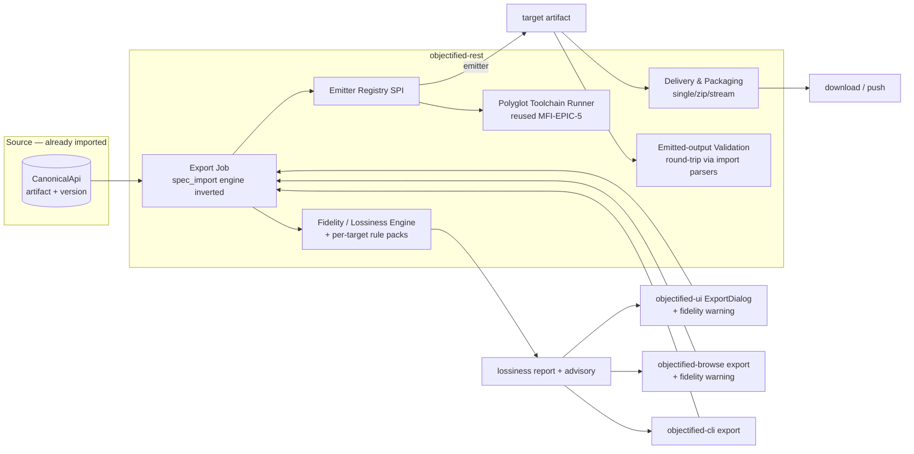
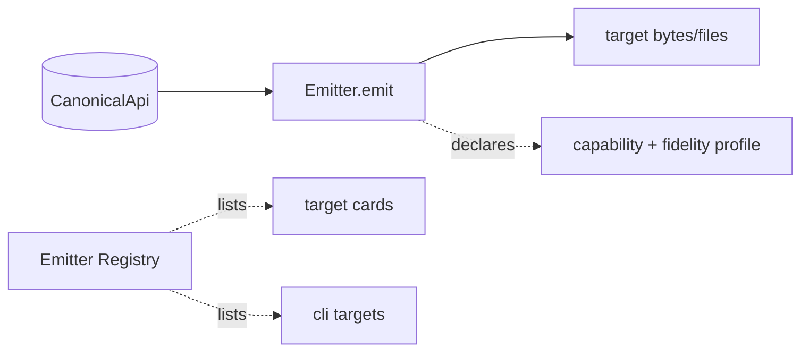
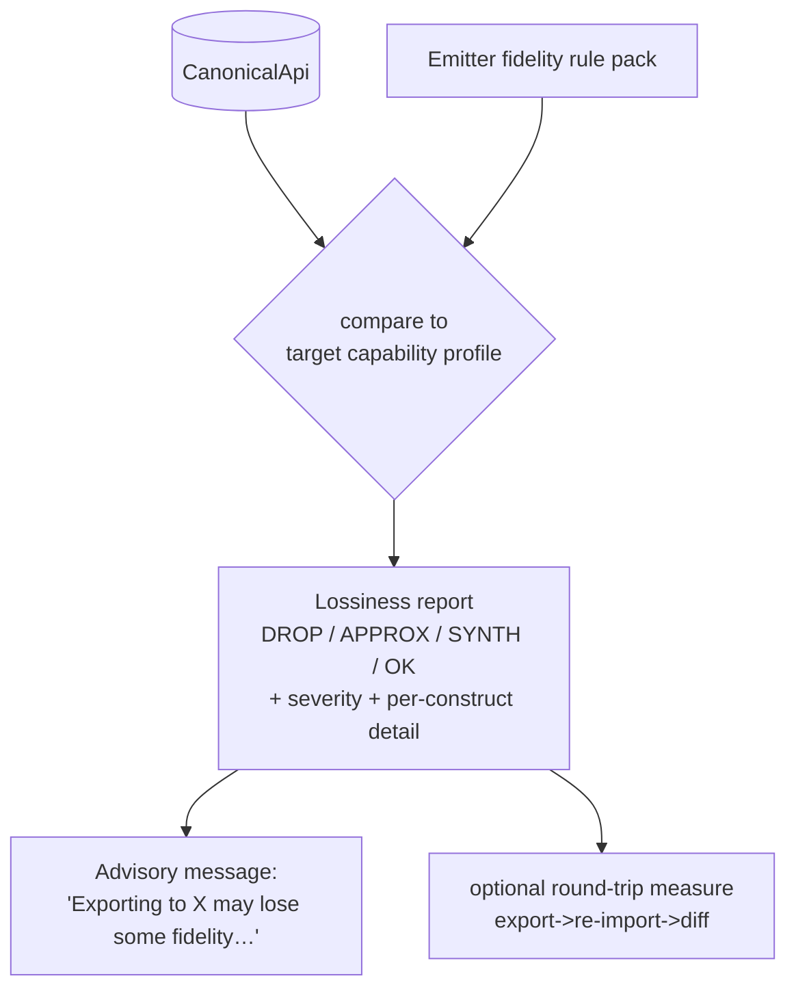
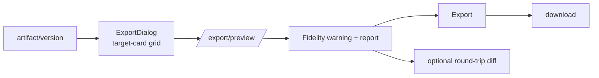
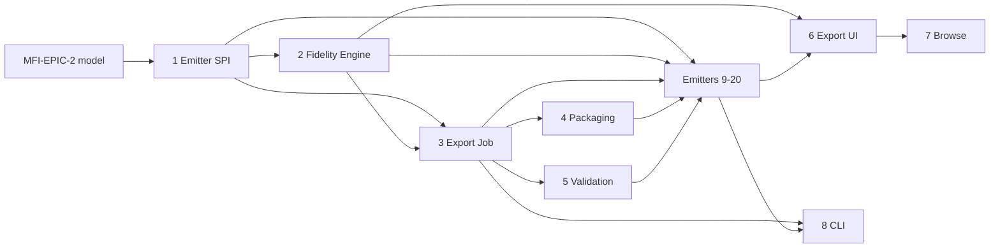

# Roadmap — Multi-Format API Export & Cross-Protocol Transcoding

> **Status:** ✅ **Issues filed on `objectified-project/objectified`** — umbrella **#3813**, epics **#3814–#3833** (MFX-EPIC-1…20), and 84 issues **#3834–#3917** (105 total). Headings below carry their `#number`; epics track children as sub-issues under umbrella #3813 (linked beneath export umbrella #3494).
> **Gap-coverage extension (2026-07-01):** ✅ epics **MFX-EPIC-21…30** (+ add-ons **MFX-14.5**, **MFX-19.6**) filed as **#4125–#4183** (59 more — 164 total) to cover modern data-schema, mainframe, EDI, and XML-schema targets. See *Gap-coverage epics* below.
> **Issue ID prefix:** `MFX` (Multi-Format eXport). Epics `MFX-EPIC-n`, issues `MFX-n.m`.
> **GitHub title format:** `objectified: [<epic>.<issue>] <title>`.
> **Recommended labels:** new `roadmap-multi-format-export` + reuse `export`, `multi-protocol`,
> `integrations`, `rest`, `ui`, `browser`, `database`, `python`, `typescript`, `linting`,
> `version-control`, `validation`, `registry`, `devex`.
> **This is the inverse of** `docs/ROADMAP_MULTI_FORMAT_IMPORT.md` (MFI umbrella **#3715**).
> **Design mockup:** [`docs/planning/mockups/multi-format-export/`](planning/mockups/multi-format-export/)
> — the UX below conforms to it.
>
> **UX decisions from the mockup review:**
> - **Export is version-scoped, not a global nav item.** It is an action on the version being viewed
>   (Projects → project → version → Export), because a tenant may have hundreds of projects/versions. *(MFX-6.5)*
> - **Per-target fidelity badges** (`lossless` / `lossy` / `types-only`) are shown on each target card,
>   computed cheaply for the *specific* source from the target's capability profile — before the export job runs. *(MFX-1.2, 2.5, 6.1)*
> - **Version-level fidelity pre-summary** (best-fidelity vs lossy targets) + a **recent-exports** list
>   render on the version view before the dialog opens. *(MFX-6.5)*
> - The fidelity panel shows a **preserved-% ring**, **count chips** (DROP/APPROX/SYNTH/OK), the
>   per-construct report, and an explicit **"Export anyway"** for lossy conversions — in objectified-ui
>   **and** objectified-browse. *(MFX-2, 6.2, 7.2)*

---

## 0. Source description (request, verbatim)

> Multi-Format API Export & Cross-Protocol Transcoding — the mirror of the multi-format IMPORT
> roadmap. Export emits **from** the Normalized internal API model (`CanonicalApi` / `api_artifact`,
> MFI-EPIC-2) **to** any target format. Because import already lands every format in that normalized
> model, this delivers **any-to-any cross-format transcoding** (import OpenAPI → export gRPC; import
> AsyncAPI → export GraphQL) plus same-format round-trip. Targets mirror the import set: OpenAPI/
> Swagger, Arazzo, AsyncAPI, gRPC/Protobuf, GraphQL, SOAP/WSDL, TypeSpec, OData, RAML, API Blueprint,
> Avro/Schema-Registry, Smithy.
>
> **Headline requirement — fidelity/lossiness.** When an API is exported to a different format,
> accuracy may be lost because the destination format cannot represent some source constructs.
> **Include a message in objectified-ui and the browser that the exported target format may lose some
> fidelity from the originally imported data, due to the destination API not allowing for as much
> detail as was provided** — plus a structured, per-construct lossiness report (REST + CLI too). Build
> a first-class Fidelity/Lossiness engine + per-target fidelity rule packs. Reuse the import roadmap's
> normalized model, toolchain runner, versioning/diff, lint engine, and parsers (to validate emitted
> output via round-trip). Cross-link existing export work; document only — do not create issues.

---

## 1. Goal & strategy

Import (MFI, #3715) made objectified **read** 12 formats into one **Normalized API Model**
(`CanonicalApi`). Export is the mirror: **emit `CanonicalApi` → any target format.** The composition
is the prize:

```
                       ┌──────────────── EXPORT (this roadmap, MFX) ───────────────┐
 IMPORT (MFI #3715)    │                                                            │
 OpenAPI ┐             │                                                  ┌─ OpenAPI/Swagger
 AsyncAPI ┤            │                                                  ├─ AsyncAPI
 gRPC     ┤  parse →   │   ┌──────────────────────────┐   emit →         ├─ gRPC / Protobuf
 GraphQL  ┼─ normalize ┼──▶│   CanonicalApi model      │──── emitter ────▶├─ GraphQL
 WSDL     ┤            │   │   (MFI-EPIC-2 tables)     │   + fidelity     ├─ SOAP / WSDL
 OData    ┤            │   └──────────────────────────┘   report         ├─ OData / TypeSpec
 Avro …   ┘            │                                                  ├─ Avro / Smithy
                       │                                                  └─ RAML / API Blueprint …
                       └────────────────────────────────────────────────────────────┘
        ANY source format  ──────────────  any-to-any  ──────────────▶  ANY target format
```

**The hard, novel part is FIDELITY.** Formats are not equally expressive. Converting a rich source
(say a GraphQL schema with unions + non-null wrappers, or an OpenAPI doc with `oneOf`/`discriminator`
+ `pattern`/`min`/`max` constraints) into a less-expressive target (Protobuf has no unions/constraints
and needs field numbers; Avro is *types-only* with no operations; RAML/API Blueprint are REST-only)
**drops or approximates** information. Objectified must (a) **compute** exactly what is lost per
export, (b) **warn the user** in objectified-ui and objectified-browse, and (c) expose the detail via
REST + CLI.

### What already exists that we REUSE (do not rebuild)

| Capability | Where | Reuse for |
|---|---|---|
| **Normalized API Model** (`CanonicalApi`, `api_*` tables) | import roadmap **MFI-EPIC-2** | The single source of truth every emitter reads |
| **Polyglot Toolchain Runner** | import roadmap **MFI-EPIC-5** | Emitters needing external tools (tsp, protoc/buf, smithy, AMF) |
| **Per-format parsers + linters** | import roadmap (MFI-EPIC-8…17) | **Validate emitted output via round-trip** (export→re-import→diff) |
| Generalized versioning + compare/diff | MFI-EPIC-3 / MCP EPIC-18 | Round-trip fidelity diff |
| Async import job engine | `spec_import_engine.py` | **Inverted** into an export job |
| Import wizard (source-card grid) | `ImportDialog.tsx` | Symmetric **ExportDialog** |
| Public browse + read views | `browse_public_routes.py`, `objectified-browse` | Public export |
| Typer CLI + jobs | `objectified-cli` | `objectified export <format>` |
| Flyway migrations | `objectified-db` | Export audit/job tables |

### Existing GitHub issues to RECONCILE / cross-link (avoid duplication)

| Issue | What | Relationship |
|---|---|---|
| **#3494** [Epic] Export & Interoperability | Existing export umbrella | **This roadmap is its detailed plan** — link as parent/related. |
| **#1786** Multi-Format Export | Direct overlap | This roadmap *is* the spec for #1786. |
| **#2249** OpenAPI Export & Import · **#2214** Graph Export & Sharing · **#2185** Batch Import & Export · **#2330** Preset Import/Export | Format/batch export | Fold into MFX targets / pipeline. |
| **#3182** [Epic] Browse & Schema Export (CLI) | Browse + CLI export | Align with MFX-EPIC-7/8. |
| #221 Export to GraphQL (closed) · #222 Export to AsyncAPI (closed) · #2866 `version.export_asyncapi` (MCP) | Prior single-format exports | Supersede/generalize behind the Emitter SPI. |
| #223–#227, #229 (Export to TS/Python/Java/C#/Go/Markdown) | **Code generation** (not spec-format export) | **Different** — out of scope; note the distinction. |
| #3489 Schema Registry & Discovery · #3496 Community & Schema Browser | Registry/browse | Align push-to-registry (MFX-EPIC-4.4) + public export. |

> **Recommendation:** open this under a **`roadmap-multi-format-export`** umbrella that is **linked as a
> child of #3494** and references the MFI import umbrella **#3715** as its symmetric twin.

### The gaps this roadmap closes

1. Export is **format-by-format and ad-hoc** (closed #221/#222, MCP `export_asyncapi`); no pluggable **Emitter SPI**.
2. No **cross-format transcoding** — you can't import OpenAPI and export gRPC today.
3. **No fidelity/lossiness model** — users get no warning when a conversion silently drops detail. *(headline)*
4. No **multi-file packaging** for targets that need it (protobuf packages, WSDL+XSD, Smithy multi-file, Avro subject sets).
5. No **emitted-output validation** (is the produced artifact actually valid in the target format?).
6. No **export surface in objectified-browse**, and no symmetric **ExportDialog**.

---

## 2. MVP definition

**MVP (v1) — "transcode from the model to 5 targets, with honest fidelity warnings":**

1. **Emitter SPI + registry** (MFX-EPIC-1): emitters register; each declares a capability + fidelity profile.
2. **Fidelity/Lossiness engine** (MFX-EPIC-2) — the headline: per-export structured report + the user-facing advisory message.
3. **Transcoding pipeline + export job** (MFX-EPIC-3): pick artifact/version → target → emit → validate → deliver; any-to-any.
4. **Output delivery & packaging** (MFX-EPIC-4) and **emitted-output validation** (MFX-EPIC-5, round-trip).
5. **Export UI** (MFX-EPIC-6) with the fidelity warning + report; **public export** (MFX-EPIC-7); **CLI export** (MFX-EPIC-8).
6. **Five high-value emitters:** **OpenAPI** (9), **AsyncAPI** (11), **GraphQL** (13), **gRPC/Protobuf** (12), **Avro/Schema-Registry** (19) — chosen to exercise REST + event + graph + RPC + data-schema and the *widest* fidelity range (Protobuf/Avro are the lossiest targets, so they prove the fidelity engine).

**v2 / later:** SOAP/WSDL, TypeSpec, OData, Smithy emitters; then legacy RAML, API Blueprint; Arazzo;
push-to-registry delivery (BSR/Schema Registry); round-trip fidelity *scoring* in the catalog.

**Gap-coverage targets (epics 21–30, filed 2026-07-01):** **JSON Schema** (21) and **standalone XSD**
(22) lead the v2 queue — both are near-free reuses of existing mappings and feed other tickets
(19.6 registry subjects, 29.x grammars). Then the enterprise differentiators no mainstream catalog
competitor offers: **COBOL copybook** (23) and **EDI X12/EDIFACT** (24), plus **Thrift** (25),
**FHIR/HL7 v2** (26), **ASN.1** (27). v3 tail: **OMG IDL** (28), **WADL/Google Discovery** (29),
**FlatBuffers/Cap'n Proto** (30).

---

## 3. Epics overview

| Epic | Theme | Issues | MVP |
|---|---|---|---|
| MFX-EPIC-1 | Emitter SPI & Registry | 1.1–1.4 | ●●● |
| MFX-EPIC-2 | **Fidelity / Lossiness Engine** (headline) | 2.1–2.6 | ●●● |
| MFX-EPIC-3 | Transcoding Pipeline & Export Job | 3.1–3.4 | ●●● |
| MFX-EPIC-4 | Output Delivery & Packaging | 4.1–4.4 | ●●● |
| MFX-EPIC-5 | Emitted-Output Validation (round-trip) | 5.1–5.3 | ●● |
| MFX-EPIC-6 | Export UI — objectified-ui (ExportDialog) | 6.1–6.5 | ●●● |
| MFX-EPIC-7 | Public Export — objectified-browse | 7.1–7.3 | ●● |
| MFX-EPIC-8 | CLI Export + Toolchain reuse | 8.1–8.3 | ●● |
| MFX-EPIC-9 | **OpenAPI / Swagger** emitter | 9.1–9.4 | ●● MVP |
| MFX-EPIC-10 | Arazzo emitter | 10.1–10.4 | ○ v2 |
| MFX-EPIC-11 | **AsyncAPI** emitter | 11.1–11.5 | ●● MVP |
| MFX-EPIC-12 | **gRPC / Protobuf** emitter | 12.1–12.5 | ●● MVP |
| MFX-EPIC-13 | **GraphQL** emitter | 13.1–13.5 | ●● MVP |
| MFX-EPIC-14 | SOAP / WSDL emitter | 14.1–14.4 | ○ v2 |
| MFX-EPIC-15 | TypeSpec emitter | 15.1–15.4 | ○ v2 |
| MFX-EPIC-16 | OData emitter | 16.1–16.4 | ○ v2 |
| MFX-EPIC-17 | RAML emitter (legacy) | 17.1–17.4 | ○ v2 |
| MFX-EPIC-18 | API Blueprint emitter (legacy) | 18.1–18.4 | ○ v2 |
| MFX-EPIC-19 | **Avro / Schema Registry** emitter | 19.1–19.5 | ●● MVP |
| MFX-EPIC-20 | Smithy emitter | 20.1–20.4 | ○ v2 |
| MFX-EPIC-21 | **JSON Schema** emitter (standalone) · #4125 | 21.1–21.5 | ○ v2 (front) |
| MFX-EPIC-22 | **XML Schema (XSD)** emitter (standalone) · #4131 | 22.1–22.6 | ○ v2 (front) |
| MFX-EPIC-23 | **COBOL Copybook** emitter (mainframe) · #4138 | 23.1–23.5 | ○ v2 |
| MFX-EPIC-24 | **EDI** emitters (X12 & EDIFACT) · #4144 | 24.1–24.5 | ○ v2 |
| MFX-EPIC-25 | Apache Thrift emitter · #4150 | 25.1–25.5 | ○ v2 |
| MFX-EPIC-26 | Healthcare emitters (FHIR & HL7 v2) · #4156 | 26.1–26.5 | ○ v2 |
| MFX-EPIC-27 | ASN.1 module emitter · #4162 | 27.1–27.4 | ○ v2 |
| MFX-EPIC-28 | OMG IDL emitter (CORBA/DDS) · #4167 | 28.1–28.4 | ○ v3 |
| MFX-EPIC-29 | Legacy REST descriptors (WADL & Discovery) · #4172 | 29.1–29.4 | ○ v3 |
| MFX-EPIC-30 | Serialization IDLs (FlatBuffers & Cap'n Proto) · #4177 | 30.1–30.4 | ○ v3 |

**Total: 30 epics, ~133 issues** (gap-coverage epics 21–30 + add-ons 14.5/19.6 filed 2026-07-01 as #4125–#4183).

### Fidelity-warning UX (objectified-ui **and** objectified-browse)

```
┌─ Export “Pet Store v1.2” ───────────────────────────────────────────┐
│ Target format:  [ gRPC / Protobuf  ▾ ]                              │
│                                                                     │
│ ⚠  Fidelity notice — exporting to Protobuf may lose detail.         │
│    The destination format can’t represent everything this API       │
│    provides. 7 constructs will be dropped or approximated:          │
│      • oneOf/discriminator on `Payment`  → flattened (DROP)          │
│      • `pattern`/`minLength` constraints → moved to comments (APPROX)│
│      • nullable fields                   → proto3 `optional` (APPROX)│
│      • field numbers                     → auto-assigned (SYNTH)     │
│                                          … [ View full report ]      │
│                                                                     │
│              [ Cancel ]        [ Export anyway ↓ ]                   │
└─────────────────────────────────────────────────────────────────────┘
```

The same advisory + report (preserved-% ring + count chips + per-construct list) renders in
**objectified-browse** for public artifacts (MFX-EPIC-7). Export itself is **invoked from the version
being viewed**, not a global nav item. See the rendered design in
[`docs/planning/mockups/multi-format-export/`](planning/mockups/multi-format-export/).

---

## 4. Architecture



---

# Epics & issues

> Complexity ∈ {S, M, L, XL}. Each emitter epic follows the same template:
> **emit (CanonicalApi → target) → fidelity rule pack → packaging/serialize → emitted-output
> validation/round-trip → UI target card + CLI + fixtures.**

---

## MFX-EPIC-1 — Emitter SPI & Registry  ·  **#3814**

The inverse of the import-source SPI: an **emitter** turns `CanonicalApi` into a target artifact and
declares what it can/can't represent.



| ID | Title | Summary | Labels | Parallel | MVP | Complexity | Affected Modules |
|----|-------|---------|--------|----------|-----|-----------|------------------|
| 1.1 | Emitter SPI + capability/fidelity profile | interface: emit(model)→files, declare capabilities | export,multi-protocol,rest,python,mvp | N | Y | L | objectified-rest |
| 1.2 | Emitter registry + REST target list | enumerate emitters for UI/CLI (`GET /export/targets`) | export,multi-protocol,rest,mvp | N | Y | M | objectified-rest |
| 1.3 | Refactor existing exports behind SPI | move current OpenAPI/MCP export under the SPI | export,multi-protocol,rest | Y | Y | M | objectified-rest |
| 1.4 | Target selection & defaults | choose target + options; sensible per-format defaults | export,multi-protocol,rest,mvp | Y | Y | S | objectified-rest |

### MFX-1.1 — Emitter SPI + capability/fidelity profile  ·  **#3834**
- **Problem.** Export is ad-hoc per format; there's no seam to add targets or to reason about what a target can represent.
- **Solution / Scope.** Define an `Emitter` interface in `objectified-rest`: `emit(model: CanonicalApi, opts) → EmitResult{files[], mediaType}`; plus a static **capability/fidelity profile** declaring which canonical constructs the target supports (operations? events? unions? nullability? constraints? field-identity?), consumed by the fidelity engine (EPIC-2). Inverse of the import `ImportSource` SPI (MFI-1.1). Descriptor: key, label, icon, paradigm, single/multi-file, needs-toolchain.
- **Acceptance Criteria.** A no-op emitter registers and appears in the target list; profile schema documented; OpenAPI emitter (9.x) implements it.
- **Dependencies / Parallelism.** Root. Blocks all emitter epics. Depends on MFI-EPIC-2 (model).
- **Technical Stack.** Python, FastAPI.

### MFX-1.2 — Emitter registry + REST target list  ·  **#3835**
- **Problem.** UI/CLI need to discover available targets + their fidelity profile, and the mockup shows a **per-target fidelity badge on every card** (computed for the current source) *before* any job runs.
- **Solution / Scope.** Registry + `GET /export/targets?artifact={id}&version={v}` returning each emitter's descriptor + capability profile **plus a cheap per-target fidelity tier** (`lossless`/`lossy`/`types-only`) derived by comparing the source `CanonicalApi`'s construct classes against each target's capability profile (no full emit). Drives the card badges (6.1) and the version pre-summary (6.5). Mirrors MFI-1.3's `/import/sources`.
- **Acceptance Criteria.** New emitter appears automatically; each target returns a fidelity tier for the given source; OpenAPI→OpenAPI is `lossless`, →Avro is `types-only`.
- **Dependencies / Parallelism.** After 1.1. Blocks 6.x/8.x.
- **Technical Stack.** FastAPI.

### MFX-1.3 — Refactor existing exports behind SPI  ·  **#3836**
- **Problem.** Current OpenAPI export + MCP `export_asyncapi` (#2866) are bespoke.
- **Solution / Scope.** Move existing export paths behind the Emitter SPI without behavior change; supersede closed #221/#222.
- **Acceptance Criteria.** Existing OpenAPI export still works, now via an emitter; one regression suite green.
- **Dependencies / Parallelism.** After 1.1. Parallel with 1.4.
- **Technical Stack.** Python.

### MFX-1.4 — Target selection & defaults  ·  **#3837**
- **Problem.** Each target needs options (e.g. proto3 vs editions, CSDL JSON vs XML, AsyncAPI 2 vs 3) with safe defaults.
- **Solution / Scope.** A per-emitter options schema + defaults, surfaced in UI/CLI.
- **Acceptance Criteria.** Options validated; defaults produce a valid artifact.
- **Dependencies / Parallelism.** After 1.1. Parallel with 1.3.
- **Technical Stack.** Python, Pydantic.

---

## MFX-EPIC-2 — Fidelity / Lossiness Engine (headline)  ·  **#3815**

The differentiator. Given a source `CanonicalApi` and a target emitter's capability profile, compute
**exactly what will be lost** and surface it everywhere.



| ID | Title | Summary | Labels | Parallel | MVP | Complexity | Affected Modules |
|----|-------|---------|--------|----------|-----|-----------|------------------|
| 2.1 | Lossiness report model + severities | DROP/APPROX/SYNTH/OK per construct + severity | export,multi-protocol,version-control,mvp | N | Y | M | objectified-rest |
| 2.2 | Fidelity computation engine | diff source constructs vs target capability profile | export,multi-protocol,python,mvp | N | Y | L | objectified-rest |
| 2.3 | Fidelity rule-pack SPI | per-target degradation rules (how a construct degrades) | export,multi-protocol,python,mvp | N | Y | M | objectified-rest |
| 2.4 | User-facing advisory message | the "may lose fidelity" copy + i18n string + thresholds | export,ui,browser,mvp | Y | Y | S | objectified-rest,objectified-ui |
| 2.5 | Fidelity report REST surfacing | return report from export + a dry-run preview endpoint | export,rest,mvp | Y | Y | S | objectified-rest |
| 2.6 | Round-trip fidelity measurement | export→re-import→diff to quantify actual loss | export,version-control,validation | Y | N | M | objectified-rest |

### MFX-2.1 — Lossiness report model + severities  ·  **#3838**
- **Problem.** "Fidelity loss" must be structured, not prose, so UI/CLI/REST can render and gate on it.
- **Solution / Scope.** A `LossinessReport` = ordered `LossItem{ construct (canonical path), kind: DROP|APPROX|SYNTH|OK, severity: info|warn|critical, message, targetMapping }` + summary counts. `DROP` = unrepresentable (removed); `APPROX` = represented imperfectly (e.g. constraint→comment); `SYNTH` = invented to satisfy target (e.g. protobuf field numbers); `OK` = clean. Stable construct keys reuse the canonical model's keys.
- **Acceptance Criteria.** Report serializes to JSON; counts per kind/severity; stable ordering.
- **Dependencies / Parallelism.** After MFI-EPIC-2. Blocks 2.2.
- **Technical Stack.** Python, Pydantic.

### MFX-2.2 — Fidelity computation engine  ·  **#3839**
- **Problem.** Need to actually compute the report for a given (model, emitter).
- **Solution / Scope.** Walk the `CanonicalApi`; for each construct, consult the emitter's capability profile + rule pack (2.3) to decide DROP/APPROX/SYNTH/OK. Pure function (no I/O) → deterministic, testable. Runs **before** emit (preview) and is attached **to** the emit result.
- **Acceptance Criteria.** For a rich source → Protobuf, reports unions/constraints/nullability/field-numbers correctly; clean REST→OpenAPI reports mostly OK.
- **Dependencies / Parallelism.** After 2.1/2.3. Blocks emitter fidelity packs.
- **Technical Stack.** Python.

### MFX-2.3 — Fidelity rule-pack SPI  ·  **#3840**
- **Problem.** Each target degrades constructs differently; rules must be pluggable per emitter.
- **Solution / Scope.** A `FidelityRulePack` SPI: maps canonical constructs → target handling (`OK`/`APPROX how`/`DROP`/`SYNTH`). Format epics ship their pack alongside the emitter. Cross-paradigm rules included (operations→types-only targets like Avro = DROP all operations).
- **Acceptance Criteria.** SPI documented; a reference pack (OpenAPI) implemented; engine consumes packs.
- **Dependencies / Parallelism.** After 2.1. Blocks 2.2 and emitter packs.
- **Technical Stack.** Python.

### MFX-2.4 — User-facing advisory message  ·  **#3841**
- **Problem.** The user explicitly wants a clear "you may lose fidelity" message in objectified-ui **and** the browser.
- **Solution / Scope.** A canonical advisory string + severity thresholds returned with every cross-format (and lossy same-format) export: e.g. *"Exporting to **{format}** may lose some fidelity. The destination format can't represent everything in this API, so **{n}** construct(s) will be dropped or approximated — review the fidelity report before downloading."* Shared by UI (6.2), browse (7.2), CLI (8.2). Suppressed/relaxed when the report is all-OK (same-format high-fidelity round-trips).
- **Acceptance Criteria.** Message reflects real counts; shown when loss > threshold; hidden when lossless; identical wording across UI/browse/CLI.
- **Dependencies / Parallelism.** After 2.2. Blocks 6.2/7.2/8.2.
- **Technical Stack.** Python (string source), TS (consumers).

### MFX-2.5 — Fidelity report REST surfacing  ·  **#3842**
- **Problem.** UI/CLI need the report before committing a download, and (per mockup) the version view needs a **fast, per-target fidelity tier + preserved-%** for all targets at once to render card badges and the pre-summary.
- **Solution / Scope.** Two granularities: (1) `GET /export/targets?artifact&version` returns the cheap per-target **tier** + a **preserved-%** estimate for every target (drives 6.1 card badges + 6.5 pre-summary, no emit); (2) `POST /export/preview` (artifact/version+target → full `LossinessReport`, no artifact) for the dialog's detailed panel; and the report is also embedded in the export job result. Tenant-scoped.
- **Acceptance Criteria.** Targets endpoint returns tier + preserved-% per target; preview returns the full report without producing the artifact; export result carries it.
- **Dependencies / Parallelism.** After 2.2, 3.1. Parallel with 2.4.
- **Technical Stack.** FastAPI.

### MFX-2.6 — Round-trip fidelity measurement  ·  **#3843**
- **Problem.** Beyond *predicted* loss, measure *actual* loss by re-importing the emitted artifact.
- **Solution / Scope.** Optionally export → re-import via the matching MFI parser → diff against the source `CanonicalApi` (reuse MFI-EPIC-3 diff) → an empirical loss list that corroborates the predicted report.
- **Acceptance Criteria.** Round-trip diff matches predicted DROPs on fixtures; flagged where they diverge.
- **Dependencies / Parallelism.** After 2.2, MFI parsers + diff. **v2.** Parallel with emitter epics.
- **Technical Stack.** Python.

---

## MFX-EPIC-3 — Transcoding Pipeline & Export Job  ·  **#3816**

Invert the import job engine: select artifact/version → choose target → (preview fidelity) → emit →
validate → deliver. Enables any-to-any.

| ID | Title | Summary | Labels | Parallel | MVP | Complexity | Affected Modules |
|----|-------|---------|--------|----------|-----|-----------|------------------|
| 3.1 | Export job engine | inverse of `spec_import_engine`: emit→validate→package | export,multi-protocol,rest,python,mvp | N | Y | L | objectified-rest |
| 3.2 | CanonicalApi → emitter dispatch | resolve emitter, run, attach fidelity report | export,multi-protocol,rest,mvp | N | Y | M | objectified-rest |
| 3.3 | Any-to-any transcoding guards | source-paradigm ↔ target-paradigm sanity + warnings | export,multi-protocol,validation,mvp | Y | Y | M | objectified-rest |
| 3.4 | Export job status/polling | job lifecycle + result (artifact ref + report) | export,rest,mvp | Y | Y | S | objectified-rest |

### MFX-3.1 — Export job engine  ·  **#3844**
- **Problem.** Export of large artifacts (multi-file, toolchain-backed) needs the same async job lifecycle as import.
- **Solution / Scope.** Mirror `spec_import_engine.py`: submit (artifact/version + target + opts) → run emitter → fidelity report → validate (EPIC-5) → package (EPIC-4) → deliver; status/polling reused. Dry-run = preview only (report, no artifact).
- **Acceptance Criteria.** An emitter runs end-to-end through the job API; status contract matches import.
- **Dependencies / Parallelism.** After 1.1, 2.2. Blocks emitter epics.
- **Technical Stack.** Python async.

### MFX-3.2 — CanonicalApi → emitter dispatch  ·  **#3845**
- **Solution / Scope.** Load the artifact's `CanonicalApi` for the chosen version, resolve the emitter from the registry, run it, attach the fidelity report.
- **Acceptance Criteria.** Correct emitter runs; report attached; tenant-scoped.
- **Dependencies / Parallelism.** After 3.1. Blocks emitter epics.
- **Technical Stack.** Python.

### MFX-3.3 — Any-to-any transcoding guards  ·  **#3846**
- **Problem.** Some conversions are nonsensical or extreme-loss (e.g. an event-only AsyncAPI → gRPC, or any operation-bearing API → Avro which is types-only).
- **Solution / Scope.** Pre-flight checks that classify the conversion (clean / lossy / severe / near-empty) and require explicit confirmation (or block) for severe cases, surfacing *why* via the fidelity report.
- **Acceptance Criteria.** Severe conversions require confirm; near-empty (operations→Avro) warns that only schemas export.
- **Dependencies / Parallelism.** After 3.2, 2.2. Parallel with 3.4.
- **Technical Stack.** Python.

### MFX-3.4 — Export job status/polling  ·  **#3847**
- **Solution / Scope.** `GET /export/jobs/{id}` returning state, fidelity report, artifact/download ref. Used by UI/CLI pollers.
- **Acceptance Criteria.** Terminal state returns download ref + report or structured error.
- **Dependencies / Parallelism.** After 3.1. Parallel with 3.3.
- **Technical Stack.** FastAPI.

---

## MFX-EPIC-4 — Output Delivery & Packaging  ·  **#3817**

| ID | Title | Summary | Labels | Parallel | MVP | Complexity | Affected Modules |
|----|-------|---------|--------|----------|-----|-----------|------------------|
| 4.1 | Single-file emit & download | one document; content-type + filename | export,rest,mvp | N | Y | S | objectified-rest |
| 4.2 | Multi-file bundle (zip) | protobuf packages, WSDL+XSD, Smithy, Avro subjects | export,rest,mvp | N | Y | M | objectified-rest |
| 4.3 | Streaming/download & retention | stream large bundles; temp artifact retention | export,rest | Y | Y | S | objectified-rest |
| 4.4 | Push-to-registry delivery | push Avro→Schema Registry, proto→BSR (opt) | export,registry,integrations | Y | N | M | objectified-rest |

*(4.1–4.4 follow the delivery template. Multi-file is mandatory for protobuf (per-package files + imports), WSDL (+ separate XSDs), Smithy (multi-namespace), and Avro (per-subject `.avsc`); deliver as a zip with a manifest. 4.4 (v2) reuses the import discovery clients in reverse to **register** schemas into a live Confluent Schema Registry / Buf Schema Registry.)*

---

## MFX-EPIC-5 — Emitted-Output Validation (round-trip)  ·  **#3818**

| ID | Title | Summary | Labels | Parallel | MVP | Complexity | Affected Modules |
|----|-------|---------|--------|----------|-----|-----------|------------------|
| 5.1 | Validate emitted artifact | parse the output with the matching MFI parser | export,validation,mvp | N | Y | M | objectified-rest |
| 5.2 | Lint emitted artifact | run the target's linter on the output | export,linting | Y | N | S | objectified-rest |
| 5.3 | Validation gating & report | block/warn on invalid output; surface results | export,validation,mvp | Y | Y | S | objectified-rest |

### MFX-5.1 — Validate emitted artifact  ·  **#3852**
- **Problem.** A buggy emitter could produce invalid output; we must guarantee the artifact is legal in its target format.
- **Solution / Scope.** Feed the emitted artifact back through the **matching MFI import parser/validator** (reuse, don't rebuild) to confirm it parses; failures fail the export job with detail.
- **Acceptance Criteria.** Valid output passes; deliberately broken output is caught.
- **Dependencies / Parallelism.** After 3.1, MFI parsers. Blocks 5.3.
- **Technical Stack.** Python (reused MFI parsers).

*(5.2 reuses the MFI lint packs on the emitted output; 5.3 gates delivery and surfaces validation alongside the fidelity report.)*

---

## MFX-EPIC-6 — Export UI — objectified-ui (ExportDialog)  ·  **#3819**

Symmetric to `ImportDialog`. **Carries the fidelity warning (user directive).**



| ID | Title | Summary | Labels | Parallel | MVP | Complexity | Affected Modules |
|----|-------|---------|--------|----------|-----|-----------|------------------|
| 6.1 | ExportDialog + target-card grid | mirror ImportDialog; pick target + options | export,ui,typescript,mvp | N | Y | M | objectified-ui |
| 6.2 | Fidelity warning panel + report | advisory message + per-construct DROP/APPROX/SYNTH list | export,ui,mvp | N | Y | M | objectified-ui |
| 6.3 | Preview + download | preview emitted artifact; download single/zip | export,ui,mvp | Y | Y | S | objectified-ui |
| 6.4 | Round-trip diff view | show what changed if re-imported (uses 2.6) | export,ui,version-control | Y | N | M | objectified-ui |
| 6.5 | Version-scoped entry points | Export is an action on the viewed version (NOT a global nav item) | export,ui | Y | Y | S | objectified-ui |

### MFX-6.1 — ExportDialog + target-card grid  ·  **#3855**
- **Solution / Scope.** A symmetric `ExportDialog` (reuse `ImportDialog` patterns/tokens): a **12-target card grid** from `GET /export/targets` where **each card shows a per-source fidelity badge** (`lossless`/`lossy`/`types-only`, from 1.2/2.5) so the user sees the trade-off before selecting; numbered stepper (Source → Target → Fidelity → Export); per-target options per 1.4 (e.g. proto3 vs editions, single-file vs multi-file zip). Selecting a target updates the fidelity headline (6.2). Follow `frontend-design` guidance. See the mockup.
- **Acceptance Criteria.** Pick a target → fidelity panel updates → export; each card shows its fidelity tier for the current source; consistent with ImportDialog look & feel.
- **Dependencies / Parallelism.** After 1.2, 2.5. Blocks 6.2.
- **Technical Stack.** Next.js, TanStack Query.

### MFX-6.2 — Fidelity warning panel + report  ·  **#3856**
- **Problem.** **(headline)** The user must see, before downloading, that the target may lose fidelity.
- **Solution / Scope.** Render (per the mockup): the advisory message (2.4) prominently; a **preserved-% ring** and **count chips** (`N dropped · N approximated · N synthesized · N clean`); an expandable per-construct report (DROP/APPROX/SYNTH/OK with source path + how it degrades); and an explicit **"Export anyway"** confirm for lossy conversions. Hidden/relaxed when lossless.
- **Acceptance Criteria.** Warning shows real counts + preserved-%; full report expandable; "Export anyway" required when lossy; absent when clean.
- **Dependencies / Parallelism.** After 6.1, 2.4/2.5. Blocks nothing.
- **Technical Stack.** Next.js.

*(6.3 preview/download incl. the emitted-artifact preview with a "valid · round-trip OK" badge; 6.4 round-trip diff (v2). **6.5 — version-scoped entry points:** Export is an action on the viewed version's actions/menu, **not** a global left-nav item, since a tenant may have hundreds of projects/versions — navigate Projects → project → version, then export that version. The version view also shows a **fidelity pre-summary** (best-fidelity vs lossy targets for this source) and a **recent-exports** list with fidelity %, per the mockup.)*

---

## MFX-EPIC-7 — Public Export — objectified-browse  ·  **#3820**

| ID | Title | Summary | Labels | Parallel | MVP | Complexity | Affected Modules |
|----|-------|---------|--------|----------|-----|-----------|------------------|
| 7.1 | Public export of published artifacts | export published versions; no auth | export,browser,mvp | N | Y | M | objectified-browse,objectified-rest |
| 7.2 | Fidelity advisory in browse | same "may lose fidelity" message + report publicly | export,browser,mvp | N | Y | S | objectified-browse |
| 7.3 | Public download + guards | rate-limit, size caps, published/public only | export,browser,security | Y | Y | S | objectified-browse,objectified-rest |

### MFX-7.1 — Public export of published artifacts  ·  **#3860**
- **Solution / Scope.** Allow exporting **published/public** artifacts from `objectified-browse` to any target, reusing the export job + emitters via a public, no-auth, read-only path (reuse `mcp_v_public`/browse read models). Never expose private artifacts.
- **Acceptance Criteria.** Public user exports a published API to a chosen format with the fidelity warning; private artifacts unavailable.
- **Dependencies / Parallelism.** After 3.x, 6.2. Blocks 7.2/7.3.
- **Technical Stack.** Next.js (objectified-browse), FastAPI.

### MFX-7.2 — Fidelity advisory in browse  ·  **#3861**
- **Problem.** **(headline)** The browser must carry the same fidelity message as the ADE.
- **Solution / Scope.** Render the identical advisory (2.4) + report in the public export flow.
- **Acceptance Criteria.** Same wording/severity as objectified-ui; report visible publicly.
- **Dependencies / Parallelism.** After 7.1. Parallel with 7.3.
- **Technical Stack.** Next.js.

*(7.3 adds rate-limit/size caps + published-only guards.)*

---

## MFX-EPIC-8 — CLI Export + Toolchain reuse  ·  **#3821**

| ID | Title | Summary | Labels | Parallel | MVP | Complexity | Affected Modules |
|----|-------|---------|--------|----------|-----|-----------|------------------|
| 8.1 | `objectified export <format>` | export an artifact/version to a target; poll | export,devex,python,mvp | N | Y | M | objectified-cli |
| 8.2 | Fidelity report in CLI | print advisory + report; `--force` for lossy | export,devex,mvp | Y | Y | S | objectified-cli |
| 8.3 | Toolchain runner reuse | wire emitters needing tsp/buf/smithy/AMF | export,multi-protocol,infrastructure | Y | N | S | objectified-rest |

### MFX-8.1 — `objectified export <format>`  ·  **#3863**
- **Solution / Scope.** `objectified export <format> <artifact> [--version] [--out file|dir] [--option ...]`; resolves the emitter, polls the export job, writes single file or unzips a bundle.
- **Acceptance Criteria.** Exports from CLI to a chosen format; bundle unpacked; `--json` mode.
- **Dependencies / Parallelism.** After 1.2, 3.4. Blocks 8.2.
- **Technical Stack.** Python, Typer.

### MFX-8.2 — Fidelity report in CLI  ·  **#3864**
- **Problem.** **(headline)** CLI users must also be warned.
- **Solution / Scope.** Print the advisory (2.4) + a concise loss table; require `--force` (or interactive confirm) when the conversion is lossy.
- **Acceptance Criteria.** Lossy export warns + needs `--force`; lossless exports cleanly.
- **Dependencies / Parallelism.** After 8.1, 2.4. Parallel with 8.3.
- **Technical Stack.** Python, Typer.

*(8.3 reuses MFI-EPIC-5 Toolchain Runner for emitters that shell out to tsp/buf/smithy/AMF.)*

---

## MFX-EPIC-9 — OpenAPI / Swagger emitter · MVP  ·  **#3822**

Highest-fidelity REST target (the model's lingua franca). Mostly OK from REST sources; loses
RPC streaming, event channels, gRPC field numbers; can express oneOf/anyOf/discriminator + constraints.

| ID | Title | Summary | Labels | Parallel | MVP | Complexity | Affected Modules |
|----|-------|---------|--------|----------|-----|-----------|------------------|
| 9.1 | OpenAPI emitter | CanonicalApi → OpenAPI 3.1 (+ 3.0/Swagger opt) | export,multi-protocol,rest,mvp | N | Y | M | objectified-rest |
| 9.2 | OpenAPI fidelity pack | what OpenAPI can't represent (events/RPC streaming) | export,multi-protocol,mvp | N | Y | S | objectified-rest |
| 9.3 | Validate + round-trip | re-import via MFI OpenAPI parser; diff | export,validation,mvp | Y | Y | S | objectified-rest |
| 9.4 | OpenAPI target card + CLI + fixtures | UI/CLI target + round-trip fixtures | export,ui,devex,mvp | Y | Y | S | objectified-ui,objectified-cli |

### MFX-9.1 — OpenAPI emitter  ·  **#3866**
- **Problem.** Need the canonical REST emitter (and the reference implementation of the SPI).
- **Solution / Scope.** Map `CanonicalApi` operations/types → OpenAPI 3.1 (paths, operations, components/schemas via the existing JSON-Schema/primitives model); option for 3.0/Swagger 2.0 downgrade (which itself loses 3.1 features — feed the fidelity pack). Reuse the existing OpenAPI generation where present.
  - Source: OpenAPI 3.1 — https://spec.openapis.org/oas/v3.1.0.html
- **Acceptance Criteria.** Emits valid 3.1 from a REST source; 3.0/2.0 downgrades flagged as lossy.
- **Dependencies / Parallelism.** After 1.1, 2.3, 3.1. Blocks 9.2/9.3.
- **Technical Stack.** Python.

### MFX-9.2 — OpenAPI fidelity pack  ·  **#3867**
- **Solution / Scope.** Rules: event channels (AsyncAPI sources) → DROP/notes; RPC streaming → APPROX (callbacks/notes); gRPC field numbers → DROP; downgrade-to-3.0 (`oneOf` nuance, `examples`) / 2.0 (`nullable`, `oneOf`, multiple content types) → APPROX/DROP.
- **Acceptance Criteria.** Event/RPC source loss reported; 2.0 downgrade enumerates dropped features.
- **Dependencies / Parallelism.** After 9.1, 2.3. Parallel with 9.3.
- **Technical Stack.** Python.

*(9.3 validates via the MFI OpenAPI parser + round-trip diff; 9.4 adds the target card + `objectified export openapi` + fixtures. Coordinate with #2249.)*

---

## MFX-EPIC-10 — Arazzo emitter · v2  ·  **#3823**

Arazzo describes **workflows** over operations, not types/endpoints — so emitting Arazzo from a
non-workflow source is **near-empty** unless the model carries workflow info.

| ID | Title | Summary | Labels | Parallel | MVP | Complexity | Affected Modules |
|----|-------|---------|--------|----------|-----|-----------|------------------|
| 10.1 | Arazzo emitter | model workflows → Arazzo description | export,multi-protocol | N | N | M | objectified-rest |
| 10.2 | Arazzo fidelity pack | non-workflow sources → near-empty/DROP | export,multi-protocol | N | N | S | objectified-rest |
| 10.3 | Validate + round-trip | re-import via Arazzo path | export,validation | Y | N | S | objectified-rest |
| 10.4 | Arazzo target card + CLI + fixtures | UI/CLI + fixtures | export,ui,devex | Y | N | S | objectified-ui,objectified-cli |

*(Adapter template. Key fidelity note: Arazzo is workflow-only — exporting a plain REST/RPC/event API yields only whatever sequencing exists; the engine should warn "this target captures workflows, not the full API surface".)*

---

## MFX-EPIC-11 — AsyncAPI emitter · MVP  ·  **#3824**

Event-driven target. Clean from event sources; from REST/RPC sources it **reframes** request/response
as messages (APPROX) and loses HTTP path/verb/status semantics.
Source: https://www.asyncapi.com/docs/reference/specification/v3.1.0

| ID | Title | Summary | Labels | Parallel | MVP | Complexity | Affected Modules |
|----|-------|---------|--------|----------|-----|-----------|------------------|
| 11.1 | AsyncAPI emitter | model channels/operations/messages → AsyncAPI 3 (+2 opt) | export,multi-protocol,mvp | N | Y | M | objectified-rest |
| 11.2 | AsyncAPI fidelity pack | REST/RPC→message reframing; HTTP semantics DROP | export,multi-protocol,mvp | N | Y | S | objectified-rest |
| 11.3 | Multi-version (2.6/3.0/3.1) | emit per requested version; 3→2 downgrade losses | export,multi-protocol | Y | N | S | objectified-rest |
| 11.4 | Validate + round-trip | re-import via MFI AsyncAPI parser; diff | export,validation,mvp | Y | Y | S | objectified-rest |
| 11.5 | AsyncAPI target card + CLI + fixtures | UI/CLI + fixtures; supersede #222/#2866 | export,ui,devex,mvp | Y | Y | S | objectified-ui,objectified-cli |

### MFX-11.1 — AsyncAPI emitter  ·  **#3874**
- **Solution / Scope.** Map canonical channels/operations/messages → AsyncAPI 3.1 (servers, channels, operations action send/receive, messages with payload schema). For REST/RPC sources, reframe operations as request/reply messages (flagged APPROX by 11.2). Reuse `@asyncapi/parser` (via toolchain runner) to validate output.
- **Acceptance Criteria.** Emits valid AsyncAPI 3 from an event source; REST source emits with documented reframing.
- **Dependencies / Parallelism.** After 1.1, 2.3, 3.1. Blocks 11.2/11.4.
- **Technical Stack.** Python (+ Node for validation).

### MFX-11.2 — AsyncAPI fidelity pack  ·  **#3875**
- **Solution / Scope.** Rules: HTTP method/path/status (REST source) → DROP/notes; RPC streaming → channel APPROX; non-message types → components. 
- **Acceptance Criteria.** REST→AsyncAPI loss enumerated.
- **Dependencies / Parallelism.** After 11.1, 2.3. Parallel with 11.4.
- **Technical Stack.** Python.

*(11.3 multi-version downgrade losses; 11.4 round-trip validation; 11.5 target card + `objectified export asyncapi` + fixtures, **superseding the closed #222 and MCP #2866**.)*

---

## MFX-EPIC-12 — gRPC / Protobuf emitter · MVP  ·  **#3825**

**The lossiest, most important fidelity proving-ground.** Protobuf has **no unions** (oneof is partial),
**no nullability** (proto3 `optional`), **no rich constraints** (no pattern/min/max — APPROX to comments),
**requires field numbers** (SYNTH, must be stable), enums are int-based, no inheritance.
Sources: https://protobuf.dev/ · https://buf.build/docs/

| ID | Title | Summary | Labels | Parallel | MVP | Complexity | Affected Modules |
|----|-------|---------|--------|----------|-----|-----------|------------------|
| 12.1 | Protobuf emitter | model services/methods/types → `.proto` (+ descriptor) | export,multi-protocol,mvp | N | Y | L | objectified-rest |
| 12.2 | Stable field-number assignment | deterministic, persisted field numbers (SYNTH) | export,multi-protocol,version-control,mvp | N | Y | M | objectified-rest |
| 12.3 | Protobuf fidelity pack | unions/nullability/constraints/inheritance loss | export,multi-protocol,mvp | N | Y | M | objectified-rest |
| 12.4 | Multi-file packaging + validate | per-package files + imports; `buf build` validate | export,rest,validation,mvp | Y | Y | M | objectified-rest |
| 12.5 | gRPC target card + CLI + fixtures | UI/CLI + round-trip fixtures | export,ui,devex,mvp | Y | Y | S | objectified-ui,objectified-cli |

### MFX-12.1 — Protobuf emitter  ·  **#3879**
- **Solution / Scope.** Map services→`service`, operations→`rpc` (streaming flags), types→`message`/`enum`, fields→typed fields. Emit `.proto` (and optionally a `FileDescriptorSet`). Map canonical types → proto scalar/message types; arrays→`repeated`; maps→`map`; optionals→proto3 `optional`.
  - Source: https://protobuf.dev/programming-guides/proto3/
- **Acceptance Criteria.** Emits compilable `.proto` (via `buf build`) for a typed source; streaming preserved.
- **Dependencies / Parallelism.** After 1.1, 2.3, 3.1, 5.x. Blocks 12.2/12.3.
- **Technical Stack.** Python + buf (toolchain runner).

### MFX-12.2 — Stable field-number assignment  ·  **#3880**
- **Problem.** Protobuf requires field numbers the source may not have; they must be **stable across exports** or every re-export is wire-incompatible.
- **Solution / Scope.** Deterministically assign + **persist** field numbers per (artifact, message, field) so re-exports reuse them; honor `reserved`; surface as SYNTH in the fidelity report.
- **Acceptance Criteria.** Re-exporting the same artifact yields identical numbers; new fields get new numbers; reported as SYNTH.
- **Dependencies / Parallelism.** After 12.1. Blocks 12.4 stability.
- **Technical Stack.** Python, PostgreSQL.

### MFX-12.3 — Protobuf fidelity pack  ·  **#3881**
- **Solution / Scope.** Rules: `oneOf`/union → `oneof` if shape allows else DROP-to-`Any`/notes (APPROX); nullability → proto3 `optional` (APPROX); constraints (pattern/min/max/format) → comments (APPROX/DROP); inheritance/`allOf` → flatten (APPROX); arbitrary JSON → `google.protobuf.Struct` (APPROX); field numbers → SYNTH.
- **Acceptance Criteria.** A rich OpenAPI/GraphQL source enumerates each loss with kind + reason.
- **Dependencies / Parallelism.** After 12.1, 2.3. Parallel with 12.4.
- **Technical Stack.** Python.

*(12.4 multi-file packaging (per-package + imports) + `buf build` validation; 12.5 target card + `objectified export grpc` + round-trip fixtures. Coordinate with #1384/#1427.)*

---

## MFX-EPIC-13 — GraphQL emitter · MVP  ·  **#3826**

Graph target. Splits input vs output types; nullability/list wrappers are first-class; no HTTP
path/verb/status (DROP); custom scalars for constrained types (APPROX).
Sources: https://spec.graphql.org/September2025/ · `graphql-core` `print_schema`

| ID | Title | Summary | Labels | Parallel | MVP | Complexity | Affected Modules |
|----|-------|---------|--------|----------|-----|-----------|------------------|
| 13.1 | GraphQL SDL emitter | model → SDL (Query/Mutation/types) via graphql-core | export,multi-protocol,python,mvp | N | Y | M | objectified-rest |
| 13.2 | Input/output type splitting | derive input types; map operations→fields | export,multi-protocol,mvp | N | Y | M | objectified-rest |
| 13.3 | GraphQL fidelity pack | HTTP semantics DROP; constraints→custom scalars | export,multi-protocol,mvp | N | Y | S | objectified-rest |
| 13.4 | Validate + round-trip | `build_schema` validate; re-import diff | export,validation,mvp | Y | Y | S | objectified-rest |
| 13.5 | GraphQL target card + CLI + fixtures | UI/CLI + fixtures; supersede #221/#2214 | export,ui,devex,mvp | Y | Y | S | objectified-ui,objectified-cli |

### MFX-13.1 — GraphQL SDL emitter  ·  **#3884**
- **Solution / Scope.** Map canonical types→GraphQL types (object/interface/union/enum/scalar), operations→`Query`/`Mutation` fields (read vs write heuristic), preserving nullability/list wrappers. Serialize via `graphql-core` `print_schema` (guarantees validity).
  - Source: https://github.com/graphql-python/graphql-core
- **Acceptance Criteria.** Emits valid SDL; nullability/list wrappers correct.
- **Dependencies / Parallelism.** After 1.1, 2.3, 3.1. Blocks 13.2/13.4.
- **Technical Stack.** Python (`graphql-core`).

### MFX-13.2 — Input/output type splitting  ·  **#3885**
- **Problem.** GraphQL forbids using output object types as inputs; request bodies must become `input` types.
- **Solution / Scope.** Derive `input` types for operation arguments/request bodies; dedupe; name deterministically; report synthesized inputs.
- **Acceptance Criteria.** Operations with body args produce valid `input` types; no output-as-input violations.
- **Dependencies / Parallelism.** After 13.1. Blocks 13.4.
- **Technical Stack.** Python.

*(13.3 fidelity (HTTP method/path/status/headers DROP; pattern/min/max → custom scalar APPROX; oneOf→union if shape allows); 13.4 round-trip validate; 13.5 target card + `objectified export graphql` + fixtures, **superseding closed #221** and feeding #2214.)*

---

## MFX-EPIC-14 — SOAP / WSDL emitter · v2  ·  **#3827**

XML target. JSON-native constructs map to XSD; `oneOf`→`xs:choice`; nullable→`nillable`/`minOccurs=0`;
loses examples; very verbose; needs WSDL+XSD multi-file.

| ID | Title | Summary | Labels | Parallel | MVP | Complexity | Affected Modules |
|----|-------|---------|--------|----------|-----|-----------|------------------|
| 14.1 | WSDL+XSD emitter | model → WSDL 1.1 + XSD types (doc/literal) | export,multi-protocol | N | N | L | objectified-rest |
| 14.2 | WSDL fidelity pack | JSON→XSD mapping losses; example/constraint DROP | export,multi-protocol | N | N | M | objectified-rest |
| 14.3 | Multi-file packaging + validate | WSDL + XSDs zip; WS-I check | export,rest,validation | Y | N | M | objectified-rest |
| 14.4 | WSDL target card + CLI + fixtures | UI/CLI + fixtures | export,ui,devex | Y | N | S | objectified-ui,objectified-cli |
| 14.5 · #4182 | WSDL 2.0 output option | 2.0 mode (interface/binding/service); reuses shared XSD mapping (22.1) | export,multi-protocol,rest | Y | N | S | objectified-rest |

*(Adapter template. Fidelity: prefer document/literal (WS-I); map types→XSD (`xs:choice`/`nillable`/facets); arrays→`maxOccurs`; loses JSON-only constructs + examples. Multi-file WSDL+XSD bundle.)*

---

## MFX-EPIC-15 — TypeSpec emitter · v2  ·  **#3828**

TypeSpec is normally a **source** IDL, not a target. Emit `.tsp` by reverse-mapping the model
(an openapi3→typespec converter exists); for REST sources fidelity is high, otherwise lossy.

| ID | Title | Summary | Labels | Parallel | MVP | Complexity | Affected Modules |
|----|-------|---------|--------|----------|-----|-----------|------------------|
| 15.1 | TypeSpec emitter | model → `.tsp` (models/operations/interfaces) | export,multi-protocol,typescript | N | N | M | objectified-rest |
| 15.2 | TypeSpec fidelity pack | non-REST losses; decorator coverage | export,multi-protocol | N | N | S | objectified-rest |
| 15.3 | Validate (tsp compile) | compile emitted `.tsp` → OpenAPI to validate | export,validation | Y | N | S | objectified-rest |
| 15.4 | TypeSpec target card + CLI + fixtures | UI/CLI + fixtures | export,ui,devex | Y | N | S | objectified-ui,objectified-cli |

*(Adapter template. Validate by compiling the emitted `.tsp` via the toolchain runner and round-tripping the OpenAPI. Note: TypeSpec→back is unusual; consider reusing `@typespec/openapi3` inverse / community openapi3-to-typespec.)*

---

## MFX-EPIC-16 — OData emitter · v2  ·  **#3829**

Entity-centric CSDL. Requires keys; functions/actions for non-CRUD ops; loses event/RPC; CSDL type
system is constrained.

| ID | Title | Summary | Labels | Parallel | MVP | Complexity | Affected Modules |
|----|-------|---------|--------|----------|-----|-----------|------------------|
| 16.1 | CSDL emitter | model → CSDL JSON (+XML) 4.01 | export,multi-protocol | N | N | M | objectified-rest |
| 16.2 | OData fidelity pack | keyless types, RPC/event DROP, type coercion | export,multi-protocol | N | N | M | objectified-rest |
| 16.3 | Validate (OASIS schema) | validate emitted CSDL; round-trip | export,validation | Y | N | S | objectified-rest |
| 16.4 | OData target card + CLI + fixtures | UI/CLI + fixtures | export,ui,devex | Y | N | S | objectified-ui,objectified-cli |

*(Adapter template. Fidelity: entities need a `$Key` — synthesize/flag where absent; non-CRUD operations → Functions/Actions or DROP; CSDL primitive coercion; emit CSDL JSON canonical + optional XML.)*

---

## MFX-EPIC-17 — RAML emitter (legacy) · v2  ·  **#3830**

RAML 1.0 REST-only target (dormant). Loses RPC/event/graph entirely; YAML; resolve via AMF.

| ID | Title | Summary | Labels | Parallel | MVP | Complexity | Affected Modules |
|----|-------|---------|--------|----------|-----|-----------|------------------|
| 17.1 | RAML emitter | model (REST) → RAML 1.0 (via AMF or direct) | export,multi-protocol | N | N | M | objectified-rest |
| 17.2 | RAML fidelity pack | non-REST DROP; type/trait coverage | export,multi-protocol | N | N | S | objectified-rest |
| 17.3 | Validate (AMF) | validate emitted RAML via AMF | export,validation | Y | N | S | objectified-rest |
| 17.4 | RAML target card + CLI + fixtures | UI/CLI + fixtures | export,ui,devex | Y | N | S | objectified-ui,objectified-cli |

*(Adapter template, legacy. Non-REST sources warn "RAML captures REST only". Prefer AMF for emit+validate.)*

---

## MFX-EPIC-18 — API Blueprint emitter (legacy) · v2  ·  **#3831**

Markdown + MSON, REST-only, archived. Highly lossy; primarily a documentation export.

| ID | Title | Summary | Labels | Parallel | MVP | Complexity | Affected Modules |
|----|-------|---------|--------|----------|-----|-----------|------------------|
| 18.1 | API Blueprint emitter | model (REST) → `.apib` (Markdown + MSON) | export,multi-protocol | N | N | M | objectified-rest |
| 18.2 | API Blueprint fidelity pack | MSON type limits; non-REST + constraint DROP | export,multi-protocol | N | N | S | objectified-rest |
| 18.3 | Validate (drafter) | parse emitted `.apib` via drafter (0 warnings) | export,validation | Y | N | S | objectified-rest |
| 18.4 | API Blueprint target card + CLI + fixtures | UI/CLI + fixtures | export,ui,devex | Y | N | S | objectified-ui,objectified-cli |

*(Adapter template, legacy. Position as a human-readable doc export; MSON can't express rich constraints (DROP); validate via drafter.)*

---

## MFX-EPIC-19 — Avro / Schema Registry emitter · MVP  ·  **#3832**

**Data-schema target — types ONLY.** Exporting an operation-bearing API to Avro drops **all**
operations/endpoints/transport (severe loss, surfaced loudly). Nullability→unions; defaults needed for
evolution; no constraints (pattern/min/max DROP); names must be valid; logical types for dates/decimals.
Sources: https://avro.apache.org/docs/1.12.0/specification/ · https://docs.confluent.io/platform/current/schema-registry/develop/api.html

| ID | Title | Summary | Labels | Parallel | MVP | Complexity | Affected Modules |
|----|-------|---------|--------|----------|-----|-----------|------------------|
| 19.1 | Avro emitter | model types → `.avsc` (records/enums/unions/logical) | export,multi-protocol,mvp | N | Y | M | objectified-rest |
| 19.2 | Avro fidelity pack | operations DROP (types-only); constraints DROP | export,multi-protocol,mvp | N | Y | M | objectified-rest |
| 19.3 | Subjects & defaults | per-type subjects; defaults for evolution; naming | export,multi-protocol,registry,mvp | N | Y | M | objectified-rest |
| 19.4 | Validate + (push) | validate `.avsc`; optional register to Schema Registry | export,validation,registry | Y | N | M | objectified-rest |
| 19.5 | Avro target card + CLI + fixtures | UI/CLI + fixtures | export,ui,devex,mvp | Y | Y | S | objectified-ui,objectified-cli |
| 19.6 · #4183 | Multi-format Schema Registry subjects | publish JSON Schema (21.1) + Protobuf (12.1) subjects, not just Avro | export,registry,integrations | Y | N | M | objectified-rest |

### MFX-19.1 — Avro emitter  ·  **#3909**
- **Solution / Scope.** Map canonical types → Avro records/enums/arrays/maps/unions/fixed; nullability → `["null", T]` unions; dates/decimals → logical types; names sanitized to Avro rules. **Operations/endpoints have no Avro representation** → excluded (reported by 19.2).
- **Acceptance Criteria.** Emits valid `.avsc` for the type set; logical types correct; names valid.
- **Dependencies / Parallelism.** After 1.1, 2.3, 3.1. Blocks 19.2/19.3.
- **Technical Stack.** Python (`fastavro`/`avro`).

### MFX-19.2 — Avro fidelity pack  ·  **#3910**
- **Problem.** **(headline, extreme case)** Avro is types-only — most of an API can't be expressed.
- **Solution / Scope.** Rules: **all operations/channels/services → DROP** (loud `critical` severity: "only data schemas are exported"); constraints (pattern/min/max/format) → DROP; rich unions/`oneOf` → Avro union if shape allows else APPROX; optional → null-union APPROX; defaults → SYNTH where required for evolution.
- **Acceptance Criteria.** Exporting an operation-bearing API surfaces the critical "types-only" warning + counts; type losses enumerated.
- **Dependencies / Parallelism.** After 19.1, 2.3. Parallel with 19.3.
- **Technical Stack.** Python.

*(19.3 per-type subjects + evolution defaults + naming strategy; 19.4 validate + optional **push to a live Confluent Schema Registry** (reuse import registry client in reverse, v2 for push); 19.5 target card + `objectified export avro` + fixtures. Coordinate with #239/#2776/#3489.)*

---

## MFX-EPIC-20 — Smithy emitter · v2  ·  **#3833**

Protocol-agnostic, trait-rich target — can represent **most** of the model (constraints via traits);
emit JSON AST (canonical) and/or `.smithy` IDL.

| ID | Title | Summary | Labels | Parallel | MVP | Complexity | Affected Modules |
|----|-------|---------|--------|----------|-----|-----------|------------------|
| 20.1 | Smithy emitter | model → JSON AST + `.smithy` (services/ops/shapes/traits) | export,multi-protocol | N | N | M | objectified-rest |
| 20.2 | Smithy fidelity pack | trait coverage; protocol-binding gaps | export,multi-protocol | N | N | S | objectified-rest |
| 20.3 | Validate (smithy build) | validate emitted model via Smithy CLI | export,validation | Y | N | S | objectified-rest |
| 20.4 | Smithy target card + CLI + fixtures | UI/CLI + fixtures | export,ui,devex | Y | N | S | objectified-ui,objectified-cli |

*(Adapter template. Smithy is high-fidelity: constraints→constraint traits, nullability→`@default`/`@required`; map paradigm bindings via protocol traits where possible; validate via `smithy build` (toolchain runner).)*

---

# Gap-coverage epics (filed 2026-07-01) — modern, mainframe, EDI & XML-schema targets

> A coverage review against the "major contender for API cataloging" goal found the original 12
> targets missed: the most-demanded standalone **data-type definition** formats (JSON Schema, XSD),
> the **mainframe/EDI** enterprise estate (COBOL copybooks, X12/EDIFACT, HL7), and several live IDL
> ecosystems (Thrift, ASN.1, OMG IDL, FlatBuffers/Cap'n Proto). Epics 21–30 close those gaps;
> add-ons **MFX-14.5 #4182** (WSDL 2.0) and **MFX-19.6 #4183** (multi-format registry subjects)
> extend existing epics. All follow the standard emitter template (emit → fidelity pack → validate →
> target card/CLI/fixtures). **Validation note:** targets without an MFI importer (copybook, EDI,
> FHIR, ASN.1, IDL, .fbs/.capnp, standalone XSD) validate via external toolchain validators
> (cb2xml, FHIR validator, asn1tools, idlc, flatc/capnp, xmlschema) through the MFX-5.1
> alternate-validator seam instead of round-trip re-import.

## MFX-EPIC-21 — JSON Schema emitter (standalone) · v2-front  ·  **#4125**

The single biggest coverage gap: the lingua franca of data-type definitions, already **imported**
(MFI-26.7/26.8) but not exportable. Types-only target; near-lossless type mapping (the canonical
type model is JSON-Schema-based), so it is also the cheapest high-value emitter.

| ID | Title | Summary | Labels | Parallel | MVP | Complexity | Affected Modules |
|----|-------|---------|--------|----------|-----|-----------|------------------|
| 21.1 · #4126 | JSON Schema emitter | types → 2020-12 bundle ($defs) or per-type files; draft-07/-04 downgrades | export,multi-protocol,rest,python | N | N | M | objectified-rest |
| 21.2 · #4127 | JSON Schema fidelity pack | operations DROP (types-only); draft-downgrade keyword losses | export,multi-protocol,python | N | N | S | objectified-rest |
| 21.3 · #4128 | JTD (RFC 8927) output mode | strict codegen-friendly sibling; heavy APPROX | export,multi-protocol,python | Y | N | S | objectified-rest |
| 21.4 · #4129 | Validate + round-trip | metaschema check + re-import via MFI JSON Schema path | export,validation | Y | N | S | objectified-rest |
| 21.5 · #4130 | Target card + CLI + fixtures | UI/CLI/browse + fixtures; feeds 19.6 | export,ui,devex | Y | N | S | objectified-ui,objectified-cli |

## MFX-EPIC-22 — XML Schema (XSD) emitter (standalone) · v2-front  ·  **#4131**

XSD today exists only inside the WSDL bundle (14.3); XML-payload APIs, JAXB pipelines, and
standards bodies want standalone XSDs. Promotes the type→XSD mapping to a shared module
(consumed by MFX-14.1) + ISO 20022 profile + optional RELAX NG/DTD modes.

| ID | Title | Summary | Labels | Parallel | MVP | Complexity | Affected Modules |
|----|-------|---------|--------|----------|-----|-----------|------------------|
| 22.1 · #4132 | Standalone XSD emitter | types → XSD 1.0/1.1 (choice/nillable/facets); shared with WSDL emitter | export,multi-protocol,rest,python | N | N | M | objectified-rest |
| 22.2 · #4133 | XSD fidelity pack | untyped maps→xs:any APPROX; operations DROP (standalone) | export,multi-protocol,python | N | N | S | objectified-rest |
| 22.3 · #4134 | RELAX NG + DTD output modes | lossier XML-schema dialects for older toolchains | export,multi-protocol,python | Y | N | S | objectified-rest |
| 22.4 · #4135 | ISO 20022 message profile | payments/banking message-schema conventions atop XSD | export,multi-protocol,integrations | Y | N | M | objectified-rest |
| 22.5 · #4136 | Validate + round-trip | xmlschema full check (no MFI standalone-XSD importer) | export,validation | Y | N | S | objectified-rest |
| 22.6 · #4137 | Target card + CLI + fixtures | UI/CLI/browse + fixtures | export,ui,devex | Y | N | S | objectified-ui,objectified-cli |

## MFX-EPIC-23 — COBOL Copybook emitter (mainframe) · v2  ·  **#4138**

**The** mainframe data-type definition format (z/OS Connect / CICS / IMS). Heavy fidelity-engine
exercise: PIC lengths/precision SYNTH, OCCURS DEPENDING ON APPROX, unions→REDEFINES, operations DROP.
No mainstream catalog competitor offers this.

| ID | Title | Summary | Labels | Parallel | MVP | Complexity | Affected Modules |
|----|-------|---------|--------|----------|-----|-----------|------------------|
| 23.1 · #4139 | COBOL copybook emitter | types → 01-level layouts; PIC synthesis; OCCURS; name mangling | export,multi-protocol,mainframe,rest,python | N | N | L | objectified-rest |
| 23.2 · #4140 | Copybook fidelity pack | SYNTH lengths/counters/renames; unions→REDEFINES; ops DROP | export,multi-protocol,mainframe,python | N | N | M | objectified-rest |
| 23.3 · #4141 | PL/I include output mode | DCL structures for PL/I shops; shares layout model | export,multi-protocol,mainframe,python | Y | N | S | objectified-rest |
| 23.4 · #4142 | Validate (cb2xml) | parse-validate every emitted copybook via toolchain runner | export,validation,mainframe | Y | N | S | objectified-rest |
| 23.5 · #4143 | Target card + CLI + fixtures | UI/CLI/browse + fixtures (--pli mode) | export,ui,devex,mainframe | Y | N | S | objectified-ui,objectified-cli |

## MFX-EPIC-24 — EDI emitters (ANSI X12 & UN/EDIFACT) · v2  ·  **#4144**

B2B supply chain/retail/logistics/insurance. Exports **implementation-guide schemas** (segment/
element/code-set definitions), not EDI documents — strictly type definitions. Severe-APPROX target;
reuses the critical-advisory tier proven on Avro.

| ID | Title | Summary | Labels | Parallel | MVP | Complexity | Affected Modules |
|----|-------|---------|--------|----------|-----|-----------|------------------|
| 24.1 · #4145 | X12 implementation-guide emitter | types → transaction-set guide (segments/elements/codes) | export,multi-protocol,edi,rest,python | N | N | L | objectified-rest |
| 24.2 · #4146 | UN/EDIFACT message-guide emitter | shared guide core; ORDERS/INVOIC etc. | export,multi-protocol,edi,python | N | N | M | objectified-rest |
| 24.3 · #4147 | EDI fidelity pack | ops DROP; deep nesting flatten; lengths/codes SYNTH | export,multi-protocol,edi,python | N | N | M | objectified-rest |
| 24.4 · #4148 | Validate emitted guides | structural + pyx12/bots spot-checks | export,validation,edi | Y | N | S | objectified-rest |
| 24.5 · #4149 | Target cards + CLI + fixtures | X12 + EDIFACT cards, CLI, fixtures | export,ui,devex,edi | Y | N | S | objectified-ui,objectified-cli |

## MFX-EPIC-25 — Apache Thrift emitter · v2  ·  **#4150**

Still heavily used (Meta-lineage stacks, Hive/Impala metastores). Same shape as Protobuf (EPIC-12);
**reuses the MFX-12.2 stable field-number persistence** — the hard part, already designed.

| ID | Title | Summary | Labels | Parallel | MVP | Complexity | Affected Modules |
|----|-------|---------|--------|----------|-----|-----------|------------------|
| 25.1 · #4151 | Thrift IDL emitter | struct/enum/typedef/union/service → .thrift | export,multi-protocol,rest,python | N | N | M | objectified-rest |
| 25.2 · #4152 | Stable field-id assignment | generalize/reuse 12.2 persisted id store | export,multi-protocol,version-control,python | N | N | S | objectified-rest |
| 25.3 · #4153 | Thrift fidelity pack | constraints→comments; HTTP/event DROP; ids SYNTH | export,multi-protocol,python | N | N | S | objectified-rest |
| 25.4 · #4154 | Validate + round-trip | thrift compile + thriftpy2 parse (no MFI importer) | export,validation | Y | N | S | objectified-rest |
| 25.5 · #4155 | Target card + CLI + fixtures | UI/CLI/browse + id-stability fixture | export,ui,devex | Y | N | S | objectified-ui,objectified-cli |

## MFX-EPIC-26 — Healthcare emitters (FHIR StructureDefinition & HL7 v2) · v2  ·  **#4156**

Healthcare vertical differentiator. FHIR StructureDefinitions (logical models, R4/R5) are the
data-type definition format of healthcare APIs; HL7 v2 segment guides remain dominant in hospital
integration engines.

| ID | Title | Summary | Labels | Parallel | MVP | Complexity | Affected Modules |
|----|-------|---------|--------|----------|-----|-----------|------------------|
| 26.1 · #4157 | FHIR StructureDefinition emitter | logical models R4/R5; enums→ValueSet/CodeSystem; opt. CapabilityStatement | export,multi-protocol,healthcare,rest,python | N | N | L | objectified-rest |
| 26.2 · #4158 | FHIR fidelity pack | ops DROP/CapabilityStatement APPROX; oneOf→value[x] | export,multi-protocol,healthcare,python | N | N | M | objectified-rest |
| 26.3 · #4159 | HL7 v2 segment-definition emitter | segment/field guides (shares 24.x guide infra) | export,multi-protocol,healthcare,python | Y | N | M | objectified-rest |
| 26.4 · #4160 | Validate (official FHIR validator) | gate delivery via toolchain runner | export,validation,healthcare | Y | N | S | objectified-rest |
| 26.5 · #4161 | Target cards + CLI + fixtures | FHIR + HL7 v2 cards, CLI, fixtures | export,ui,devex,healthcare | Y | N | S | objectified-ui,objectified-cli |

## MFX-EPIC-27 — ASN.1 module emitter · v2  ·  **#4162**

Telecom (5G/NAS), LDAP, PKI, aviation. Notably **high-fidelity for constraints** (SIZE/value-range
subtype notation) — one of the few targets where pattern/min/max survive. Types-only.

| ID | Title | Summary | Labels | Parallel | MVP | Complexity | Affected Modules |
|----|-------|---------|--------|----------|-----|-----------|------------------|
| 27.1 · #4163 | ASN.1 emitter | SEQUENCE/CHOICE/ENUMERATED + subtype constraints | export,multi-protocol,mainframe,rest,python | N | N | M | objectified-rest |
| 27.2 · #4164 | ASN.1 fidelity pack | ops DROP; maps DROP/APPROX; constraints largely OK | export,multi-protocol,mainframe,python | N | N | S | objectified-rest |
| 27.3 · #4165 | Validate (asn1tools) | compile every emitted module | export,validation,mainframe | Y | N | S | objectified-rest |
| 27.4 · #4166 | Target card + CLI + fixtures | UI/CLI/browse + fixtures | export,ui,devex,mainframe | Y | N | S | objectified-ui,objectified-cli |

## MFX-EPIC-28 — OMG IDL emitter (CORBA / DDS) · v3  ·  **#4167**

One IDL, two live ecosystems: legacy CORBA estates and modern DDS (ROS 2, industrial, automotive).
IDL 4.2 with a DDS profile option (@key/@optional annotations).

| ID | Title | Summary | Labels | Parallel | MVP | Complexity | Affected Modules |
|----|-------|---------|--------|----------|-----|-----------|------------------|
| 28.1 · #4168 | OMG IDL emitter | struct/union/enum/interface; DDS profile | export,multi-protocol,mainframe,rest,python | N | N | M | objectified-rest |
| 28.2 · #4169 | OMG IDL fidelity pack | constraints→comments; events→topics (DDS) or DROP | export,multi-protocol,mainframe,python | N | N | S | objectified-rest |
| 28.3 · #4170 | Validate (idlc) | parse via cyclonedds idlc / omniidl | export,validation,mainframe | Y | N | S | objectified-rest |
| 28.4 · #4171 | Target card + CLI + fixtures | UI/CLI/browse + fixtures | export,ui,devex,mainframe | Y | N | S | objectified-ui,objectified-cli |

## MFX-EPIC-29 — Legacy REST descriptors (WADL & Google Discovery) · v3  ·  **#4172**

Completeness tier alongside RAML/API Blueprint: WADL (JAX-RS era; XSD grammars via 22.1) and the
Google API Discovery document (generated-client tooling; draft-04 subset via 21.1).

| ID | Title | Summary | Labels | Parallel | MVP | Complexity | Affected Modules |
|----|-------|---------|--------|----------|-----|-----------|------------------|
| 29.1 · #4173 | WADL emitter | resources/methods + XSD grammars (from 22.1) | export,multi-protocol,python | N | N | M | objectified-rest |
| 29.2 · #4174 | Google Discovery emitter | resources/methods/schemas (draft-04 subset from 21.1) | export,multi-protocol,python | Y | N | M | objectified-rest |
| 29.3 · #4175 | Fidelity packs + validation | non-REST DROP ("REST only"); schema/metaschema checks | export,multi-protocol,validation,python | N | N | S | objectified-rest |
| 29.4 · #4176 | Target cards + CLI + fixtures | UI/CLI/browse + fixtures | export,ui,devex | Y | N | S | objectified-ui,objectified-cli |

## MFX-EPIC-30 — Serialization IDL emitters (FlatBuffers & Cap'n Proto) · v3  ·  **#4177**

Performance-oriented serialization schemas (gaming, embedded, robotics). Both reuse the persisted
field-identity store (12.2/25.2); Cap'n Proto also needs a stable @0x file id (SYNTH).

| ID | Title | Summary | Labels | Parallel | MVP | Complexity | Affected Modules |
|----|-------|---------|--------|----------|-----|-----------|------------------|
| 30.1 · #4178 | FlatBuffers schema emitter | table/struct/enum/union → .fbs; persisted ids | export,multi-protocol,python | N | N | M | objectified-rest |
| 30.2 · #4179 | Cap'n Proto schema emitter | struct @N ordinals + stable file id → .capnp | export,multi-protocol,python | Y | N | M | objectified-rest |
| 30.3 · #4180 | Fidelity packs + compile validation | constraints/ops losses; flatc/capnp compile | export,multi-protocol,validation,python | N | N | S | objectified-rest |
| 30.4 · #4181 | Target cards + CLI + fixtures | UI/CLI/browse + id-stability fixtures | export,ui,devex | Y | N | S | objectified-ui,objectified-cli |

---

## 5. Work order (dependency-driven)



**Build order:**

1. **Foundation:** MFX-1.1 (SPI) → 1.2 ‖ MFX-2.1/2.3 → 2.2 (fidelity engine) ‖ MFX-3.1 (export job). Reuses MFI-EPIC-2 model + MFI-EPIC-5 runner.
2. **Cross-cutting:** MFX-2.4/2.5 (advisory + preview) ‖ MFX-4.1/4.2 (delivery) ‖ MFX-5.1/5.3 (validation) ‖ MFX-1.3/1.4.
3. **Surfaces:** MFX-6.1/6.2 (ExportDialog + fidelity warning) ‖ MFX-8.1/8.2 (CLI) ‖ MFX-7.1/7.2 (browse).
4. **MVP emitters (prove the fidelity range):** MFX-EPIC-9 OpenAPI, 11 AsyncAPI, 13 GraphQL, 12 gRPC, 19 Avro — each: emit → fidelity pack → packaging → validate/round-trip → UI/CLI/fixtures.
5. **MVP ships.** Then v2 emitters: SOAP/WSDL → TypeSpec → OData → Smithy → legacy RAML/API Blueprint → Arazzo; then 2.6 round-trip scoring, 4.4 push-to-registry, 6.4 round-trip diff view.
6. **Gap-coverage emitters (epics 21–30, #4125–#4183):** JSON Schema (21) ‖ XSD (22) **first** —
   both are cheap and feed others (19.6 registry subjects; 29.x grammars/schema subsets; 14.5 WSDL 2.0
   reuses 22.1). Then the enterprise differentiators COBOL copybook (23) ‖ EDI X12/EDIFACT (24), and
   Thrift (25) ‖ FHIR/HL7 v2 (26) ‖ ASN.1 (27) — 25.2/30.x reuse the 12.2 field-id store; 26.3 reuses
   the 24.x guide infrastructure. v3 tail: OMG IDL (28) → WADL/Discovery (29) → FlatBuffers/Cap'n
   Proto (30).

---

## 6. Cross-cutting risks & decisions

1. **Fidelity is the product.** The lossiness engine (EPIC-2) + per-target packs are the novel,
   highest-risk, highest-value work. Treat the advisory message as a hard requirement in **both**
   objectified-ui and objectified-browse (and CLI/REST) — not an afterthought.
2. **Targets are wildly unequal.** Protobuf/Avro/RAML/API-Blueprint lose a lot; OpenAPI/Smithy/TypeSpec
   lose little. The MVP target set deliberately spans that range so the engine is proven on the worst cases.
3. **Avro is types-only** and **Arazzo is workflow-only** — exporting an operation-bearing API to Avro,
   or a non-workflow API to Arazzo, is near-empty; the pipeline must warn *critically*, not silently emit junk.
4. **Field-number / identity stability** (Protobuf) must be **persisted** or every re-export is a breaking,
   wire-incompatible artifact. Same caution for Avro evolution defaults.
5. **Validate the output** (EPIC-5) by reusing the **import parsers** — never ship an emitter that can
   produce invalid target artifacts.
6. **Don't duplicate** #3494 (Export & Interoperability) / #1786 (Multi-Format Export) — this roadmap is
   their detailed plan; link them. Code-gen exports (#223–#229) are a *different* feature.
7. **Symmetry with import** (#3715): reuse the model, runner, parsers, job engine, and UI patterns —
   building export should be mostly *adapters + fidelity*, not new infrastructure.
8. **Gap targets without MFI importers** (copybook, EDI, FHIR, ASN.1, OMG IDL, .fbs/.capnp,
   standalone XSD, Thrift) cannot round-trip through MFX-5.1's re-import path — they validate via
   external toolchain validators (cb2xml, FHIR validator, asn1tools, idlc, flatc/capnp, xmlschema,
   thrift) through the alternate-validator seam. Adding matching MFI importers later (a symmetric
   import-gap roadmap) upgrades them to full round-trip — and grows the import catalog, which
   the "major contender" positioning wants anyway.

---

## 7. Sources

- OpenAPI 3.1 — https://spec.openapis.org/oas/v3.1.0.html
- AsyncAPI 3.1 — https://www.asyncapi.com/docs/reference/specification/v3.1.0
- Protobuf / proto3 / Editions · Buf — https://protobuf.dev/programming-guides/proto3/ · https://buf.build/docs/
- GraphQL (Sept 2025) · graphql-core `print_schema` — https://spec.graphql.org/September2025/ · https://github.com/graphql-python/graphql-core
- WSDL/SOAP/XSD — https://www.w3.org/TR/wsdl · https://www.w3.org/TR/xmlschema11-1/
- TypeSpec — https://typespec.io
- OData CSDL 4.01 — https://docs.oasis-open.org/odata/odata-csdl-json/v4.01/odata-csdl-json-v4.01.html
- RAML 1.0 · AMF — https://github.com/raml-org/raml-spec · https://github.com/aml-org/amf
- API Blueprint · drafter — https://github.com/apiaryio/api-blueprint
- Avro 1.12 · Confluent Schema Registry — https://avro.apache.org/docs/1.12.0/specification/ · https://docs.confluent.io/platform/current/schema-registry/develop/api.html
- Smithy 2.0 — https://smithy.io/2.0/spec/
- JSON Schema 2020-12 — https://json-schema.org/specification · JTD — https://www.rfc-editor.org/rfc/rfc8927
- COBOL copybooks / cb2xml — https://github.com/bmTas/cb2xml · z/OS Connect data mapping
- ANSI X12 — https://x12.org/ · UN/EDIFACT — https://unece.org/trade/uncefact/introducing-unedifact
- Apache Thrift IDL — https://thrift.apache.org/docs/idl
- FHIR StructureDefinition — https://hl7.org/fhir/structuredefinition.html · HL7 v2 — https://www.hl7.org/implement/standards/product_brief.cfm?product_id=185
- ASN.1 X.680 — https://www.itu.int/rec/T-REC-X.680 · asn1tools — https://github.com/eerimoq/asn1tools
- OMG IDL 4.2 — https://www.omg.org/spec/IDL/4.2 · ISO 20022 — https://www.iso20022.org/
- WADL — https://www.w3.org/submissions/wadl/ · Google Discovery — https://developers.google.com/discovery/v1/reference/apis
- FlatBuffers — https://flatbuffers.dev/ · Cap'n Proto — https://capnproto.org/language.html
- Reused in-repo / sibling roadmap: `ROADMAP_MULTI_FORMAT_IMPORT.md` (MFI umbrella **#3715**, EPIC-2 model, EPIC-5 runner, per-format parsers/linters), `spec_import_engine.py`, `versions`/`quality_*`, `ImportDialog.tsx`/`DashboardSideNav.tsx`, `objectified-browse`, `objectified-cli`, `objectified-db` Flyway.

---

## 8. Related existing issues to reconcile (link, don't duplicate)

- **#3494** [Epic] Export & Interoperability — **parent**; this roadmap is its detailed plan.
- **#1786** Multi-Format Export — this roadmap *is* its spec.
- #2249 OpenAPI Export & Import · #2214 Graph Export & Sharing · #2185 Batch Import & Export · #2330 Preset Import/Export
- #3182 [Epic] Browse & Schema Export (CLI) — align MFX-EPIC-7/8.
- #221 Export to GraphQL (closed) · #222 Export to AsyncAPI (closed) · #2866 MCP `version.export_asyncapi` — supersede behind the Emitter SPI.
- #3489 Schema Registry & Discovery · #3496 Community & Schema Browser — align push-to-registry + public export.
- **Import twin: MFI umbrella #3715** (this is its inverse).
- *Out of scope (different feature):* code generation — #223–#227 (TS/Python/Java/C#/Go), #229 (Markdown docs).
