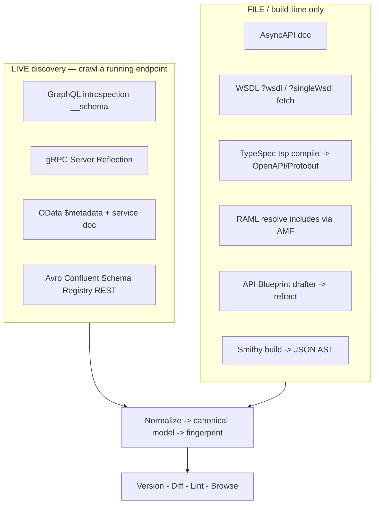
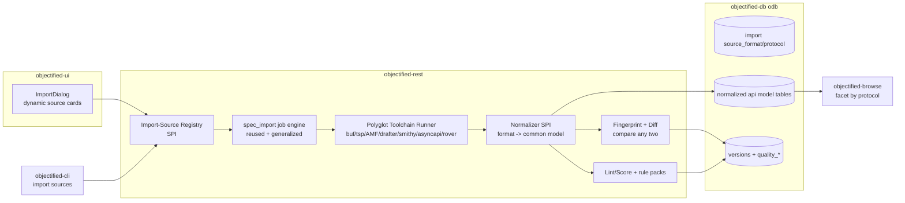
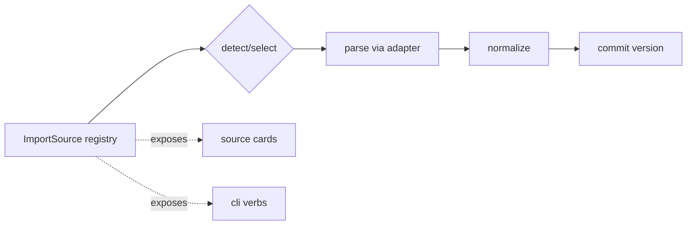
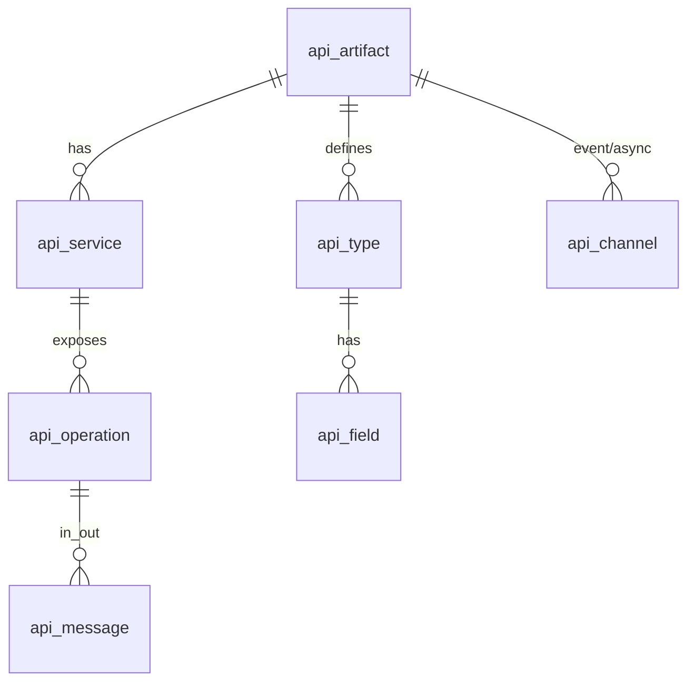
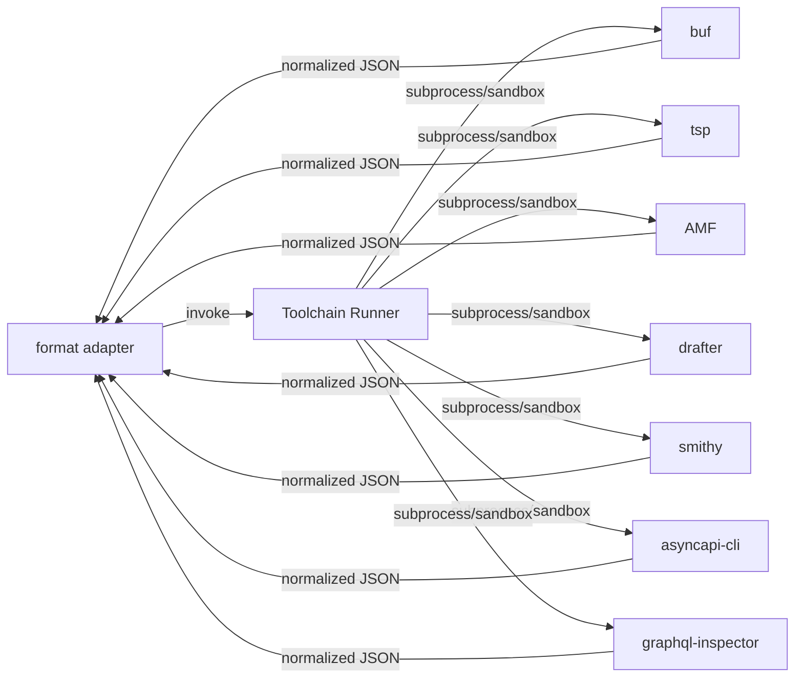
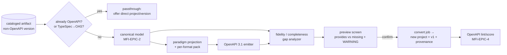
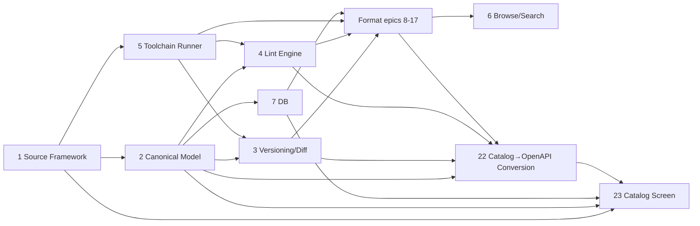

# Roadmap — Multi-Format API Import & Cataloging

> **Status:** ✅ **Issues filed on `objectified-project/objectified`** — umbrella **#3715**,
> epics **#3716–#3732** (MFI-EPIC-1…17), and 80 issues **#3733–#3812** (98 total). Epic/issue
> headings below carry their `#number`; epics track their children as GitHub sub-issues under
> umbrella #3715. (33 table-only abbreviated issues were filed with bodies synthesized from the
> epic adapter-template; their numbers are in the epic task-lists on GitHub.)
> **Issue ID prefix:** `MFI` (Multi-Format Import). Epics `MFI-EPIC-n`, issues `MFI-n.m`.
> **GitHub title format:** `objectified: [<epic>.<issue>] <title>`.
> **Recommended labels:** new `roadmap-multi-format` + reuse `multi-protocol`, `import`,
> `integrations`, `rest`, `ui`, `database`, `python`, `typescript`, `linting`,
> `version-control`, `browser`, `registry`, `validation` (+ optional per-format labels).

---

## 0. Source description (request, verbatim)

> Multi-Format API Import & Cataloging — make Objectified an extremely powerful cataloging
> and versioning tool for many API description formats, not just OpenAPI/Swagger/Arazzo/
> JSON-Schema/Postman (and the new MCP import). Produce ONE consolidated roadmap file:
> `docs/ROADMAP_MULTI_FORMAT_IMPORT.md`.
>
> Scope: add new IMPORT SOURCES (ingestion) for these 10 additional formats, each cataloged
> + versioned + diffable + lint/scored + browsable exactly like existing specs: **AsyncAPI,
> gRPC/Protocol Buffers, GraphQL, SOAP/WSDL, TypeSpec, OData, RAML, API Blueprint, Avro/
> Schema Registry, Smithy.** Structure as SHARED-FOUNDATION epics + one epic per format
> (parser, normalizer to a common model, format-specific lint/score rules, fixtures, a UI
> source card + CLI command, plus any live-discovery path). Heavily reuse the MCP catalog
> roadmap (V2-MCP-EPIC-15…27, umbrella #3637), `spec_import_engine`, `schema_lint`, the
> `versions`/`quality_*` columns, `objectified-browse`, `ImportDialog`, `DashboardSideNav`,
> the CLI, and Flyway migrations. Cross-link existing multi-protocol epics (#3489, #3496);
> do not duplicate. Document only — do not create issues.

### 0.1 Update request — Catalog → OpenAPI conversion & fidelity preview (verbatim)

> Update the `docs/ROADMAP_MULTI_FORMAT_IMPORT.md` to include the functionality to take an
> imported catalog and convert it to a project/version that is an OpenAPI Specification, if the
> imported object in the catalog isn't already one. When importing and converting, there needs to
> be a preview screen that shows what the data currently provides, and where it will be missing
> data that an OpenAPI specification might favor for completeness. Warn the user that the fidelity
> of the original API may not be complete enough to create a fully defined OpenAPI Specification.

This update adds **MFI-EPIC-22 — Catalog → OpenAPI Conversion & Fidelity Preview** (issues 22.1–22.8 — **filed #4002–#4009 under epic #4000**). It turns the canonical model (MFI-EPIC-2) into an
**OpenAPI 3.1 emitter** with a **completeness gap analyzer** and a **preview/confirm screen** that
shows, side by side, *what the source provides* vs *what an OpenAPI spec favors but the source
cannot supply* — fronted by an explicit **fidelity warning**. It also consolidates the previously
scattered "migrate-to-OpenAPI" off-ramps (RAML **15.5**, API Blueprint **16.4**, WADL §9.3) under
one engine. See **MFI-EPIC-22** below and the work-order/risk additions in §5/§6.

### 0.2 Update request — Catalog screen for non-publishable imported items (verbatim)

> Modify the same catalog roadmap so that when importing data into Objectified that is not OpenAPI,
> but is OpenAPI-worthy, the data is collected in a "Catalog" screen in the UI. Cataloged items are
> not candidates for publishing because they may be incomplete. Cataloged information in the screen
> should include the cataloged item that was imported, along with a pill that shows the format of
> the file that was imported, along with the source material, etc, like the current Projects screen
> shows. These projects may be visible using the Designer at some point, but they need to be
> cataloged in such a way that they can be viewed, linted, and so on, through the same type of
> screen that the projects screen provides.

This update adds **MFI-EPIC-23 — Catalog Screen & Non-Publishable Cataloged Items** (issues 23.1–23.12 — **filed #4010–#4021 under epic #4001**). It gives non-OpenAPI-but-OpenAPI-worthy imports a home: a
**Catalog screen** that mirrors the existing Projects dashboard (card/table, filter/sort/search,
lint-grade + quality orbs) but for **non-publishable** items, each carrying a **format pill** and
**source-material/provenance** metadata. Catalog items are viewable and lintable through the same
screens as Projects, may later open read-only in the Designer, and are promoted out of the catalog
into a publishable OpenAPI Project via the **MFI-EPIC-22** convert + fidelity-preview flow.
EPIC-23 is the **staging surface**; EPIC-22 is the **promotion path**. See **MFI-EPIC-23** below.

---

## 1. Goal & strategy

Today objectified ingests **OpenAPI / Swagger / Arazzo / JSON-Schema / Postman** (and, per the
MCP roadmap, **MCP servers**). This roadmap makes the import + catalog + version + diff +
lint + browse pipeline **format-pluggable**, then adds **10 formats** spanning every major API
paradigm:

```
REST-ish:    OData · RAML · API Blueprint           (+ existing OpenAPI/Swagger)
RPC:         gRPC/Protobuf · Smithy
Graph:       GraphQL
Event-driven: AsyncAPI
Design-IDL:  TypeSpec  (compiles to OpenAPI/JSON-Schema/Protobuf)
Data schema: Avro / Confluent Schema Registry
```

**Core insight (from research):** every format wants the same shape of treatment —
*parse → resolve/dereference → normalize to a canonical model → fingerprint → diff any two
versions → lint/score → catalog/browse.* Only the **parser**, the **normalizer**, the
**lint rule-pack**, and the **breaking-change rules** are format-specific. So the bulk of the
work is **shared foundation built once**, then a thin, repeatable **per-format adapter**.

### What already exists that we REUSE (do not rebuild)

| Capability | Where | Reuse for |
|---|---|---|
| Async import job engine (submit→poll→commit) | `spec_import_engine.py`, `spec_import_routes.py` | Per-format ingestion jobs |
| Import wizard (3-col source-card grid) | objectified-ui `ImportDialog.tsx` | New source cards per format |
| Deterministic linter (findings + 0–100 + A–F + fingerprint) | `schema_lint.py`, `lint_routes.py` | Lint engine + per-format rule packs |
| Versioning + git-like tags + quality columns | `versions`, `version_tags`, `versions.quality_*` (V124) | Generalized versioning |
| **MCP catalog patterns** (import-source, fingerprint/diff, compare-any-two, lint, browse) | `ROADMAP_MCP_CATALOGING.md` · V2-MCP-EPIC-15…27 · umbrella **#3637** | Direct template for this whole roadmap |
| Public browse + read views | `browse_public_routes.py`, `objectified-browse` | Browse by protocol/format |
| Typer CLI + import commands + job polling | `objectified-cli` | Per-format CLI sources |
| Flyway migrations (`odb`, UUID PKs, tenant scoping, soft delete) | `objectified-db/scripts` | Schema additions |

### Existing GitHub issues to RECONCILE / cross-link (avoid duplication)

| Format | Existing issues | This roadmap's relationship |
|---|---|---|
| AsyncAPI | **#1438** [Epic] AsyncAPI & Event-Driven Arch · **#2772** REPO-3.3 AsyncAPI importer · #1447 visual editor · #236/#222 (closed) | We provide the **catalog/version/diff/lint/browse** layer; the importer (#2772) is the parser feeding it. Link, don't duplicate. |
| GraphQL | **#1331** [Epic] GraphQL Schema Design · **#2775** REPO-3.6 GraphQL SDL importer · #1342/#1365/#1462 | Same — consume the SDL importer; add introspection discovery + diff/lint/catalog. |
| gRPC/Protobuf | **#1384** [Epic] gRPC & Protobuf Support · #1409 editor · #1427 testing/breaking-change · #1400 designer · #238 (closed) | #1427 overlaps breaking-change; coordinate. We add descriptor-set normalize + catalog. |
| Avro | **#239** Import from Avro · **#2776** REPO-3.7 Protobuf/Avro importer | Add Schema Registry discovery + compatibility-mode diff + catalog. |
| Schema registry / discovery | **#3489** [Epic] Schema Registry & Discovery · **#3496** [Epic] Community & Schema Browser · #624 | Strong overlap for browse/registry; **align EPIC-5/6/MFI-EPIC-12** with #3489/#3496. |
| RAML | #237 (closed import) | Legacy import + migrate-to-OpenAPI. |
| SOAP/WSDL, OData, TypeSpec, Smithy, API Blueprint | *(none found)* | **Net-new.** |

> **Recommendation:** open this as a **`roadmap-multi-format`** umbrella that links the existing
> format epics (#1438, #1331, #1384, #3489, #3496) as related, and positions these issues as the
> *cataloging engine* rather than re-spec'ing importers/editors already tracked.

### The gaps this roadmap closes

1. Import/catalog is **hard-wired to OpenAPI-family**; no plug-in seam for new formats.
2. No **paradigm-agnostic normalized model** so versioning/diff/lint/browse work uniformly across REST/RPC/event/graph/data-schema.
3. No **polyglot toolchain runner** — many best-of-breed parsers/linters are JS/JVM/native (buf, tsp, AMF, drafter, smithy, AsyncAPI CLI), not Python.
4. No **per-format breaking-change / compatibility** engine (incl. Avro Schema-Registry compat modes, Buf wire-compat, GraphQL/Smithy diff).
5. No **browse/search by protocol/format**.

---

## 2. MVP definition

**MVP (v1) — "the plug-in framework proven across 3 paradigms":**

1. **Import-source plug-in framework** (MFI-EPIC-1): formats register as sources; `ImportDialog` renders them dynamically; CLISource dispatch; format auto-detect.
2. **Normalized internal API model** (MFI-EPIC-2) covering REST/RPC/event/graph, with persistence.
3. **Generalized versioning + fingerprint + compare-any-two diff** (MFI-EPIC-3), reusing the MCP `EPIC-18` work.
4. **Generalized lint/score + rule-pack SPI** (MFI-EPIC-4), reusing `schema_lint`.
5. **Polyglot toolchain runner** (MFI-EPIC-5) — sandboxed subprocess to run JS/JVM/native parsers/linters.
6. **DB additions** (MFI-EPIC-7) and **browse-by-protocol** (MFI-EPIC-6).
7. **Three first formats proving the seam across paradigms:** **AsyncAPI** (event), **GraphQL** (graph + live introspection), **gRPC/Protobuf** (RPC + live reflection). *(MFI-EPIC-8/9/10)*

**v2 / later:** OData, Avro/Schema-Registry (live registry crawl), SOAP/WSDL, TypeSpec, then the
legacy/niche set RAML, API Blueprint (legacy import + migrate-to-OpenAPI), and Smithy.

---

## 3. Epics overview

| Epic | Theme | Issues | MVP |
|---|---|---|---|
| MFI-EPIC-1 | Import-Source Plug-in Framework | 1.1–1.5 | ●●● |
| MFI-EPIC-2 | Normalized Internal API Model | 2.1–2.4 | ●●● |
| MFI-EPIC-3 | Versioning, Fingerprint & Compare/Diff (generalized) | 3.1–3.4 | ●●● |
| MFI-EPIC-4 | Lint/Score Engine + Rule-Pack SPI | 4.1–4.4 | ●●● |
| MFI-EPIC-5 | Polyglot Toolchain Runner | 5.1–5.3 | ●●● |
| MFI-EPIC-6 | Browse/Search & Categorization by protocol | 6.1–6.3 | ●● |
| MFI-EPIC-7 | DB model & persistence additions | 7.1–7.3 | ●●● |
| MFI-EPIC-8 | **AsyncAPI** (event-driven) | 8.1–8.5 | ●● MVP |
| MFI-EPIC-9 | **gRPC / Protocol Buffers** (RPC) | 9.1–9.6 | ●● MVP |
| MFI-EPIC-10 | **GraphQL** (graph) | 10.1–10.6 | ●● MVP |
| MFI-EPIC-11 | OData (queryable REST) | 11.1–11.6 | ○ v2 |
| MFI-EPIC-12 | Avro / Confluent Schema Registry | 12.1–12.6 | ○ v2 |
| MFI-EPIC-13 | SOAP / WSDL (+XSD) | 13.1–13.6 | ○ v2 |
| MFI-EPIC-14 | TypeSpec | 14.1–14.5 | ○ v2 |
| MFI-EPIC-15 | RAML (legacy) | 15.1–15.5 | ○ v2 |
| MFI-EPIC-16 | API Blueprint (legacy) | 16.1–16.4 | ○ v2 |
| MFI-EPIC-17 | Smithy | 17.1–17.5 | ○ v2 |
| **MFI-EPIC-22** | **Catalog → OpenAPI Conversion & Fidelity Preview** | 22.1–22.8 | ◐ conv-MVP |
| **MFI-EPIC-23** | **Catalog Screen & Non-Publishable Cataloged Items** | 23.1–23.12 | ◐ catalog-MVP |

**Total: 19 epics in the main set (1–17 + 22 + 23), ~100 issues** — plus the post-MVP candidate
epics 18–21 in §9. *(MFI-EPIC-22 depends on the foundation epics 2/3/4; MFI-EPIC-23 is the UI/UX
surface for non-OpenAPI imports and depends on the model/persistence (EPIC-2/7) and the import
framework (EPIC-1), and integrates EPIC-22 as its promotion path.)*

### Discovery tiers (drives ingestion design)



---

## 4. Architecture



---

# Epics & issues

> Complexity ∈ {S, M, L, XL}. Each format epic follows the same adapter template:
> **parse → normalize → (discover) → lint pack → diff/breaking → UI+CLI source & fixtures.**

---

## MFI-EPIC-1 — Import-Source Plug-in Framework  ·  **#3716**

Generalize the existing import flow so a format is added by *registering a source*, not editing
the wizard/engine. This is the seam the whole roadmap hangs on.



| ID | Title | Summary | Labels | Parallel | MVP | Complexity | Affected Modules |
|----|-------|---------|--------|----------|-----|-----------|------------------|
| 1.1 ✅ | ImportSource SPI & registry | define adapter interface (detect/parse/normalize/lint/diff) + registry | multi-protocol,rest,python,mvp | N | Y | L | objectified-rest |
| 1.2 | Generalize spec-import job pipeline | make `spec_import_engine` format-agnostic via adapters | multi-protocol,rest,python,mvp | N | Y | L | objectified-rest |
| 1.3 | Dynamic source cards in ImportDialog | render registered sources (icon/label/input panel) | multi-protocol,ui,typescript,mvp | Y | Y | M | objectified-ui |
| 1.4 | CLI source dispatch | `objectified import <format>` resolves to adapters | multi-protocol,devex,python,mvp | Y | Y | M | objectified-cli |
| 1.5 | Format auto-detection | sniff format from content/extension/headers (extend `import auto`) | multi-protocol,rest,validation,mvp | Y | Y | M | objectified-rest |

### MFI-1.1 — ImportSource SPI & registry  ·  **#3733**  ·  ✅ **Done**
- **Status.** Implemented in `objectified-rest/src/app/import_source.py` (the `ImportSource` ABC + descriptor metadata + by-key registry + shared canonical fingerprint/diff and lint-report defaults), `objectified-rest/src/app/openapi_import_source.py` (the reference adapter — the existing OpenAPI/Swagger path refactored behind the SPI: `parse` reuses the pipeline's JSON/YAML loader, `normalize` delegates to the registered `OpenApiNormalizer`, `lint` delegates to `schema_lint.lint_openapi_spec`, fingerprint/diff use the canonical defaults), and `objectified-rest/src/app/sample_import_source.py` (the no-op acceptance adapter). The SPI carries `detect(payload) → DetectionResult` (confidence), `parse(raw) → native_ast`, `normalize(native_ast) → CanonicalApi`, and canonical-level `fingerprint`/`diff`/`lint`, plus descriptor metadata (key, label, icon, paradigm, input kinds file/url/paste/discovery, live-discovery capability, emitted formats). The registry (`register_import_source`/`get_import_source`/`available_import_sources`/`describe_import_sources`/`detect_import_source`, with a `register=True` subclass flag and lazy built-in loading) enumerates adapters for UI/CLI/REST — the source list. Detection recognizes both OpenAPI 3.x and Swagger 2.0; Swagger 2.0 *normalization* awaits its own normalizer (a later format epic) and raises a clear `ImportSourceError` until then. Wrapping is behavior-preserving (generalizing the job engine onto adapters is MFI-1.2). Documented in `objectified-rest/docs/import_source_spi.md`; tests in `tests/test_import_source.py` + `tests/test_openapi_import_source.py` (33 tests; full rest suite green, 1902 passed). objectified-rest 1.27.0 → 1.28.0.
- **Problem.** Each new format today would mean editing the import engine + wizard. There's no extension seam.
- **Solution / Scope.** Define an `ImportSource` adapter interface in `objectified-rest`: `detect(bytes/url) → confidence`, `parse(input) → native_ast`, `normalize(native_ast) → CanonicalApi` (EPIC-2), `fingerprint`, `diff(a,b)`, `lint(model)`; plus descriptor metadata (key, label, icon, paradigm, input kinds: file/url/paste/discovery, live-discovery capability). A registry enumerates adapters for UI/CLI/REST. Mirrors the MCP import-source decision (V2-MCP-EPIC-17/24.1).
- **Acceptance Criteria.** Existing OpenAPI/Swagger/Postman importers refactored behind the SPI with no behavior change; a no-op sample adapter registers and appears in the source list.
- **Dependencies / Parallelism.** Root of the roadmap. Blocks all format epics.
- **Technical Stack.** Python, FastAPI.

### MFI-1.2 — Generalize spec-import job pipeline  ·  **#3734**
- **Problem.** `spec_import_engine.py` is OpenAPI-shaped; new formats need the same async job lifecycle.
- **Solution / Scope.** Refactor the submit→poll→commit/rollback engine to drive any `ImportSource` adapter (parse→normalize→version→lint), keeping the existing job status contract, dry-run, and incremental mode. Reuse the MCP discovery-job learnings.
- **Acceptance Criteria.** A format adapter runs end-to-end through the existing job API; OpenAPI import still passes its tests.
- **Dependencies / Parallelism.** After 1.1. Blocks format epics.
- **Technical Stack.** Python async.

### MFI-1.3 — Dynamic source cards in ImportDialog  ·  **#3735**
- **Problem.** The 3-col source grid is hard-coded; formats must self-register their card + input panel.
- **Solution / Scope.** Drive `ImportDialog` source cards from the registry (1.1) via a REST `GET /import/sources`; each card declares icon (Lucide), label, description, and which input panel (file/url/paste/discovery) it uses. Matches the MCP "MCP Server source card" pattern.
- **Acceptance Criteria.** Adding an adapter server-side makes a new card appear with no UI code change; existing cards unchanged.
- **Dependencies / Parallelism.** After 1.1. Parallel with 1.4.
- **Technical Stack.** Next.js, TanStack Query.

### MFI-1.4 — CLI source dispatch  ·  **#3736**
- **Problem.** CLI import verbs are hard-coded per format.
- **Solution / Scope.** `objectified import <format> <input>` resolves the adapter from the registry; shared flags (`--url`, `--file`, `--dry-run`, `--import-timeout`); list available formats via `objectified import --list`.
- **Acceptance Criteria.** New adapter is invokable from CLI without new command code; polling/output consistent with current import.
- **Dependencies / Parallelism.** After 1.1. Parallel with 1.3.
- **Technical Stack.** Python, Typer.

### MFI-1.5 — Format auto-detection  ·  **#3737**
- **Problem.** Users shouldn't have to know whether a file is RAML vs OpenAPI vs Smithy.
- **Solution / Scope.** Extend the existing `import auto` detector to sniff the new formats: `#%RAML`, `FORMAT: 1A` (API Blueprint), `$version`/namespace (Smithy/TypeSpec), `<wsdl:definitions>`/`<edmx:Edmx>` (WSDL/OData), `asyncapi:` key, `.proto` `syntax=`, Avro `{"type":"record"}`, GraphQL `type Query`. Each adapter contributes a `detect()` with a confidence score; highest wins.
- **Acceptance Criteria.** Fixtures of each format auto-route to the right adapter; ambiguous inputs prompt the user.
- **Dependencies / Parallelism.** After 1.1/1.2. Parallel with format epics.
- **Technical Stack.** Python.

---

## MFI-EPIC-2 — Normalized Internal API Model  ·  **#3717**

One paradigm-agnostic model that every format maps into, so versioning/diff/lint/browse are written **once**.



| ID | Title | Summary | Labels | Parallel | MVP | Complexity | Affected Modules |
|----|-------|---------|--------|----------|-----|-----------|------------------|
| 2.1 ✅ | Canonical model schema design | paradigm-agnostic entities (service/operation/message/type/field/channel) | multi-protocol,rest,python,mvp | N | Y | L | objectified-rest |
| 2.2 ✅ | Normalized-model persistence tables | store the canonical model per artifact version | multi-protocol,database,mvp | N | Y | M | objectified-db |
| 2.3 ✅ | Normalizer SPI (format → model) | per-format mapping contract + base utilities | multi-protocol,rest,python,mvp | N | Y | M | objectified-rest |
| 2.4 ✅ | Paradigm coverage & fidelity tests | ensure REST/RPC/event/graph/data map losslessly enough | multi-protocol,testing,mvp | Y | Y | M | objectified-rest |

### MFI-2.1 — Canonical model schema design  ·  **#3738**  ·  ✅ **Done**
- **Status.** Implemented in `objectified-rest/src/app/canonical_model.py`; documented in `objectified-rest/docs/canonical_model.md`; paradigm-coverage + persistence round-trip tests in `objectified-rest/tests/test_canonical_model.py` (REST/RPC/event/graph/data-schema).
- **Problem.** REST, RPC, event-driven, graph, and data-schema formats have different shapes; we need a common denominator that still supports per-format diff/lint fidelity.
- **Solution / Scope.** Design a `CanonicalApi`: artifact (format, protocol, identity, version, servers/endpoints), **services** (named groups), **operations** (op kind: request/response, query/mutation/subscription, unary/streaming, pub/sub; input/output message refs; verb/route where applicable), **messages** (payload schema ref, headers), **channels** (event address/binding), **types** (records/structs/enums/unions + fields with type, nullability, defaults, constraints), and a `raw`/`extras` bag for format-specific fidelity. Keys are stable (mirroring GraphQL Schema Coordinates / protobuf field numbers / XSD QNames so diffs are stable).
- **Acceptance Criteria.** Documented model maps cleanly from at least one REST, one RPC, one event, one graph, and one data-schema sample; round-trips to/from persistence.
- **Dependencies / Parallelism.** After 1.1. Blocks 2.2/2.3 and all normalizers.
- **Technical Stack.** Python, Pydantic.

### MFI-2.2 — Normalized-model persistence tables  ·  **#3739**  ·  ✅ **Done**
- **Status.** Implemented in `objectified-db/scripts/V135__canonical_api_model_persistence_3739.sql`: seven `odb` tables (`api_artifacts` → `api_services` → `api_operations` → `api_messages`; `api_artifacts` → `api_channels`; `api_artifacts` → `api_types` → `api_fields`) mirroring the MFI-2.1 `CanonicalApi`, each tied to a `versions` row and tenant-scoped, with stable per-parent keys, soft delete, JSONB for `raw`/constraints/irregular sub-structures, and GIN tsvector search indexes. Structural contract tests in `objectified-db/test/canonical-api-model-persistence.test.ts`; migration applied + a full store/reload round-trip verified against the live `objectified` database.
- **Problem.** The canonical model must be queryable (browse/search/diff), not a blob.
- **Solution / Scope.** Flyway migration adding `odb.api_artifacts`, `api_services`, `api_operations`, `api_messages`, `api_channels`, `api_types`, `api_fields` (UUID PKs, tenant scoping, soft delete, JSONB for `raw`/constraints, GIN/tsvector for search), each tied to a `version_id`. Reuse `versions`/`version_tags`.
- **Acceptance Criteria.** Migration applies over the latest version; stores + reloads a canonical model; indexed for search.
- **Dependencies / Parallelism.** After 2.1. Blocks normalizers' persistence.
- **Technical Stack.** PostgreSQL, Flyway.

### MFI-2.3 — Normalizer SPI (format → model)  ·  **#3740**  ·  ✅ **Done**
- **Status.** Implemented in `objectified-rest/src/app/normalizer.py` (the SPI + base utilities) and `objectified-rest/src/app/openapi_normalizer.py` (the reference normalizer). The `Normalizer` abstract contract carries `format`/`paradigm` identity and a single `normalize()` method, with a by-format-key registry (`register_normalizer`/`get_normalizer`/`available_formats`, plus a `register=True` class flag). Base utilities: `Keys` (deterministic stable-key builders for the documented key grammar), `coerce_constraints` + `SchemaCoercer` (JSON-Schema fragment → canonical `TypeRef`/`Constraints`/named `Type`s, reusing the JSON-Schema vocabulary and accepting both OpenAPI 3.0 and 3.1 forms), and `normalize_ordering` (sorts identity-keyed collections for byte-stable output). The reference `OpenApiNormalizer` maps a parsed OpenAPI 3.0/3.1 document into a REST `CanonicalApi` and self-registers `openapi-3.0`/`openapi-3.1`. Documented in `objectified-rest/docs/normalizer_spi.md`; tests in `tests/test_normalizer.py` + `tests/test_openapi_normalizer.py` (41 tests; full rest suite green). objectified-rest 1.25.0 → 1.26.0.
- **Problem.** Each format needs a mapping into the canonical model with shared helpers.
- **Solution / Scope.** A `Normalizer` contract + base utilities (stable-key assignment, schema coercion into the canonical type model reusing the existing JSON-Schema/primitives work, ordering normalization). Format epics implement it.
- **Acceptance Criteria.** SPI documented; a reference normalizer (e.g. OpenAPI→Canonical) implemented and tested.
- **Dependencies / Parallelism.** After 2.1. Blocks format normalizer issues.
- **Technical Stack.** Python.

### MFI-2.4 — Paradigm coverage & fidelity tests  ·  **#3741**  ·  ✅ **Done**
- **Status.** Implemented in `objectified-rest/tests/test_paradigm_fidelity.py` — the cross-paradigm fidelity *contract* the format epics are written against. For each paradigm it sweeps the load-bearing axis exhaustively and asserts each value survives the full normalizer tail (`normalize_ordering`, asserted idempotent + fingerprint-stabilizing, then the JSONB round-trip): every gRPC `StreamingMode` (unary/client/server/bidi) + protobuf field-number identity across re-ordering; every GraphQL list/non-null wrapper permutation (`T`…`[[T!]!]!`, re-rendered back to source syntax); both AsyncAPI actions (publish/subscribe) with channel bindings/parameters; every falsy Avro default (`0`/`0.0`/`False`/`""`/`[]`/`{}`, type-checked so `0` ≠ `False`) plus enum-ordinal and union-resolution order preserved through ordering; and REST parameter locations + success/error status fidelity. A `test_load_bearing_fields_have_a_canonical_home` gap-audit fails — pointing straight back at MFI-2.1 — if the model ever drops a load-bearing field. The one true edge (an *explicit* Avro `default: null` vs no default) is shown covered losslessly by the documented per-entity `extras` escape hatch, so **no MFI-2.1 extension was required**. 27 fidelity tests; the normalizer+canonical suites (76 tests) stay green. Docs cross-linked from `objectified-rest/docs/normalizer_spi.md`. objectified-rest 1.26.0 → 1.27.0.
- **Problem.** A lossy model would make diffs/lint wrong for some paradigms.
- **Solution / Scope.** A cross-paradigm fixture suite asserting that key entities survive normalization (e.g. gRPC streaming flags, GraphQL nullability/list wrappers, AsyncAPI operation action, Avro defaults). Where a paradigm needs extra fields, extend 2.1.
- **Acceptance Criteria.** Each paradigm's load-bearing fields are represented and asserted; gaps tracked back into 2.1.
- **Dependencies / Parallelism.** After 2.3. Parallel with format epics (acts as their contract test).
- **Technical Stack.** Python, pytest.

---

## MFI-EPIC-3 — Versioning, Fingerprint & Compare/Diff (generalized)  ·  **#3718**

Lift the MCP catalog's versioning/diff (V2-MCP-EPIC-18) to operate on the **canonical model**, so
every format gets dated versions, a self-computed fingerprint, and compare-any-two diffs for free.

| ID | Title | Summary | Labels | Parallel | MVP | Complexity | Affected Modules |
|----|-------|---------|--------|----------|-----|-----------|------------------|
| 3.1 | Canonical fingerprint SPI | stable SHA-256 over normalized model (+ per-format hash hooks) | multi-protocol,version-control,python,mvp | N | Y | M | objectified-rest |
| 3.2 | Compare-any-two diff over the model | added/removed/modified across services/ops/types/fields | multi-protocol,version-control,python,mvp | N | Y | M | objectified-rest |
| 3.3 | Breaking-change classifier SPI | per-format rules + wrap external tools (Buf/inspector/smithy/Avro) | multi-protocol,validation,version-control,mvp | N | Y | L | objectified-rest |
| 3.4 | Versioning + tagging reuse | dated versions on change; reuse versions/version_tags | multi-protocol,versions,mvp | Y | Y | S | objectified-rest |

### MFI-3.1 — Canonical fingerprint SPI  ·  **#3742**
- **Problem.** Change detection must work uniformly but respect per-format identity keys.
- **Solution / Scope.** Canonicalize the normalized model (sorted, stable keys, drop comments/descriptions/order) → SHA-256. Provide a per-format hook for special hashes (Avro **Parsing Canonical Form** CRC-64/SHA-256 [avro spec], protobuf descriptor-set, XSD QName canonicalization). Reuse MCP `EPIC-18.1`.
  - Source: Avro PCF — https://avro.apache.org/docs/1.12.0/specification/
- **Acceptance Criteria.** Identical artifacts → identical fingerprint across runs; a single field change flips it; Avro PCF vs semantic-hash distinction documented (PCF strips defaults/aliases/doc).
- **Dependencies / Parallelism.** After 2.1. Blocks 3.2.
- **Technical Stack.** Python, hashlib.

### MFI-3.2 — Compare-any-two diff over the model  ·  **#3743**
- **Problem.** Users need to diff **any two versions** of any format (the MCP decision, generalized).
- **Solution / Scope.** A `diff(modelA, modelB)` over the canonical model returning added/removed/modified across services/operations/messages/channels/types/fields with before/after + counts; compare-any-two (not just adjacent), mirroring V2-MCP-EPIC-18.2/24.3. Format adapters may enrich change labels.
- **Acceptance Criteria.** Correct add/remove/modify on cross-format fixtures; non-adjacent pairs supported; identical models → empty diff.
- **Dependencies / Parallelism.** After 3.1. Blocks per-format diff enrichment.
- **Technical Stack.** Python.

### MFI-3.3 — Breaking-change classifier SPI  ·  **#3744**
- **Problem.** "What changed" must be graded **breaking vs safe**, and the rules differ sharply per format (Avro compat modes, Buf wire-compat, GraphQL breaking/dangerous, Smithy evaluators, OData §5.2, XSD).
- **Solution / Scope.** A classifier SPI that takes a diff + both models and returns severities. Format packs implement it, ideally **wrapping the canonical tool** via the toolchain runner (EPIC-5): Buf breaking (WIRE/WIRE_JSON), GraphQL-Inspector classes, `@asyncapi/diff`, `smithy diff` evaluators, Confluent `/compatibility`, OData policy. Where no tool exists (RAML, API Blueprint), a documented built-in ruleset.
  - Sources: Buf https://buf.build/docs/breaking/rules/ · GraphQL Inspector https://github.com/graphql-hive/graphql-inspector · Confluent compat https://docs.confluent.io/platform/current/schema-registry/develop/api.html · Smithy https://smithy.io/2.0/guides/evolving-models.html
- **Acceptance Criteria.** Each format pack classifies a known breaking and a known safe change; severities surfaced on the diff view.
- **Dependencies / Parallelism.** After 3.2, 5.1. Used by all format epics.
- **Technical Stack.** Python + external CLIs.

### MFI-3.4 — Versioning + tagging reuse  ·  **#3745**
- **Problem.** Each imported artifact needs dated versions only when its fingerprint changes.
- **Solution / Scope.** Reuse `versions`/`version_tags` + the MCP version-on-change logic for canonical artifacts; date/time tags; `current_version`. No new mechanism.
- **Acceptance Criteria.** Re-import with no change creates no version; a change creates one dated version + diff.
- **Dependencies / Parallelism.** After 3.2. Parallel with EPIC-4.
- **Technical Stack.** PostgreSQL, FastAPI.

---

## MFI-EPIC-4 — Lint/Score Engine + Rule-Pack SPI  ·  **#3719**

Generalize `schema_lint.py` (findings + 0–100 + A–F + fingerprint) to a pluggable engine with
per-format **rule packs**, optionally wrapping external linters.

| ID | Title | Summary | Labels | Parallel | MVP | Complexity | Affected Modules |
|----|-------|---------|--------|----------|-----|-----------|------------------|
| 4.1 | Lint engine + rule-pack SPI | run rule packs over the canonical model, deterministic findings | multi-protocol,linting,python,mvp | N | Y | M | objectified-rest |
| 4.2 | Score/grade/fingerprint reuse | 0–100 + A–F + stable fingerprint per version | multi-protocol,linting,mvp | N | Y | S | objectified-rest |
| 4.3 | External-linter adapter | wrap Spectral/Buf-lint/smithy-linters/graphql-eslint via runner | multi-protocol,linting,integrations | Y | N | M | objectified-rest |
| 4.4 | Lint REST/UI/CLI surfacing | expose findings/score per version everywhere | multi-protocol,rest,ui,linting,mvp | Y | Y | S | objectified-rest,objectified-ui,objectified-cli |

### MFI-4.1 — Lint engine + rule-pack SPI  ·  **#3746**
- **Problem.** The current linter targets OpenAPI/JSON-Schema; we need per-format rule packs over the canonical model.
- **Solution / Scope.** Generalize `schema_lint.py` into an engine that runs registered **rule packs** (a pack = ordered rules → `LintFinding` with stable IDs + severity + group), mirroring its deterministic structure. A "common" pack covers cross-format hygiene (missing descriptions, unstable identifiers); format packs add specifics.
- **Acceptance Criteria.** Pure (no DB/network); deterministic findings + stable IDs; OpenAPI pack reproduces current behavior.
- **Dependencies / Parallelism.** After 2.1. Blocks format lint packs.
- **Technical Stack.** Python.

### MFI-4.2 — Score/grade/fingerprint reuse  ·  **#3747**
- **Problem.** Findings must roll up to a stored score/grade per version, like specs and MCP.
- **Solution / Scope.** Weighted 0–100 (normative violations heavier), A–F bands (V124 thresholds), report fingerprint; persist to the artifact version (reuse `quality_*` columns / MCP `mcp_version_scores` pattern). Capture at import.
- **Acceptance Criteria.** Deterministic score per fixed model; auto-captured on new version.
- **Dependencies / Parallelism.** After 4.1. Parallel with 4.3.
- **Technical Stack.** Python, PostgreSQL.

### MFI-4.3 — External-linter adapter  ·  **#3748**
- **Problem.** Best-of-breed linters (Spectral, Buf lint, smithy-linters, graphql-eslint, AMF SHACL) are JS/JVM and authoritative for their formats.
- **Solution / Scope.** An adapter that runs an external linter via the toolchain runner (EPIC-5), maps its output into `LintFinding`s, and merges with native packs. Opt-in per format.
  - Sources: Spectral https://github.com/stoplightio/spectral · Buf lint https://buf.build/docs/lint/ · smithy-linters https://smithy.io/2.0/guides/model-linters.html
- **Acceptance Criteria.** At least one external linter (e.g. Spectral for AsyncAPI) runs and contributes findings; failures degrade gracefully to native packs.
- **Dependencies / Parallelism.** After 4.1, 5.1. Parallel with 4.2.
- **Technical Stack.** Python + Node/JVM CLIs.

### MFI-4.4 — Lint REST/UI/CLI surfacing  ·  **#3749**
- **Problem.** Findings/score must appear in REST, ADE, and CLI uniformly.
- **Solution / Scope.** Reuse `lint_routes.py` shape for canonical artifacts; ADE lint panel + CLI `objectified lint`. Mirrors MCP EPIC-24.4 / EPIC-25.3.
- **Acceptance Criteria.** Findings + score visible per version in all three surfaces; tenant-scoped.
- **Dependencies / Parallelism.** After 4.2. Parallel with 4.3.
- **Technical Stack.** FastAPI, Next.js, Typer.

---

## MFI-EPIC-5 — Polyglot Toolchain Runner  ·  **#3720**

Many authoritative parsers/linters/diff tools are **not Python** (buf, tsp, AMF/JVM, drafter,
smithy CLI, AsyncAPI CLI, rover/graphql-inspector). A sandboxed runner lets adapters shell out
safely. This is the single biggest non-obvious dependency for the format epics.



| ID | Title | Summary | Labels | Parallel | MVP | Complexity | Affected Modules |
|----|-------|---------|--------|----------|-----|-----------|------------------|
| 5.1 | Toolchain runner service | sandboxed subprocess invocation + JSON capture + timeouts | multi-protocol,infrastructure,python,mvp | N | Y | L | objectified-rest |
| 5.2 | Tool runtime packaging | bundle Node/JVM/native CLIs (container image / pinned versions) | multi-protocol,infrastructure,mvp | N | Y | M | objectified-rest |
| 5.3 | Sandbox security & resource limits | no-network default, FS isolation, CPU/mem/time caps | multi-protocol,security,mvp | Y | Y | M | objectified-rest |

### MFI-5.1 — Toolchain runner service  ·  **#3750**
- **Problem.** Adapters need a uniform, safe way to run external tools and get structured output.
- **Solution / Scope.** A service that runs a registered tool (by key + args) in a constrained subprocess, captures stdout/stderr/exit, parses its JSON, with per-call timeout and structured errors. Used by parse (buf build, tsp compile, smithy ast, drafter, AMF), lint (4.3), and breaking (3.3).
- **Acceptance Criteria.** Runs a sample tool, returns parsed JSON; timeout/non-zero handled; concurrency-capped.
- **Dependencies / Parallelism.** Early foundation. Blocks 3.3/4.3 and most format epics.
- **Technical Stack.** Python (subprocess/asyncio).

### MFI-5.2 — Tool runtime packaging  ·  **#3751**
- **Problem.** The deployment must actually contain buf, tsp, AMF (JVM), drafter, smithy (JVM), AsyncAPI CLI, rover.
- **Solution / Scope.** Package pinned tool versions into the REST runtime image (or a sidecar); version-pin for reproducibility; document footprint. Make tools optional/lazy so a format degrades to "unavailable" if its tool is absent.
- **Acceptance Criteria.** Image builds with pinned tools; each tool invocable; missing-tool path yields a clear "format unavailable" status.
- **Dependencies / Parallelism.** After 5.1. Blocks format epics that need the tool.
- **Technical Stack.** Docker, Node, JVM, native.

### MFI-5.3 — Sandbox security & resource limits  ·  **#3752**
- **Problem.** Running third-party CLIs on user-supplied input is a security surface (SSRF, code exec, zip bombs).
- **Solution / Scope.** No-network by default, read-only temp FS, CPU/mem/time caps, input size limits; opt-in network only for explicit live-discovery (gRPC reflection, registry crawl) with SSRF guards (reuse MCP EPIC-16.6 posture).
- **Acceptance Criteria.** Network blocked by default; oversized/hostile inputs rejected; limits enforced.
- **Dependencies / Parallelism.** After 5.1. Parallel with 5.2.
- **Technical Stack.** Python, OS sandboxing.

---

## MFI-EPIC-6 — Browse/Search & Categorization by protocol  ·  **#3721**

Make the catalog navigable across paradigms. **Align with #3489 (Schema Registry & Discovery)
and #3496 (Community & Schema Browser).**

| ID | Title | Summary | Labels | Parallel | MVP | Complexity | Affected Modules |
|----|-------|---------|--------|----------|-----|-----------|------------------|
| 6.1 | Protocol/format facets | filter browse by protocol (REST/RPC/event/graph/data) + format | multi-protocol,browser,mvp | N | N | M | objectified-rest,objectified-ui |
| 6.2 | Cross-protocol search | search operations/types/messages across all formats | multi-protocol,browser,rest | N | N | M | objectified-rest,objectified-db |
| 6.3 | Catalog categorization | tag/categorize artifacts by paradigm + domain | multi-protocol,community | Y | N | S | objectified-rest |

### MFI-6.1 — Protocol/format facets  ·  **#3753**
- **Problem.** With 15+ formats, browse must filter by paradigm/format.
- **Solution / Scope.** Add protocol/format facets to browse (REST, RPC, event-driven, graph, data-schema; and specific format). Reuse `browse_public_routes`/`objectified-browse`. Coordinate with #3496.
- **Acceptance Criteria.** Browse filters by protocol + format; counts per facet.
- **Dependencies / Parallelism.** After 7.1, 2.2. Blocks 6.2.
- **Technical Stack.** FastAPI, Next.js.

### MFI-6.2 — Cross-protocol search  ·  **#3754**
- **Problem.** "Find every API with a `createOrder` operation" across formats.
- **Solution / Scope.** FTS over the normalized model (operations/types/messages) with protocol/format/grade filters; reuse the tsvector indexes from 2.2. Coordinate with #3489.
- **Acceptance Criteria.** Query returns matching operations/types across formats; facets compose.
- **Dependencies / Parallelism.** After 6.1, 2.2. 
- **Technical Stack.** PostgreSQL FTS, FastAPI.

### MFI-6.3 — Catalog categorization  ·  **#3755**
- **Problem.** Catalog needs domain/paradigm grouping.
- **Solution / Scope.** Categories + tags per artifact (paradigm auto-derived; domain manual), surfaced as browse facets. Reuse MCP EPIC-23.3.
- **Acceptance Criteria.** Artifacts categorizable; facets filter browse.
- **Dependencies / Parallelism.** After 7.1. Parallel with 6.1.
- **Technical Stack.** PostgreSQL, FastAPI.

---

## MFI-EPIC-7 — DB model & persistence additions  ·  **#3722**

| ID | Title | Summary | Labels | Parallel | MVP | Complexity | Affected Modules |
|----|-------|---------|--------|----------|-----|-----------|------------------|
| 7.1 ✅ | Source-format & protocol columns | tag artifacts/versions with format + protocol + tool versions | multi-protocol,database,mvp | N | Y | S | objectified-db |
| 7.2 ✅ | Format-specific metadata store | JSONB per-format metadata (e.g. Avro subject, gRPC package, registry coords) | multi-protocol,database,mvp | Y | Y | S | objectified-db |
| 7.3 | Backfill existing specs | tag current OpenAPI/Arazzo artifacts with format/protocol | multi-protocol,database | Y | N | S | objectified-db |

### MFI-7.1 — Source-format & protocol columns  ·  **#3756**  ·  ✅ **Done**
- **Status.** Implemented in `objectified-db/scripts/V136__source_format_protocol_columns_3756.sql`: adds `source_format VARCHAR(128)`, `protocol VARCHAR(64)`, and `source_tool_versions JSONB NOT NULL DEFAULT '{}'` to `odb.versions` — the universally-present catalog/revision entity (an `api_artifacts` row only exists once the normalizer has run, whereas every import yields a `versions` row), mirroring V124's "captured at import" precedent. `source_format`/`protocol` reuse the `api_artifacts.format`/`protocol` vocabularies and are nullable until the MFI-7.3 backfill; `source_tool_versions` is provenance surfaced by the catalog endpoint as `tool_versions`. Two partial facet indexes (`idx_versions_source_format`, `idx_versions_protocol`, scoped `WHERE deleted_at IS NULL AND <col> IS NOT NULL`) back MFI-6.1 browse-by-protocol/format; the JSONB provenance column is intentionally not indexed. Adapter population at import is wired in the import path (objectified-rest/CLI); this migration provides the schema home + indexes. Purely additive (rollback recipe in the header). Structural contract tests in `objectified-db/test/source-format-protocol-columns.test.ts` (13 tests); full db suite green (251). objectified-db 0.17.0 → 0.18.0.
- **Problem.** The catalog can't currently say what *kind* of API an artifact is.
- **Solution / Scope.** Migration adding `source_format`, `protocol`, `source_tool_versions` to the artifact/version model (or project/version), indexed for facets.
- **Acceptance Criteria.** Columns added + indexed; populated by adapters at import.
- **Dependencies / Parallelism.** After 2.2. Blocks 6.x facets.
- **Technical Stack.** PostgreSQL, Flyway.

### MFI-7.2 — Format-specific metadata store  ·  **#3757**  ·  ✅ **Done**
- **Status.** Implemented in `objectified-db/scripts/V137__format_metadata_store_3757.sql`: adds a single open-ended `format_metadata JSONB NOT NULL DEFAULT '{}'` bag to `odb.versions` — the universally-present revision entity (an `api_artifacts` row only exists once the normalizer has run, whereas every import yields a `versions` row), mirroring V136/V124's "captured at import" precedent. Each format adapter writes the keys it carries beyond the canonical model (Avro subject/compatibility, gRPC package/edition, OData serviceRoot, WSDL targetNamespace, schema-registry coordinates) and discovery/diff/lint read them back, so a new format needs **no DDL change** ("no schema churn per format"). Intentionally **not** indexed: like V136's `source_tool_versions` it is per-revision provenance, not a facet, and a JSONB GIN index here would write-amplify the hot import path for no read benefit (cf. V125's GIN-index drops). Distinct from `api_artifacts.extras` (canonical-model-level format attributes). Purely additive (rollback recipe in the header). Structural contract tests in `objectified-db/test/format-metadata-store.test.ts` (10 tests); full db suite green. objectified-db 0.18.0 → 0.19.0.
- **Problem.** Each format carries identity beyond the common model (Avro subject/compat level, gRPC package/edition, OData root, WSDL targetNamespace, registry coordinates).
- **Solution / Scope.** A JSONB `format_metadata` column (or side table) for adapter-specific fields used by discovery/diff/lint.
- **Acceptance Criteria.** Adapters persist + read their metadata; no schema churn per format.
- **Dependencies / Parallelism.** After 7.1. Parallel with 7.3.
- **Technical Stack.** PostgreSQL.

### MFI-7.3 — Backfill existing specs  ·  **#3758**
- **Problem.** Existing OpenAPI/Arazzo artifacts predate the format/protocol columns.
- **Solution / Scope.** One-off backfill tagging existing artifacts as `openapi`/`arazzo` + `rest`/`workflow`.
- **Acceptance Criteria.** All existing artifacts carry a format/protocol; browse facets include them.
- **Dependencies / Parallelism.** After 7.1. Parallel with 7.2.
- **Technical Stack.** SQL.

---

## MFI-EPIC-8 — AsyncAPI (event-driven) · MVP  ·  **#3723**

AsyncAPI 3.1.0 (latest) / 3.0 / 2.6 still common. JSON/YAML; no live introspection. Servers/
channels/operations/messages. Diff via `@asyncapi/diff`; lint via Spectral.
Sources: https://www.asyncapi.com/docs/reference/specification/v3.1.0 · https://github.com/asyncapi/diff

| ID | Title | Summary | Labels | Parallel | MVP | Complexity | Affected Modules |
|----|-------|---------|--------|----------|-----|-----------|------------------|
| 8.1 | AsyncAPI parser + validate | `@asyncapi/parser` via runner; dereference; v2+v3 | multi-protocol,import,mvp | N | Y | M | objectified-rest |
| 8.2 | AsyncAPI → canonical model | servers/channels/operations/messages → model | multi-protocol,import,mvp | N | Y | M | objectified-rest |
| 8.3 | AsyncAPI lint pack | Spectral `spectral:asyncapi` + native hygiene | multi-protocol,linting | Y | Y | S | objectified-rest |
| 8.4 | AsyncAPI diff/breaking | wrap `@asyncapi/diff` (breaking/non-breaking) | multi-protocol,version-control | Y | Y | M | objectified-rest |
| 8.5 | AsyncAPI source card + CLI + fixtures | UI card, `objectified import asyncapi`, fixtures | multi-protocol,ui,devex,mvp | Y | Y | S | objectified-ui,objectified-cli |

### MFI-8.1 — AsyncAPI parser + validate  ·  **#3759**
- **Problem.** Need to parse + dereference AsyncAPI v2/v3 reliably (the Python ecosystem is thin).
- **Solution / Scope.** Use **`@asyncapi/parser`** (JS) via the toolchain runner to validate + dereference to a canonical JSON, supporting 2.6/3.0/3.1. Capture `info.title`/`version`/`id` identity.
  - Source: https://github.com/asyncapi/parser-js
- **Acceptance Criteria.** v2 and v3 fixtures parse + dereference; invalid docs report errors.
- **Dependencies / Parallelism.** After 1.x, 2.3, 5.1. Blocks 8.2.
- **Technical Stack.** Python + Node (`@asyncapi/parser`).

### MFI-8.2 — AsyncAPI → canonical model  ·  **#3760**
- **Problem.** Map AsyncAPI's event model into the canonical model.
- **Solution / Scope.** Servers→endpoints, channels→`api_channel` (address/bindings/params), operations→`api_operation` (action send/receive, channel ref, reply), messages→`api_message` (payload schema, headers, correlationId). Hash the dereferenced structure (3.1).
- **Acceptance Criteria.** A multi-channel doc normalizes; round-trips; fingerprint stable.
- **Dependencies / Parallelism.** After 8.1, 2.1. Blocks 8.4.
- **Technical Stack.** Python.

### MFI-8.3 — AsyncAPI lint pack  ·  **#3761**
- **Problem.** Need quality signals for event APIs.
- **Solution / Scope.** Wrap **Spectral** `extends: spectral:asyncapi` (v2+v3) via 4.3, plus native rules (message names, missing payload schema, server protocol/security). 
- **Acceptance Criteria.** Lints v2+v3; findings merged into the score.
- **Dependencies / Parallelism.** After 4.1/4.3, 8.2. Parallel with 8.4.
- **Technical Stack.** Python + Spectral.

### MFI-8.4 — AsyncAPI diff/breaking  ·  **#3762**
- **Problem.** Classify breaking changes between versions.
- **Solution / Scope.** Wrap **`@asyncapi/diff`** (pass already-validated/dereferenced docs from 8.1) → breaking/non-breaking/unclassified, mapped into the classifier SPI (3.3).
- **Acceptance Criteria.** A breaking and a safe change classified correctly; surfaced on diff view.
- **Dependencies / Parallelism.** After 8.2, 3.3. Parallel with 8.3.
- **Technical Stack.** Python + `@asyncapi/diff`.

### MFI-8.5 — AsyncAPI source card + CLI + fixtures  ·  **#3763**
- **Problem.** Users need to import AsyncAPI from UI/CLI.
- **Solution / Scope.** Register the source (icon/label/input: file/url/paste), `objectified import asyncapi`, and a fixture suite (2.6/3.0/3.1). Coordinate with **#2772 / #1438**.
- **Acceptance Criteria.** Import from UI + CLI end-to-end → cataloged version with score + diff.
- **Dependencies / Parallelism.** After 8.2, 1.3/1.4. 
- **Technical Stack.** Next.js, Typer.

---

## MFI-EPIC-9 — gRPC / Protocol Buffers (RPC) · MVP  ·  **#3724**

`.proto` (proto2/proto3/Editions 2023/2024). **Live: Server Reflection.** Compile to a
`FileDescriptorSet` and hash that, not raw `.proto`. Buf for lint + breaking (WIRE/WIRE_JSON).
Sources: https://protobuf.dev/editions/overview/ · https://grpc.io/docs/guides/reflection/ · https://buf.build/docs/breaking/rules/

| ID | Title | Summary | Labels | Parallel | MVP | Complexity | Affected Modules |
|----|-------|---------|--------|----------|-----|-----------|------------------|
| 9.1 | .proto → FileDescriptorSet | `buf build`/protoc via runner; resolve imports | multi-protocol,import,mvp | N | Y | M | objectified-rest |
| 9.2 | Protobuf → canonical model | services/methods (streaming)/messages/fields(number) | multi-protocol,import,mvp | N | Y | M | objectified-rest |
| 9.3 | gRPC live discovery (reflection) | crawl a running server via Server Reflection | multi-protocol,integrations | N | Y | M | objectified-rest |
| 9.4 | Protobuf lint pack | wrap `buf lint` (MINIMAL/BASIC/STANDARD) | multi-protocol,linting | Y | Y | S | objectified-rest |
| 9.5 | Protobuf breaking | wrap `buf breaking` (WIRE/WIRE_JSON) | multi-protocol,version-control | Y | Y | M | objectified-rest |
| 9.6 | gRPC source card + CLI + fixtures | UI/CLI source (file + reflection URL) + fixtures | multi-protocol,ui,devex,mvp | Y | Y | S | objectified-ui,objectified-cli |

### MFI-9.1 — .proto → FileDescriptorSet  ·  **#3764**
- **Problem.** Hand-parsing `.proto` is fragile; the canonical artifact is the compiled descriptor set.
- **Solution / Scope.** Use **`buf build`** (or `protoc --descriptor_set_out`) via the runner to produce a `FileDescriptorSet`, resolving `import`s and Editions. Read with `google.protobuf.descriptor_pb2` in Python.
- **Acceptance Criteria.** Multi-file proto compiles to a descriptor set; Editions 2023/2024 + proto3 handled.
- **Dependencies / Parallelism.** After 5.1, 2.3. Blocks 9.2.
- **Technical Stack.** Python (`protobuf`), buf.

### MFI-9.2 — Protobuf → canonical model  ·  **#3765**
- **Problem.** Map services/methods/messages into the canonical model with stable keys.
- **Solution / Scope.** Services→`api_service`, methods→`api_operation` (unary/client/server/bidi streaming flags, input/output type), messages→`api_type`/`api_field` keyed by **field number** (+ oneof, reserved). Exclude comments/order from the hash.
- **Acceptance Criteria.** Streaming flags + field numbers preserved; fingerprint stable; round-trips.
- **Dependencies / Parallelism.** After 9.1, 2.1. Blocks 9.5.
- **Technical Stack.** Python.

### MFI-9.3 — gRPC live discovery (reflection)  ·  **#3766**
- **Problem.** Many gRPC services expose their schema only at runtime.
- **Solution / Scope.** A discovery path that connects to a running server's **`grpc.reflection.v1`** service (`ListServices`, `FileContainingSymbol`), assembles `FileDescriptorProto`s into a descriptor set, then normalizes (9.2). Uses `grpcio-reflection`. Network opt-in via 5.3 with SSRF guard + auth (reuse MCP credential vault patterns).
- **Acceptance Criteria.** Reflection on a sample server yields the full surface; falls back to v1alpha; auth/SSRF handled.
- **Dependencies / Parallelism.** After 9.1, 5.3. Parallel with 9.4.
- **Technical Stack.** Python (`grpcio-reflection`).

### MFI-9.4 — Protobuf lint pack  ·  **#3767**
- **Solution / Scope.** Wrap **`buf lint`** (categories MINIMAL→STANDARD, COMMENTS) via 4.3 + native checks (versioned package `foo.v1`, no `required`, `reserved` on deletion).
- **Acceptance Criteria.** Lints a sample; findings scored.
- **Dependencies / Parallelism.** After 4.3, 9.2. Parallel with 9.5.
- **Technical Stack.** Python + buf.

### MFI-9.5 — Protobuf breaking  ·  **#3768**
- **Solution / Scope.** Wrap **`buf breaking`** with a configurable strictness (default WIRE_JSON for services) via 3.3; map to severities.
- **Acceptance Criteria.** Detects a field-number reuse / type change as breaking; safe additions pass.
- **Dependencies / Parallelism.** After 9.2, 3.3. Parallel with 9.4.
- **Technical Stack.** Python + buf.

### MFI-9.6 — gRPC source card + CLI + fixtures  ·  **#3769**
- **Solution / Scope.** UI/CLI source supporting `.proto` upload **and** a reflection URL; `objectified import grpc`; fixtures. Coordinate with **#1384 / #1427** (breaking-change overlap).
- **Acceptance Criteria.** Import from file and from a live reflection endpoint both catalog a version.
- **Dependencies / Parallelism.** After 9.2/9.3, 1.3/1.4.
- **Technical Stack.** Next.js, Typer.

---

## MFI-EPIC-10 — GraphQL (graph) · MVP  ·  **#3725**

SDL (Sept 2025 / Oct 2021). **Live: introspection.** Schema Coordinates as stable keys. Diff via
GraphQL-Inspector (breaking/dangerous/non-breaking); lint via graphql-eslint.
Sources: https://spec.graphql.org/September2025/ · https://graphql.org/learn/introspection/ · https://github.com/graphql-hive/graphql-inspector

| ID | Title | Summary | Labels | Parallel | MVP | Complexity | Affected Modules |
|----|-------|---------|--------|----------|-----|-----------|------------------|
| 10.1 | GraphQL SDL parse / build schema | `graphql-core` build_schema; multi-file merge | multi-protocol,import,python,mvp | N | Y | M | objectified-rest |
| 10.2 | GraphQL → canonical model | types/fields/args/directives keyed by Schema Coordinate | multi-protocol,import,mvp | N | Y | M | objectified-rest |
| 10.3 | GraphQL live introspection | fetch `__schema`, rebuild SDL | multi-protocol,integrations,mvp | N | Y | M | objectified-rest |
| 10.4 | GraphQL lint pack | graphql-eslint / schema-linter via runner | multi-protocol,linting | Y | Y | S | objectified-rest |
| 10.5 | GraphQL breaking | wrap GraphQL-Inspector classes | multi-protocol,version-control | Y | Y | M | objectified-rest |
| 10.6 | GraphQL source card + CLI + fixtures | UI/CLI source (SDL file + introspection URL) + fixtures | multi-protocol,ui,devex,mvp | Y | Y | S | objectified-ui,objectified-cli |

### MFI-10.1 — GraphQL SDL parse / build schema  ·  **#3770**
- **Solution / Scope.** Parse SDL with **`graphql-core`** (`build_schema`/`validate`); merge multi-file via `graphql-tools` semantics. Capture root operation types.
  - Source: https://github.com/graphql-python/graphql-core
- **Acceptance Criteria.** Valid SDL builds; invalid reports errors; multi-file merges.
- **Dependencies / Parallelism.** After 2.3. Blocks 10.2.
- **Technical Stack.** Python (`graphql-core`).

### MFI-10.2 — GraphQL → canonical model  ·  **#3771**
- **Solution / Scope.** Types (object/interface/union/enum/input/scalar + LIST/NON_NULL wrappers), fields, args, input fields, enum values, directives → canonical model keyed by **Schema Coordinate** (`Type.field`). Preserve nullability/list wrappers in the hash.
- **Acceptance Criteria.** Nullability/list wrappers preserved; fingerprint stable.
- **Dependencies / Parallelism.** After 10.1, 2.1. Blocks 10.5.
- **Technical Stack.** Python.

### MFI-10.3 — GraphQL live introspection  ·  **#3772**
- **Solution / Scope.** Run `getIntrospectionQuery()` against an endpoint, `build_client_schema` → SDL → normalize. Handle introspection-disabled (fall back to uploaded SDL); auth via credential vault.
- **Acceptance Criteria.** Introspects a sample endpoint; graceful fallback when disabled.
- **Dependencies / Parallelism.** After 10.1, 5.3. Parallel with 10.4.
- **Technical Stack.** Python (`graphql-core`, httpx).

### MFI-10.4 — GraphQL lint pack  ·  **#3773**
- **Solution / Scope.** Wrap **graphql-eslint** (`schema-recommended`, `require-description`, `naming-convention`) via 4.3 + native checks.
- **Acceptance Criteria.** Lints SDL; findings scored.
- **Dependencies / Parallelism.** After 4.3, 10.2. Parallel with 10.5.
- **Technical Stack.** Python + Node.

### MFI-10.5 — GraphQL breaking  ·  **#3774**
- **Solution / Scope.** Wrap **GraphQL-Inspector** `diff` → breaking/dangerous/non-breaking, mapped to severities (3.3).
- **Acceptance Criteria.** Removing a field = breaking; adding an enum value = dangerous; correctly surfaced.
- **Dependencies / Parallelism.** After 10.2, 3.3. Parallel with 10.4.
- **Technical Stack.** Python + Node.

### MFI-10.6 — GraphQL source card + CLI + fixtures  ·  **#3775**
- **Solution / Scope.** UI/CLI source for SDL file **and** introspection URL; `objectified import graphql`; fixtures. Coordinate with **#1331 / #2775**.
- **Acceptance Criteria.** Import from SDL and from live introspection both catalog a version.
- **Dependencies / Parallelism.** After 10.2/10.3, 1.3/1.4.
- **Technical Stack.** Next.js, Typer.

---

## MFI-EPIC-11 — OData (queryable REST) · v2  ·  **#3726**

CSDL XML/JSON, OData 4.01 (+ v2/v3 legacy). **Live: `$metadata` + service doc.** Normalize to
CSDL JSON; diff per §5.2.
Sources: https://docs.oasis-open.org/odata/odata-csdl-json/v4.01/odata-csdl-json-v4.01.html

| ID | Title | Summary | Labels | Parallel | MVP | Complexity | Affected Modules |
|----|-------|---------|--------|----------|-----|-----------|------------------|
| 11.1 | CSDL parse + validate | XML/JSON → canonical CSDL JSON; OASIS schema validate | multi-protocol,import,validation | N | N | M | objectified-rest |
| 11.2 | OData → canonical model | entity types/sets/functions/actions (param signatures) | multi-protocol,import | N | N | M | objectified-rest |
| 11.3 | OData live discovery | `$metadata` + service document fetch | multi-protocol,integrations | N | N | M | objectified-rest |
| 11.4 | OData lint/validate | OASIS JSON-Schema/XSD + ref/key resolution | multi-protocol,linting | Y | N | S | objectified-rest |
| 11.5 | OData breaking | §5.2 rules (incl. `$schemaversion`) | multi-protocol,version-control | Y | N | M | objectified-rest |
| 11.6 | OData source card + CLI + fixtures | UI/CLI (file + service URL) + v2/v4 fixtures | multi-protocol,ui,devex | Y | N | S | objectified-ui,objectified-cli |

*(Issues 11.1–11.6 follow the adapter template: parse → normalize → live-discover → lint → breaking → UI/CLI. Key notes: normalize CSDL XML→JSON before diffing; hash `(kind, FQ-name, identity)` tuples — operations keyed by ordered parameter signature; OASIS `csdl.schema.json` for validation; handle v2/v3 SAP services. Python via `xmlschema`/`jsonschema`; live via `$metadata`.)*

---

## MFI-EPIC-12 — Avro / Confluent Schema Registry · v2  ·  **#3727**

Avro 1.12; **Confluent Schema Registry REST** (subjects/versions/IDs + compatibility modes). This
epic is special: **compatibility is first-class** and registry crawl is live.
Sources: https://avro.apache.org/docs/1.12.0/specification/ · https://docs.confluent.io/platform/current/schema-registry/develop/api.html

| ID | Title | Summary | Labels | Parallel | MVP | Complexity | Affected Modules |
|----|-------|---------|--------|----------|-----|-----------|------------------|
| 12.1 | Avro schema parse + PCF fingerprint | `.avsc`/IDL parse; Parsing Canonical Form + semantic hash | multi-protocol,import,python | N | N | M | objectified-rest |
| 12.2 | Avro → canonical model | records/fields/enums/unions/logical types | multi-protocol,import | N | N | M | objectified-rest |
| 12.3 | Schema Registry discovery | crawl subjects/versions/IDs via REST | multi-protocol,registry,integrations | N | N | M | objectified-rest |
| 12.4 | Avro compatibility engine | BACKWARD/FORWARD/FULL(+TRANSITIVE) as breaking rules | multi-protocol,version-control,validation | N | N | L | objectified-rest |
| 12.5 | Avro lint pack | defaults/doc/aliases/optional-union hygiene | multi-protocol,linting | Y | N | S | objectified-rest |
| 12.6 | Avro source card + CLI + fixtures | UI/CLI (file + registry URL); subject naming strategies | multi-protocol,ui,devex,registry | Y | N | M | objectified-ui,objectified-cli |

### MFI-12.1 — Avro schema parse + PCF fingerprint  ·  **#3782**
- **Solution / Scope.** Parse `.avsc`/IDL with **`fastavro`**/`avro`; compute the **Parsing Canonical Form** fingerprint (CRC-64-AVRO/SHA-256) **and** a richer semantic hash that retains `default`/`aliases`/`order` (PCF strips these — they're evolution-load-bearing). Treat `doc`-only changes as non-breaking.
- **Acceptance Criteria.** PCF + semantic hashes computed; doc-only change flips semantic but not PCF.
- **Dependencies / Parallelism.** After 2.3, 3.1. Blocks 12.2.
- **Technical Stack.** Python (`fastavro`/`avro`).

### MFI-12.3 — Schema Registry discovery  ·  **#3784**
- **Solution / Scope.** Crawl a **Confluent Schema Registry**: `GET /subjects`, `/subjects/{s}/versions`, `/schemas/ids/{id}`, `GET /config[/{s}]` (compat level); dedup by schema ID; record subject naming strategy. Catalog each subject as an artifact with its version history. Auth via credential vault; SSRF guard.
- **Acceptance Criteria.** Crawls a registry; subjects→artifacts with versions + compat level captured.
- **Dependencies / Parallelism.** After 12.1, 5.3. Parallel with 12.2.
- **Technical Stack.** Python (`confluent-kafka[avro]`/`python-schema-registry-client`).

### MFI-12.4 — Avro compatibility engine  ·  **#3785**
- **Solution / Scope.** Implement the breaking classifier as the **Confluent compatibility modes** (BACKWARD/FORWARD/FULL + TRANSITIVE), pivoting on field `default`s; optionally dry-run against a live registry's `POST /compatibility/...`. This is the richest, most valuable diff in the roadmap.
  - Source: Confluent compat table (research brief).
- **Acceptance Criteria.** Classifies add/remove field per mode correctly; TRANSITIVE checks all prior versions; matches registry dry-run on fixtures.
- **Dependencies / Parallelism.** After 12.2, 3.3. Parallel with 12.5.
- **Technical Stack.** Python.

*(12.2, 12.5, 12.6 follow the adapter template. Coordinate with **#239 / #2776 / #3489**.)*

---

## MFI-EPIC-13 — SOAP / WSDL (+XSD) · v2  ·  **#3728**

WSDL 1.1 (+2.0), SOAP 1.1/1.2, XSD 1.0/1.1. **Live: `?wsdl` / `?singleWsdl`.** Resolve imports
before hashing; lint against WS-I Basic Profile.
Sources: https://www.w3.org/TR/wsdl · https://www.w3.org/TR/xmlschema11-1/

| ID | Title | Summary | Labels | Parallel | MVP | Complexity | Affected Modules |
|----|-------|---------|--------|----------|-----|-----------|------------------|
| 13.1 | WSDL+XSD parse & import resolution | `zeep`/`xmlschema`; stitch wsdl:import/xsd:import | multi-protocol,import,python | N | N | L | objectified-rest |
| 13.2 | WSDL → canonical model | services/ports/bindings/operations/messages/types | multi-protocol,import | N | N | M | objectified-rest |
| 13.3 | WSDL live fetch | `?wsdl`/`?singleWsdl` retrieval + inline | multi-protocol,integrations | N | N | M | objectified-rest |
| 13.4 | WS-I lint pack | document/literal, unique soapActions, resolvable imports | multi-protocol,linting,validation | Y | N | M | objectified-rest |
| 13.5 | WSDL/XSD breaking | op/MEP/soapAction changes; XSD facet/occurs changes | multi-protocol,version-control | Y | N | L | objectified-rest |
| 13.6 | WSDL source card + CLI + fixtures | UI/CLI (file + ?wsdl URL) + fixtures | multi-protocol,ui,devex | Y | N | M | objectified-ui,objectified-cli |

*(Adapter template. Notes: canonicalize XML + resolve all imports before hashing; "additive = safe" does NOT hold for XSD (strict receivers); no standard XSD-diff — build a ruleset (membrane/soa-model as reference); Python via `zeep`/`xmlschema` (XSD 1.0 **and 1.1**). Prefer `?singleWsdl` to inline the graph.)*

---

## MFI-EPIC-14 — TypeSpec · v2  ·  **#3729**

TypeSpec 1.0 GA; `.tsp` IDL that **compiles** to OpenAPI/JSON-Schema/Protobuf. No live introspection.
**Diff the emitted OpenAPI**, not raw `.tsp`. Versioning via `@typespec/versioning`.
Sources: https://typespec.io · https://typespec.io/docs/libraries/versioning/guide/

| ID | Title | Summary | Labels | Parallel | MVP | Complexity | Affected Modules |
|----|-------|---------|--------|----------|-----|-----------|------------------|
| 14.1 | TypeSpec compile via runner | `tsp compile` → OpenAPI/JSON-Schema/Protobuf | multi-protocol,import,typescript | N | N | M | objectified-rest |
| 14.2 | TypeSpec → canonical model | normalize via emitted OpenAPI (reuse OpenAPI normalizer) | multi-protocol,import | N | N | S | objectified-rest |
| 14.3 | TypeSpec lint pack | built-in `tsp` linter diagnostics | multi-protocol,linting | Y | N | S | objectified-rest |
| 14.4 | TypeSpec versioning/diff | `@typespec/versioning` per-version emit → openapi-diff | multi-protocol,version-control | Y | N | M | objectified-rest |
| 14.5 | TypeSpec source card + CLI + fixtures | UI/CLI (.tsp + tspconfig) + fixtures | multi-protocol,ui,devex | Y | N | S | objectified-ui,objectified-cli |

*(Adapter template. Key: treat emitted OpenAPI as the integration surface — reuse the existing OpenAPI normalizer/diff/lint; `@typespec/compiler` is JS-only → runner; for breaking changes compile both versions → OpenAPI and run openapi-diff. Coordinate with the existing OpenAPI pipeline.)*

---

## MFI-EPIC-15 — RAML (legacy) · v2  ·  **#3730**

RAML 1.0 (dormant since 2016; use **AMF** to parse/normalize). Static files; resolve `!include`/
`uses`. No official breaking framework → build a ruleset. Offer migrate-to-OpenAPI.
Sources: https://github.com/aml-org/amf · https://github.com/raml-org/raml-spec

| ID | Title | Summary | Labels | Parallel | MVP | Complexity | Affected Modules |
|----|-------|---------|--------|----------|-----|-----------|------------------|
| 15.1 | RAML parse/resolve via AMF | AMF (JS/JVM) via runner; resolve includes/uses | multi-protocol,import | N | N | M | objectified-rest |
| 15.2 | RAML → canonical model | resources/methods/types/traits (resolved model) | multi-protocol,import | N | N | M | objectified-rest |
| 15.3 | RAML lint pack | AMF SHACL validation + hygiene | multi-protocol,linting,validation | Y | N | S | objectified-rest |
| 15.4 | RAML breaking ruleset | custom (no official); resource/method/type changes | multi-protocol,version-control | Y | N | M | objectified-rest |
| 15.5 | RAML source card + CLI + migrate | UI/CLI + AMF-based RAML→OpenAPI export | multi-protocol,ui,devex,export | Y | N | M | objectified-ui,objectified-cli |

*(Adapter template. Standardize on **AMF** for parse/normalize/validate — avoid unmaintained `ramlfications`/`webapi-parser`. Hash the AMF-resolved model, not raw bytes. Coordinate with #237 (closed). **Migrate-to-OpenAPI is now provided by the shared MFI-EPIC-22 engine** (canonical→OpenAPI emitter + fidelity preview) — 15.5's RAML→OpenAPI export becomes a thin call into 22.x rather than a standalone migrator.)*

---

## MFI-EPIC-16 — API Blueprint (legacy) · v2  ·  **#3731**

Format 1A (archived Nov 2024). Markdown + MSON. Static single-file. Parse via **drafter** →
refract/API-Elements AST; offer **apib2swagger** migration.
Sources: https://github.com/apiaryio/api-blueprint

| ID | Title | Summary | Labels | Parallel | MVP | Complexity | Affected Modules |
|----|-------|---------|--------|----------|-----|-----------|------------------|
| 16.1 | API Blueprint parse via drafter | `drafter` → API Elements / Refract JSON | multi-protocol,import | N | N | M | objectified-rest |
| 16.2 | API Blueprint → canonical model | resource groups/resources/actions/transactions/MSON | multi-protocol,import | N | N | M | objectified-rest |
| 16.3 | API Blueprint lint pack | drafter warnings (zero = good) | multi-protocol,linting | Y | N | S | objectified-rest |
| 16.4 | API Blueprint source card + CLI + migrate | UI/CLI + apib2swagger → OpenAPI | multi-protocol,ui,devex,export | Y | N | M | objectified-ui,objectified-cli |

*(Adapter template, abbreviated — legacy/archived. Pin drafter version; hash the refract element tree excluding prose/examples; primary value is **import + migrate to OpenAPI** — the migrate path is the shared **MFI-EPIC-22** engine (16.4's `apib2swagger` becomes one per-format pack under 22.8, fronted by the same fidelity preview). Diff via canonical model (3.2); no native breaking framework.)*

---

## MFI-EPIC-17 — Smithy · v2  ·  **#3732**

Smithy 2.0; IDL `.smithy` ↔ JSON AST (isomorphic; **JSON AST is the canonical diff artifact**).
Built-in `smithy diff` (severities + ~30 evaluators) and `smithy-linters`. Build-time only.
Sources: https://smithy.io/2.0/spec/ · https://smithy.io/2.0/guides/evolving-models.html

| ID | Title | Summary | Labels | Parallel | MVP | Complexity | Affected Modules |
|----|-------|---------|--------|----------|-----|-----------|------------------|
| 17.1 | Smithy build → JSON AST | `smithy ast`/`build` via runner; assemble model | multi-protocol,import | N | N | M | objectified-rest |
| 17.2 | Smithy → canonical model | services/operations/resources/shapes/traits | multi-protocol,import | N | N | M | objectified-rest |
| 17.3 | Smithy lint pack | `smithy-linters` (CamelCase, MissingPaginatedTrait, …) | multi-protocol,linting | Y | N | S | objectified-rest |
| 17.4 | Smithy breaking | wrap `smithy diff` evaluators (NOTE/WARNING/DANGER/ERROR) | multi-protocol,version-control | Y | N | M | objectified-rest |
| 17.5 | Smithy source card + CLI + fixtures | UI/CLI (.smithy/JSON AST) + fixtures | multi-protocol,ui,devex | Y | N | S | objectified-ui,objectified-cli |

### MFI-17.1 — Smithy build → JSON AST  ·  **#3808**
- **Solution / Scope.** Use the **Smithy CLI** (`smithy ast`/`build`) via the runner to assemble multi-file models into the **JSON AST** (absolute shape IDs, no ref resolution needed) — read directly with Python `json`.
- **Acceptance Criteria.** Multi-file model assembles to JSON AST; identity (`$version`, namespaces) captured.
- **Dependencies / Parallelism.** After 5.1/5.2, 2.3. Blocks 17.2.
- **Technical Stack.** Python + Smithy CLI (JVM).

*(17.2–17.5 follow the adapter template: hash per-shape AST; lint via `smithy-linters`; breaking via the built-in `smithy diff` evaluators mapped to severities (3.3).)*

---

## MFI-EPIC-22 — Catalog → OpenAPI Conversion & Fidelity Preview · conv-MVP  ·  **#4000**

Turn **any cataloged artifact that is not already OpenAPI** into a first-class **OpenAPI 3.1
project/version** inside objectified. The conversion is driven off the **canonical model**
(MFI-EPIC-2): a format is parsed → normalized once, then *projected* onto OpenAPI. Because formats
span paradigms (RPC/event/graph/data-schema), **conversion is inherently lossy for most of them** —
so the headline feature is not the emitter but the **fidelity preview**: a confirm screen that
shows, side by side, *what the source actually provides* and *what an OpenAPI document favors for
completeness but the source cannot supply*, behind an explicit **"fidelity may be incomplete"**
warning. This epic also unifies the previously scattered migrate-to-OpenAPI off-ramps (RAML
**15.5**, API Blueprint **16.4**, WADL §9.3) into one engine + one UX.

> **Core principle (from research): convert *from the canonical model*, wrap the authoritative
> converter where one exists, and never hide the loss.** OData→OpenAPI is a near-lossless OASIS
> standard; Smithy and gRPC ship official (but explicitly *lossy*) converters; GraphQL and
> AsyncAPI have no clean request/response mapping at all. The gap analyzer encodes exactly this
> spectrum so the preview tells the truth per source.



**Fidelity classification (the model behind the preview).** For every OpenAPI construct the emitter
considers, the analyzer tags coverage so the UI can render two honest columns + a score:

| Tag | Meaning | Example |
|---|---|---|
| `present` | directly derivable from the source | OData entity set → `paths` + CRUD ops; WSDL operation → path |
| `inferred` | synthesized via a documented heuristic/default | gRPC method w/o `google.api.http` → `POST /pkg.Svc/Method`; default `200` response |
| `partial` | some instances covered, others not | only some ops have response schemas |
| `missing` | OpenAPI favors it, source has **no** data | HTTP status codes, response media types, `servers`, `securitySchemes`, examples, error responses |
| `n/a` | the paradigm has no equivalent | AsyncAPI pub/sub `action`, GraphQL subscriptions, event channel bindings |

The **OpenAPI completeness checklist** the analyzer scores against: `info` (title/version/
description/contact/license) · `servers` · `paths`+methods · `operationId`/`summary`/`description` ·
parameters (`in`/`required`/`schema`) · `requestBody` media types+schema · `responses` per status
code + media types + schema · `components.schemas` · `securitySchemes`+`security` · `tags` ·
`examples` · `externalDocs` · `deprecated`.

| ID | Title | Summary | Labels | Parallel | MVP | Complexity | Affected Modules |
|----|-------|---------|--------|----------|-----|-----------|------------------|
| 22.1 | Canonical → OpenAPI 3.1 emitter SPI | inverse-of-normalizer: project canonical model → valid OAS 3.1 doc | multi-protocol,export,rest,python | N | Y | L | objectified-rest |
| 22.2 | Paradigm projection strategies | per-paradigm mapping rules (RPC/event/graph/data-schema → REST) | multi-protocol,export,rest,python | N | Y | L | objectified-rest |
| 22.3 | Fidelity / completeness gap analyzer | classify each OAS construct present/inferred/partial/missing/n-a + score | multi-protocol,export,validation | N | Y | L | objectified-rest |
| 22.4 | Conversion preview screen + warning | side-by-side provides-vs-missing, fidelity grade, mandatory warning | multi-protocol,ui,typescript | Y | Y | L | objectified-ui |
| 22.5 | Convert-to-project/version job + provenance | emit doc, create project + v1, link source, lint/score, store report | multi-protocol,export,rest,versions | N | Y | M | objectified-rest,objectified-db |
| 22.6 | Conversion REST API + CLI | `POST …/convert` (dry-run=preview, commit=create) + `objectified convert` | multi-protocol,rest,devex | Y | Y | M | objectified-rest,objectified-cli |
| 22.7 | OpenAPI-native passthrough detection | skip conversion when source is OpenAPI/Swagger/TypeSpec-emitted | multi-protocol,rest,validation | Y | N | S | objectified-rest |
| 22.8 | Per-format conversion packs + fixtures | wrap authoritative converters; consolidate RAML/APIB/WADL off-ramps | multi-protocol,export,integrations | Y | N | XL | objectified-rest |

### MFI-22.1 — Canonical → OpenAPI 3.1 emitter SPI  ·  **#4002**
- **Problem.** The pipeline normalizes *into* the canonical model but cannot emit *out* to OpenAPI. Conversion needs the inverse of the Normalizer SPI (2.3).
- **Solution / Scope.** An `OpenApiEmitter` that walks a `CanonicalApi` and produces a valid **OpenAPI 3.1** document: artifact→`info`/`servers`, services/operations→`paths`+methods+`operationId`, messages→`requestBody`/`responses` with media types, types/fields→`components.schemas` (reuse the existing JSON-Schema/primitives machinery — OAS 3.1 schemas *are* JSON Schema), channels/agent-skills→best-effort operations (delegated to 22.2). Output validates against the OpenAPI 3.1 meta-schema; deterministic ordering so re-conversion is stable. The emitter records, per construct, *where each value came from* (source / inferred / default) to feed the analyzer (22.3).
- **Acceptance Criteria.** Emits a schema-valid OAS 3.1 doc from a canonical model covering ≥1 REST, ≥1 RPC, ≥1 data-schema source; output passes the existing OpenAPI validator; emission is deterministic.
- **Dependencies / Parallelism.** After 2.1/2.3. Blocks 22.2/22.3/22.5.
- **Technical Stack.** Python, Pydantic, OpenAPI 3.1.

### MFI-22.2 — Paradigm projection strategies  ·  **#4003**
- **Problem.** REST maps cleanly, but RPC/event/graph/data-schema do not have native paths/verbs/responses — each needs an explicit, documented projection (and each loses something).
- **Solution / Scope.** A pluggable projection per paradigm, each emitting where it can and **declaring its losses** to 22.3:
  - **RPC (gRPC/Smithy/Thrift/OpenRPC):** method→operation. Use `google.api.http`/Smithy `http` traits when present; else synthesize `POST /{Service}/{Method}` with the input message as `requestBody` and output as the `200` body (the gRPC-transcoding/JSON convention). Streaming flagged as `x-` extensions + a loss note.
  - **Graph (GraphQL):** SOFA-style projection — queries→`GET`, mutations→`POST` under a root path; **subscriptions are `n/a`**; arguments→parameters/body.
  - **Event (AsyncAPI/CloudEvents):** **explicitly low-fidelity** — emit message payloads as `components.schemas` and document each channel/operation as a non-normative path with a prominent caveat; pub/sub `action`, bindings, correlationId are `n/a`. Recommend "schemas-only" mode.
  - **Data-schema (Avro/Protobuf-schema/JSON-Schema/XSD):** **components-only** OpenAPI (types, no `paths`) unless a service definition is also present.
  - **Agent descriptors (A2A/MCP):** skills/tools→operations with input/output schemas (reuse MCP catalog mapping).
- **Acceptance Criteria.** Each projection produces a valid doc on a fixture and reports its `inferred`/`n/a` set; subscriptions/streaming/pubsub are surfaced as losses, not silently dropped.
- **Dependencies / Parallelism.** After 22.1. Parallel with 22.3. Feeds 22.8.
- **Technical Stack.** Python.

### MFI-22.3 — Fidelity / completeness gap analyzer  ·  **#4004**
- **Problem.** The user must see, before committing, **what the converted spec will and won't contain** — and be warned when fidelity is low.
- **Solution / Scope.** Given the source canonical model + the emitter's provenance map, produce a structured **fidelity report**: for each completeness-checklist item, a coverage tag (`present`/`inferred`/`partial`/`missing`/`n/a`), the count + examples, and a human-readable reason ("source has no response status codes", "gRPC has no media types"). Roll up to a **fidelity score 0–100 + A–F grade** (reuse the 4.2 banding) weighted by how load-bearing each missing item is, and a top-line **fidelity tier** (`high`/`medium`/`low`) that drives how strong the UI warning is. Pure/deterministic (no DB/network).
- **Acceptance Criteria.** OData fixture scores high (near-lossless); AsyncAPI fixture scores low with pubsub/binding losses enumerated; gRPC-without-http-annotations flags inferred paths + missing media types/status codes; report is deterministic for a fixed model.
- **Dependencies / Parallelism.** After 22.1/22.2. Blocks 22.4/22.5.
- **Technical Stack.** Python.

### MFI-22.4 — Conversion preview screen + fidelity warning  ·  **#4005**
- **Problem.** Conversion must be a *reviewed* action, not a silent transform — the user has to understand the trade-off first.
- **Solution / Scope.** A preview/confirm UI (reuse the `ImportDialog`/dry-run pattern) rendering the 22.3 report as **two columns**: **"What the source provides"** (the `present`/`inferred` constructs that will be in the spec, with how each was derived) and **"What OpenAPI favors but is missing"** (the `missing`/`partial`/`n/a` items, grouped, with reasons). Header shows the **fidelity grade + tier** and a **mandatory, dismiss-to-proceed warning banner**: *"The fidelity of the original API may not be complete enough to create a fully defined OpenAPI Specification — review the gaps below before converting."* Strength/wording scales with tier (low-tier = stronger, requires explicit acknowledgement). Optional: let the user supply defaults inline (title/version/servers) to close cheap gaps before committing; a collapsible raw-OpenAPI preview. "Convert" stays disabled until the warning is acknowledged.
- **Acceptance Criteria.** Both columns render from a live dry-run; warning shown for every non-OpenAPI source and is acknowledgement-gated on low-tier; user-entered defaults flow into the commit; cancel makes no changes.
- **Entry point.** Launched from the **Catalog screen** (MFI-23.11) "Convert to OpenAPI" action on a cataloged item.
- **Dependencies / Parallelism.** After 22.3, 22.6 (dry-run API). Parallel with 22.5.
- **Technical Stack.** Next.js, TanStack Query.

### MFI-22.5 — Convert-to-project/version job + provenance  ·  **#4006**
- **Problem.** A confirmed conversion must create a real, editable OpenAPI **project/version**, traceable back to its source.
- **Solution / Scope.** A job (reuse the spec-import submit→commit engine) that: emits the OAS doc (22.1/22.2), creates a **new project** (or new version of an existing converted project on re-convert) with the emitted spec as **v1**, runs the existing **OpenAPI lint/score** (MFI-EPIC-4) on the result, and persists **provenance** — source artifact id + source version + source format/protocol + the fidelity report + tool versions — so the converted spec links back to its origin and a later re-import diffs cleanly. The converted project is then a normal OpenAPI project: editable in the ADE to fill the gaps the preview flagged.
- **Acceptance Criteria.** Confirm creates a project + v1 with valid OAS, an attached fidelity report, and a back-link to the source version; re-convert of a changed source produces a new version, not a duplicate project; OpenAPI lint/score captured.
- **Dependencies / Parallelism.** After 22.1/22.2/22.3, 7.x. Parallel with 22.4.
- **Technical Stack.** Python async, PostgreSQL, FastAPI.

### MFI-22.6 — Conversion REST API + CLI  ·  **#4007**
- **Problem.** Convert + preview must be invokable from UI, CLI, and API uniformly.
- **Solution / Scope.** `POST /catalog/{artifactVersionId}/convert` with `dryRun=true` returning the **fidelity report only** (powers 22.4's preview) and `dryRun=false` running the commit job (22.5); plus `objectified convert <artifact> --to openapi [--dry-run] [--out file]`. Consistent job-polling/output with existing import. `--to openapi` is the only target now but the verb is target-generic for future emitters.
- **Acceptance Criteria.** Dry-run returns the report without side effects; commit creates the project/version; CLI prints the fidelity summary + warning and exits non-zero hint on low-tier unless `--force`.
- **Dependencies / Parallelism.** After 22.3/22.5. Parallel with 22.4.
- **Technical Stack.** FastAPI, Typer.

### MFI-22.7 — OpenAPI-native passthrough detection  ·  **#4008**
- **Problem.** The request is explicit: convert *only if the imported object isn't already OpenAPI*. Converting an OpenAPI source through the canonical model would needlessly lose fidelity.
- **Solution / Scope.** Detect when the source format is **OpenAPI/Swagger** (already first-class — offer direct project/version creation, no conversion) or **TypeSpec** (which *natively emits* OpenAPI via MFI-EPIC-14 — route to that emit, not the lossy projection). For these, the "convert" action becomes a near-lossless passthrough/adopt and the preview shows a `high`-fidelity report with no warning (or an informational note for Swagger 2.0→3.1 upgrade specifics).
- **Acceptance Criteria.** OpenAPI/Swagger sources skip lossy conversion and create a project directly; TypeSpec routes through its native OpenAPI emit; non-OpenAPI sources always go through 22.1–22.5.
- **Dependencies / Parallelism.** After 1.5 (detection), 22.5. Parallel with 22.8.
- **Technical Stack.** Python.

### MFI-22.8 — Per-format conversion packs + fixtures (consolidates migrate-to-OpenAPI)  ·  **#4009**
- **Problem.** Each source format needs a concrete mapping pack, and the existing one-off "migrate-to-OpenAPI" notes (RAML 15.5, API Blueprint 16.4, WADL §9.3) should not be re-implemented per epic.
- **Solution / Scope.** Per-format packs that refine the generic projection (22.2), **wrapping the authoritative converter via the toolchain runner (MFI-EPIC-5) where one exists**, with native fallback otherwise, each with a golden-fixture + expected-fidelity-tier assertion:
  - **OData** — wrap the OASIS **OData→OpenAPI v1.0** mapping (Microsoft `Microsoft.OpenApi.OData` / the OASIS JS lib). *Expected tier: high.*
  - **Smithy** — wrap the built-in **`smithy-openapi`** plugin (OAS 3.0.2/3.1.0). *Tier: medium-high; record documented losses (endpoint/hostLabel traits).*
  - **gRPC/Protobuf** — **gnostic** / **protoc-gen-openapiv2** / **protoc-gen-connect-openapi** via buf; honor `google.api.http`. *Tier: medium (low without http annotations).*
  - **GraphQL** — **SOFA**-style projection (or `graphql-to-openapi`). *Tier: medium; subscriptions n/a.*
  - **AsyncAPI / CloudEvents** — native schemas-only projection. *Tier: low — strong warning.*
  - **WSDL/SOAP, Avro/Protobuf-schema, RAML, API Blueprint, WADL** — native projection off the canonical model; RAML/APIB/WADL replace their per-epic migrate notes by pointing here.
  - Sources: OASIS OData→OpenAPI mapping & Microsoft.OpenApi.OData; Smithy `converting-to-openapi`; google/gnostic + grpc-gateway `protoc-gen-openapiv2` + protoc-gen-connect-openapi; SOFA (sofa-api).
- **Acceptance Criteria.** Each pack converts its golden fixture to a valid OAS doc and asserts its expected fidelity tier; RAML/APIB/WADL epics reference 22.x rather than defining separate migrators.
- **Dependencies / Parallelism.** After 22.2/22.3, 5.1/5.2. Parallel across formats; parallel with 22.7.
- **Technical Stack.** Python + external CLIs (.NET/JS/JVM via runner).

---

## MFI-EPIC-23 — Catalog Screen & Non-Publishable Cataloged Items · catalog-MVP  ·  **#4001**

When an import is **not OpenAPI but is OpenAPI-worthy** (it has operations/types that *could*
project to OpenAPI — gRPC, GraphQL, AsyncAPI, OData, WSDL, Smithy, RAML, API Blueprint, …), the
result should not silently become a publishable Project, because it may be incomplete. Instead it
lands in a dedicated **Catalog** screen — a near-clone of the existing **Projects dashboard**
(`objectified-ui/src/app/ade/dashboard/projects/page.tsx`) — where it can be **viewed, linted, and
inspected** exactly like a project, but is **never a publish candidate**. Each catalog item shows a
**format pill** (the imported file's format), a **paradigm/protocol** pill, **source-material**
provenance (original file/URL/discovery + tool versions), and the lint-grade/quality orbs the
project card already renders. The only way out of the catalog to a *publishable* artifact is the
**MFI-EPIC-22** convert-to-OpenAPI flow (with its fidelity preview).

> **Reuse, don't rebuild.** Mirror the Projects dashboard wholesale —
> `ProjectsDashboardProjectCard.tsx`, the card/table view toggle, filter/sort/search, the
> lint-report and `ProjectQualityHistoryDialog` dialogs, `DashboardSideNav.tsx`, and the
> `/projects/{tenantSlug}` REST shape. The catalog is a *parallel list surface*, not a new UI
> language. The one hard rule: **no publish path** for catalog items, anywhere.

```mermaid
flowchart TB
  IMP[Import non-OpenAPI source\nMFI-EPIC-1] --> WORTHY{OpenAPI-worthy?\nhas operations/types}
  WORTHY -- no\ndata-schema only --> CATdata[Catalog item\nschemas-only]
  WORTHY -- yes --> CAT[Catalog item\nnon-publishable]
  OAS[Import OpenAPI/Swagger] --> PRJ[(Projects\npublishable)]
  CAT --> SCREEN[Catalog screen\nview · lint · format pill · source]
  CATdata --> SCREEN
  SCREEN -- view read-only --> DES[Designer/Studio\n(later)]
  SCREEN -- Convert to OpenAPI\nMFI-EPIC-22 preview --> PRJ
  PRJ --> PUB[Publish ✔]
  CAT -. publish blocked .-x PUB
```

| ID | Title | Summary | Labels | Parallel | MVP | Complexity | Affected Modules |
|----|-------|---------|--------|----------|-----|-----------|------------------|
| 23.1 | Catalog item entity & non-publishable guarantee | listable catalog artifact distinct from publishable Project; `publishable=false` | multi-protocol,rest,database | N | Y | M | objectified-rest,objectified-db |
| 23.2 | Catalog list + detail REST API | `GET /catalog/{tenantSlug}` mirroring `/projects` shape (+ item detail) | multi-protocol,rest | N | Y | M | objectified-rest |
| 23.3 | Catalog screen page (list/card/table) | clone projects dashboard: views, filter/sort/search, soft-delete | multi-protocol,ui,typescript | N | Y | L | objectified-ui |
| 23.4 | CatalogItemCard (mirror ProjectCard) | card/row with orbs, status, actions — no publish | multi-protocol,ui,typescript | Y | Y | M | objectified-ui |
| 23.5 | Format + protocol + source pills | format pill (imported file format) + paradigm + source-material badge | multi-protocol,ui,typescript | Y | Y | S | objectified-ui |
| 23.6 | "Catalog" side-nav entry | add to `DashboardSideNav` (Specifications section) with icon + preview pill | multi-protocol,ui | Y | Y | S | objectified-ui |
| 23.7 | Route OpenAPI-worthy non-OpenAPI imports → catalog | ingestion decides Project vs Catalog by format/paradigm | multi-protocol,import,rest | N | Y | M | objectified-rest |
| 23.8 | Non-publishable enforcement (UI + REST) | hide/disable publish on catalog items; reject publish server-side | multi-protocol,rest,ui,validation | Y | Y | M | objectified-rest,objectified-ui |
| 23.9 | Catalog item detail + source-material panel | provenance: original file/URL/discovery, tool versions, import job | multi-protocol,ui,rest | Y | Y | M | objectified-ui,objectified-rest |
| 23.10 | Lint/score + quality-history parity | reuse lint-report + quality dialogs for catalog items | multi-protocol,linting,ui | Y | Y | S | objectified-ui,objectified-rest |
| 23.11 | Convert-to-Project promotion (EPIC-22 entry) | "Convert to OpenAPI" action → fidelity preview → publishable Project | multi-protocol,export,ui | N | Y | M | objectified-ui,objectified-rest |
| 23.12 | Read-only Designer/Studio view | open a catalog item in the editor in view-only mode | multi-protocol,ui | Y | N | M | objectified-ui |

### MFI-23.1 — Catalog item entity & non-publishable guarantee  ·  **#4010**
- **Problem.** The catalog needs a first-class, listable artifact that is explicitly *not* a publishable Project, so the UI and API can treat the two lists differently and the "no publish" rule is enforced at the data layer, not just hidden in the UI.
- **Solution / Scope.** Model a **catalog item** as a projection over the normalized artifact + version tables (MFI-EPIC-2/7) carrying `source_format`/`protocol` (7.1), `format_metadata` (7.2), source provenance, lint score/grade, and a **`publishable=false`** invariant (catalog items are never publishable; OpenAPI/Swagger imports remain Projects with `publishable=true`). Reuse `versions`/`version_tags`/soft-delete; no new versioning mechanism. Tenant-scoped like projects.
- **Acceptance Criteria.** A non-OpenAPI import is persisted + retrievable as a catalog item with format/protocol/source/lint; `publishable` is false and immutable for catalog items; existing OpenAPI projects are unaffected.
- **Dependencies / Parallelism.** After 2.2, 7.1/7.2. Blocks 23.2/23.7/23.8.
- **Technical Stack.** PostgreSQL, FastAPI.

### MFI-23.2 — Catalog list + detail REST API  ·  **#4011**
- **Problem.** The Catalog screen needs data in the same shape the Projects screen already consumes, to maximize UI reuse.
- **Solution / Scope.** `GET /catalog/{tenantSlug}` (and item detail) returning the same envelope as `/projects/{tenantSlug}` (id/name/slug/description/timestamps/creator/qualityScore/qualityGrade) **plus** `source_format`, `protocol`, `source_material` (file name / source URL / discovery kind), `tool_versions`, and `publishable:false`. Support `include_deleted`, filtering, sorting parity. Proxied through a Next.js `/api/catalog` route mirroring `src/app/api/projects/route.ts`.
- **Acceptance Criteria.** Endpoint returns catalog items tenant-scoped with the project-compatible fields + the new format/source fields; matches the projects response contract so the UI list can be cloned.
- **Dependencies / Parallelism.** After 23.1. Blocks 23.3.
- **Technical Stack.** FastAPI, Next.js route proxy.

### MFI-23.3 — Catalog screen page (list/card/table)  ·  **#4012**
- **Problem.** Users need a Projects-equivalent screen to browse cataloged items.
- **Solution / Scope.** A new route `/ade/dashboard/catalog` cloned from `src/app/ade/dashboard/projects/page.tsx`: card/table view toggle, filter (all/attention/deleted), sort (name/created/updated/quality/grade/format), search, soft-delete/undelete. Wired to `/api/catalog` (23.2). Empty-state explains what the catalog is and how items get here (non-OpenAPI imports).
- **Acceptance Criteria.** Catalog list renders in both views with filter/sort/search and soft-delete, reaching feature parity with the projects list minus publish.
- **Dependencies / Parallelism.** After 23.2. Parallel with 23.4/23.5.
- **Technical Stack.** Next.js (app router), Tailwind + Radix, TanStack/fetch.

### MFI-23.4 — CatalogItemCard (mirror ProjectCard)  ·  **#4013**
- **Problem.** Catalog items need a card/row visually consistent with project cards.
- **Solution / Scope.** A `CatalogItemCard` cloned from `ProjectsDashboardProjectCard.tsx`: gradient avatar, name, short id/slug, status badge, **lint-grade orb** (→ lint report) and **quality orb** (→ quality history), creator + updated timestamp, and an actions dropdown that includes **View / Lint / Convert to OpenAPI / Delete** but **omits Publish**. Slots for the new format/source pills (23.5).
- **Acceptance Criteria.** Card renders all project-card affordances except publish; orbs open the same dialogs; actions menu has no publish path.
- **Dependencies / Parallelism.** After 23.2. Parallel with 23.3/23.5.
- **Technical Stack.** React 19, Tailwind, lucide-react.

### MFI-23.5 — Format + protocol + source pills  ·  **#4014**
- **Problem.** The request calls out a **pill showing the imported file's format**, plus source material — the catalog's headline metadata.
- **Solution / Scope.** A reusable **FormatPill** + a format registry (icon + color per format: OpenAPI, gRPC, GraphQL, AsyncAPI, OData, WSDL, Smithy, RAML, API Blueprint, Avro, …) modeled on `src/app/utils/project-domain-categories.ts`; a **ProtocolPill** (REST/RPC/event/graph/data-schema/agent); and a **source-material badge** (file name / source URL / live-discovery) with an icon for the input kind. Used on the card (23.4) and detail (23.9).
- **Acceptance Criteria.** Each catalog item shows a correct format pill + protocol pill + source badge; unknown formats degrade to a neutral pill.
- **Dependencies / Parallelism.** After 23.2. Parallel with 23.3/23.4.
- **Technical Stack.** React, Tailwind, lucide-react.

### MFI-23.6 — "Catalog" side-nav entry  ·  **#4015**
- **Problem.** The catalog needs a discoverable nav entry beside Projects.
- **Solution / Scope.** Add a **Catalog** entry to `DashboardSideNav.tsx` in the "Specifications" section (icon e.g. `Library`/`Boxes`, href `/ade/dashboard/catalog`, disabled with no tenant), optionally with a "Preview" pill like MCP Servers.
- **Acceptance Criteria.** Catalog appears in the side nav, navigates to the screen, and is tenant-gated like Projects.
- **Dependencies / Parallelism.** After 23.3. Parallel with the rest of the UI work.
- **Technical Stack.** Next.js, Tailwind.

### MFI-23.7 — Route OpenAPI-worthy non-OpenAPI imports → catalog  ·  **#4016**
- **Problem.** The import pipeline must decide whether a finished import becomes a publishable Project or a non-publishable catalog item.
- **Solution / Scope.** In the generalized import job (MFI-1.2), branch on the adapter's format/paradigm: **OpenAPI/Swagger (and TypeSpec-emitted OpenAPI)** → Project (publishable, as today); **everything else that is OpenAPI-worthy** (has operations/types) → **catalog item** (23.1). Pure data-schema sources (Avro/Protobuf-schema/JSON-Schema/XSD) also catalog, flagged "schemas-only". The decision + reason is recorded on the item for the UI to explain.
- **Acceptance Criteria.** Importing gRPC/GraphQL/AsyncAPI/OData/etc. produces a catalog item, not a project; importing OpenAPI still produces a project; the routing reason is stored.
- **Dependencies / Parallelism.** After 1.2, 23.1. Blocks the catalog being populated.
- **Technical Stack.** Python async.

### MFI-23.8 — Non-publishable enforcement (UI + REST)  ·  **#4017**
- **Problem.** Catalog items "are not candidates for publishing because they may be incomplete" — this must be enforced, not merely visually omitted.
- **Solution / Scope.** **UI:** no publish action on catalog cards/detail/menus; **REST:** the publish endpoints reject a catalog item (or any `publishable=false` artifact) with a clear error pointing to the convert-to-OpenAPI flow. Existing project publish is unchanged.
- **Acceptance Criteria.** No publish affordance anywhere for catalog items; a direct publish API call against a catalog item is refused with a helpful message; projects publish normally.
- **Dependencies / Parallelism.** After 23.1. Parallel with 23.3/23.4.
- **Technical Stack.** FastAPI, Next.js.

### MFI-23.9 — Catalog item detail + source-material panel  ·  **#4018**
- **Problem.** Users need to inspect *what was imported* and *where it came from*.
- **Solution / Scope.** A catalog item detail view (route under `/ade/dashboard/catalog/...`) showing: the **original source material** (raw file/bytes or source URL or discovery target), **format/protocol** pills, **tool versions** + import-job reference (provenance), a normalized-content summary (services/operations/types counts), and links to lint + quality. Mirrors the versions/detail pattern.
- **Acceptance Criteria.** Detail view shows source material + provenance + format/protocol + a normalized summary; raw source is viewable/downloadable.
- **Dependencies / Parallelism.** After 23.2/23.5. Parallel with 23.10.
- **Technical Stack.** Next.js, FastAPI.

### MFI-23.10 — Lint/score + quality-history parity  ·  **#4019**
- **Problem.** Catalog items must be lintable "through the same type of screen that the projects screen provides."
- **Solution / Scope.** Reuse the lint-report view (`/api/projects/{projectId}/versions/{versionId}/lint` analog for catalog items) and `ProjectQualityHistoryDialog` so the grade/quality orbs on the catalog card and detail open the identical dialogs. Lint runs over the canonical model via the per-format rule packs (MFI-EPIC-4).
- **Acceptance Criteria.** Clicking a catalog item's lint/quality orbs opens the same dialogs as projects, populated from its lint/score history.
- **Dependencies / Parallelism.** After 4.4, 23.2. Parallel with 23.9.
- **Technical Stack.** Next.js, FastAPI.

### MFI-23.11 — Convert-to-Project promotion (EPIC-22 entry)  ·  **#4020**
- **Problem.** The catalog needs an exit ramp to a publishable artifact — this is where EPIC-22 plugs in.
- **Solution / Scope.** A **"Convert to OpenAPI"** action on the catalog card/detail opens the **MFI-EPIC-22** fidelity preview (22.4) for that item; on confirm, the convert job (22.5) creates a publishable **Project**, and the catalog item is marked **"Converted → {project}"** with a back-link (re-convert allowed if the source changes). The catalog item itself stays non-publishable.
- **Acceptance Criteria.** Converting a catalog item launches the fidelity preview and, on confirm, yields a linked publishable project; the catalog item shows its converted state + link.
- **Dependencies / Parallelism.** After 22.4/22.5, 23.4/23.9. The bridge between EPIC-23 and EPIC-22.
- **Technical Stack.** Next.js, FastAPI.

### MFI-23.12 — Read-only Designer/Studio view of catalog items  ·  **#4021**
- **Problem.** "These projects may be visible using the Designer at some point" — view-only, since they're incomplete and non-publishable.
- **Solution / Scope.** Allow opening a catalog item in the Studio/editor (`/ade/studio/editor`) in a **read-only / preview** mode that renders the normalized model (and raw source) without enabling edit/save/publish. Lays groundwork for a future "edit to complete then convert" path.
- **Acceptance Criteria.** A catalog item opens in the Designer read-only; no edit/save/publish is possible; normalized content is rendered.
- **Dependencies / Parallelism.** After 23.9. Later (non-MVP) — parallel with everything once 23.9 lands.
- **Technical Stack.** Next.js.

---

## 5. Work order (dependency-driven)



**Build order:**

1. **Foundation first:** MFI-1.1 → 1.2 (SPI + generalized engine) ‖ MFI-5.1 (runner) ‖ MFI-2.1 → 2.2/2.3 (model + persistence) ‖ MFI-7.1.
2. **Cross-cutting:** MFI-3.1 → 3.2 → 3.3 (fingerprint/diff/breaking SPI) ‖ MFI-4.1 → 4.2/4.3 (lint engine) ‖ MFI-5.2/5.3 (tool packaging + sandbox) ‖ MFI-1.3/1.4/1.5 (UI/CLI/auto-detect).
3. **MVP formats (prove the seam):** MFI-EPIC-8 AsyncAPI, MFI-EPIC-10 GraphQL, MFI-EPIC-9 gRPC — each: parse → normalize → discover (9/10) → lint → breaking → UI/CLI.
4. **MVP ships.** Then v2 formats by value: **OData → Avro/Schema-Registry → SOAP/WSDL → TypeSpec**, then legacy **RAML → API Blueprint**, then **Smithy**.
5. **Browse/Search (MFI-EPIC-6)** lands once ≥3 formats populate the model (align with #3489/#3496).
6. **Catalog → OpenAPI conversion (MFI-EPIC-22)** can start as soon as the canonical model +
   versioning + lint (EPIC-2/3/4) exist — its conv-MVP (22.1 emitter → 22.2 projections → 22.3 gap
   analyzer → 22.5 convert job → 22.6 API → 22.4 preview) is independent of which format epics have
   shipped. Per-format packs (22.8) light up incrementally as each format's normalizer lands;
   ship 22.7 passthrough first so OpenAPI/Swagger/TypeSpec sources are handled losslessly from day one.
7. **Catalog screen (MFI-EPIC-23)** needs only the model/persistence (EPIC-2/7) + import framework
   (EPIC-1) to start. Build the catalog-MVP as: 23.1 entity + 23.2 API → 23.7 import routing →
   23.3/23.4/23.5/23.6 screen+card+pills+nav → 23.8 non-publishable enforcement → 23.9/23.10
   detail+lint parity. **23.11 promotion** lands once EPIC-22's preview (22.4) exists — it is the
   bridge between the two epics. **23.12 read-only Designer** is later/non-MVP. The catalog fills up
   incrementally as each format epic (8–17) ships its normalizer.

---

## 6. Cross-cutting risks & decisions

1. **Polyglot toolchain is the critical path.** Authoritative tooling for AsyncAPI/gRPC/RAML/
   Smithy/TypeSpec/API-Blueprint is JS/JVM/native. MFI-EPIC-5 (runner + packaging + sandbox) gates
   most format epics — build it early and treat tool packaging as a real ops cost.
2. **Normalize-before-hash is universal.** Never hash raw bytes — hash the resolved/dereferenced
   canonical model with stable keys (Schema Coordinates, protobuf field numbers, XSD QNames, Avro PCF).
3. **Two ingestion pipelines.** Live discovery (gRPC reflection, GraphQL introspection, OData
   `$metadata`, Schema-Registry crawl) vs file/build-time (AsyncAPI, WSDL fetch, TypeSpec/RAML/
   Smithy/API-Blueprint compile/resolve). The SPI must express both.
4. **Compatibility maturity varies.** Buy/wrap where tools exist (Buf, GraphQL-Inspector,
   `@asyncapi/diff`, `smithy diff`, Confluent compat, OData §5.2); build rulesets only for RAML &
   API Blueprint.
5. **Lifecycle reality:** Avro/Confluent, Smithy, gRPC, GraphQL, AsyncAPI, OData, TypeSpec are
   active; **RAML is dormant (use AMF), API Blueprint is archived (import + migrate to OpenAPI).**
   Set expectations accordingly.
6. **Don't duplicate existing issues.** Position as the *cataloging/versioning engine* feeding/
   consuming the existing importer/editor epics (#1438, #1331, #1384, #3489, #3496, REPO-3.x); link them.
7. **Security:** running third-party CLIs on user input + live network discovery = SSRF/code-exec
   surface; MFI-5.3 (no-network default, FS/CPU/mem/time caps) and credential vault reuse are mandatory.
8. **Conversion is lossy — never hide it (MFI-EPIC-22).** OpenAPI cannot faithfully represent every
   paradigm: event pub/sub, GraphQL subscriptions, and gRPC streaming have no clean OAS equivalent,
   and most sources lack the HTTP status codes / media types / servers / security that a *complete*
   OpenAPI doc wants. The fidelity-gap analyzer (22.3) + the mandatory preview warning (22.4) exist
   precisely so users convert with eyes open. Fidelity tier is per-source: OData is near-lossless
   (OASIS standard), Smithy/gRPC are medium (official but lossy converters), AsyncAPI is low. Always
   wrap the authoritative converter where one exists rather than re-deriving the mapping (22.8), and
   keep provenance so a converted spec can be edited up to full fidelity in the ADE.
9. **Catalog vs Project is a hard boundary (MFI-EPIC-23).** Non-OpenAPI imports are *cataloged*, not
   *published* — they may be incomplete, so `publishable=false` is enforced at the data + REST layer,
   not just hidden in the UI (23.1/23.8). The Catalog screen mirrors the Projects dashboard for
   parity (view/lint/format-pill/source) but never offers publish; the *only* path to a publishable
   artifact is MFI-EPIC-22 conversion (23.11). This keeps "incomplete imports" from leaking into the
   public/published surface while still making them first-class, inspectable catalog citizens.

---

## 7. Sources

- AsyncAPI 3.1 spec · `@asyncapi/parser` · `@asyncapi/diff` — https://www.asyncapi.com/docs/reference/specification/v3.1.0 · https://github.com/asyncapi/parser-js · https://github.com/asyncapi/diff
- Protobuf Editions · gRPC Server Reflection · Buf lint/breaking — https://protobuf.dev/editions/overview/ · https://grpc.io/docs/guides/reflection/ · https://buf.build/docs/breaking/rules/
- GraphQL spec (Sept 2025) · introspection · GraphQL-Inspector — https://spec.graphql.org/September2025/ · https://graphql.org/learn/introspection/ · https://github.com/graphql-hive/graphql-inspector
- WSDL/SOAP/XSD — https://www.w3.org/TR/wsdl · https://www.w3.org/TR/soap/ · https://www.w3.org/TR/xmlschema11-1/
- TypeSpec · versioning — https://typespec.io · https://typespec.io/docs/libraries/versioning/guide/
- OData CSDL 4.01 — https://docs.oasis-open.org/odata/odata-csdl-json/v4.01/odata-csdl-json-v4.01.html
- RAML 1.0 · AMF — https://github.com/raml-org/raml-spec · https://github.com/aml-org/amf
- API Blueprint · drafter — https://github.com/apiaryio/api-blueprint
- Avro 1.12 · Confluent Schema Registry API — https://avro.apache.org/docs/1.12.0/specification/ · https://docs.confluent.io/platform/current/schema-registry/develop/api.html
- Smithy 2.0 · evolving models · linters — https://smithy.io/2.0/spec/ · https://smithy.io/2.0/guides/evolving-models.html · https://smithy.io/2.0/guides/model-linters.html
- Spectral — https://github.com/stoplightio/spectral
- **Catalog → OpenAPI conversion (MFI-EPIC-22):**
  - OData → OpenAPI (OASIS mapping v1.0 + Microsoft.OpenApi.OData) — https://docs.oasis-open.org/odata/odata-openapi/v1.0/cn01/odata-openapi-v1.0-cn01.html · https://github.com/microsoft/OpenAPI.NET.OData · https://oasis-tcs.github.io/odata-openapi/lib/
  - Smithy → OpenAPI (built-in, documented as lossy) — https://smithy.io/2.0/guides/model-translations/converting-to-openapi.html
  - gRPC/Protobuf → OpenAPI — https://github.com/google/gnostic · https://grpc-ecosystem.github.io/grpc-gateway/docs/mapping/customizing_openapi_output/ · https://github.com/sudorandom/protoc-gen-connect-openapi
  - GraphQL → REST/OpenAPI (SOFA) — https://github.com/Urigo/sofa · https://github.com/schwer/graphql-to-openapi
  - OpenAPI 3.1 = JSON Schema (schema reuse for `components`) — https://spec.openapis.org/oas/v3.1.0
- Reused in-repo: `ROADMAP_MCP_CATALOGING.md` (V2-MCP-EPIC-15…27, #3637), `spec_import_engine.py`, `schema_lint.py`, `versions`/`version_tags`/`quality_*`, `browse_public_routes.py`, `ImportDialog.tsx`, `DashboardSideNav.tsx`, objectified-cli, objectified-db Flyway.

---

## 8. Related existing issues to reconcile (link, don't duplicate)

- #1438 [Epic] AsyncAPI & Event-Driven Architecture · #2772 REPO-3.3 AsyncAPI importer · #1447
- #1331 [Epic] GraphQL Schema Design & Tooling · #2775 REPO-3.6 GraphQL SDL importer · #1342/#1365/#1462
- #1384 [Epic] gRPC & Protocol Buffer Support · #1409 · #1427 (breaking-change overlap) · #1400
- #239 Import from Avro · #2776 REPO-3.7 Protobuf/Avro importer
- #3489 [Epic] Schema Registry & Discovery · #3496 [Epic] Community & Schema Browser · #624
- #237 Import from RAML (closed)
- MCP catalog umbrella **#3637** (V2-MCP-EPIC-15…27) — the pattern this roadmap generalizes.

---

## 9. Further import candidates (2026 research)

> **Status:** ✅ **Issues filed** on `objectified-project/objectified` — **4 epics #3970–#3973**
> (MFI-EPIC-18…21) + **23 candidate issues #3974–#3996**, all under umbrella **#3715**, labelled
> `roadmap-candidate` (post-MVP). These are formats discovered while scanning what companies are
> actually adopting in 2026, plus long-lived legacy/mainframe formats with large installed bases.
> They are documented here so the **plug-in seam (MFI-EPIC-1/2)** is designed wide enough to absorb
> them; the Tier-1 set (**A2A Agent Cards #3974**, **OpenRPC #3979**, **CloudEvents/xRegistry
> #3980**, **FHIR #3985**) is flagged to promote first. See **§9.6** for the full issue map.
>
> Every candidate below is scored against the SAME pipeline the rest of this roadmap uses
> (*parse → normalize → fingerprint → diff → lint/score → catalog/browse*) and reuses MFI-EPIC-1…7.

### 9.0 Headline: the "alternative to MCP" — catalog **agent** descriptors, not just API specs

The agent-interoperability stack converged hard in Q1 2026. MCP (already imported here) won
*agent → tool*; the **complementary** layer that won *agent → agent* is **A2A (Agent2Agent)** —
created by Google, donated to the **Linux Foundation** (now under the Agentic AI Foundation
alongside MCP), 150+ supporting orgs, production enterprise adoption by 2026. **This is the
"alternative to MCP" worth cataloging first**, for one decisive reason:

- An A2A agent advertises itself with an **Agent Card** — a JSON capability descriptor served at
  `/.well-known/agent-card.json` (a.k.a. `agent.json`) carrying `name`, `description`, `url`,
  `provider`, `version`, `capabilities`, `securitySchemes`, and a list of **skills** (id / name /
  description / tags / input-output modes). It is structurally a near-twin of an MCP server
  descriptor — **directly** ingestible by the MCP catalog machinery (V2-MCP-EPIC-15…27) we
  already built.
- **A2A deliberately has no standard registry/discovery API yet** (the spec calls it "an area of
  potential future exploration"). That is an open lane: **objectified can be the Agent-Card
  catalog** — fetch via well-known URI, fingerprint, version, diff skills across releases,
  lint for capability/auth hygiene, and browse/search by skill & tag. Same play that made the
  MCP catalog valuable, on the fastest-growing descriptor format of 2026.

The broader **agentic-web** family clusters around this and is worth cataloging as a group
(most are tiny JSON/markdown manifests — cheap adapters, high discovery value):

| Candidate | What it is | Discovery | Why catalog it | Fit |
|---|---|---|---|---|
| **A2A Agent Card** | Agent capability/skills descriptor (JSON) | `/.well-known/agent-card.json` (live) | The MCP-complement everyone is shipping; no canonical registry exists → be it | ●●● **top pick** |
| **ACP (Agent Communication Protocol)** | IBM/AGNTCY REST-native agent protocol; MIME multipart, sync+async | HTTP endpoint manifest | REST-native A2A alternative under LF; same Agent-Card-style metadata | ●● |
| **ANP (Agent Network Protocol)** | Decentralized agent discovery across open networks | DID/JSON identity docs | Captures the decentralized end of the spectrum | ● |
| **agents.json / agent.json / agents.txt** | Site-level "what agent protocols & capabilities this site speaks" manifest (the robots.txt of the agentic web) | site root / `.well-known` | One file enumerates A2A/MCP/AP2/x402 endpoints → a natural crawl seed feeding all the above | ●● |
| **llms.txt** | Markdown content/capability manifest for LLMs | site root | Trivial parse; pairs with agents.json for site-level cataloging | ● |
| **AP2 / x402** | Agent **payment** mandates & HTTP-402 monetized endpoints | headers / manifest | Mostly out of scope (payments), but flag as endpoint metadata if seen | ○ note-only |

**Recommendation:** add an **"Agent descriptors" paradigm** to the canonical model (EPIC-2) —
agents have *skills/capabilities/auth* rather than *operations/types* — and a single
**Agent-Card adapter (A2A first, ACP second)** that reuses the MCP catalog wholesale. This is the
highest strategic-value addition in this appendix.

### 9.1 Modern API/RPC description formats companies are adopting

| Candidate | What it is | What it brings | Reuse / discovery | Fit |
|---|---|---|---|---|
| **OpenRPC** | OpenAPI-equivalent for **JSON-RPC 2.0** (methods, params, result, components) — pure JSON | De-facto standard across **blockchain/web3** (Ethereum Foundation, MetaMask, Chainlink, Filecoin, Starknet, Celestia). JSON → trivial parse, clean diff/lint, `service_discovery` via `rpc.discover` live method | Maps to RPC paradigm (like gRPC). Reuse Smithy/gRPC normalizer; live `rpc.discover` mirrors gRPC reflection | ●●● strong |
| **CloudEvents + xRegistry** | CNCF **graduated** event envelope + **xRegistry** universal catalog (schema + message-definitions + endpoint registries; spans JSON-Schema/Avro/Protobuf over MQTT/AMQP/Kafka/NATS/HTTP) | xRegistry is *itself a catalog standard with a symmetric REST API + document model* — objectified can both **import from** and **expose as** xRegistry. Complements AsyncAPI for the event paradigm | Feeds AsyncAPI epic (EPIC-8) + Avro/Schema-Registry epic (EPIC-12); live crawl like Confluent SR | ●●● strong |
| **Apache Thrift** | Cross-language IDL + RPC (`.thrift`); heavy use at Meta and large back-ends | Net-new **RPC** coverage beside gRPC; struct/service/exception model normalizes cleanly; field-id-based diff like protobuf | Reuse gRPC/Protobuf normalizer & breaking-change rules (field numbers) | ●● |
| **Connect / Connect-RPC (Buf)** | gRPC + REST/JSON from one protobuf definition | Mostly **already covered** by gRPC/Protobuf (EPIC-9) — add as a Buf-toolchain *flavor*, not a new epic | Extension of EPIC-9 + MFI-EPIC-5 (buf runner already planned) | ○ fold-in |
| **FlatBuffers** (`.fbs`) / **Cap'n Proto** (`.capnp`) | Zero-copy binary IDLs (games, low-latency, embedded) | Net-new **data-schema/RPC**; table/struct/union schema + Cap'n Proto interfaces; evolution rules (reserved fields/ids) diffable | Reuse protobuf-style normalizer + breaking-change engine | ● |
| **JSON:API / HAL / JSON-LD+Hydra** | REST hypermedia conventions/media-types | Convention-level (less a hard schema) — value is **tagging/normalizing** existing REST artifacts that declare these media types; lint for spec conformance | Light adapter over existing OpenAPI model; browse facet | ○ low |
| **JSON Type Definition (JTD, RFC 8927)** | Compact alternative to JSON Schema | Pairs with existing JSON-Schema import + Type Registry governance work | Reuse JSON-Schema normalizer | ○ low |

### 9.2 Vertical-standard formats (healthcare & finance) — large, mandated, sticky

These carry the biggest *non-tech* installed bases and are increasingly **mandated**, which makes
cataloging/versioning/diff genuinely valuable (compliance, migration tracking).

| Candidate | Domain | What it brings | Catalogable artifact | Fit |
|---|---|---|---|---|
| **FHIR (HL7 R4/R5/R6)** | Healthcare | RESTful healthcare API standard, very active 2026 (Caliper accelerator, US Cures-Act mandates). Resources are JSON/XML with **StructureDefinition** profiles + **CapabilityStatement** describing a server's API | StructureDefinitions (types), CapabilityStatement (operations) → maps cleanly to canonical model; live `/metadata` discovery | ●●● strong vertical |
| **HL7 v2** | Healthcare | Still the **most-used** clinical messaging standard (pipe-delimited segments) | Message/segment schemas → legacy import + migrate-to-FHIR path (like RAML→OpenAPI) | ●● |
| **ISO 20022** | Finance/payments | SWIFT cross-border **cutover** in progress; richer XSD-based message schemas; AML/compliance value | XSD message definitions → reuse WSDL/XSD epic (EPIC-13) normalizer | ●● |
| **FIX / FIX Orchestra** | Capital markets | Trading-message standard; **FIX Orchestra** is the machine-readable (XML) spec of a venue's FIX dialect | Orchestra file → normalize messages/fields; diff venue dialects across versions | ●● |
| **EDI: X12 / EDIFACT (+ Peppol/UBL)** | B2B supply chain | $41B+ market, still core; modernization = EDI↔JSON/API hybrids; **Peppol e-invoicing mandated** (BE 2026, FR/PL 2026, DE/ES 2027, EU ViDA 2030) | Transaction sets / message types as schemas; huge catalog/versioning value for trading-partner maps | ●● |
| **ISO 8583** | Card payments | ATM/POS card-transaction messaging; positional/bitmap | Message/bitmap schema → legacy data-schema import | ○ niche |

### 9.3 Legacy / mainframe / middleware formats (large installed base, modernization-driven)

Mainframe modernization is a live 2026 theme (z/OS Connect, AI-assisted COBOL analysis). The
catalog value is **mapping legacy contracts to a normalized model and diffing them as they migrate**.

| Candidate | What it is | What it brings | Path | Fit |
|---|---|---|---|---|
| **COBOL copybooks** | Mainframe record/data-layout definitions (`PIC`, `OCCURS`, `REDEFINES`; EBCDIC) | Copybook→JSON-Schema is a central modernization need (Precisely, OpenLegacy, Google MAT all do it). Big installed base; pairs with z/OS Connect REST exposure | Parse copybook → canonical **types**; diff layouts across versions; lint for ambiguous redefines | ●● legacy-strong |
| **z/OS Connect / CICS-IMS API requester** | Mainframe-as-REST layer | Often emits OpenAPI (partly covered) — value is cataloging the **copybook↔API binding** | Feed OpenAPI epic + copybook adapter | ○ fold-in |
| **WADL** | XML REST description, predates OpenAPI | Legacy REST contracts still in gov/enterprise | Legacy import + **migrate-to-OpenAPI via MFI-EPIC-22** (same engine/preview as RAML/API-Blueprint) | ● |
| **CORBA IDL (OMG IDL)** | Distributed-object RPC IDL | Long-lived in telecom/defense/finance back-ends | RPC normalize (interfaces/operations/structs); reuse gRPC model | ○ niche |
| **ASN.1** | Schema language for telecom/crypto/X.509/SNMP/5G/LTE | Extremely long-lived, enormous reach (every X.509 cert, 5G signalling, SNMP MIBs) | Modules→types; net-new but high-reach data-schema adapter | ● |
| **XML-RPC / ONC-RPC (XDR, RFC 4506)** | Early RPC IDLs | Legacy RPC contracts; cheap adapters | RPC normalize; migrate notes | ○ niche |

### 9.4 Prioritization (suggested promotion order)

```
Tier 1 (promote next — highest strategic value):
  A2A Agent Card  ·  OpenRPC  ·  CloudEvents/xRegistry  ·  FHIR
Tier 2 (strong, vertical/B2B pull or clean reuse):
  ACP/agents.json (agentic group)  ·  Apache Thrift  ·  ISO 20022  ·  FIX Orchestra  ·  EDI X12/EDIFACT  ·  COBOL copybooks  ·  HL7 v2
Tier 3 (niche / fold-in / opportunistic):
  Connect-RPC (→EPIC-9)  ·  FlatBuffers/Cap'n Proto  ·  WADL  ·  ASN.1  ·  JSON:API/HAL  ·  JTD  ·  CORBA IDL  ·  ISO 8583  ·  XML-RPC/ONC-RPC
```

**Two model changes these candidates imply for MFI-EPIC-1/2 (worth designing in now):**
1. An **"agent descriptor" paradigm** (skills/capabilities/auth) in the canonical model so A2A/ACP
   Agent Cards catalog as first-class citizens beside operation-based APIs.
2. A **"registry-as-source" ingestion mode** — xRegistry, Confluent Schema Registry, FHIR
   `/metadata`, and a future A2A registry are all *catalogs we crawl*, not single files; the
   plug-in SPI's live-discovery path (MFI-1.x) should model "crawl a registry" alongside "fetch one doc".

### 9.5 Sources (section 9)

- A2A protocol & Agent Card / discovery — https://a2a-protocol.org/latest/specification/ · https://a2a-protocol.org/latest/topics/agent-discovery/ · https://agent2agent.info/docs/concepts/agentcard/
- Agent-interoperability landscape (MCP/A2A/ACP/ANP, LF governance) — https://arxiv.org/html/2505.02279v1 · https://getstream.io/blog/ai-agent-protocols/ · https://developers.googleblog.com/en/a2a-a-new-era-of-agent-interoperability/
- Agentic-web manifests (agents.json/agent.json/agents.txt/llms.txt/x402/AP2/WebMCP) — https://www.agentwebprotocol.org/ · https://github.com/agents-txt/agents-txt
- OpenRPC — https://spec.open-rpc.org/ · https://www.open-rpc.org/
- CloudEvents (CNCF) + xRegistry — https://github.com/cloudevents/spec · https://xregistry.io/ · https://github.com/xregistry/spec
- Apache Thrift / FlatBuffers / Cap'n Proto / Connect-RPC — https://thrift.apache.org/ · https://en.wikipedia.org/wiki/FlatBuffers · https://capnproto.org/ · https://connectrpc.com/
- FHIR / HL7 — https://www.hl7.org/fhir/ · https://blog.hl7.org/topic/fhir · https://en.wikipedia.org/wiki/Fast_Healthcare_Interoperability_Resources
- ISO 20022 / SWIFT · FIX Orchestra · EDI X12/EDIFACT/Peppol — https://www.iso20022.org/ · https://www.fixtrading.org/standards/fix-orchestra/ · https://intuitionlabs.ai/articles/x12-edi-standard-guide
- Mainframe modernization (COBOL copybooks, z/OS Connect) — https://www.openlegacy.com/solutions/platform/cics-mainframe-integration · https://openmainframeproject.org/blog/mentorship-series-automating-mainframe-modernization-using-ai-agents-to-reduce-costs-by-a-vijay-aditya/
- ASN.1 — https://www.itu.int/en/ITU-T/asn1/Pages/introduction.aspx

### 9.6 Filed issues (map)

Umbrella **#3715**. Epics & issues created from this section (all `roadmap-candidate`, post-MVP):

| Epic | Issue | Candidate | Tier |
|---|---|---|---|
| **MFI-EPIC-18** #3970 — Agent Descriptor Cataloging | #3974 | MFI-18.1 A2A Agent Card adapter (top pick) | 1 |
| | #3975 | MFI-18.2 ACP (Agent Communication Protocol) | 2 |
| | #3976 | MFI-18.3 Agentic-web site manifests (agents.json/agent.json/agents.txt/llms.txt) | 2 |
| | #3977 | MFI-18.4 Canonical model: agent-descriptor paradigm | 1 |
| | #3978 | MFI-18.5 Registry-as-source ingestion mode | 1 |
| **MFI-EPIC-19** #3971 — Modern RPC / Event | #3979 | MFI-19.1 OpenRPC (JSON-RPC 2.0) | 1 |
| | #3980 | MFI-19.2 CloudEvents + xRegistry | 1 |
| | #3981 | MFI-19.3 Apache Thrift | 2 |
| | #3982 | MFI-19.4 FlatBuffers / Cap'n Proto | 3 |
| | #3983 | MFI-19.5 Connect-RPC (fold into EPIC-9) | 3 |
| | #3984 | MFI-19.6 REST hypermedia conventions (JSON:API/HAL/Hydra/JTD) | 3 |
| **MFI-EPIC-20** #3972 — Vertical (Health & Finance) | #3985 | MFI-20.1 FHIR (R4/R5/R6) | 1 |
| | #3986 | MFI-20.2 HL7 v2 | 2 |
| | #3987 | MFI-20.3 ISO 20022 | 2 |
| | #3988 | MFI-20.4 FIX / FIX Orchestra | 2 |
| | #3989 | MFI-20.5 EDI X12 / EDIFACT (+ Peppol/UBL) | 2 |
| | #3990 | MFI-20.6 ISO 8583 | 3 |
| **MFI-EPIC-21** #3973 — Legacy / Mainframe | #3991 | MFI-21.1 COBOL copybooks | 2 |
| | #3992 | MFI-21.2 z/OS Connect / CICS-IMS binding (fold-in) | 3 |
| | #3993 | MFI-21.3 WADL (→ migrate-to-OpenAPI) | 3 |
| | #3994 | MFI-21.4 CORBA IDL (OMG IDL) | 3 |
| | #3995 | MFI-21.5 ASN.1 | 3 |
| | #3996 | MFI-21.6 XML-RPC / ONC-RPC (XDR) | 3 |
