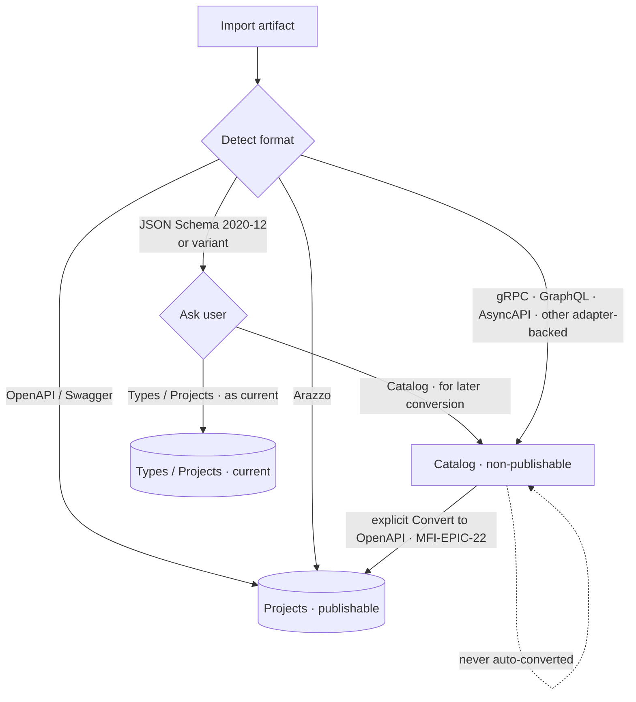
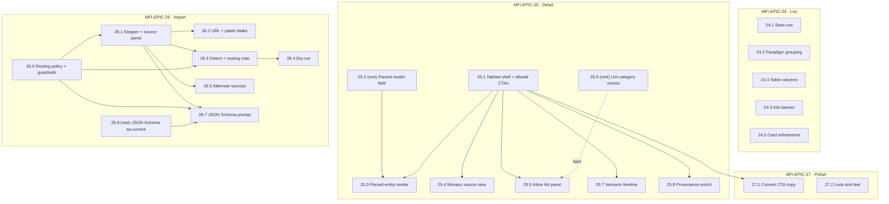
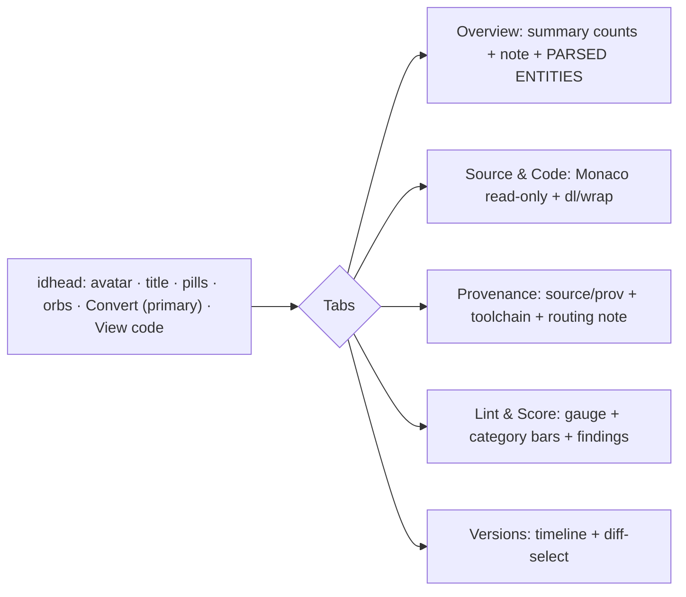
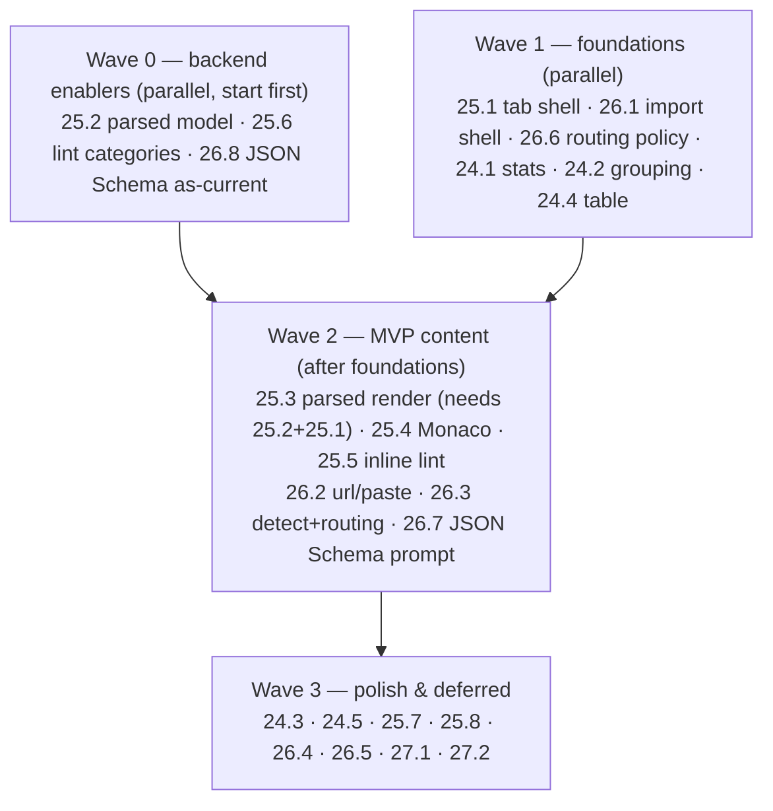

# Roadmap — Multi-Format Import: Catalog UI (Mockup Parity)

> **Status:** ✅ **Issues filed on `objectified-project/objectified`** — epics **#4077–#4080**
> (MFI-EPIC-24…27) and 23 issues **#4081–#4103**, all sub-issues under umbrella **#3715**.
> This roadmap enumerates the UI work needed to
> bring the shipped Catalog (multi-format import) surfaces up to the reference mockup at
> `docs/planning/mockups/multi-format-import/index.html`. It is a **reconciliation / parity
> layer** over already-shipped work (MFI-EPIC-22 convert, MFI-EPIC-23 catalog screen), **not**
> net-new functionality — the backend REST contract and a first-pass UI already exist.
> **Issue ID prefix:** `MFI` (consistent with `docs/ROADMAP_MULTI_FORMAT_IMPORT.md`). New epics
> continue the sequence as `MFI-EPIC-24…27`; issues `MFI-n.m`.
> **GitHub title format:** `objectified: [<epic>.<issue>] <title>`.
> **Recommended labels:** `roadmap-multi-format`, `multi-protocol`, `ui`, `typescript`, `rest`,
> `linting`, `import`, `export`, `mvp` (+ `validation` where relevant).

---

## 0. Source description (request, verbatim)

> Implement the UI portion of the multi-format-import from the
> `docs/planning/mockups/multi-format-import/index.html` page so that the functionality matches
> the available import functionality, along with the behavior and look-and-feel as expected.

### 0.1 Interpretation & framing

The mockup is the **target design** for the Catalog experience. The backend (import/detect/route,
catalog list+detail+source+lint, convert/fidelity) and a **first-pass UI** are already shipped and
mostly closed on GitHub:

| Already shipped (do **not** rebuild) | Where |
|---|---|
| Catalog list page (card/table, filter/sort/search, soft-delete) | `objectified-ui/src/app/ade/dashboard/catalog/page.tsx` (MFI-23.3 #4012) |
| CatalogItemCard | `…/components/ade/dashboard/catalog/CatalogItemCard.tsx` (MFI-23.4 #4013) |
| Format/Protocol/Source pills + registry | `…/components/ui/catalog/{FormatPill,ProtocolPill,SourceBadge}.tsx`, `…/utils/catalog-format-registry.ts` (MFI-23.5 #4014) |
| Catalog side-nav entry | `…/components/ade/dashboard/DashboardSideNav.tsx` (MFI-23.6 #4015) |
| Detail page + source-material panel | `…/catalog/[id]/{page.tsx,CatalogItemDetailClient.tsx}` (MFI-23.9 #4018) |
| Conversion preview dialog + fidelity utils | `…/catalog/ConversionPreviewDialog.tsx`, `…/utils/conversion-fidelity.ts` (MFI-22.4 #4005) |
| Convert-to-Project badge/back-link | `ConvertedBadge` in `catalog/page.tsx` (MFI-23.11 #4020) |
| Catalog import dialog (file-only, 3 formats) | `…/catalog/CatalogImportDialog.tsx` |

This roadmap targets **only the deltas** where the implementation trails the mockup. It draws its
gap list from a file-by-file comparison of the mockup against the eight component/util files above.

### 0.2 Available backend contract (what the UI can already call)

The UI binds to existing REST endpoints (all JWT/tenant-scoped) — **no new backend is needed for
MVP except two enrichment fields** (25.2, 25.6):

- **List** `GET /v1/catalog/{tenant}` → `CatalogItemSchema[]` (name, slug, `sourceFormat`, `protocol`,
  `formatMetadata`, `qualityScore/Grade`, `publishable:false`, `conversion` back-link).
- **Detail** `GET /v1/catalog/{tenant}/{item}` → `+ summary{services,operations,types,channels}`,
  `+ source{kind,label,uri,has_content,downloadable}`.
- **Source** `GET /v1/catalog/{tenant}/{item}/source` → 307 redirect (URL) | 200 stream (captured) | 404.
- **Lint** `GET /v1/catalog/{tenant}/{item}/lint` → `{score,grade,findings[],ruleHits,severity_counts}`.
- **Convert** `POST /v1/catalog/{tenant}/{item}/convert?dryRun=` → `{report(FidelityReport),openapi,…}`.
- **Import sources** `GET /v1/import/sources` → `ImportSourceDescriptor[]` (key,label,icon,paradigm,
  `input_kinds[file|url|paste]`; alternate source kinds may be added later per format capability).
- **Detect** `POST /v1/import/detect` → candidates `{format,confidence,importable,source_key}`.
- **Import job** `POST /v1/tenants/{tenant}/imports[/upload]` → `202 {job_id}`; poll `GET …/{job}` →
  `{status,progress,result{routing_decision{target,publishable,reason,paradigm,format,counts}}}`;
  `POST …/{job}/commit`.

Two data gaps the UI cannot render without backend help (documented as enabler issues):
1. The mockup's **parsed-entity blocks** (operations/types/messages/channels/records with fields)
   have no counterpart in `CatalogItemDetailSchema` (only aggregate `summary` counts). → **MFI-25.2**.
2. The mockup's **per-category lint bars** (e.g. "Schema hygiene 95") need category-rollup scores;
   `/lint` returns findings + `severity_counts` but not per-category 0–100 scores. → **MFI-25.6**
   (bars degrade gracefully to a category-severity breakdown until then).

### 0.2.1 UI gap found during mockup review — import destination guide

The roadmap now has a precise routing policy (§0.3), but the mockup only reveals that policy after a
sample artifact has been detected. That leaves users guessing whether OpenAPI/Arazzo will leave the
Catalog flow, whether JSON Schema will prompt, and which formats are currently adapter-backed before
they choose a source.

**Recommended component.** Fold an **Import destination guide** into **MFI-26.1 / 26.3** rather than
filing a new issue: a side-by-side import panel where source selection sits beside a compact routing
reference, with a horizontal divider under each panel heading. The routing side lists (1) implemented
catalog adapters, (2) project-routed formats, (3) the JSON Schema choice branch, and (4)
recognized-but-not-yet importable formats. The guide should be driven from the same routing helper and
`/v1/import/sources` metadata as the source panel, so it does not drift from the enforcement logic.

**Acceptance criteria addendum.** Before upload/fetch/paste, users can see where each major format
will land; the detected-format routing note highlights the matching guide row; JSON Schema is visibly
called out as the only prompt; unavailable formats are labeled "recognized, not importable yet" instead
of appearing as active choices.

### 0.3 Import routing policy (request refinement, verbatim)

> Make sure that the import functionality in Catalog matches the import formats that have been
> implemented, and are strictly imported into the catalog, and not into a new project with a new
> version. Imported items into the catalog are intended to stay in the catalog, and only move to the
> projects when converted. They are never automatically converted when imported into the catalog.
> Only two types of imports into the catalog are _not_ supported: OpenAPI and Arazzo. These
> SPECIFICALLY create projects. Everything else does not. JSON schema files still create projects,
> but when these types are detected (specifically JSON Schema 2020-12 or variants) will ask a user if
> they want to import into the catalog for later conversion, or if they want to import them into
> types/projects. If they decide the latter, import will allow them to import the type or schema as
> current.

This refinement pins the **destination** of every import and closes three gaps against today's
backend (`objectified-rest/src/app/import_routing.py`), where `PUBLISHABLE_FORMATS =
{openapi-3.0, openapi-3.1, swagger-2.0}` → Projects and **everything else → catalog**:
(a) **Arazzo** currently falls through to the catalog but must route to **Projects**; (b) **JSON
Schema 2020‑12/variants** currently routes to the catalog as *schemas‑only* but must instead **prompt**
the user; (c) the catalog importer must **guarantee** it never mints a publishable Project/version and
never auto‑converts.

**Destination decision table**

| Detected format | Destination | Prompt user? | Auto‑convert on import? |
|---|---|---|---|
| OpenAPI 3.0 / 3.1, Swagger 2.0 (incl. TypeSpec‑emitted OpenAPI) | **Projects** (publishable) | No | n/a |
| **Arazzo** | **Projects** (publishable) | No | n/a |
| **JSON Schema 2020‑12 & variants** | **Prompt →** Catalog *or* Types/Projects | **Yes** | No |
| gRPC/Protobuf · GraphQL · AsyncAPI (implemented adapters) | **Catalog** (non‑publishable) | No | **No — stays in catalog until explicit Convert** |
| Other recognized non‑OpenAPI formats without an adapter yet | shown as *recognized, not importable yet* | No | n/a |

**Rules enforced by this roadmap:**
1. **Only OpenAPI and Arazzo specifically create Projects.** Everything else does not.
2. **Catalog imports are stored verbatim and stay in the catalog** — never auto‑converted, never given
   a publishable project/version. They move to Projects **only** via the explicit Convert‑to‑OpenAPI
   flow (**MFI-EPIC-22**).
3. **JSON Schema is the only format that asks the user**: *Catalog (for later conversion)* vs
   *Types/Projects (import the type/schema as current)*. Choosing the latter uses the existing
   type/schema import path; choosing the former stores a non‑publishable catalog item.
4. **The import source panel offers only the base source methods**: File Upload, URL Import, and
   Clipboard paste. Alternate source methods can be added later only when a format supports that intake.



This policy is implemented by **MFI-26.6 / 26.7 / 26.8** (below) and constrains **MFI-26.1** (source
panel = File Upload / URL Import / Clipboard paste) and **MFI-26.3** (the predicted routing note must
reflect this table).

---

## 1. MVP Definition

**MVP = a catalog user, for the three already-importable non-OpenAPI formats (gRPC/Protobuf,
GraphQL, AsyncAPI), gets the mockup's core experience end-to-end:**

1. **List** shows the 4-card stats row and cards **grouped by paradigm** (graph/rpc/event/rest/
   data-schema) with section headers + counts. (MFI-24.1, 24.2, 24.4)
2. **Detail** is **tabbed** (Overview / Source & Code / Provenance / Lint & Score / Versions), the
   Overview renders the **parsed, human-readable model** (entities + fields) plus the summary note,
   Source & Code shows the **raw source read-only in Monaco**, and Lint & Score renders **inline**
   (gauge + findings). (MFI-25.1–25.5)
3. **Import** is a **stepped, multi-source modal** (File / URL / Clipboard) that surfaces the
   **auto-detected format + confidence** and the **predicted routing** (Catalog vs Projects), and
   **enforces the §0.3 routing policy**: only OpenAPI + Arazzo create Projects; all implemented
   non-OpenAPI formats import **strictly into the catalog** (never auto-converted); JSON Schema
   2020-12/variants **prompts** the user (catalog vs types/projects). (MFI-26.1–26.3, 26.6–26.8)
4. **Convert** already meets parity; MVP only relabels the CTA and wires it as the detail's primary
   action. (folded into MFI-25.1 / MFI-27.1)

**Explicitly out of MVP** (documented, deferred): alternate import sources beyond File/URL/Clipboard
(MFI-26.5, gated on per-format source capability), inline versions timeline + diff-select
(MFI-25.7), provenance enrichment (MFI-25.8), dry-run action (MFI-26.4),
category-score bars enabler (MFI-25.6), and cosmetic polish (MFI-24.3, 24.5, 27.1, 27.2).

**Non-goals:** read-only Designer/Studio view of catalog items (already tracked as **MFI-23.12
#4021**, v2); any new format parsers/adapters (owned by the per-format epics MFI-EPIC-8…17); any
change to the publishable/non-publishable DB invariant (MFI-23.1/23.8, shipped).

---

## 2. Epics overview

| Epic | Title | Issues | Theme | MVP |
|---|---|---|---|---|
| **MFI-EPIC-24** | Catalog List Screen Parity | 24.1–24.5 | Stats, paradigm grouping, table columns, card refinements | ◐ partial |
| **MFI-EPIC-25** | Catalog Detail View Parity | 25.1–25.8 | Tabbed IA, parsed rendering, Monaco source, inline lint | ● core |
| **MFI-EPIC-26** | Multi-Source Import Modal | 26.1–26.8 | Stepper, File/URL/Clipboard intake, detect+route, **§0.3 routing policy**, source extensibility | ◐ partial |
| **MFI-EPIC-27** | Convert Modal & Cross-Surface Polish | 27.1–27.2 | CTA copy, look-and-feel alignment | ○ polish |



---

## MFI-EPIC-24 — Catalog List Screen Parity · #4077

Bring `catalog/page.tsx` to the mockup's list layout: a 4-card stats row, paradigm-grouped cards,
the persistent non-publishable banner, and table columns matching the mockup's set. The list already
**exceeds** the mockup on sort (6 real sort keys w/ asc/desc), live filter-chip counts, empty state,
and the `CatalogSupportedFormats` gallery — those stay as-is.

_All MFI-EPIC-24 tickets are delivered — see the per-ticket notes below._

### MFI-24.1 — Catalog stats row (4 metric cards) · #4081 — ✅ Done
- **Delivered.** `CatalogStatsRow` renders the four cards above the toolbar from a pure
  `computeCatalogStats(items)` helper (no new API); `headerSubtitle` reduced to a static tagline.
  Unit tests assert each metric from a fixture list plus a render test; see
  `objectified-ui/src/app/utils/catalog-dashboard-stats.ts` and
  `objectified-ui/src/app/components/ade/dashboard/catalog/CatalogStatsRow.tsx`.
- **Problem.** The mockup opens the list with a 4-card stats grid; the implementation collapses this
  into a single `headerSubtitle` string ("N items · avg quality X · N active"), losing the
  formats-represented and converted-to-OpenAPI metrics and the letter grade on avg quality.
- **Solution / scope.** Compute from the already-fetched list (no new API): (1) *Cataloged items* with
  `active`/`disabled` sub-badges; (2) *Avg quality* as `letter · score` via existing grade mapping;
  (3) *Formats represented* = distinct `sourceFormat` count + a sample badge; (4) *Converted to OpenAPI*
  = count where `conversion != null`, indigo "promotion path" badge. Source: mockup `renderCatalog`
  (`index.html:1359-1367`).
- **Acceptance criteria.** Four cards render above the toolbar; counts match the list; avg shows
  letter+score; converted count links behavior matches `ConvertedBadge`; cards collapse responsively;
  `headerSubtitle` reduced or removed; unit test asserts each metric from a fixture list.
- **Dependencies / parallelism.** Independent; parallel with all EPIC-24. No backend.
- **Tech stack.** React/TSX client component, Tailwind, existing `dashboardScreenClasses`.

### MFI-24.2 — Group cards by paradigm · #4082 — ✅ Done
- **Delivered.** The card view sections by resolved paradigm via a pure
  `groupCatalogItemsByParadigm(items)` helper — fixed graph→rpc→event→rest→data-schema order, empty
  paradigms omitted, a trailing "Other" bucket so no card is ever dropped (agent/unknown/absent), and
  input order preserved so sections stay sorted. A toolbar Group control (Protocol / None) mirrors the
  sort control and defaults to Protocol; None reproduces the flat grid and the table view stays flat.
  Unit tests cover grouping + ordering; source-contract tests cover the wiring. See
  `objectified-ui/src/app/utils/catalog-paradigm-grouping.ts` and
  `objectified-ui/src/app/ade/dashboard/catalog/page.tsx`.
- **Problem.** Cards render as a single flat grid; the mockup groups them into paradigm sections with
  a header (label + item count + divider), iterating paradigms in fixed order. The mockup's
  "Group: Protocol ▾" toolbar control has no counterpart.
- **Solution / scope.** Group the filtered list by resolved paradigm (`protocol`→`resolveCatalogProtocol`),
  render `.sgrp`-style section headers then the grid per group, in the fixed order
  graph→rpc→event→rest→data-schema (mockup `PARADIGM` order, `index.html:1369-1377`). Add a Group
  toggle (Protocol / None) mirroring the sort control; "None" preserves today's flat grid. Only the
  **card** view groups; table view stays flat.
- **Acceptance criteria.** With Group=Protocol, cards appear under correct paradigm headers with live
  counts; empty paradigms are omitted; Group=None reproduces current flat grid; grouping composes with
  filter/search/sort; test covers grouping + ordering.
- **Dependencies / parallelism.** Independent; parallel. Uses existing registry.
- **Tech stack.** React/TSX, Tailwind, `catalog-format-registry.ts`.

```
[ Graph ─ 2 items ────────────────────────]
  ┌ card ┐ ┌ card ┐
[ RPC ─ 1 item ───────────────────────────]
  ┌ card ┐
[ Event ─ 1 item ─────────────────────────]  ...
```

### MFI-24.3 — Persistent non-publishable banner · #4083 — ✅ Done
- **Delivered.** A self-contained `CatalogNonPublishableBanner` (`role="note"`) renders at the top of
  the Catalog content stack, above the gallery/stats/toolbar, so the "items are non-publishable →
  Convert to OpenAPI → OpenAPI/Swagger land in Projects" messaging shows on both the populated and
  empty list. Copy mirrors `note.info` in
  `docs/planning/mockups/multi-format-import/index.html:389-396`; the banner is persistent (the
  optional dismiss-per-session was skipped). Render tests assert the note landmark and each copy
  point; see `objectified-ui/src/app/components/ade/dashboard/catalog/CatalogNonPublishableBanner.tsx`
  and `objectified-ui/tests/catalog-nonpublishable-banner.test.tsx`.

### MFI-24.4 — Table view column parity · #4084 — ✅ Done
- **Delivered.** The catalog table now renders the mockup's 8 columns in order — **Artifact / Format /
  Protocol / Source / Quality / Grade / Status / Updated** — plus the trailing actions column. The
  bundled `CatalogFormatBadge` cell is split into dedicated **Format** (`FormatPill`), **Protocol**
  (`ProtocolPill`) and **Source** (`SourceBadge`) columns; a new **Grade** column shows a `gc-A…F`
  letter chip via the shared `GradeChip` (`ui/catalog/GradeChip.tsx`), coloured by band (A emerald →
  F red) and derived through `catalogItemGrade` (captured `qualityGrade`, else score-derived). The
  artifact cell gains the `.av.sm` gradient avatar (initials); Description/Created-By/Created are
  dropped to match the set (search still spans description). Sort keys (Quality/Grade/Status/Updated)
  are unchanged. Covered by `objectified-ui/tests/catalog-grade-chip.test.tsx`,
  `objectified-ui/tests/catalog-card-presentation.test.ts` and the header/row contracts in
  `objectified-ui/tests/catalog-page.test.ts`.

### MFI-24.5 — Card orb & footer refinements · #4085 — ✅ Done
- **Delivered.** `CatalogItemCard` now renders three orbs (Quality, Lint, and an always-inert **Debt**
  orb — a neutral `—` with a "Technical debt (not yet computed)" tooltip and no button) 3-across under a
  dashed divider, with the format/source pills moved above them. `ConvertedBadge` (`conversionSlot`) is
  right-aligned in the orb row, and the footer carries the creator chip ("imported by …") + updated-relative
  time in place of the old "enabled · active" text. Existing quality/lint dialog wiring is unchanged; the
  card test contract (`objectified-ui/tests/catalog-item-card.test.tsx`) is updated with Debt-orb/footer cases.
- **Problem.** The card shows two orbs (Quality, Lint); the mockup shows **three** — adding a **Debt**
  orb (empty `—`, "not yet computed") — in a 3-across row with a dashed divider. The mockup footer is
  "[avatar] imported by X … updated Y"; the implementation puts creator in the body and shows
  "enabled · active" in the footer. The converted badge sits in a separate row vs the mockup's orb row.
- **Solution / scope.** Add the neutral Debt orb; switch orbs to the 3-across dashed-divider layout;
  move the creator chip into the footer and drop the enabled/active footer text; move `ConvertedBadge`
  into the orb row (right-aligned). Source: mockup `cardHTML` `index.html:1315-1340`.
- **Acceptance criteria.** Three orbs render (Debt inert/non-clickable with tooltip); footer = creator +
  updated; converted badge in orb row; existing orb-dialog wiring preserved; card snapshot test updated.
- **Dependencies / parallelism.** Parallel. Non-MVP (look-and-feel).
- **Tech stack.** React/TSX, Tailwind.

---

## MFI-EPIC-25 — Catalog Detail View Parity · #4078

The largest gap. Today `CatalogItemDetailClient.tsx` is a single flat scroll (header → source
download → summary counts → provenance) with **no tabs, no parsed rendering, no Monaco, no inline
lint, no versions timeline**. This epic rebuilds it to the mockup's tabbed IA and rich content.



| Issue | Title | Summary | Labels | Parallel | MVP | Complexity | Affected modules |
|---|---|---|---|---|---|---|---|
| MFI-25.7 · #4092 | Inline versions timeline + diff | Version timeline with tick-any-two-to-diff, replacing off-page link | `ui`,`typescript`,`version-control` | N | N | M | detail client |
| MFI-25.8 · #4093 | Provenance tab enrichment | Fingerprint + Publishable:false rows + routing note; two-column source/toolchain | `ui`,`typescript`,`multi-protocol` | N | N | S | detail client |

### MFI-25.1 — Tabbed detail shell + idhead CTAs · #4086 — ✅ Done
- **Problem.** The detail view is a flat scroll with no tab IA; the mockup organizes content into five
  tabs and gives the header a **primary** Convert CTA plus a **View code** button that jumps to Source.
- **Solution / scope.** Introduce a tab bar (Overview / Source & Code / Provenance / Lint & Score /
  Versions) and move existing panels into the matching panes; promote Convert to the primary button and
  add "View code" (selects Source tab). Keep deep-link/back behavior. Source: mockup `index.html:417-502`.
- **Acceptance criteria.** Five tabs switch panes without route change; Convert is primary and opens the
  existing `ConversionPreviewDialog`; "View code" activates Source tab; existing quality/lint orb dialogs
  still open; keyboard/aria tab semantics; test covers tab switching + CTA wiring.
- **Dependencies / parallelism.** Foundation for 25.3/25.4/25.5/25.7/25.8/27.1; do **first** in EPIC-25.
- **Tech stack.** React/TSX, Tailwind, existing dialogs.

### MFI-25.2 — (rest) Expose normalized parsed model in catalog detail · #4087 — ✅ Done
- **Problem.** `CatalogItemDetailSchema` exposes only aggregate `summary` counts; the mockup's Overview
  renders **parsed entities** (operations/types/messages/channels/records with per-field name/type/
  description). The UI has no data to render these.
- **Solution / scope.** Extend the detail API (or add `GET …/{item}/model`) to return a normalized,
  paradigm-tagged entity list derived from the canonical model (MFI-EPIC-2): entity groups → entities
  (name, tag, meta) → fields (name, type, description, required). Keep it presentation-agnostic. Sources:
  `catalog_routes.py` (detail), `catalog_detail.py`, canonical model (MFI-EPIC-2). Confirm the canonical
  model is persisted/derivable for the three MVP formats.
- **Acceptance criteria.** Detail response includes a `parsed`/`model` array for gRPC/GraphQL/AsyncAPI
  fixtures; shape stable + documented; empty/absent model degrades to `[]`; contract test per format.
- **Dependencies / parallelism.** Parallel with all UI; **blocks 25.3**. Backend (Python/NestJS-adjacent
  FastAPI) work.
- **Tech stack.** FastAPI/Pydantic, canonical model, pytest fixtures.

### MFI-25.3 — Parsed-entity rendering (Overview) · #4088 — ✅ Done
- **Problem.** The Overview shows only count boxes; the mockup renders the parsed model human-readably
  and shows a `summaryNote` sub-line (e.g. "8 queries · 4 mutations · 2 subscriptions").
- **Solution / scope.** Consume 25.2's `parsed` model and render mockup `entHTML` blocks: per group a
  card, per entity a header (colored tag + name + meta) and `.frow` field rows (name / type / desc);
  add the `summaryNote` line under the count boxes. Tag colors map per paradigm. Source: mockup
  `entHTML`/`openDetail` (`index.html:1415-1453`).
- **Acceptance criteria.** For each MVP format, entity blocks render with correct tags/fields; missing
  model shows a graceful "no parsed model" note; count boxes + summaryNote present; test renders a
  fixture and asserts entity/field text.
- **Dependencies / parallelism.** Depends on **25.2** (data) and **25.1** (tab). Serial after both.
- **Tech stack.** React/TSX, Tailwind.

### MFI-25.4 — Monaco read-only Source & Code viewer · #4089 — ✅ Done
- **Delivered.** New `CatalogSourceViewer` replaces the download-only Source pane: it lazily fetches the
  raw source from `GET /api/catalog/{id}/source` on first tab activation (the proxy's 307 for URL sources
  is followed by `fetch`), then renders it read-only in a dynamically-imported (`ssr:false`) Monaco
  editor with a format pill / source badge / `language: …` tag, Download + Wrap actions, and a `<pre>`
  offline fallback the dynamic loader resolves to when Monaco can't load. A pure
  `monacoLanguageForCatalogFormat` helper maps `sourceFormat`→Monaco language (JSON-or-YAML formats
  refined by sniffing the bytes). The download link + non-publishable/no-source degradations are
  preserved. Covered by `catalog-source-viewer[-offline].test.tsx` + `catalog-source-language.test.ts`.
- **Problem.** The Source panel only offers a download/open link; the mockup shows the **raw source
  read-only in Monaco** with a format pill / source badge / language tag, Download + Wrap buttons, and
  an offline fallback `<pre>`.
- **Solution / scope.** In the Source tab, fetch raw source via `GET …/{item}/source` (stream) — for
  307-redirect (URL) sources, fetch through the existing UI proxy — and render in a dynamically-imported
  read-only Monaco editor (reuse the `dynamic(() => import('@monaco-editor/react'), {ssr:false})` pattern
  from `studio/code/page.tsx`). Map `sourceFormat`→Monaco language; add Wrap toggle and offline `<pre>`
  fallback. Source: mockup `ensureMonaco` (`index.html:1517-1541`).
- **Acceptance criteria.** Raw source renders read-only with syntax highlight + line numbers; language
  tag correct; Download hits the source endpoint; Wrap toggles word-wrap; offline path shows `<pre>`;
  no SSR crash; test mounts with a mocked fetch.
- **Dependencies / parallelism.** Depends on **25.1**. Uses existing `/source` endpoint (no backend).
- **Tech stack.** React/TSX, `@monaco-editor/react` (dynamic), Tailwind.

### MFI-25.5 — Inline Lint & Score panel · #4090 — ✅ Done
- **Delivered.** New `CatalogLintPanel` renders lint inline in the Lint & Score tab: an SVG grade
  gauge (band-tinted progress ring + server letter grade + `score/100`), category bars, and a
  findings list (severity chip + rule + message + a MUST/SHOULD chip derived from severity). It
  fetches the same authoritative `GET /api/catalog/{id}/lint` report lazily on first tab activation
  (one-shot, with a retry affordance), reusing `fetchCatalogLintReport`. The bars use real
  per-category 0–100 scores when the report carries `categories[]` (MFI-25.6), otherwise degrade to
  a per-category **severity breakdown** derived from the findings (which categories carry the most
  severe findings) — no fabricated score. The full itemized `CatalogLintReportDialog` and the
  quality-history dialog stay reachable from the panel's actions and the header orbs. A pure
  `catalog-lint-panel` util (gauge geometry, category-source selection, MUST/SHOULD, humanizer) plus
  the forward-compatible optional `categories` field on `VersionLintReport` back it. Covered by
  `catalog-lint-panel.test.tsx` + `catalog-lint-panel-util.test.ts`; existing catalog suites green.
- **Problem.** Lint is reachable only via `CatalogLintReportDialog`; the mockup renders a **circular
  grade gauge** (letter + score/100), **per-category bars**, and a **findings list** inline in a
  Lint & Score tab.
- **Solution / scope.** In the Lint tab, call `GET …/{item}/lint` and render: a conic-gradient gauge
  (grade + score), category bars (from 25.6 when available; otherwise degrade to a per-category severity
  breakdown derived from `findings`/`severity_counts`), and a findings list (severity chip + rule +
  message + MUST/SHOULD). Keep the existing dialog available from the orb for history. Source: mockup
  lint pane (`index.html:481-491`, `1475-1486`).
- **Acceptance criteria.** Gauge shows correct band color + letter + score; findings list matches
  `/lint`; bars render (real category scores when 25.6 lands, else graceful fallback); test with a
  mocked lint response.
- **Dependencies / parallelism.** Depends on **25.1**; **25.6** enhances (not blocks) the bars.
- **Tech stack.** React/TSX, Tailwind/SVG or CSS conic-gradient.

### MFI-25.6 — (rest) Lint category-score rollup · #4091 — ✅ Done
- **Problem.** `/lint` returns findings + `ruleHits` + `severity_counts` but no per-category 0–100
  scores, so the mockup's category bars can't be driven with real values.
- **Solution / scope.** Added per-category rollup scores to the lint report. `schema_lint` now rolls up
  a deterministic 0–100 score per category (the same capped-penalty formula, scoped to each category's
  findings) via `_category_scores`/`LintCategoryScore`; the always-evaluated in-spec categories
  (naming/documentation/structure) are surfaced even at a clean 100, and `compatibility` appears only
  when a base comparison produces findings. Exposed as `categories[{name,score}]` on `LintReportResponse`,
  so both `/lint` surfaces (version + catalog, sharing `build_lint_report`) carry it. OpenAPI spec
  regenerated.
- **Acceptance criteria.** `/lint` (catalog + version) returns a `categories[{name,score}]` array;
  scores 0–100; deterministic; contract test. ✅
- **Dependencies / parallelism.** Parallel; enhances 25.5. Non-MVP (bars degrade until then).
- **Tech stack.** FastAPI/Pydantic, `schema_lint`, pytest.

### MFI-25.7 — Inline versions timeline + diff-select · #4092
- **Problem.** The detail only links off-page to `/ade/dashboard/versions`; the mockup shows an inline
  version **timeline** with a "tick any two revisions to diff" affordance.
- **Solution / scope.** In the Versions tab, render a timeline from the versions API with two-checkbox
  diff selection that routes to the existing diff view with both revisions preselected. Source: mockup
  versions pane (`index.html:493-499`, `1489`).
- **Acceptance criteria.** Timeline lists revisions newest-first; selecting exactly two enables "Diff";
  diff opens with both revisions; off-page link retained as fallback; test covers selection logic.
- **Dependencies / parallelism.** Depends on **25.1**. Non-MVP.
- **Tech stack.** React/TSX, existing versions/diff endpoints.

### MFI-25.8 — Provenance tab enrichment · #4093
- **Problem.** The provenance panel lacks the mockup's **fingerprint** row, explicit **Publishable:
  false** row, and the **routing-decision note**, and is single-column vs the mockup's two-column
  source/toolchain split.
- **Solution / scope.** Add fingerprint (from `formatMetadata`) + a Publishable:false row + a routing
  note (from the import job's `routing_decision.reason` or derived from format); lay out as two columns
  (Source & provenance | Toolchain & routing). Source: mockup provenance (`index.html:471-478`,
  `1461-1472`).
- **Acceptance criteria.** All three fields render when present; two-column layout responsive; existing
  tool-version chips + import-job id retained; test asserts new rows.
- **Dependencies / parallelism.** Depends on **25.1**. Non-MVP. May consume routing data already on the
  import job.
- **Tech stack.** React/TSX, Tailwind.

---

## MFI-EPIC-26 — Multi-Source Import Modal · #4079

`CatalogImportDialog.tsx` is a single-step **file-only** dropzone supporting 3 storable formats. The
mockup is a 4-step wizard with side-by-side source/destination panels, using the current base source
methods — File Upload, URL Import, and Clipboard paste — plus auto-detect confidence and a
routing-decision note. This epic rebuilds it to the mockup while binding to the
existing import job + detect endpoints, and it **enforces the §0.3 import routing policy** — only
OpenAPI + Arazzo create Projects; all implemented non-OpenAPI formats import **strictly into the
catalog** (never auto-converted); JSON Schema 2020-12/variants **prompts** the user (26.6–26.8).

```
Step 1 Source     Step 2 Detect & route     Step 3 Options   Step 4 Import
┌─────┬─────┬─────┐  Auto-detected: GraphQL   store_raw,       submit → poll
│File │URL  │Clip │  SDL (0.98) · paradigm    format hint,     → routing_decision
└─────┴─────┴─────┘  Routing → Catalog         defaults         → Catalog / Projects
Destination guide: Catalog / Projects / JSON Schema choice / future sources
```

| Issue | Title | Summary | Labels | Parallel | MVP | Complexity | Affected modules |
|---|---|---|---|---|---|---|---|
| MFI-26.1 · #4094 | Stepped import shell + source panel | 4-step stepper + side-by-side source/destination panels for File Upload, URL Import, Clipboard paste | `ui`,`typescript`,`import` | N | **Y** | L | `CatalogImportDialog.tsx` |
| MFI-26.2 · #4095 | URL + clipboard/paste intake | Wire URL fetch and paste-text intake to the import job engine | `ui`,`typescript`,`import` | N | **Y** | M | `CatalogImportDialog.tsx`, api proxies |
| MFI-26.3 · #4096 | Auto-detect + routing note | Surface detect confidence/paradigm + predicted Catalog-vs-Projects routing | `ui`,`typescript`,`import` | N | **Y** | S | `CatalogImportDialog.tsx` |
| MFI-26.4 · #4097 | Dry-run preview action | Add a non-committing dry-run that previews detection/routing without storing | `ui`,`typescript`,`import` | Y | N | S | `CatalogImportDialog.tsx` |
| MFI-26.5 · #4098 | Alternate import source extensibility | Add future source methods only when a format can be imported through alternate intake | `ui`,`import`,`integrations` | Y | N | M | import dialog + import source registry |
| MFI-26.6 · #4101 | Import routing policy & catalog-only guardrails | Only OpenAPI+Arazzo → Projects; all else → catalog, never auto-converted/publishable | `ui`,`rest`,`import`,`validation` | N | **Y** | M | `import_routing.py`, `CatalogImportDialog.tsx` |
| MFI-26.7 · #4102 | JSON Schema 2020-12 disambiguation prompt | On JSON Schema detect, ask Catalog (later conversion) vs Types/Projects (as current) | `ui`,`typescript`,`import` | N | **Y** | M | `CatalogImportDialog.tsx` |
| MFI-26.8 · #4103 | (rest) JSON Schema "import as current" path | Backend path to import JSON Schema as a current type/schema into types/projects | `rest`,`import`,`validation` | Y | **Y** | M | `import_routing.py`, spec-import job, type registry |

### MFI-26.1 — Stepped import shell + source panel · #4094
- **Problem.** The import dialog is single-step and file-only; the mockup is a 4-step wizard fronted by
  the current base source methods: **File Upload**, **URL Import**, and **Clipboard paste**.
- **Solution / scope.** Rebuild as a stepper (Source → Detect & route → Options → Import). Render a
  side-by-side source/destination panel from `GET /v1/import/sources` (`input_kinds`) so tiles reflect
  real capability: File / URL / Clipboard only for the current base importer. Preserve today's file
  dropzone as the File tile's step-2 body. Per §0.3 / **26.6**, the destination guide explains where
  detected formats land without adding alternate source methods prematurely. Source: mockup import
  modal (`index.html:506-555`).
- **Acceptance criteria.** Stepper advances/back; source panel renders exactly File Upload / URL Import /
  Clipboard paste from `/import/sources`; File path reproduces current upload→preview→store; URL and
  paste slots are present for 26.2; no reflection/introspection/registry tiles appear; test covers step
  navigation + panel render from a mocked sources response.
- **Dependencies / parallelism.** Foundation for 26.2/26.3/26.4/26.5; do **first** in EPIC-26.
- **Tech stack.** React/TSX, Tailwind, `useImportSources`.

### MFI-26.2 — URL + clipboard/paste intake · #4095
- **Problem.** Only file upload is supported; the registry and `SourceBadge` already model `url`/`paste`
  kinds, but the importer offers neither.
- **Solution / scope.** Add URL-fetch and paste-text bodies to step 2; submit via the import job engine
  with `source_kind:'url'|'paste'`, `store_raw_source:true`. Reuse detection on fetched/pasted bytes.
  Sources: `POST /v1/tenants/{tenant}/imports` (JSON base64), `SpecImportStartMetadata.source_kind`.
- **Acceptance criteria.** URL and paste both import gRPC/GraphQL/AsyncAPI to a catalog item; source
  badge reflects kind; errors surfaced; test covers both paths with mocked job polling.
- **Dependencies / parallelism.** Depends on **26.1**. No new backend.
- **Tech stack.** React/TSX, existing import proxies.

### MFI-26.3 — Auto-detect + routing note · #4096
- **Problem.** Detection runs but confidence/paradigm isn't shown, and there's no routing note telling
  the user the artifact will land in Catalog (vs Projects for OpenAPI/Swagger/TypeSpec-emitted).
- **Solution / scope.** Call `POST /v1/import/detect` in step 2 and show "Auto-detected: <format>
  (confidence X) · paradigm Y"; compute a **predicted** routing note client-side that reflects the §0.3
  table — **OpenAPI/Swagger and Arazzo → Projects**; **JSON Schema 2020-12/variants → prompt** (26.7);
  **everything else → Catalog non-publishable** — matching the job's eventual `routing_decision`.
  Sources: §0.3; mockup notes (`index.html:535-545`); `/import/detect`; `import_routing.decide_import_routing`.
- **Acceptance criteria.** Confidence + paradigm shown after source input; routing note matches the §0.3
  destination for OpenAPI, Arazzo, JSON Schema (prompt), and an adapter-backed catalog format; ambiguous
  detection handled; test with mocked detect responses.
- **Dependencies / parallelism.** Depends on **26.1**. No new backend.
- **Tech stack.** React/TSX, `/import/detect`.

### MFI-26.4 — Dry-run preview action · #4097
- **Problem.** The mockup offers a **Dry run** button; the importer has none.
- **Solution / scope.** Add a Dry-run action that runs detect + routing prediction (and, if cheap, a
  preview job) **without** committing a catalog item; show what *would* happen. Reuse job
  `status:'preview'` semantics if available.
- **Acceptance criteria.** Dry-run shows predicted format/routing with no catalog write; Continue still
  commits; test asserts no store call on dry-run.
- **Dependencies / parallelism.** Depends on 26.1; parallel with 26.2/26.3. Non-MVP.
- **Tech stack.** React/TSX, import proxies.

### MFI-26.5 — Alternate import source extensibility · #4098
- **Problem.** The current base importer should not expose reflection, introspection, registry, or other
  alternate source methods because those artifacts are imported through File Upload, URL Import, or
  Clipboard paste today. Future formats may later support additional intake methods.
- **Solution / scope.** Keep the source panel limited to File / URL / Clipboard until a format-specific
  alternate intake is actually available. When that happens, extend `/v1/import/sources` with a source
  kind and label that describes the capability, then add the tile behind the same source registry rather
  than hard-coding format-specific shortcuts into the dialog.
- **Acceptance criteria.** No alternate source tile appears unless backed by a format capability; current
  mockup and tests show only File Upload / URL Import / Clipboard paste; adding a future source kind is
  data-driven through the source registry.
- **Dependencies / parallelism.** Depends on **26.1** and on future per-format source capability.
  Non-MVP; likely v2.
- **Tech stack.** React/TSX + import source registry.

### MFI-26.6 — Import routing policy & catalog-only guardrails · #4101
- **Problem.** Per §0.3, only **OpenAPI and Arazzo** may create Projects; every other implemented
  format must import **strictly into the catalog**, is **never auto-converted**, and never mints a
  publishable project/version. Today the backend routes only the OpenAPI/Swagger family to Projects
  (so **Arazzo wrongly lands in the catalog**), and the UI has no guardrail asserting the catalog path
  produces a non-publishable, unconverted item.
- **Solution / scope.** (Backend) add **Arazzo** to the publishable/Project routing in
  `import_routing.decide_import_routing` (`PUBLISHABLE_FORMATS` + Arazzo detection), keeping all other
  formats on the non-publishable catalog branch; assert the catalog branch never triggers conversion.
  (UI) `CatalogImportDialog` routes OpenAPI/Arazzo to the **Projects** import path and only ever stores
  other implemented formats as **catalog** items — no auto-convert, no publishable project/version.
  Encode the §0.3 decision table as the single source of truth. Sources: §0.3; `import_routing.py`;
  `catalog-import-formats.ts`.
- **Acceptance criteria.**
  - [ ] OpenAPI/Swagger **and Arazzo** import as publishable Projects; nothing else does.
  - [ ] gRPC/Protobuf, GraphQL, AsyncAPI import as **catalog items only** — no project/version, no
    conversion performed at import time.
  - [ ] A catalog item has **no** converted OpenAPI project until an explicit Convert (MFI-EPIC-22).
  - [ ] Routing table covered by unit tests (backend `decide_import_routing` + UI routing helper).
- **Dependencies / parallelism.** Anchors §0.3; constrains **26.1**/**26.3**; pairs with **26.7/26.8**
  for the JSON Schema branch. Backend + UI.
- **Tech stack.** FastAPI/Pydantic (`import_routing.py`), React/TSX (`CatalogImportDialog.tsx`), pytest + Jest.

### MFI-26.7 — JSON Schema 2020-12 disambiguation prompt · #4102
- **Problem.** JSON Schema serves two purposes — a **catalog** artifact for later conversion, or a
  **type/schema** imported *as current* into Types/Projects. On detecting **JSON Schema 2020-12 or a
  variant**, the importer must ask which the user wants; today such files route silently to the catalog.
- **Solution / scope.** When detection (`/v1/import/detect`) reports JSON Schema 2020-12/variants, show a
  choice step: **(a) Import into Catalog** (for later conversion) → non-publishable catalog item;
  **(b) Import into Types/Projects** (as current) → the existing type/schema import path (via **26.8**).
  Only JSON Schema triggers this prompt — OpenAPI/Arazzo never prompt, other catalog formats never
  prompt. Source: §0.3; mockup detect note (`index.html:535-539`).
- **Acceptance criteria.**
  - [ ] Prompt appears **only** for JSON Schema 2020-12/variants (schema-dialect detection).
  - [ ] "Catalog" stores a non-publishable catalog item (no conversion); "Types/Projects" imports as
    current via 26.8.
  - [ ] OpenAPI/Arazzo/gRPC/GraphQL/AsyncAPI imports are unaffected (no prompt).
  - [ ] Tests cover both branches + the no-prompt formats.
- **Dependencies / parallelism.** Depends on **26.1** (import shell) and **26.6** (policy); the
  Types/Projects branch depends on **26.8**.
- **Tech stack.** React/TSX, `/import/detect`. Affected: `CatalogImportDialog.tsx`.

### MFI-26.8 — (rest) JSON Schema "import as current" into types/projects · #4103
- **Problem.** The "Types/Projects (as current)" choice from **26.7** needs a backend path that imports a
  JSON Schema 2020-12 document as a **current** type/schema — distinct from the catalog store-raw path
  and from the lossy convert flow.
- **Solution / scope.** Extend the import job / routing to accept an explicit **target** for JSON Schema
  (`types`/`project`) and persist the schema as a current type/schema (type registry and/or project
  version), rather than a catalog item. Default (no user opt-in) still permits the catalog branch.
  Sources: §0.3; `import_routing.py`; spec-import job; type registry.
- **Acceptance criteria.**
  - [ ] A JSON Schema import with `target=types|project` creates a **current** type/schema, not a
    catalog item.
  - [ ] The same document with the catalog choice still stores a non-publishable catalog item.
  - [ ] Contract test for both targets; no regression to OpenAPI/Arazzo routing.
- **Dependencies / parallelism.** Backend enabler for **26.7**; parallel with UI work. Coordinate with
  the Type Registry roadmap where relevant.
- **Tech stack.** FastAPI/Pydantic, spec-import job, type registry, pytest.

---

## MFI-EPIC-27 — Convert Modal & Cross-Surface Polish · #4080

The convert modal (`ConversionPreviewDialog.tsx`) is the **strongest-parity** surface and already
**exceeds** the mockup (real title/version/server defaults, raw-OpenAPI preview, enumerated projection
losses). Only copy/CTA-wiring and small cross-surface cosmetics remain.

| Issue | Title | Summary | Labels | Parallel | MVP | Complexity | Affected modules |
|---|---|---|---|---|---|---|---|
| MFI-27.1 · #4099 | Convert CTA copy + primary wiring | Relabel "Convert" → "Convert & create Project"; open from detail's primary CTA | `ui`,`export` | Y | N | XS | `ConversionPreviewDialog.tsx`, detail client |
| MFI-27.2 · #4100 | Cross-surface look-and-feel | Search placeholder, avg letter·score phrasing, spacing/copy alignment to mockup | `ui` | Y | N | XS | `catalog/page.tsx`, card |

### MFI-27.1 — Convert CTA copy + primary wiring · #4099
- **Problem.** The convert button reads "Convert"; the mockup names the outcome ("Convert & create
  Project"), and the detail's Convert should be the **primary** action opening this modal.
- **Solution / scope.** Update button copy; ensure the detail idhead primary CTA (from 25.1) opens the
  existing dialog; relabel to "Re-convert" when a conversion already exists (behavior already present on
  the back-link). Source: mockup `index.html:586`.
- **Acceptance criteria.** Button reads "Convert & create Project"; opens from the primary detail CTA;
  re-convert label correct; existing ack-gate/preview untouched; test asserts label + open wiring.
- **Dependencies / parallelism.** Depends on **25.1** for the primary CTA. Non-MVP.
- **Tech stack.** React/TSX.

### MFI-27.2 — Cross-surface look-and-feel · #4100
- **Problem.** Minor copy/visual drift: list search placeholder wording, avg-quality phrasing
  ("letter · score"), and small spacing/label differences from the mockup.
- **Solution / scope.** Align the search placeholder ("Search name, slug, format, protocol…"), render
  avg quality as "letter · score" wherever shown, and sweep small spacing/label mismatches. Source:
  mockup topbar/stats (`index.html:357`, `1362`).
- **Acceptance criteria.** Placeholder + avg phrasing match mockup; no functional regressions; visual
  diff reviewed.
- **Dependencies / parallelism.** Parallel; Non-MVP. Partially overlaps 24.1 (avg display).
- **Tech stack.** React/TSX, Tailwind.

---

## 3. Work order (sequenced)

Dependencies drive ordering; within a wave, issues are parallelizable. Backend enablers (25.2, 25.6,
26.8) start early so they never block the UI critical path.



**Recommended execution:**
1. **Wave 0 (backend, parallel):** MFI-25.2 (parsed model — unblocks the biggest UI feature),
   MFI-25.6 (lint categories — enhances bars), MFI-26.8 (JSON Schema "as current" path — unblocks the
   26.7 prompt's second branch).
2. **Wave 1 (UI foundations, parallel):** MFI-25.1 (detail tab shell — unblocks most of EPIC-25),
   MFI-26.1 (import shell — unblocks EPIC-26), **MFI-26.6 (routing policy — the destination contract
   the whole import flow enforces)**, MFI-24.1 / 24.2 / 24.4 (independent list work).
3. **Wave 2 (MVP content):** MFI-25.3 (needs 25.2 + 25.1), MFI-25.4, MFI-25.5, MFI-26.2, MFI-26.3,
   MFI-26.7 (JSON Schema prompt — needs 26.1/26.6, and 26.8 for its Types/Projects branch).
   → **At the end of Wave 2 the MVP is met.**
4. **Wave 3 (polish & deferred, parallel):** MFI-24.3, 24.5, 25.7, 25.8, 26.4, 26.5 (gated on future
   per-format source capability), 27.1, 27.2.

---

## 4. Verification & testing

- **Unit/component (Jest + RTL, `objectified-ui/tests/`):** follow existing patterns
  (`catalog-pills.test.tsx`, `catalog-item-detail.test.tsx`). New tests: stats metrics, paradigm
  grouping/order, table columns, tab switching, parsed-entity rendering (per MVP format fixture), Monaco
  mount + wrap, inline lint gauge/findings, import stepper navigation + detect/routing notes.
  ⚠️ Heed the known jsdom setState-loop constraint on complex dialogs — test picker/REST boundaries and
  pure helpers rather than deep-rendering problematic modals.
- **Contract (backend, pytest):** 25.2 parsed-model shape per format; 25.6 category-score rollup;
  **26.6 `decide_import_routing` table** (OpenAPI/Swagger + Arazzo → Project; gRPC/GraphQL/AsyncAPI →
  catalog, no convert); **26.8 JSON Schema `target=types|project` vs catalog**.
- **E2E (Playwright, `objectified-ui/e2e/`):** catalog list → open detail → switch tabs → view source in
  Monaco → open convert preview; import a fixture GraphQL/gRPC/AsyncAPI doc via File and URL and assert it
  lands as a **catalog item** (never a Project/version, never converted); import an **Arazzo** doc and
  assert it lands as a **Project**; import a **JSON Schema 2020-12** doc and assert the **prompt** appears,
  with each choice routing to catalog vs types/projects.
- **Mockup fidelity:** visually diff each rebuilt surface against
  `docs/planning/mockups/multi-format-import/index.html` (see the repo's mockup-verify workflow).

---

## 5. Cross-references

- Parent roadmap: `docs/ROADMAP_MULTI_FORMAT_IMPORT.md` (MFI umbrella #3715; EPIC-22 #4000, EPIC-23 #4001).
- Reference mockup: `docs/planning/mockups/multi-format-import/index.html`.
- Sibling: `docs/ROADMAP_MULTI_FORMAT_EXPORT.md`; `docs/WORK_ORDER_MFI.md`.
- Deferred and tracked elsewhere: read-only Designer/Studio catalog view — **MFI-23.12 #4021**.
- This roadmap does **not** create issues (per skill guidance); it is documented for validation before
  filing. When approved, file under the MFI umbrella using the title format
  `objectified: [<epic>.<issue>] <title>`.
