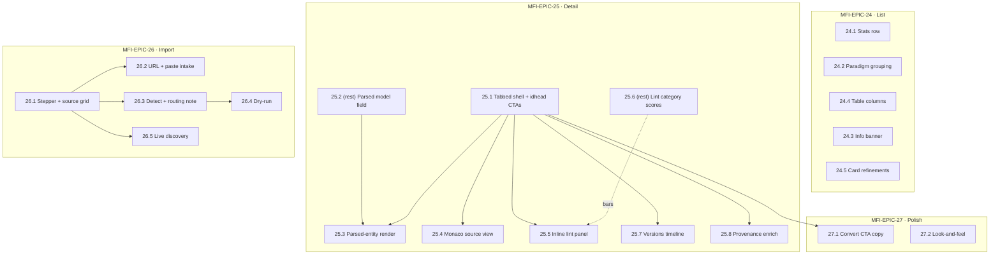
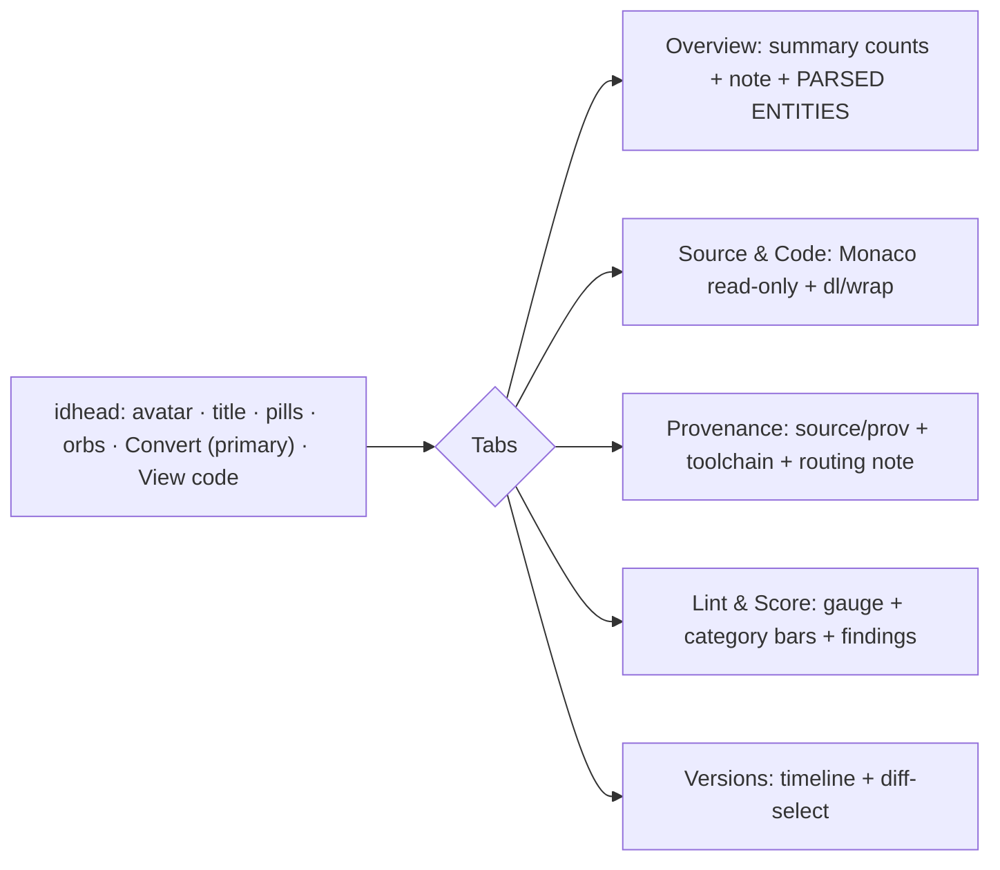
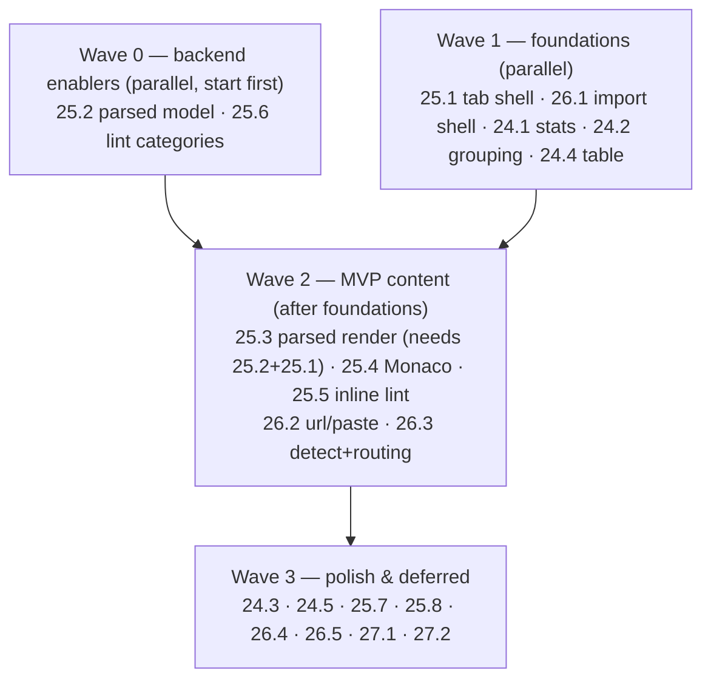

# Roadmap — Multi-Format Import: Catalog UI (Mockup Parity)

> **Status:** ✅ **Issues filed on `objectified-project/objectified`** — epics **#4077–#4080**
> (MFI-EPIC-24…27) and 20 issues **#4081–#4100**, all sub-issues under umbrella **#3715**.
> This roadmap enumerates the UI work needed to
> bring the shipped Catalog (multi-format import) surfaces up to the reference mockup at
> `docs/planning/mockups/multi-format-import/index.html`. It is a **reconciliation / parity
> layer** over already-shipped work (MFI-EPIC-22 convert, MFI-EPIC-23 catalog screen), **not**
> net-new functionality — the backend REST contract and a first-pass UI already exist.
> **Issue ID prefix:** `MFI` (consistent with `docs/ROADMAP_MULTI_FORMAT_IMPORT.md`). New epics
> continue the sequence as `MFI-EPIC-24…27`; issues `MFI-n.m`.
> **GitHub title format:** `objectified: [<epic>.<issue>] <title>`.
> **Recommended labels:** `roadmap-multi-format`, `multi-protocol`, `ui`, `typescript`, `rest`,
> `linting`, `import`, `export`, `mvp` (+ `validation` where relevant).

---

## 0. Source description (request, verbatim)

> Implement the UI portion of the multi-format-import from the
> `docs/planning/mockups/multi-format-import/index.html` page so that the functionality matches
> the available import functionality, along with the behavior and look-and-feel as expected.

### 0.1 Interpretation & framing

The mockup is the **target design** for the Catalog experience. The backend (import/detect/route,
catalog list+detail+source+lint, convert/fidelity) and a **first-pass UI** are already shipped and
mostly closed on GitHub:

| Already shipped (do **not** rebuild) | Where |
|---|---|
| Catalog list page (card/table, filter/sort/search, soft-delete) | `objectified-ui/src/app/ade/dashboard/catalog/page.tsx` (MFI-23.3 #4012) |
| CatalogItemCard | `…/components/ade/dashboard/catalog/CatalogItemCard.tsx` (MFI-23.4 #4013) |
| Format/Protocol/Source pills + registry | `…/components/ui/catalog/{FormatPill,ProtocolPill,SourceBadge}.tsx`, `…/utils/catalog-format-registry.ts` (MFI-23.5 #4014) |
| Catalog side-nav entry | `…/components/ade/dashboard/DashboardSideNav.tsx` (MFI-23.6 #4015) |
| Detail page + source-material panel | `…/catalog/[id]/{page.tsx,CatalogItemDetailClient.tsx}` (MFI-23.9 #4018) |
| Conversion preview dialog + fidelity utils | `…/catalog/ConversionPreviewDialog.tsx`, `…/utils/conversion-fidelity.ts` (MFI-22.4 #4005) |
| Convert-to-Project badge/back-link | `ConvertedBadge` in `catalog/page.tsx` (MFI-23.11 #4020) |
| Catalog import dialog (file-only, 3 formats) | `…/catalog/CatalogImportDialog.tsx` |

This roadmap targets **only the deltas** where the implementation trails the mockup. It draws its
gap list from a file-by-file comparison of the mockup against the eight component/util files above.

### 0.2 Available backend contract (what the UI can already call)

The UI binds to existing REST endpoints (all JWT/tenant-scoped) — **no new backend is needed for
MVP except two enrichment fields** (25.2, 25.6):

- **List** `GET /v1/catalog/{tenant}` → `CatalogItemSchema[]` (name, slug, `sourceFormat`, `protocol`,
  `formatMetadata`, `qualityScore/Grade`, `publishable:false`, `conversion` back-link).
- **Detail** `GET /v1/catalog/{tenant}/{item}` → `+ summary{services,operations,types,channels}`,
  `+ source{kind,label,uri,has_content,downloadable}`.
- **Source** `GET /v1/catalog/{tenant}/{item}/source` → 307 redirect (URL) | 200 stream (captured) | 404.
- **Lint** `GET /v1/catalog/{tenant}/{item}/lint` → `{score,grade,findings[],ruleHits,severity_counts}`.
- **Convert** `POST /v1/catalog/{tenant}/{item}/convert?dryRun=` → `{report(FidelityReport),openapi,…}`.
- **Import sources** `GET /v1/import/sources` → `ImportSourceDescriptor[]` (key,label,icon,paradigm,
  `input_kinds[file|url|paste|discovery]`,`live_discovery`).
- **Detect** `POST /v1/import/detect` → candidates `{format,confidence,importable,source_key}`.
- **Import job** `POST /v1/tenants/{tenant}/imports[/upload]` → `202 {job_id}`; poll `GET …/{job}` →
  `{status,progress,result{routing_decision{target,publishable,reason,paradigm,format,counts}}}`;
  `POST …/{job}/commit`.

Two data gaps the UI cannot render without backend help (documented as enabler issues):
1. The mockup's **parsed-entity blocks** (operations/types/messages/channels/records with fields)
   have no counterpart in `CatalogItemDetailSchema` (only aggregate `summary` counts). → **MFI-25.2**.
2. The mockup's **per-category lint bars** (e.g. "Schema hygiene 95") need category-rollup scores;
   `/lint` returns findings + `severity_counts` but not per-category 0–100 scores. → **MFI-25.6**
   (bars degrade gracefully to a category-severity breakdown until then).

---

## 1. MVP Definition

**MVP = a catalog user, for the three already-importable non-OpenAPI formats (gRPC/Protobuf,
GraphQL, AsyncAPI), gets the mockup's core experience end-to-end:**

1. **List** shows the 4-card stats row and cards **grouped by paradigm** (graph/rpc/event/rest/
   data-schema) with section headers + counts. (MFI-24.1, 24.2, 24.4)
2. **Detail** is **tabbed** (Overview / Source & Code / Provenance / Lint & Score / Versions), the
   Overview renders the **parsed, human-readable model** (entities + fields) plus the summary note,
   Source & Code shows the **raw source read-only in Monaco**, and Lint & Score renders **inline**
   (gauge + findings). (MFI-25.1–25.5)
3. **Import** is a **stepped, multi-source modal** (File / URL / Clipboard) that surfaces the
   **auto-detected format + confidence** and the **predicted routing** (Catalog vs Projects).
   (MFI-26.1–26.3)
4. **Convert** already meets parity; MVP only relabels the CTA and wires it as the detail's primary
   action. (folded into MFI-25.1 / MFI-27.1)

**Explicitly out of MVP** (documented, deferred): live-discovery intake (gRPC reflection / GraphQL
introspection / Schema Registry — MFI-26.5, gated on backend discovery adapters), inline versions
timeline + diff-select (MFI-25.7), provenance enrichment (MFI-25.8), dry-run action (MFI-26.4),
category-score bars enabler (MFI-25.6), and cosmetic polish (MFI-24.3, 24.5, 27.1, 27.2).

**Non-goals:** read-only Designer/Studio view of catalog items (already tracked as **MFI-23.12
#4021**, v2); any new format parsers/adapters (owned by the per-format epics MFI-EPIC-8…17); any
change to the publishable/non-publishable DB invariant (MFI-23.1/23.8, shipped).

---

## 2. Epics overview

| Epic | Title | Issues | Theme | MVP |
|---|---|---|---|---|
| **MFI-EPIC-24** | Catalog List Screen Parity | 24.1–24.5 | Stats, paradigm grouping, table columns, card refinements | ◐ partial |
| **MFI-EPIC-25** | Catalog Detail View Parity | 25.1–25.8 | Tabbed IA, parsed rendering, Monaco source, inline lint | ● core |
| **MFI-EPIC-26** | Multi-Source Import Modal | 26.1–26.5 | Stepper, source grid, detect+route, discovery | ◐ partial |
| **MFI-EPIC-27** | Convert Modal & Cross-Surface Polish | 27.1–27.2 | CTA copy, look-and-feel alignment | ○ polish |



---

## MFI-EPIC-24 — Catalog List Screen Parity · #4077

Bring `catalog/page.tsx` to the mockup's list layout: a 4-card stats row, paradigm-grouped cards,
the persistent non-publishable banner, and table columns matching the mockup's set. The list already
**exceeds** the mockup on sort (6 real sort keys w/ asc/desc), live filter-chip counts, empty state,
and the `CatalogSupportedFormats` gallery — those stay as-is.

| Issue | Title | Summary | Labels | Parallel | MVP | Complexity | Affected modules |
|---|---|---|---|---|---|---|---|
| MFI-24.1 · #4081 | Catalog stats row (4 metric cards) | Add cataloged-items / avg-quality(letter·score) / formats-represented / converted-count cards | `ui`,`typescript`,`multi-protocol` | Y | **Y** | S | `catalog/page.tsx` |
| MFI-24.2 · #4082 | Group cards by paradigm | Section cards by graph/rpc/event/rest/data-schema with header+count+divider; add Group control | `ui`,`typescript`,`multi-protocol` | Y | **Y** | M | `catalog/page.tsx` |
| MFI-24.3 · #4083 | Persistent non-publishable banner | Show the info banner on the populated list, not only the empty state | `ui`,`multi-protocol` | Y | N | XS | `catalog/page.tsx` |
| MFI-24.4 · #4084 | Table view column parity | Add Protocol, Source, Grade(letter chip) columns + artifact avatar; reconcile extra columns | `ui`,`typescript`,`multi-protocol` | Y | **Y** | S | `catalog/page.tsx`, `ui/catalog/*` |
| MFI-24.5 · #4085 | Card orb & footer refinements | Add 3rd "Debt" orb (empty), move creator chip to footer, reposition converted badge into orb row | `ui`,`typescript`,`multi-protocol` | Y | N | S | `catalog/CatalogItemCard.tsx` |

### MFI-24.1 — Catalog stats row (4 metric cards) · #4081
- **Problem.** The mockup opens the list with a 4-card stats grid; the implementation collapses this
  into a single `headerSubtitle` string ("N items · avg quality X · N active"), losing the
  formats-represented and converted-to-OpenAPI metrics and the letter grade on avg quality.
- **Solution / scope.** Compute from the already-fetched list (no new API): (1) *Cataloged items* with
  `active`/`disabled` sub-badges; (2) *Avg quality* as `letter · score` via existing grade mapping;
  (3) *Formats represented* = distinct `sourceFormat` count + a sample badge; (4) *Converted to OpenAPI*
  = count where `conversion != null`, indigo "promotion path" badge. Source: mockup `renderCatalog`
  (`index.html:1359-1367`).
- **Acceptance criteria.** Four cards render above the toolbar; counts match the list; avg shows
  letter+score; converted count links behavior matches `ConvertedBadge`; cards collapse responsively;
  `headerSubtitle` reduced or removed; unit test asserts each metric from a fixture list.
- **Dependencies / parallelism.** Independent; parallel with all EPIC-24. No backend.
- **Tech stack.** React/TSX client component, Tailwind, existing `dashboardScreenClasses`.

### MFI-24.2 — Group cards by paradigm · #4082
- **Problem.** Cards render as a single flat grid; the mockup groups them into paradigm sections with
  a header (label + item count + divider), iterating paradigms in fixed order. The mockup's
  "Group: Protocol ▾" toolbar control has no counterpart.
- **Solution / scope.** Group the filtered list by resolved paradigm (`protocol`→`resolveCatalogProtocol`),
  render `.sgrp`-style section headers then the grid per group, in the fixed order
  graph→rpc→event→rest→data-schema (mockup `PARADIGM` order, `index.html:1369-1377`). Add a Group
  toggle (Protocol / None) mirroring the sort control; "None" preserves today's flat grid. Only the
  **card** view groups; table view stays flat.
- **Acceptance criteria.** With Group=Protocol, cards appear under correct paradigm headers with live
  counts; empty paradigms are omitted; Group=None reproduces current flat grid; grouping composes with
  filter/search/sort; test covers grouping + ordering.
- **Dependencies / parallelism.** Independent; parallel. Uses existing registry.
- **Tech stack.** React/TSX, Tailwind, `catalog-format-registry.ts`.

```
[ Graph ─ 2 items ────────────────────────]
  ┌ card ┐ ┌ card ┐
[ RPC ─ 1 item ───────────────────────────]
  ┌ card ┐
[ Event ─ 1 item ─────────────────────────]  ...
```

### MFI-24.3 — Persistent non-publishable banner · #4083
- **Problem.** The mockup keeps a prominent info banner ("Catalog items are non-publishable… only path
  is Convert to OpenAPI; OpenAPI/Swagger land in Projects") on the populated list. The implementation
  only carries this messaging in the empty state.
- **Solution / scope.** Render the `note.info` banner between page head and toolbar on the populated
  list; dismissible-per-session optional. Source: mockup `index.html:373-380`.
- **Acceptance criteria.** Banner shows on populated + empty list; copy matches mockup intent; passes
  a11y (role=note); snapshot/unit test.
- **Dependencies / parallelism.** Independent; parallel. Non-MVP (informational).
- **Tech stack.** React/TSX, Tailwind.

### MFI-24.4 — Table view column parity · #4084
- **Problem.** The table columns are Name/Description/Format/Quality/Status/Created-By/Created/Updated;
  the mockup's set is **Artifact / Format / Protocol / Source / Quality / Grade / Status / Updated**.
  Protocol, Source, and a letter **Grade** chip are missing; the artifact cell lacks the avatar.
- **Solution / scope.** Split the bundled `CatalogFormatBadge` cell into dedicated **Format**,
  **Protocol** (`ProtocolPill`), and **Source** (`SourceBadge`) columns; add a **Grade** column with a
  `gc-A…F` letter chip; add the `.av.sm` avatar to the artifact cell. Drop or move Description/
  Created-By/Created to match the mockup's 8-column set (retain via column-visibility if cheap). Source:
  mockup table `index.html:1382-1398`.
- **Acceptance criteria.** Table shows the 8 mockup columns in order; Grade chip color matches band;
  avatar renders initials; sorting still works on Quality/Grade/Status/Updated; test asserts headers +
  a sample row.
- **Dependencies / parallelism.** Parallel; may share a small grade-chip component with 25.5.
- **Tech stack.** React/TSX, Tailwind, `ui/catalog/*` pills.

### MFI-24.5 — Card orb & footer refinements · #4085
- **Problem.** The card shows two orbs (Quality, Lint); the mockup shows **three** — adding a **Debt**
  orb (empty `—`, "not yet computed") — in a 3-across row with a dashed divider. The mockup footer is
  "[avatar] imported by X … updated Y"; the implementation puts creator in the body and shows
  "enabled · active" in the footer. The converted badge sits in a separate row vs the mockup's orb row.
- **Solution / scope.** Add the neutral Debt orb; switch orbs to the 3-across dashed-divider layout;
  move the creator chip into the footer and drop the enabled/active footer text; move `ConvertedBadge`
  into the orb row (right-aligned). Source: mockup `cardHTML` `index.html:1315-1340`.
- **Acceptance criteria.** Three orbs render (Debt inert/non-clickable with tooltip); footer = creator +
  updated; converted badge in orb row; existing orb-dialog wiring preserved; card snapshot test updated.
- **Dependencies / parallelism.** Parallel. Non-MVP (look-and-feel).
- **Tech stack.** React/TSX, Tailwind.

---

## MFI-EPIC-25 — Catalog Detail View Parity · #4078

The largest gap. Today `CatalogItemDetailClient.tsx` is a single flat scroll (header → source
download → summary counts → provenance) with **no tabs, no parsed rendering, no Monaco, no inline
lint, no versions timeline**. This epic rebuilds it to the mockup's tabbed IA and rich content.



| Issue | Title | Summary | Labels | Parallel | MVP | Complexity | Affected modules |
|---|---|---|---|---|---|---|---|
| MFI-25.1 · #4086 | Tabbed detail shell + idhead CTAs | 5-tab IA (Overview/Source/Provenance/Lint/Versions); primary Convert + "View code" | `ui`,`typescript`,`multi-protocol` | N | **Y** | M | `CatalogItemDetailClient.tsx` |
| MFI-25.2 · #4087 | (rest) Expose normalized parsed model | Add parsed entities (ops/types/messages/channels/records+fields) to detail API | `rest`,`multi-protocol`,`validation` | Y | **Y** | M | `objectified-rest/…/catalog_*` |
| MFI-25.3 · #4088 | Parsed-entity rendering (Overview) | Render entity blocks + field rows + summaryNote in Overview | `ui`,`typescript`,`multi-protocol` | N | **Y** | L | `CatalogItemDetailClient.tsx` |
| MFI-25.4 · #4089 | Monaco read-only Source & Code | Inline read-only source viewer + lang tag + download/wrap + offline fallback | `ui`,`typescript`,`multi-protocol` | N | **Y** | M | detail client, monaco wrapper |
| MFI-25.5 · #4090 | Inline Lint & Score panel | Circular grade gauge + category bars + findings rendered inline (not modal-only) | `ui`,`typescript`,`linting` | N | **Y** | M | detail client, `CatalogLintReportDialog` |
| MFI-25.6 · #4091 | (rest) Lint category-score rollup | Per-category 0–100 scores to drive the bars | `rest`,`linting`,`multi-protocol` | Y | N | S | `objectified-rest/…/lint_*` |
| MFI-25.7 · #4092 | Inline versions timeline + diff | Version timeline with tick-any-two-to-diff, replacing off-page link | `ui`,`typescript`,`version-control` | N | N | M | detail client |
| MFI-25.8 · #4093 | Provenance tab enrichment | Fingerprint + Publishable:false rows + routing note; two-column source/toolchain | `ui`,`typescript`,`multi-protocol` | N | N | S | detail client |

### MFI-25.1 — Tabbed detail shell + idhead CTAs · #4086
- **Problem.** The detail view is a flat scroll with no tab IA; the mockup organizes content into five
  tabs and gives the header a **primary** Convert CTA plus a **View code** button that jumps to Source.
- **Solution / scope.** Introduce a tab bar (Overview / Source & Code / Provenance / Lint & Score /
  Versions) and move existing panels into the matching panes; promote Convert to the primary button and
  add "View code" (selects Source tab). Keep deep-link/back behavior. Source: mockup `index.html:417-502`.
- **Acceptance criteria.** Five tabs switch panes without route change; Convert is primary and opens the
  existing `ConversionPreviewDialog`; "View code" activates Source tab; existing quality/lint orb dialogs
  still open; keyboard/aria tab semantics; test covers tab switching + CTA wiring.
- **Dependencies / parallelism.** Foundation for 25.3/25.4/25.5/25.7/25.8/27.1; do **first** in EPIC-25.
- **Tech stack.** React/TSX, Tailwind, existing dialogs.

### MFI-25.2 — (rest) Expose normalized parsed model in catalog detail · #4087
- **Problem.** `CatalogItemDetailSchema` exposes only aggregate `summary` counts; the mockup's Overview
  renders **parsed entities** (operations/types/messages/channels/records with per-field name/type/
  description). The UI has no data to render these.
- **Solution / scope.** Extend the detail API (or add `GET …/{item}/model`) to return a normalized,
  paradigm-tagged entity list derived from the canonical model (MFI-EPIC-2): entity groups → entities
  (name, tag, meta) → fields (name, type, description, required). Keep it presentation-agnostic. Sources:
  `catalog_routes.py` (detail), `catalog_detail.py`, canonical model (MFI-EPIC-2). Confirm the canonical
  model is persisted/derivable for the three MVP formats.
- **Acceptance criteria.** Detail response includes a `parsed`/`model` array for gRPC/GraphQL/AsyncAPI
  fixtures; shape stable + documented; empty/absent model degrades to `[]`; contract test per format.
- **Dependencies / parallelism.** Parallel with all UI; **blocks 25.3**. Backend (Python/NestJS-adjacent
  FastAPI) work.
- **Tech stack.** FastAPI/Pydantic, canonical model, pytest fixtures.

### MFI-25.3 — Parsed-entity rendering (Overview) · #4088
- **Problem.** The Overview shows only count boxes; the mockup renders the parsed model human-readably
  and shows a `summaryNote` sub-line (e.g. "8 queries · 4 mutations · 2 subscriptions").
- **Solution / scope.** Consume 25.2's `parsed` model and render mockup `entHTML` blocks: per group a
  card, per entity a header (colored tag + name + meta) and `.frow` field rows (name / type / desc);
  add the `summaryNote` line under the count boxes. Tag colors map per paradigm. Source: mockup
  `entHTML`/`openDetail` (`index.html:1415-1453`).
- **Acceptance criteria.** For each MVP format, entity blocks render with correct tags/fields; missing
  model shows a graceful "no parsed model" note; count boxes + summaryNote present; test renders a
  fixture and asserts entity/field text.
- **Dependencies / parallelism.** Depends on **25.2** (data) and **25.1** (tab). Serial after both.
- **Tech stack.** React/TSX, Tailwind.

### MFI-25.4 — Monaco read-only Source & Code viewer · #4089
- **Problem.** The Source panel only offers a download/open link; the mockup shows the **raw source
  read-only in Monaco** with a format pill / source badge / language tag, Download + Wrap buttons, and
  an offline fallback `<pre>`.
- **Solution / scope.** In the Source tab, fetch raw source via `GET …/{item}/source` (stream) — for
  307-redirect (URL) sources, fetch through the existing UI proxy — and render in a dynamically-imported
  read-only Monaco editor (reuse the `dynamic(() => import('@monaco-editor/react'), {ssr:false})` pattern
  from `studio/code/page.tsx`). Map `sourceFormat`→Monaco language; add Wrap toggle and offline `<pre>`
  fallback. Source: mockup `ensureMonaco` (`index.html:1517-1541`).
- **Acceptance criteria.** Raw source renders read-only with syntax highlight + line numbers; language
  tag correct; Download hits the source endpoint; Wrap toggles word-wrap; offline path shows `<pre>`;
  no SSR crash; test mounts with a mocked fetch.
- **Dependencies / parallelism.** Depends on **25.1**. Uses existing `/source` endpoint (no backend).
- **Tech stack.** React/TSX, `@monaco-editor/react` (dynamic), Tailwind.

### MFI-25.5 — Inline Lint & Score panel · #4090
- **Problem.** Lint is reachable only via `CatalogLintReportDialog`; the mockup renders a **circular
  grade gauge** (letter + score/100), **per-category bars**, and a **findings list** inline in a
  Lint & Score tab.
- **Solution / scope.** In the Lint tab, call `GET …/{item}/lint` and render: a conic-gradient gauge
  (grade + score), category bars (from 25.6 when available; otherwise degrade to a per-category severity
  breakdown derived from `findings`/`severity_counts`), and a findings list (severity chip + rule +
  message + MUST/SHOULD). Keep the existing dialog available from the orb for history. Source: mockup
  lint pane (`index.html:481-491`, `1475-1486`).
- **Acceptance criteria.** Gauge shows correct band color + letter + score; findings list matches
  `/lint`; bars render (real category scores when 25.6 lands, else graceful fallback); test with a
  mocked lint response.
- **Dependencies / parallelism.** Depends on **25.1**; **25.6** enhances (not blocks) the bars.
- **Tech stack.** React/TSX, Tailwind/SVG or CSS conic-gradient.

### MFI-25.6 — (rest) Lint category-score rollup · #4091
- **Problem.** `/lint` returns findings + `ruleHits` + `severity_counts` but no per-category 0–100
  scores, so the mockup's category bars can't be driven with real values.
- **Solution / scope.** Add per-category rollup scores to the lint report (weighted from rule severities
  per category) so the UI can render bars directly. Source: `lint_routes.py`, `schema_lint` scoring.
- **Acceptance criteria.** `/lint` (catalog + version) returns a `categories[{name,score}]` array;
  scores 0–100; deterministic; contract test.
- **Dependencies / parallelism.** Parallel; enhances 25.5. Non-MVP (bars degrade until then).
- **Tech stack.** FastAPI/Pydantic, `schema_lint`, pytest.

### MFI-25.7 — Inline versions timeline + diff-select · #4092
- **Problem.** The detail only links off-page to `/ade/dashboard/versions`; the mockup shows an inline
  version **timeline** with a "tick any two revisions to diff" affordance.
- **Solution / scope.** In the Versions tab, render a timeline from the versions API with two-checkbox
  diff selection that routes to the existing diff view with both revisions preselected. Source: mockup
  versions pane (`index.html:493-499`, `1489`).
- **Acceptance criteria.** Timeline lists revisions newest-first; selecting exactly two enables "Diff";
  diff opens with both revisions; off-page link retained as fallback; test covers selection logic.
- **Dependencies / parallelism.** Depends on **25.1**. Non-MVP.
- **Tech stack.** React/TSX, existing versions/diff endpoints.

### MFI-25.8 — Provenance tab enrichment · #4093
- **Problem.** The provenance panel lacks the mockup's **fingerprint** row, explicit **Publishable:
  false** row, and the **routing-decision note**, and is single-column vs the mockup's two-column
  source/toolchain split.
- **Solution / scope.** Add fingerprint (from `formatMetadata`) + a Publishable:false row + a routing
  note (from the import job's `routing_decision.reason` or derived from format); lay out as two columns
  (Source & provenance | Toolchain & routing). Source: mockup provenance (`index.html:471-478`,
  `1461-1472`).
- **Acceptance criteria.** All three fields render when present; two-column layout responsive; existing
  tool-version chips + import-job id retained; test asserts new rows.
- **Dependencies / parallelism.** Depends on **25.1**. Non-MVP. May consume routing data already on the
  import job.
- **Tech stack.** React/TSX, Tailwind.

---

## MFI-EPIC-26 — Multi-Source Import Modal · #4079

`CatalogImportDialog.tsx` is a single-step **file-only** dropzone supporting 3 storable formats. The
mockup is a 4-step wizard with a 6-tile source grid (File/URL/Clipboard + 3 LIVE discovery), auto-detect
confidence, and a routing-decision note. This epic rebuilds it to the mockup while binding to the
existing import job + detect endpoints.

```
Step 1 Source     Step 2 Detect & route     Step 3 Options   Step 4 Import
┌─────┬─────┬─────┐  Auto-detected: GraphQL   store_raw,       submit → poll
│File │URL  │Clip │  SDL (0.98) · paradigm    format hint,     → routing_decision
├─────┼─────┼─────┤  graph                     defaults         → Catalog / Projects
│gRPC*│GQL* │Reg* │  Routing → Catalog
└─────┴─────┴─────┘  (non-publishable)         (* = LIVE, 26.5)
```

| Issue | Title | Summary | Labels | Parallel | MVP | Complexity | Affected modules |
|---|---|---|---|---|---|---|---|
| MFI-26.1 · #4094 | Stepped import shell + source grid | 4-step stepper + 6-tile source grid (File/URL/Clipboard + 3 LIVE placeholders) | `ui`,`typescript`,`import` | N | **Y** | L | `CatalogImportDialog.tsx` |
| MFI-26.2 · #4095 | URL + clipboard/paste intake | Wire URL fetch and paste-text intake to the import job engine | `ui`,`typescript`,`import` | N | **Y** | M | `CatalogImportDialog.tsx`, api proxies |
| MFI-26.3 · #4096 | Auto-detect + routing note | Surface detect confidence/paradigm + predicted Catalog-vs-Projects routing | `ui`,`typescript`,`import` | N | **Y** | S | `CatalogImportDialog.tsx` |
| MFI-26.4 · #4097 | Dry-run preview action | Add a non-committing dry-run that previews detection/routing without storing | `ui`,`typescript`,`import` | Y | N | S | `CatalogImportDialog.tsx` |
| MFI-26.5 · #4098 | Live-discovery intake | gRPC reflection / GraphQL introspection / Schema Registry intake tiles | `ui`,`import`,`integrations` | Y | N | L | import dialog + `rest` discovery |

### MFI-26.1 — Stepped import shell + source grid · #4094
- **Problem.** The import dialog is single-step and file-only; the mockup is a 4-step wizard fronted by a
  6-tile source grid, three of which are LIVE discovery sources.
- **Solution / scope.** Rebuild as a stepper (Source → Detect & route → Options → Import). Render the
  source grid from `GET /v1/import/sources` (`input_kinds`, `live_discovery`) so tiles reflect real
  capability: File / URL / Clipboard active; gRPC reflection / GraphQL introspection / Schema Registry
  shown as **LIVE-tagged** tiles (disabled/"coming soon" until 26.5). Preserve today's file dropzone as
  the File tile's step-2 body. Source: mockup import modal (`index.html:506-555`).
- **Acceptance criteria.** Stepper advances/back; source grid renders from `/import/sources`; File path
  reproduces current upload→preview→store; LIVE tiles visibly gated; test covers step navigation +
  grid render from a mocked sources response.
- **Dependencies / parallelism.** Foundation for 26.2/26.3/26.4/26.5; do **first** in EPIC-26.
- **Tech stack.** React/TSX, Tailwind, `useImportSources`.

### MFI-26.2 — URL + clipboard/paste intake · #4095
- **Problem.** Only file upload is supported; the registry and `SourceBadge` already model `url`/`paste`
  kinds, but the importer offers neither.
- **Solution / scope.** Add URL-fetch and paste-text bodies to step 2; submit via the import job engine
  with `source_kind:'url'|'paste'`, `store_raw_source:true`. Reuse detection on fetched/pasted bytes.
  Sources: `POST /v1/tenants/{tenant}/imports` (JSON base64), `SpecImportStartMetadata.source_kind`.
- **Acceptance criteria.** URL and paste both import gRPC/GraphQL/AsyncAPI to a catalog item; source
  badge reflects kind; errors surfaced; test covers both paths with mocked job polling.
- **Dependencies / parallelism.** Depends on **26.1**. No new backend.
- **Tech stack.** React/TSX, existing import proxies.

### MFI-26.3 — Auto-detect + routing note · #4096
- **Problem.** Detection runs but confidence/paradigm isn't shown, and there's no routing note telling
  the user the artifact will land in Catalog (vs Projects for OpenAPI/Swagger/TypeSpec-emitted).
- **Solution / scope.** Call `POST /v1/import/detect` in step 2 and show "Auto-detected: <format>
  (confidence X) · paradigm Y"; compute a **predicted** routing note client-side (native format →
  Projects; else → Catalog non-publishable), matching the job's eventual `routing_decision`. Sources:
  mockup notes (`index.html:535-545`); `/import/detect`; `import_routing.decide_import_routing`.
- **Acceptance criteria.** Confidence + paradigm shown after source input; routing note matches final
  `routing_decision.target` for the MVP formats and for an OpenAPI control; ambiguous detection handled;
  test with mocked detect responses.
- **Dependencies / parallelism.** Depends on **26.1**. No new backend.
- **Tech stack.** React/TSX, `/import/detect`.

### MFI-26.4 — Dry-run preview action · #4097
- **Problem.** The mockup offers a **Dry run** button; the importer has none.
- **Solution / scope.** Add a Dry-run action that runs detect + routing prediction (and, if cheap, a
  preview job) **without** committing a catalog item; show what *would* happen. Reuse job
  `status:'preview'` semantics if available.
- **Acceptance criteria.** Dry-run shows predicted format/routing with no catalog write; Continue still
  commits; test asserts no store call on dry-run.
- **Dependencies / parallelism.** Depends on 26.1; parallel with 26.2/26.3. Non-MVP.
- **Tech stack.** React/TSX, import proxies.

### MFI-26.5 — Live-discovery intake · #4098
- **Problem.** The mockup's three LIVE tiles (gRPC reflection, GraphQL introspection, Schema Registry)
  have no implementation; `/import/sources` advertises `live_discovery` but adapters may be v2.
- **Solution / scope.** Wire the discovery tiles to `source_kind:'discovery'` import flows (endpoint URL
  + optional interval) **once** backend discovery adapters exist; until then keep tiles gated with a
  clear "coming soon". Confirm adapter availability per format before enabling. Sources: `input_kinds`
  containing `discovery`, `live_discovery:true`; per-format epics (gRPC #3724, GraphQL #3725, Avro/
  Registry #3727).
- **Acceptance criteria.** For each format with a live adapter, discovery import produces a catalog item;
  tiles without an adapter stay gated; test covers gated + enabled states.
- **Dependencies / parallelism.** Depends on **26.1** and on backend discovery adapters (external).
  Non-MVP; likely v2.
- **Tech stack.** React/TSX + `rest` discovery adapters.

---

## MFI-EPIC-27 — Convert Modal & Cross-Surface Polish · #4080

The convert modal (`ConversionPreviewDialog.tsx`) is the **strongest-parity** surface and already
**exceeds** the mockup (real title/version/server defaults, raw-OpenAPI preview, enumerated projection
losses). Only copy/CTA-wiring and small cross-surface cosmetics remain.

| Issue | Title | Summary | Labels | Parallel | MVP | Complexity | Affected modules |
|---|---|---|---|---|---|---|---|
| MFI-27.1 · #4099 | Convert CTA copy + primary wiring | Relabel "Convert" → "Convert & create Project"; open from detail's primary CTA | `ui`,`export` | Y | N | XS | `ConversionPreviewDialog.tsx`, detail client |
| MFI-27.2 · #4100 | Cross-surface look-and-feel | Search placeholder, avg letter·score phrasing, spacing/copy alignment to mockup | `ui` | Y | N | XS | `catalog/page.tsx`, card |

### MFI-27.1 — Convert CTA copy + primary wiring · #4099
- **Problem.** The convert button reads "Convert"; the mockup names the outcome ("Convert & create
  Project"), and the detail's Convert should be the **primary** action opening this modal.
- **Solution / scope.** Update button copy; ensure the detail idhead primary CTA (from 25.1) opens the
  existing dialog; relabel to "Re-convert" when a conversion already exists (behavior already present on
  the back-link). Source: mockup `index.html:586`.
- **Acceptance criteria.** Button reads "Convert & create Project"; opens from the primary detail CTA;
  re-convert label correct; existing ack-gate/preview untouched; test asserts label + open wiring.
- **Dependencies / parallelism.** Depends on **25.1** for the primary CTA. Non-MVP.
- **Tech stack.** React/TSX.

### MFI-27.2 — Cross-surface look-and-feel · #4100
- **Problem.** Minor copy/visual drift: list search placeholder wording, avg-quality phrasing
  ("letter · score"), and small spacing/label differences from the mockup.
- **Solution / scope.** Align the search placeholder ("Search name, slug, format, protocol…"), render
  avg quality as "letter · score" wherever shown, and sweep small spacing/label mismatches. Source:
  mockup topbar/stats (`index.html:357`, `1362`).
- **Acceptance criteria.** Placeholder + avg phrasing match mockup; no functional regressions; visual
  diff reviewed.
- **Dependencies / parallelism.** Parallel; Non-MVP. Partially overlaps 24.1 (avg display).
- **Tech stack.** React/TSX, Tailwind.

---

## 3. Work order (sequenced)

Dependencies drive ordering; within a wave, issues are parallelizable. Backend enablers (25.2, 25.6)
start early so they never block the UI critical path.



**Recommended execution:**
1. **Wave 0 (backend, parallel):** MFI-25.2 (parsed model — unblocks the biggest UI feature),
   MFI-25.6 (lint categories — enhances bars).
2. **Wave 1 (UI foundations, parallel):** MFI-25.1 (detail tab shell — unblocks most of EPIC-25),
   MFI-26.1 (import shell — unblocks EPIC-26), MFI-24.1 / 24.2 / 24.4 (independent list work).
3. **Wave 2 (MVP content):** MFI-25.3 (needs 25.2 + 25.1), MFI-25.4, MFI-25.5, MFI-26.2, MFI-26.3.
   → **At the end of Wave 2 the MVP is met.**
4. **Wave 3 (polish & deferred, parallel):** MFI-24.3, 24.5, 25.7, 25.8, 26.4, 26.5 (gated on backend
   discovery), 27.1, 27.2.

---

## 4. Verification & testing

- **Unit/component (Jest + RTL, `objectified-ui/tests/`):** follow existing patterns
  (`catalog-pills.test.tsx`, `catalog-item-detail.test.tsx`). New tests: stats metrics, paradigm
  grouping/order, table columns, tab switching, parsed-entity rendering (per MVP format fixture), Monaco
  mount + wrap, inline lint gauge/findings, import stepper navigation + detect/routing notes.
  ⚠️ Heed the known jsdom setState-loop constraint on complex dialogs — test picker/REST boundaries and
  pure helpers rather than deep-rendering problematic modals.
- **Contract (backend, pytest):** 25.2 parsed-model shape per format; 25.6 category-score rollup.
- **E2E (Playwright, `objectified-ui/e2e/`):** catalog list → open detail → switch tabs → view source in
  Monaco → open convert preview; import a fixture GraphQL/gRPC/AsyncAPI doc via File and URL and assert it
  lands as a catalog item with correct routing.
- **Mockup fidelity:** visually diff each rebuilt surface against
  `docs/planning/mockups/multi-format-import/index.html` (see the repo's mockup-verify workflow).

---

## 5. Cross-references

- Parent roadmap: `docs/ROADMAP_MULTI_FORMAT_IMPORT.md` (MFI umbrella #3715; EPIC-22 #4000, EPIC-23 #4001).
- Reference mockup: `docs/planning/mockups/multi-format-import/index.html`.
- Sibling: `docs/ROADMAP_MULTI_FORMAT_EXPORT.md`; `docs/WORK_ORDER_MFI.md`.
- Deferred and tracked elsewhere: read-only Designer/Studio catalog view — **MFI-23.12 #4021**.
- This roadmap does **not** create issues (per skill guidance); it is documented for validation before
  filing. When approved, file under the MFI umbrella using the title format
  `objectified: [<epic>.<issue>] <title>`.
