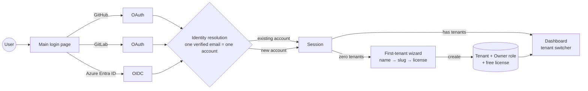
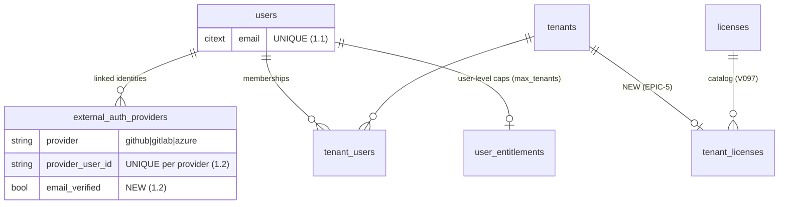
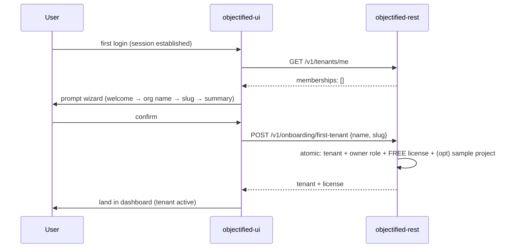
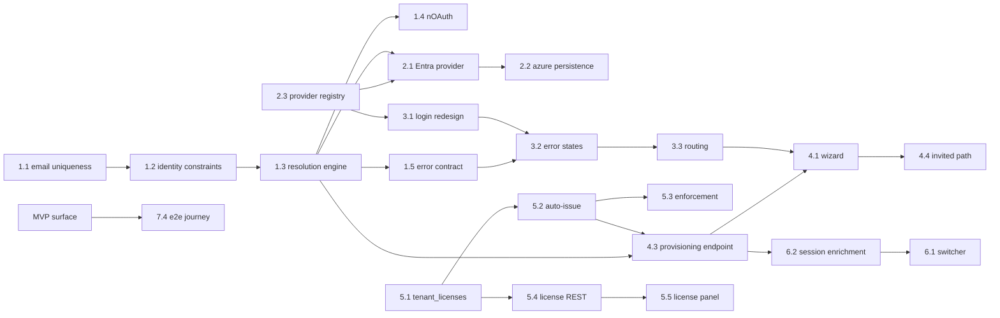

# Roadmap — OAuth Login, First-Tenant Onboarding & Lightweight Licensing

> **Status:** ✅ **Issues filed on `objectified-project/objectified` (2026-07-01)** — umbrella
> **#4184**, epics **#4185/#4192/#4198/#4204/#4210/#4217/#4222** (OLO-EPIC-1…7), and 35 issues
> **#4186–#4226** (43 total). Headings and tables below carry their `#number`; children are
> sub-issues of their epic, epics are sub-issues of umbrella #4184.
> **Issue ID prefix:** `OLO` (OAuth Login & Onboarding). Epics `OLO-EPIC-n`, issues `OLO-n.m`.
> **GitHub title format:** `objectified: [OLO-<epic>.<issue>] <title>`.
> **Labels:** `roadmap-oauth-login` (created) + reused `auth`, `tenancy`, `monetization`,
> `security`, `ui`, `rest`, `database`, `python`, `typescript`, `a11y`, `testing`, `devex`, `mvp`, `epic`.
> **Builds on existing code** — this is a *harden-and-complete* roadmap, not greenfield (see §2).

---

## 0. Source description (request, verbatim)

> Main login page for users to sign up using third party systems like GitHub, GitLab, and Azure.
> The first installment will get users the ability to login with their account information, set up
> a first tenant (it will prompt them), and set up a lightweight license for them to use
> Objectified. It will also prevent users from logging in with multiple accounts under the same
> e-mail address: one email address controls their access, but they can be members of multiple
> tenants, each of which have their own licensing structure.

---

## 1. Goal & strategy

One front door. A user arrives at the **main login page**, authenticates with **GitHub, GitLab, or
Azure (Microsoft Entra ID)**, and Objectified guarantees that **one verified email address maps to
exactly one user account** — regardless of which provider they used. On first login with no tenant
membership, the app **prompts a first-tenant onboarding wizard** (org name → slug → done), attaches
a **lightweight free-tier license to that tenant**, and lands the user in the dashboard. The same
user can later belong to many tenants, and **each tenant carries its own license**.



### 1.1 The invariant (headline requirement)

**One email address controls access.** Concretely:

1. `odb.users.email` is **unique** (case-insensitively) and is the identity anchor.
2. Signing in with *any* provider whose **verified** email matches an existing account **links** the
   provider to that account (`odb.external_auth_providers`) — it never creates a second account.
3. Providers that cannot prove the email is verified are **rejected with guidance** (this is the
   industry-standard mitigation; auto-linking on *unverified* email is an account-takeover vector —
   see Auth.js `allowDangerousEmailAccountLinking` guidance and the Entra **nOAuth** advisory, §8).
4. Membership is many-to-many: one user ↔ many tenants (`odb.tenant_users` + RBAC roles), and each
   tenant has **its own license** (new in this roadmap: tenant-scoped license attachment).

---

## 2. What already exists (reuse, don't rebuild)

| Capability | Where | State |
|---|---|---|
| NextAuth with **GitHub + GitLab + credentials** | `objectified-ui/src/app/api/auth/[...nextauth]/route.ts` | ✅ working; Azure missing |
| Login page | `objectified-ui/src/app/login/{page,LoginClient}.tsx` | ✅ exists; needs redesign + error states |
| OAuth signup flow (user→link→tenant→member→sample project) | `objectified-ui/lib/auth/oauth-signup-actions.ts`, `src/app/signup/oauth/` | ✅ exists; refactor into prompted wizard + REST |
| Provider linking | `objectified-ui/src/app/api/auth/link/[provider]/route.ts` | ✅ GitHub/GitLab; add Azure |
| Users / tenants / membership | `odb.users`, `odb.tenants`, `odb.tenant_users`, `odb.tenant_administrators` (V001) | ✅ |
| External identities | `odb.external_auth_providers` (V010) | ✅; needs uniqueness + verified-email hardening |
| Pending signup + one-time codes + user entitlements | V071 (`oauth_signup_pending`, `auth_one_time_codes`, `user_entitlements`) | ✅ |
| **License catalog + feature flags** | V097 (`licenses` free/paid/sponsor with seats JSONB, `feature_flags`, `license_feature_flags`, user/tenant overrides) | ✅ catalog exists; **no tenant-level license attachment** |
| RBAC (owner/admin/editor/viewer + permission grid) | V118–V121, `permissions.py`, `auth.py` | ✅ |
| Session discovery | `GET /v1/tenants/me` (`tenants_session_routes.py`) | ✅ |
| JWT + API-key auth to REST | `objectified-rest/src/app/auth.py` | ✅ |
| Feature gating dependency | `objectified-rest/src/app/feature_gating.py` | ✅ pattern to reuse for license guards |

**The gaps this roadmap closes:**

1. **No Azure (Entra ID) provider** (open issue **#69**) and no verified-email enforcement on any provider.
2. **The one-email invariant is not enforced** — no case-insensitive unique guarantee, no
   uniqueness constraints on provider identities, and the signIn callback doesn't implement a
   deliberate match-by-verified-email → link policy (nor block unverified emails).
3. Login page lacks the **front-door treatment**: three provider buttons, structured conflict/error
   states, post-login routing rules.
4. First-tenant setup is buried in the signup flow — it must become a **prompted wizard** that fires
   whenever an authenticated user has zero tenants (not only during OAuth signup), with an atomic
   REST provisioning endpoint.
5. Licensing is **per-user** (`user_entitlements`) but the requirement is **per-tenant** ("each of
   which have their own licensing structure") — needs a tenant→license attachment, auto-issue of
   the free tier, and seat enforcement.
6. No **tenant switcher** UX for multi-tenant membership.

---

## 3. MVP Definition

**MVP (v1) — "one front door, one identity, first tenant, free license":**

1. **Login page** with GitHub, GitLab, and Azure buttons (+ existing credentials fallback), full
   error-state coverage, post-login routing (EPIC-3).
2. **One-email invariant** enforced end-to-end: DB uniqueness (case-insensitive), provider-identity
   uniqueness, verified-email-only auto-link policy, Entra nOAuth hardening (EPIC-1).
3. **Azure / Microsoft Entra ID provider** wired through NextAuth + persistence + link flow (EPIC-2).
4. **First-tenant onboarding wizard** prompted on zero-tenant login; atomic REST provisioning
   (tenant + owner role + license); invited users skip it (EPIC-4).
5. **Lightweight licensing:** every new tenant gets the **Free** license from the V097 catalog
   automatically; seat limits enforced on member-add and tenant-create; license visible in tenant
   settings (EPIC-5: 5.1–5.5).
6. **Tenant switcher** so multi-tenant membership is usable (EPIC-6: 6.1–6.2).
7. Auth **rate limiting + config validation + e2e journey test** (EPIC-7: 7.1, 7.2, 7.4).

**v2 / later:** login/identity audit surface (ties #1607/#534/#2418), unlink/link management UI
polish, onboarding resumability/telemetry, license upgrade flow (real billing — belongs to #3484),
additional providers (Okta #241, AWS #68, Google, SAML #2445).

---

## 4. Epics overview

| Epic | Theme | Issues | MVP |
|---|---|---|---|
| OLO-EPIC-1 · #4185 | **Identity foundation & the one-email invariant** (headline) | 1.1–1.6 | ●●● |
| OLO-EPIC-2 · #4192 | Azure (Microsoft Entra ID) provider + provider parity | 2.1–2.5 | ●●● |
| OLO-EPIC-3 · #4198 | Main login page (front door) | 3.1–3.5 | ●●● |
| OLO-EPIC-4 · #4204 | First-tenant onboarding wizard | 4.1–4.5 | ●●● |
| OLO-EPIC-5 · #4210 | Lightweight licensing (tenant-scoped) | 5.1–5.6 | ●●● |
| OLO-EPIC-6 · #4217 | Multi-tenant membership UX | 6.1–6.4 | ●● |
| OLO-EPIC-7 · #4222 | Security, ops & QA hardening | 7.1–7.4 | ●● |

**Total: 7 epics, 35 issues.**

---

# Epics & issues

---

## OLO-EPIC-1 — Identity foundation & the one-email invariant · MVP  ·  **#4185**

The headline requirement. Everything else sits on top of a hard guarantee: **one verified email =
one user account**, with providers linked beneath it.



| ID | Title | Summary | Labels | Parallel | MVP | Complexity | Affected Modules |
|----|-------|---------|--------|----------|-----|-----------|------------------|
| 1.1 · #4186 | Email canonicalization + case-insensitive uniqueness | lower/trim emails; unique index; dedupe audit migration | auth,database,security,mvp | N | Y | M | objectified-db,objectified-rest |
| 1.2 · #4187 | Provider-identity uniqueness + verified-email columns | unique (provider, provider_user_id); store email + email_verified per identity | auth,database,mvp | N | Y | S | objectified-db,objectified-rest |
| 1.3 · #4188 | Account-resolution & auto-link engine | verified email match → link to existing user; never a second account; unverified → structured rejection | auth,rest,security,mvp | N | Y | L | objectified-rest,objectified-ui |
| 1.4 · #4189 | Entra ID nOAuth hardening | require verified-email evidence (xms_edov / email_verified / UPN-domain rules) before trusting Azure email claims | auth,security,mvp | Y | Y | M | objectified-ui,objectified-rest |
| 1.5 · #4190 | Structured auth error contract | stable error codes (unverified-email, account-disabled, membership-suspended, link-required) consumed by the login page | auth,rest,ui,mvp | Y | Y | S | objectified-rest,objectified-ui |
| 1.6 · #4191 | Sign-in/sign-up/link audit events | append identity events; feeds #1607 login/logout events + #534/#2418 login history | auth,database,monitoring | Y | N | M | objectified-rest,objectified-db |

### OLO-1.1 — Email canonicalization + case-insensitive uniqueness · #4186
- **Problem Statement.** `odb.users.email` (V001) has no case-insensitive uniqueness guarantee, so
  `Ada@Example.com` and `ada@example.com` can become two accounts — the exact failure the request
  forbids ("one email address controls their access").
- **Solution / Scope.** Migration (**V140+**): normalize existing rows (lower/trim), detect
  duplicates into an audit table for manual resolution (do **not** auto-merge), then add a unique
  index on `lower(email)` (or convert to `citext`). REST/DB layer normalizes on every read/write
  path (`database.py` helpers, signup actions). Document the merge runbook for any flagged dupes.
- **Acceptance Criteria.** Duplicate-cased signups are impossible at the DB level; existing dupes
  are surfaced, not silently merged; all lookups are case-insensitive.
- **Parallelism / Dependencies.** Root of EPIC-1. Blocks 1.3.
- **Technical Stack.** PostgreSQL/Flyway (objectified-db), Python (objectified-rest).

### OLO-1.2 — Provider-identity uniqueness + verified-email columns · #4187
- **Problem Statement.** `odb.external_auth_providers` (V010) lacks uniqueness constraints, so the
  same GitHub identity could be linked to two users (or twice to one), and it doesn't record
  whether the provider's email claim was verified.
- **Solution / Scope.** Migration: unique `(provider, provider_user_id)`; unique
  `(user_id, provider)` (one identity per provider per user, matching the existing link route's
  assumption); add `email`, `email_verified boolean`, `last_login_at` columns; backfill from stored
  profile JSON where possible. Extend `azure` into the provider value set.
- **Acceptance Criteria.** Constraints enforced; link flow rejects an identity already bound to a
  different user with error code from 1.5; columns populated on every OAuth sign-in.
- **Parallelism / Dependencies.** After 1.1 (same migration train). Blocks 1.3, 2.2.
- **Technical Stack.** PostgreSQL/Flyway, Python.

### OLO-1.3 — Account-resolution & auto-link engine · #4188
- **Problem Statement.** The NextAuth `signIn` callback has ad-hoc linking; there is no single,
  tested policy that guarantees the invariant across GitHub/GitLab/Azure and credentials.
- **Solution / Scope.** One server-side resolution function (shared by NextAuth callbacks and the
  REST signup path) implementing, in order: (a) known `(provider, provider_user_id)` → sign in that
  user; (b) else **verified** provider email matches an existing user → auto-link identity + sign
  in (industry-accepted when the provider verifies emails — the Auth.js
  `allowDangerousEmailAccountLinking` guidance; we implement the equivalent explicitly in our
  callback so the policy is provider-gated and audited); (c) else verified email, no user → create
  user + identity (route to onboarding); (d) **unverified email → reject** with `unverified-email`
  (1.5). Also: while signed in, "link another provider" attaches to the session user regardless of
  that provider's email (explicit user intent), matching the existing link route.
- **Acceptance Criteria.** Property-tested matrix over {new/known identity} × {new/known email} ×
  {verified/unverified} × {signed-in link}; a second account can never be created for an existing
  verified email; unverified emails never authenticate.
- **Parallelism / Dependencies.** After 1.1/1.2. Blocks 2.1 sign-in path, 3.2, 4.x. The heart of the epic.
- **Technical Stack.** TypeScript (NextAuth callbacks), Python (REST-side resolution for parity), pytest/vitest.

### OLO-1.4 — Entra ID nOAuth hardening · #4189
- **Problem Statement.** Entra ID's `email` claim can be attacker-controlled in multi-tenant app
  registrations (the published **nOAuth** account-takeover pattern); trusting it for auto-link
  breaks the invariant.
- **Solution / Scope.** For the `azure` provider only: treat email as verified **only** when the
  token carries acceptable evidence (`xms_edov` optional claim enabled on the app registration,
  and/or `email_verified`, and/or email == UPN on a verified domain); otherwise classify as
  unverified (→ 1.3(d)). Request the optional claim in the app-registration docs (7.2); unit-test
  claim matrices.
- **Acceptance Criteria.** Forged-email token fixtures are rejected; legitimate Entra sign-ins with
  the optional claim link correctly.
- **Parallelism / Dependencies.** After 1.3 policy seam; pairs with 2.1. Parallel with 1.5.
- **Technical Stack.** TypeScript (provider profile callback), test fixtures.

### OLO-1.5 — Structured auth error contract · #4190
- **Problem Statement.** Login failures currently surface as generic NextAuth errors; the login
  page can't tell "unverified email" from "account disabled" from "membership suspended."
- **Solution / Scope.** A small enum of stable error codes emitted by 1.3/1.4 and REST
  (`unverified-email`, `identity-linked-elsewhere`, `account-disabled`, `membership-suspended`,
  `provider-not-configured`, `signup-disabled`), passed via NextAuth error redirect params;
  documented copy for each (consumed by 3.2).
- **Acceptance Criteria.** Each code has a test forcing it; login page can render distinct guidance
  per code; codes are stable/documented.
- **Parallelism / Dependencies.** After 1.3 skeleton. Blocks 3.2.
- **Technical Stack.** TypeScript, Python.

### OLO-1.6 — Sign-in/sign-up/link audit events *(v2)* · #4191
- **Problem Statement.** No durable record of who signed in/up, with which provider, or which
  identities were linked — needed for support, security review, and the existing asks (#1607,
  #534, #2418 login history).
- **Solution / Scope.** Append-only `odb.auth_events` (event type, user, provider, ip/user-agent
  hash, outcome, error code) written best-effort from 1.3 outcomes; retention policy; feeds the
  Profile roadmap's login-history surface later. Reuse the `access_audit` (V121) pattern.
- **Acceptance Criteria.** Events written for success/failure/link paths; queryable per user;
  documented retention.
- **Parallelism / Dependencies.** After 1.3. Independent of UI epics.
- **Technical Stack.** PostgreSQL/Flyway, Python.

---

## OLO-EPIC-2 — Azure (Microsoft Entra ID) provider + provider parity · MVP  ·  **#4192**

Implements open issue **#69 (Enable Azure Login)** within this architecture; brings GitHub/GitLab
up to the same verified-email standard.

| ID | Title | Summary | Labels | Parallel | MVP | Complexity | Affected Modules |
|----|-------|---------|--------|----------|-----|-----------|------------------|
| 2.1 · #4193 | Entra ID provider in NextAuth | microsoft-entra-id provider (OIDC, PKCE), env config, profile→identity mapping | auth,ui,typescript,mvp | N | Y | M | objectified-ui |
| 2.2 · #4194 | Azure identity persistence | extend V010 storage + link route for azure; token/claims storage | auth,database,rest,mvp | N | Y | S | objectified-db,objectified-rest,objectified-ui |
| 2.3 · #4195 | Provider registry & deploy config | single config surface listing enabled providers; login page + link UI read it | auth,devex,infrastructure,mvp | Y | Y | S | objectified-ui |
| 2.4 · #4196 | Link/unlink Azure in profile settings | extend existing link flow + a manage-identities panel (unlink guarded: never remove last sign-in method) | auth,ui,profile | Y | N | M | objectified-ui,objectified-rest |
| 2.5 · #4197 | GitHub/GitLab verified-email parity pass | request user:email / read_user scopes; use provider verified-email endpoints; wire into 1.3 | auth,ui,security,mvp | Y | Y | S | objectified-ui |

### OLO-2.1 — Entra ID provider in NextAuth · #4193
- **Problem Statement.** Azure login (#69) is a first-installment requirement and absent today.
- **Solution / Scope.** Add the Microsoft Entra ID provider (OIDC authorization-code + PKCE) to the
  NextAuth config beside GitHub/GitLab; env: `AZURE_AD_CLIENT_ID`/`SECRET`/`TENANT` (`common` for
  multi-tenant); profile callback maps `oid` → `provider_user_id` and defers email trust to 1.4.
  Follow the same session/jwt callback shape already in `[...nextauth]/route.ts`.
- **Acceptance Criteria.** Sign-in round-trip works against a test app registration; identity lands
  in `external_auth_providers` as `azure`; 1.4 gating applied.
- **Parallelism / Dependencies.** After 1.3/1.4 seams exist. Blocks 2.2/2.4.
- **Technical Stack.** Next.js/NextAuth (TypeScript).

*(2.2 persists the azure identity + tokens via the hardened V010 schema and extends
`api/auth/link/[provider]` to accept `azure`. 2.3 introduces one provider-registry module — id,
label, icon, enabled-from-env — consumed by the login page (3.1), the link panel (2.4), and docs
(7.2), so adding Okta/#241, AWS/#68, Google later is config, not code archaeology. 2.5 ensures
GitHub (`user:email` scope + verified primary email from the emails API when the profile email is
null) and GitLab (`read_user`) reliably yield a verified email for 1.3.)*

---

## OLO-EPIC-3 — Main login page (front door) · MVP  ·  **#4198**

```
┌──────────────────────────────────────────────┐
│                Objectified                   │
│        Design. Version. Publish APIs.        │
│                                              │
│   ┌──────────────────────────────────────┐   │
│   │   Continue with GitHub               │   │
│   │   Continue with GitLab               │   │
│   │   Continue with Microsoft            │   │
│   └──────────────────────────────────────┘   │
│   ──────────────  or  ──────────────         │
│   email / password (existing credentials)    │
│                                              │
│   ⚠ error banner (code-driven copy, 3.2)     │
└──────────────────────────────────────────────┘
```

| ID | Title | Summary | Labels | Parallel | MVP | Complexity | Affected Modules |
|----|-------|---------|--------|----------|-----|-----------|------------------|
| 3.1 · #4199 | Login page redesign (3 providers + credentials) | provider buttons from registry (2.3), brand treatment per design language | auth,ui,typescript,mvp | N | Y | M | objectified-ui |
| 3.2 · #4200 | Error & edge-state rendering | code-driven copy for every 1.5 error; retry/help affordances | auth,ui,mvp | N | Y | S | objectified-ui |
| 3.3 · #4201 | Post-login routing rules | zero tenants → onboarding wizard; else last-active/default tenant dashboard (ties #541/#2436) | auth,ui,mvp | Y | Y | S | objectified-ui |
| 3.4 · #4202 | Session lifecycle hygiene | logout everywhere the header offers it, expiry handling, callbackUrl allowlist (no open redirect) | auth,security,ui,mvp | Y | Y | S | objectified-ui |
| 3.5 · #4203 | Login a11y + visual tests | keyboard/screen-reader pass, axe checks, visual snapshots | auth,ui,a11y,testing | Y | N | S | objectified-ui |

### OLO-3.1 — Login page redesign · #4199
- **Problem Statement.** The existing `login/LoginClient.tsx` predates the provider set and the
  front-door role; it must present GitHub/GitLab/Microsoft as the primary path with credentials as
  fallback.
- **Solution / Scope.** Rebuild the page on the provider registry (2.3): one button per enabled
  provider (brand icon + "Continue with …"), credentials form collapsed beneath an "or" divider,
  loading/disabled states during redirect, "Beta" treatment hook (#88 heritage). Server component
  keeps the existing already-authenticated redirect.
- **Acceptance Criteria.** All enabled providers render (and only those); credentials flow
  unchanged; page matches the dashboard design language; redirect-in-progress state visible.
- **Parallelism / Dependencies.** After 2.3. Blocks 3.2/3.5.
- **Technical Stack.** Next.js, Tailwind (existing tokens).

*(3.2 renders 1.5's codes with distinct, actionable copy — e.g. `unverified-email`: "Verify your
email with GitHub, then try again". 3.3 implements the routing contract used by EPIC-4: the wizard
is *prompted*, not navigated to. 3.4 audits `callbackUrl` handling against an allowlist and expiry
behavior — pairs with 7.3.)*

---

## OLO-EPIC-4 — First-tenant onboarding wizard · MVP  ·  **#4204**

"It will prompt them": any authenticated user with **zero tenant memberships** gets the wizard —
whether they arrived via fresh OAuth signup, credentials, or an old orphaned account.



| ID | Title | Summary | Labels | Parallel | MVP | Complexity | Affected Modules |
|----|-------|---------|--------|----------|-----|-----------|------------------|
| 4.1 · #4205 | Onboarding wizard UI shell | zero-tenant prompt; steps welcome → tenant → summary; skip-not-allowed for zero-tenant users | auth,tenancy,ui,typescript,mvp | N | Y | M | objectified-ui |
| 4.2 · #4206 | Tenant-create step (name, slug, availability) | live slug check (reuse HEAD /v1/tenants/{slug}), validation, suggested slug from org name | tenancy,ui,mvp | N | Y | S | objectified-ui |
| 4.3 · #4207 | REST: atomic first-tenant provisioning endpoint | one transaction: tenant + owner role assignment + free-license attach + optional sample project | tenancy,rest,python,mvp | N | Y | M | objectified-rest,objectified-db |
| 4.4 · #4208 | Invited-user path | pending/active membership exists → skip wizard, land in that tenant (V121 status-aware) | tenancy,ui,rest,mvp | Y | Y | S | objectified-ui,objectified-rest |
| 4.5 · #4209 | Onboarding resumability + telemetry | persist wizard state (reuse oauth_signup_pending pattern), abandon/resume, funnel metrics | tenancy,ui,monitoring | Y | N | M | objectified-ui,objectified-rest |

### OLO-4.3 — REST: atomic first-tenant provisioning endpoint · #4207
- **Problem Statement.** Tenant provisioning currently lives in UI server actions
  (`oauth-signup-actions.ts`) — multiple sequential DB writes with no transaction, invoked only
  from the OAuth signup path. The wizard (and future CLI/API onboarding) needs one atomic,
  authorization-checked REST operation.
- **Solution / Scope.** `POST /v1/onboarding/first-tenant` (session-scoped, `validate_session_credentials`):
  in one transaction create tenant, add caller to `tenant_users` (active) + `tenant_user_roles`
  (owner, V118 seed), attach the **Free** license (5.1/5.2), optionally provision the sample
  project (reuse existing helper). Enforce `user_entitlements.max_tenants` (5.3). Refactor
  `completeOAuthSignup()` to call this endpoint (or the shared service) so there is exactly one
  provisioning path.
- **Acceptance Criteria.** All-or-nothing on failure; second call for a user with a tenant returns
  409 unless under their max-tenants cap; OAuth signup path now flows through the same code;
  pytest coverage green.
- **Parallelism / Dependencies.** After 1.3, 5.1/5.2 model. Blocks 4.1 completion, 4.4.
- **Technical Stack.** FastAPI, PostgreSQL.

*(4.1/4.2 are the prompted UI per the mock above — the prompt is a route guard driven by 3.3, not a
dismissible toast. 4.4 handles the "invited before first login" case: membership rows already
present → no wizard. 4.5 is v2 polish.)*

---

## OLO-EPIC-5 — Lightweight licensing (tenant-scoped) · MVP  ·  **#4210**

The V097 catalog (Free/Paid/Sponsor + seats JSONB + feature flags) exists but nothing attaches a
license **to a tenant** — while the requirement is explicit: tenants "each … have their own
licensing structure." User-level `user_entitlements` (max_tenants) stays for user-scoped caps.

| ID | Title | Summary | Labels | Parallel | MVP | Complexity | Affected Modules |
|----|-------|---------|--------|----------|-----|-----------|------------------|
| 5.1 · #4211 | Tenant→license attachment model | `odb.tenant_licenses` (tenant_id unique, license_id, issued_at, issued_by, notes); V140+ | monetization,tenancy,database,mvp | N | Y | S | objectified-db |
| 5.2 · #4212 | Auto-issue Free license on tenant creation | provisioning (4.3) + any tenant-create path attach Free by default; backfill existing tenants | monetization,rest,python,mvp | N | Y | S | objectified-rest,objectified-db |
| 5.3 · #4213 | License enforcement guards | member-add/invite blocked over max_users_per_tenant; tenant-create over max_tenants; structured 403s | monetization,tenancy,rest,security,mvp | N | Y | M | objectified-rest |
| 5.4 · #4214 | License REST surface | `GET /v1/tenants/{slug}/license` (plan, seats used/max, features via V097 composition) | monetization,rest,mvp | Y | Y | S | objectified-rest |
| 5.5 · #4215 | License panel in tenant settings | plan card, seat usage meter, feature list, upgrade CTA stub (no billing) | monetization,ui,typescript,mvp | Y | Y | M | objectified-ui |
| 5.6 · #4216 | Reconcile with #3484 / #64 | align this model with the Platform Foundations & Licensing epic; close/absorb #64 (table exists since V097) | monetization,documentation | Y | N | S | docs |

### OLO-5.1 — Tenant→license attachment model · #4211
- **Problem Statement.** `odb.licenses` (V097) is a catalog with per-license seat shapes
  (`max_tenants`, `max_users_per_tenant`) but no row says *which tenant holds which license*;
  `user_entitlements.license_id` binds licenses to users, which cannot express per-tenant licensing.
- **Solution / Scope.** Migration V140+: `odb.tenant_licenses` (unique tenant_id → one active
  license per tenant; license_id FK to V097 catalog; issued_at/issued_by/notes for provenance).
  Keep `user_entitlements` for user caps (max_tenants); document the split: **user entitlement =
  how many tenants you may create; tenant license = what each tenant may do**. Composition with
  `tenant_feature_flags`/`license_feature_flags` unchanged.
- **Acceptance Criteria.** Migration applies cleanly; one active license per tenant enforced;
  ER docs updated.
- **Parallelism / Dependencies.** Root of EPIC-5. Blocks 5.2–5.5. Coordinate with #3484.
- **Technical Stack.** PostgreSQL/Flyway.

### OLO-5.3 — License enforcement guards · #4213
- **Problem Statement.** Seat limits exist as JSON in the catalog but nothing enforces them, so the
  "lightweight license" would be decorative.
- **Solution / Scope.** A `require_license_capacity()` dependency (mirror `feature_gating.py`):
  member-add/invite routes check active-member count < `max_users_per_tenant` of the tenant's
  license; 4.3 checks the caller's tenant count < `user_entitlements.max_tenants` (fallback to Free
  defaults). Structured 403 payload (code `license-seats-exhausted` / `tenant-cap-reached`) so UI
  (5.5) and wizard can render upgrade guidance. Suspended members (V121) don't count against seats.
- **Acceptance Criteria.** Adding a member beyond Free's 5 seats → 403 with code; creating a second
  tenant on Free (max 1) → 403 with code; counts correct under soft-delete/suspension; pytest green.
- **Parallelism / Dependencies.** After 5.1/5.2. Pairs with 6.3.
- **Technical Stack.** FastAPI, PostgreSQL.

*(5.2 backfills Free onto existing tenants so enforcement can't strand them; 5.4/5.5 read
composition = license features ∪ tenant overrides (V097). 5.6 is a documentation/reconciliation
ticket: #3484 owns paid upgrades/billing; this epic deliberately ships only the free tier +
enforcement seams.)*

---

## OLO-EPIC-6 — Multi-tenant membership UX  ·  **#4217**

One account, many tenants — now make it navigable.

| ID | Title | Summary | Labels | Parallel | MVP | Complexity | Affected Modules |
|----|-------|---------|--------|----------|-----|-----------|------------------|
| 6.1 · #4218 | Tenant switcher | dashboard header menu listing memberships (/v1/tenants/me), active-tenant switch, per-tenant role badge | tenancy,ui,typescript,mvp | N | Y | M | objectified-ui |
| 6.2 · #4219 | Session tenant context enrichment | memberships include role + license tier + status in one round-trip | tenancy,rest,mvp | N | Y | S | objectified-rest |
| 6.3 · #4220 | Member management ↔ license alignment | member/invite screens surface seat usage + 5.3 errors gracefully | tenancy,monetization,ui | Y | N | S | objectified-ui |
| 6.4 · #4221 | Multi-tenant e2e fixtures & tests | seeded user in 3 tenants with distinct roles/licenses; switcher + guard coverage | tenancy,testing | Y | N | S | objectified-ui,objectified-rest |

*(6.1/6.2 are MVP because "members of multiple tenants" is in the first installment; 6.3/6.4
harden it. 6.2 extends `tenants_session_routes.py` to join role (V119) + license (5.1) so the
switcher renders without N+1 calls.)*

---

## OLO-EPIC-7 — Security, ops & QA hardening  ·  **#4222**

| ID | Title | Summary | Labels | Parallel | MVP | Complexity | Affected Modules |
|----|-------|---------|--------|----------|-----|-----------|------------------|
| 7.1 · #4223 | Auth endpoint rate limiting | throttle credentials sign-in, signup completion, link routes (reuse existing rate-limit middleware) | auth,security,rest,mvp | Y | Y | S | objectified-rest,objectified-ui |
| 7.2 · #4224 | Provider setup & secrets docs + config validation | GitHub/GitLab/Entra app-registration guides (incl. xms_edov claim); boot-time env validation with actionable errors | auth,devex,documentation,mvp | Y | Y | S | docs,objectified-ui |
| 7.3 · #4225 | Auth threat-model checklist review | state/PKCE, redirect allowlist, session fixation, token storage in V010, CSRF on link routes | auth,security | Y | N | M | objectified-ui,objectified-rest |
| 7.4 · #4226 | End-to-end journey test | Playwright: login (each provider mocked) → invariant checks → wizard → license → switcher; pytest for REST paths | auth,testing,mvp | N | Y | M | objectified-ui,objectified-rest |

---

## 5. Work order (dependency-driven)



**Build order:**

1. **Foundation (serial):** OLO-1.1 → 1.2 → 1.3 (the invariant), with 2.3 (provider registry) and
   5.1 (tenant_licenses) in parallel.
2. **Providers + policy:** 2.1 Entra (+ 1.4 nOAuth gating) ‖ 2.5 GitHub/GitLab parity ‖ 1.5 error
   contract ‖ 5.2 auto-issue + backfill.
3. **Front door:** 3.1 → 3.2 → 3.3 ‖ 3.4 session hygiene ‖ 7.1 rate limits ‖ 7.2 docs/config.
4. **Onboarding + licensing:** 4.3 provisioning endpoint → 4.1/4.2 wizard → 4.4 invited path ‖
   5.3 enforcement → 5.4 → 5.5 license panel.
5. **Multi-tenant UX:** 6.2 → 6.1 switcher.
6. **MVP gate:** 7.4 e2e journey green. Then v2: 1.6 audit events, 2.4 identity management panel,
   3.5 a11y pass, 4.5 resumability, 5.6 reconciliation docs, 6.3/6.4, 7.3 threat review.

---

## 6. Cross-cutting risks & decisions

1. **The invariant is a security boundary, not a UX nicety.** Auto-linking is safe *only* on
   verified emails from trusted providers; Entra requires the nOAuth mitigations (1.4). Unverified
   → reject, never merge.
2. **Do not auto-merge existing duplicate emails** (1.1) — surface them; merging accounts silently
   can hand one user another's tenants.
3. **Licensing split:** user entitlement (may create N tenants) vs tenant license (tenant may have
   N members + features). Keeping both avoids breaking V071/V097 consumers.
4. **One provisioning path** (4.3): the current UI-server-action flow must be refactored onto the
   REST endpoint, or the wizard and OAuth signup will drift.
5. **Backfill before enforcement** (5.2 before 5.3), or existing tenants hit 403s.
6. **Reconcile, don't duplicate:** #69 (Azure) is *implemented by* OLO-2.x; #64's license table
   already exists (V097) — close/absorb via 5.6; #3484 owns paid plans/billing; #1607/#534/#2418
   consume 1.6's events; #241 Okta / #68 AWS / #2445 SAML / Google become provider-registry
   config-plus-issue follow-ups after 2.3.
7. **Credentials login stays** (existing users, dev seeds) but is visually secondary on the new page.

---

## 7. Existing GitHub issues to reconcile (link, don't duplicate)

- **#69 Enable Azure Login** (open, mvp) — implemented by OLO-EPIC-2; link as related/closed-by.
- **#68 Enable AWS Login** · **#241 Enable Okta Login** · **#1701/#1703/#1705 SSO Okta/Azure/Cognito**
  · **#2445 SAML 2.0** — future providers; unblocked by the provider registry (OLO-2.3); keep open.
- **#3484 [Epic] Platform Foundations & Licensing** — parent for paid licensing/billing; OLO-EPIC-5
  ships the free tier + enforcement seams beneath it.
- **#64 Add a license table** (open, mvp) — superseded by V097 catalog + OLO-5.1; close via 5.6.
- **#36 Implement Sign Up** · **#66 GitLab/GitHub free signup** · **#41 SSO account link** ·
  **#58 GitLab login** (all closed) — prior art this roadmap hardens.
- **#1607 Login/Logout Events** · **#534 login history table** · **#2418 [Profile 1.6] Login
  History** · **#514/#1626 last-login widgets** — consumers of OLO-1.6 audit events.
- **#541 / #2436 default landing page after login** — satisfied/extended by OLO-3.3 routing rules.
- **#3194 CLI PKCE login** (closed) — CLI auth already aligned; 4.3's REST endpoint keeps CLI
  onboarding possible later.

---

## 8. Sources

- Auth.js / NextAuth OAuth provider options & `allowDangerousEmailAccountLinking` —
  https://next-auth.js.org/configuration/providers/oauth
- NextAuth discussion: multiple accounts with the same email —
  https://github.com/nextauthjs/next-auth/discussions/2808
- NextAuth `OAuthAccountNotLinked` behavior — https://github.com/nextauthjs/next-auth/issues/9992
- Microsoft Entra ID: claims validation & the `xms_edov` optional claim (nOAuth mitigation) —
  https://learn.microsoft.com/en-us/entra/identity-platform/claims-validation
- Descope nOAuth disclosure (email-claim account takeover in multi-tenant Entra apps) —
  https://www.descope.com/blog/post/noauth
- Microsoft Entra ID OIDC — https://learn.microsoft.com/en-us/entra/identity-platform/v2-protocols-oidc
- GitHub OAuth scopes (`user:email`, verified emails API) —
  https://docs.github.com/en/apps/oauth-apps/building-oauth-apps/scopes-for-oauth-apps
- GitLab OAuth (`read_user`) — https://docs.gitlab.com/ee/api/oauth2.html
- In-repo: `objectified-ui/src/app/api/auth/[...nextauth]/route.ts`,
  `objectified-ui/lib/auth/oauth-signup-actions.ts`, `objectified-rest/src/app/auth.py`,
  `objectified-rest/src/app/permissions.py`, `objectified-rest/src/app/feature_gating.py`,
  `objectified-db` V001/V010/V071/V097/V118–V121 (latest migration V139 → new work starts **V140**).
