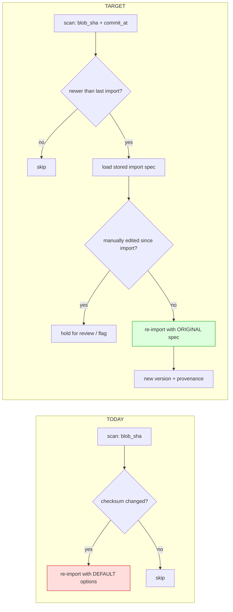
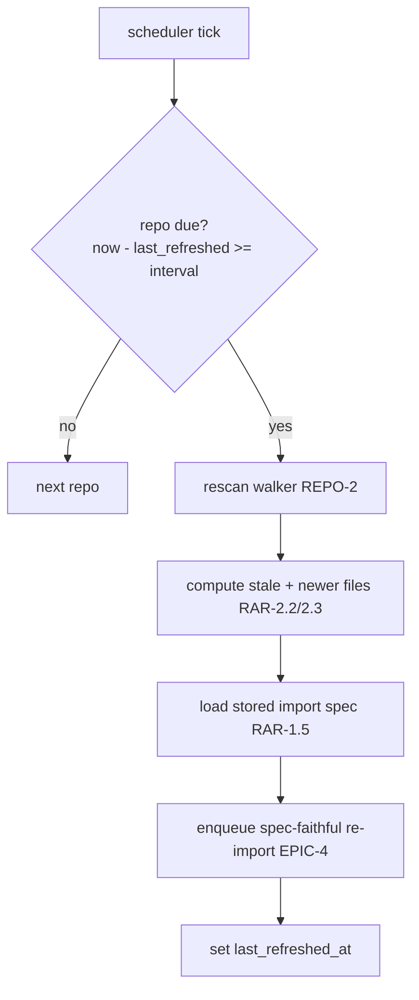
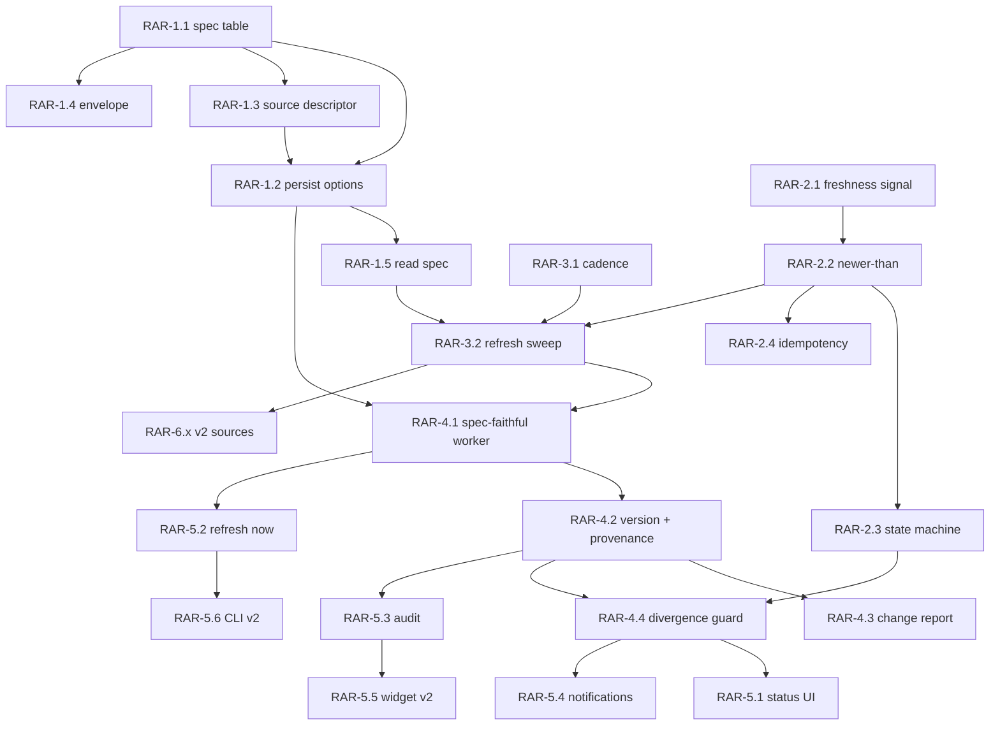

# Roadmap — Repository Auto-Refresh & Spec-Faithful Re-Import

## 0. Source description (verbatim request)

> Repositories need to have a way to automatically refresh and renew imports of imported files that
> were initially imported, following the same import specifications requested from the user at the
> time the file was imported. This system needs to refresh repositories after a few minutes, then
> re-import files that are newer than the imported files in the system. Create a roadmap to cover
> this functionality, most of which should be v1/MVP candidates.

This roadmap extends the **existing** repository platform (`REPO-EPIC-4` Polling/Webhooks/Sync and
`REPO-EPIC-E` / `REPO-12` Auto-import pipeline) with the one capability they do not yet provide:
**re-importing a changed repository file using the exact import specification the user chose the
first time, gated on the file being genuinely newer.** New work is namespaced **`RAR-*`**
(Repository Auto-Refresh) to avoid collision with existing `REPO-*` IDs.

---

## 1. What already exists (do **not** rebuild)

A code + issue walk confirms most of the *plumbing* is shipped. The roadmap builds on it.

| Capability | Where | Status |
|------------|-------|--------|
| Repository registration / providers (GitHub, GitLab, Bitbucket) | `REPO-EPIC-1` | shipped |
| Repository scanner + file index (`odb.tenant_repository_files`, `blob_sha`) | `REPO-EPIC-2`, `repository_file_scan.py` | shipped |
| Poll scheduler (cron-like) + commit-SHA change detection | `REPO-4.1` #2779, `REPO-4.2` #2780 | shipped |
| Failure backoff + auto-pause | `REPO-4.5` #2783 | shipped |
| Checksum-keyed idempotent re-import (`content_checksum`) | `REPO-8.3` #2933 | shipped |
| Per-file `import_enabled` / `auto_import_enabled` flags | `REPO-9.1/9.2` #2931/#2932 | shipped |
| Auto-import worker + 3-filter dispatch (selection → mode → checksum) | `REPO-12.1` #2935 | shipped |
| Auto version creation with provenance, scan-report artifact, notifications, audit linking | `REPO-12.3–12.6` | shipped |
| "Import Now" one-shot, Specs tab, bulk apply | `REPO-9.4/9.5/9.7` | shipped |
| Import audit trail (`odb.tenant_repository_imports`) | `repository-import-metrics.ts` | shipped |

### The four concrete gaps this roadmap closes

1. **Import options are not persisted.** `SpecImportOptions` (naming convention, prefix/suffix,
   `type_mapping`, `required_overrides`, `description_overrides`, `generate_examples`,
   project/version mapping, conflict/skip flags) is accepted at import time
   (`objectified-rest/src/app/models.py`, `rest-spec-import-worker.ts:63-93`) but **no column stores
   it**. `odb.tenant_repository_imports` has `(repository_id, branch, path, blob_sha, project_id,
   version_id, imported_by, created_at)` — no options. So an auto-import re-runs with **defaults**,
   not the user's original spec. *(This is the heart of the request.)*
2. **Change detection is checksum-only, not "newer-than".** Re-import fires on
   `content_checksum != last_imported_checksum`. There is no timestamp/commit-recency comparison, so
   a revert to older content (different checksum) would re-import a *stale* file. The request
   explicitly asks to "re-import files that are **newer** than the imported files in the system."
3. **Refresh cadence is hardcoded.** The scan sweep is `await asyncio.sleep(5)`
   (`objectified-rest/src/app/main.py:179`) and not configurable per-repo; the "every few minutes"
   refresh tier is unconfigured.
4. **No manual-edit safety on the auto path.** Nothing checks whether a version was hand-edited in
   Objectified after the original import before an auto-refresh overwrites it.



---

## 2. MVP definition (v1)

The v1 slice makes auto-refresh **spec-faithful, freshness-gated, and safe**:

- **Capture & persist** the full import specification (options + source descriptor + freshness
  signal) at every import — `RAR-1.*`.
- **Newer-than gating**: a file re-imports only when its source commit is newer than the last
  imported commit, with checksum idempotency to suppress no-op churn — `RAR-2.*`.
- **Configurable few-minute cadence**: replace the hardcoded sweep with a per-repo refresh interval
  (default ~5 min, enforced minimum) — `RAR-3.1/3.2/3.3`.
- **Spec-faithful execution**: the auto-refresh worker re-applies the stored spec, creates a new
  provenance-linked version, and produces a change report — `RAR-4.1/4.2/4.3`.
- **Manual-edit safety**: detect divergence and hold rather than clobber — `RAR-4.4`.
- **Visibility & control**: per-file refresh status, "Refresh Now", refresh audit, notifications —
  `RAR-5.1/5.2/5.3/5.4`.

v2 covers advanced cadence controls, non-repository sources (URL/upload), webhook-instant refresh,
multi-branch policy, and CLI — `RAR-3.4/3.5`, `RAR-5.5/5.6`, `RAR-6.*`.

---

## 3. Epics overview

| Epic | Issue | Theme | MVP weight |
|------|-------|-------|------------|
| `RAR-EPIC-1` | #3506 | Import Specification Capture & Persistence | MVP |
| `RAR-EPIC-2` | #3507 | Freshness Detection & "Newer-Than" Gating | MVP |
| `RAR-EPIC-3` | #3508 | Auto-Refresh Scheduler & Cadence | MVP (3.4/3.5 v2) |
| `RAR-EPIC-4` | #3509 | Spec-Faithful Re-Import Execution | MVP |
| `RAR-EPIC-5` | #3510 | Observability, Control & Notifications | MVP (5.5/5.6 v2) |
| `RAR-EPIC-6` | #3511 | Non-Repository Sources & Advanced (v2) | v2 |

Issue title format: `Repository: [<epic>.<issue>] <title>` (roadmap ID `RAR-<epic>.<issue>`).
Complexity: **S** ≤ ~1 day, **M** ~2–3 days, **L** ~1 week, **XL** multi-week.

### Issue index (created in GitHub)

All issues filed under `objectified-project/objectified`. Children are native **sub-issues** of their
epic. Use this table to resolve any `RAR-*` reference below to its issue number.

| ID | Issue | ID | Issue | ID | Issue |
|----|-------|----|-------|----|-------|
| RAR-EPIC-1 | #3506 | RAR-EPIC-2 | #3507 | RAR-EPIC-3 | #3508 |
| RAR-EPIC-4 | #3509 | RAR-EPIC-5 | #3510 | RAR-EPIC-6 | #3511 |
| ~~RAR-1.1~~ ✅ | ~~#3512~~ | ~~RAR-1.2~~ ✅ | ~~#3513~~ | ~~RAR-1.3~~ ✅ | ~~#3514~~ |
| ~~RAR-1.4~~ ✅ | ~~#3515~~ | ~~RAR-1.5~~ ✅ | ~~#3516~~ | RAR-1.6 | #3517 |
| ~~RAR-2.1~~ ✅ | ~~#3518~~ | ~~RAR-2.2~~ ✅ | ~~#3519~~ | ~~RAR-2.3~~ ✅ | ~~#3520~~ |
| ~~RAR-2.4~~ ✅ | ~~#3521~~ | ~~RAR-3.1~~ ✅ | ~~#3522~~ | ~~RAR-3.2~~ ✅ | ~~#3523~~ |
| ~~RAR-3.3~~ ✅ | ~~#3524~~ | RAR-3.4 | #3525 | RAR-3.5 | #3526 |
| ~~RAR-4.1~~ ✅ | ~~#3527~~ | RAR-4.2 | #3528 | RAR-4.3 | #3529 |
| RAR-4.4 | #3530 | RAR-4.5 | #3531 | RAR-5.1 | #3532 |
| RAR-5.2 | #3533 | RAR-5.3 | #3534 | RAR-5.4 | #3535 |
| RAR-5.5 | #3536 | RAR-5.6 | #3537 | RAR-6.1 | #3538 |
| RAR-6.2 | #3539 | RAR-6.3 | #3540 | RAR-6.4 | #3541 |
| RAR-6.5 | #3542 | | | | |

---

## RAR-EPIC-1 — Import Specification Capture & Persistence

Persist exactly what the user asked for at import time so it can be replayed.

| ID | Title | Summary | Labels | Parallel | MVP | Cmplx | Modules |
|----|-------|---------|--------|----------|-----|-------|---------|
| ~~RAR-1.1~~ ✅ **Done** (#3512) | `repository_import_spec` data model | New table storing the full import spec keyed to an imported file | `enhancement`,`mvp`,`import`,`repository`,`data-model` | N | Y | M | objectified-db, objectified-rest |
| ~~RAR-1.2~~ ✅ **Done** (#3513) | Persist `SpecImportOptions` at import time | Write the options blob on every successful import (manual + auto) | `enhancement`,`mvp`,`import`,`repository`,`rest` | N | Y | M | objectified-rest, objectified-ui |
| ~~RAR-1.3~~ ✅ **Done** (#3514) | Capture source descriptor | Store kind, filename, `--format` override, content-type used | `enhancement`,`mvp`,`import`,`repository` | Y | Y | S | objectified-ui |
| ~~RAR-1.4~~ ✅ **Done** (#3515) | Versioned spec envelope (`spec_schema_version`) | Forward-compatible envelope so stored specs survive option changes | `enhancement`,`mvp`,`import`,`data-model` | Y | Y | S | objectified-rest |
| ~~RAR-1.5~~ ✅ **Done** (#3516) | REST: read stored import spec | `GET …/repository-imports/{id}/spec` returns the captured spec | `enhancement`,`mvp`,`import`,`rest` | Y | Y | S | objectified-rest |
| RAR-1.6 | Backfill best-effort specs for historical imports | Migration seeds a default spec for pre-existing imports | `enhancement`,`import`,`repository`,`data-model` | Y | N | M | objectified-db, objectified-rest |

### RAR-1.1 — `repository_import_spec` data model

**Problem.** `SpecImportOptions` is accepted and applied but never stored
(`odb.tenant_repository_imports` has no options column), so re-imports cannot honor the original
request.

**Solution / scope.** Add a table keyed to the imported file lineage capturing the full spec. Source:
the `SpecImportOptions` model in `objectified-rest/src/app/models.py` and the worker mapping in
`objectified-ui/scripts/rest-spec-import-worker.ts:63-93`.

```
┌────────────────────────────────────────────────────────────┐
│ odb.repository_import_spec                                 │
├────────────────────────────────────────────────────────────┤
│ id                 UUID PK                                  │
│ tenant_id          UUID FK                                  │
│ repository_id      UUID FK                                  │
│ branch             VARCHAR                                  │
│ path               VARCHAR        -- file lineage key       │
│ project_id         UUID FK                                  │
│ source_kind        VARCHAR        -- openapi-3 | arazzo | …│
│ format_override    VARCHAR NULL   -- explicit --format     │
│ content_type       VARCHAR NULL                            │
│ options_json       JSONB          -- full SpecImportOptions │
│ spec_schema_version SMALLINT      -- envelope version       │
│ created_by         UUID FK                                  │
│ created_at         TIMESTAMPTZ                              │
│ updated_at         TIMESTAMPTZ                              │
│ UNIQUE (repository_id, branch, path)  -- latest spec/file   │
└────────────────────────────────────────────────────────────┘
```

**Acceptance criteria.**
- Table + migration created; unique on `(repository_id, branch, path)`.
- Indexed on `(tenant_id, repository_id)` for refresh-sweep joins.
- `options_json` round-trips a full `SpecImportOptions` payload losslessly.

**Parallelism / dependencies.** Blocks RAR-1.2, RAR-4.1. Depends on existing
`tenant_repository_imports`. **Parallel = N.**

**Status: ✅ Done (#3512).** Migration `objectified-db/scripts/20260621-120000.sql` creates
`odb.repository_import_spec` with `UNIQUE (repository_id, branch, path)`, the
`(tenant_id, repository_id)` sweep index, and `options_json JSONB`. objectified-rest adds the
`RepositoryImportSpec` model and `upsert_repository_import_spec` / `get_repository_import_spec`
DAO methods; tests assert the options payload round-trips losslessly. Wiring the write site is
RAR-1.2.

### RAR-1.2 — Persist `SpecImportOptions` at import time

**Problem.** The options exist only in-flight.
**Solution / scope.** On successful import (both `POST …/imports` manual path and the REPO-12
auto-import path), upsert a `repository_import_spec` row. Reuse `repository-import-metrics.ts` insert
site so capture is atomic with the audit row.
**Acceptance criteria.** Manual import and existing auto-import both write a spec row; re-import of the
same path updates it; unit + integration tests assert persisted == submitted.
**Dependencies.** Depends RAR-1.1. **Parallel = N.**

**Status: ✅ Done (#3513).** `repository-import-metrics.ts` gains `upsertRepositoryImportSpec`
(idempotent on the `(repository_id, branch, path)` unique constraint, tenant-guarded); `import-helper.ts`
calls it from the shared post-success metric step, so both the manual and the REPO-12 auto-import path
capture the submitted options atomically with the audit row. Capture is best-effort — a failure logs but
never fails the import. Source-descriptor slots (`format_override`, `content_type`) are threaded through
as nullable and fully populated by RAR-1.3. Unit tests assert the lossless options round-trip and idempotent
upsert; an integration test drives a full import and asserts persisted == submitted.

### RAR-1.3 / 1.4 / 1.5 / 1.6
- **1.3** persist the source descriptor (kind/filename/format/content-type) — needed so replay sniffs
  identically to the first import.
- **1.4** wrap `options_json` in `{ spec_schema_version, options }` with a migration path.
- **1.5** expose `GET …/repository-imports/{id}/spec` (and a `?path=` variant) for UI/CLI.
- **1.6** one-time backfill: derive a conservative default spec for historical imports so they become
  refresh-eligible (flagged `backfilled=true`).

**Status of 1.3: ✅ Done (#3514).** The repository import path
(`RepositoryFileImportMapping.tsx`) now derives the source descriptor the importer actually resolved
and passes it into `startImport` → `upsertRepositoryImportSpec`: `format_override` = the resolved spec
format (e.g. `swagger` for a Swagger 2.0 file routed through the OpenAPI importer), `content_type` =
the syntax the document was parsed as (`application/json`, `application/yaml`, …). `source_kind` is the
importer kind and the filename is the `path` lineage key, both already captured. The derivation lives in
the pure, reusable `lib/repository-import-source-descriptor.ts` so the RAR-4.1 refresh worker can reuse
it; unit tests pin the format/content-type mapping and a wiring test asserts the descriptor reaches the
capture call.

**Status of 1.5: ✅ Done (#3516).** `GET /v1/tenants/{tenant_slug}/repository-imports/{id}/spec`
returns the captured spec as `{ spec_schema_version, source_kind, format_override, content_type,
options }`, upgraded on read to the current envelope shape (RAR-1.4) so `options` and
`spec_schema_version` always reflect the current `SpecImportOptions`. The `?path=` variant
reinterprets `{id}` as the repository id and resolves the latest spec for that repository / `branch`
/ `path` (branch optional → most recently updated across branches). Both modes are tenant-scoped from
the auth token (404 cross-tenant); backed by `Database.get_repository_import_spec_by_id` /
`get_repository_import_spec_by_path`. The refresh worker (RAR-3.2/4.1), the Specs tab (RAR-5.1), and
the CLI consume it. The OpenAPI contract is regenerated.

---

## RAR-EPIC-2 — Freshness Detection & "Newer-Than" Gating

Re-import only files genuinely newer than what's already in the system.

| ID | Title | Summary | Labels | Parallel | MVP | Cmplx | Modules |
|----|-------|---------|--------|----------|-----|-------|---------|
| ~~RAR-2.1~~ ✅ **Done** (#3518) | Capture freshness signal at import | Store source commit SHA + committed-at + blob_sha as `last_imported_*` | `enhancement`,`mvp`,`import`,`repository`,`data-model` | Y | Y | M | objectified-db, objectified-rest |
| ~~RAR-2.2~~ ✅ **Done** (#3519) | "Newer-than" comparator | Re-import only when remote commit is newer than last imported | `enhancement`,`mvp`,`import`,`repository` | N | Y | M | objectified-rest |
| ~~RAR-2.3~~ ✅ **Done** (#3520) | Per-file refresh state machine | up-to-date / stale / refreshing / failed / diverged | `enhancement`,`mvp`,`import`,`repository` | Y | Y | M | objectified-rest, objectified-ui |
| ~~RAR-2.4~~ ✅ **Done** (#3521) | Checksum idempotency guard | Suppress no-op refreshes when content unchanged despite newer commit | `enhancement`,`mvp`,`import` | Y | Y | S | objectified-rest |

### RAR-2.1 — Capture freshness signal at import

**Problem.** The system stores `blob_sha` but not a comparable recency signal; the scan does a
wholesale DELETE/INSERT (`database.py replace_tenant_repository_files`) so per-file recency is lost.
**Solution / scope.** Persist `last_imported_commit_sha`, `last_imported_committed_at`,
`last_imported_blob_sha` on the import-spec/import-audit lineage. Pull `committed_at` from the
provider tree/commit API already used in `repository_file_scan.py`.
**Acceptance criteria.** Every import records the three signals; exposed via RAR-1.5.
**Dependencies.** Parallel with EPIC-1. **Parallel = Y.**

**Status: ✅ Done (#3518).** Migration `objectified-db/scripts/20260621-130000.sql` adds the branch
tip recency columns `commit_sha` / `committed_at` to `odb.tenant_repository_files` and the import
anchor columns `last_imported_commit_sha` / `last_imported_committed_at` / `last_imported_blob_sha`
to `odb.repository_import_spec`. The scan (`repository_file_scan.py`) captures the branch tip commit
SHA + committed-at already returned by the provider branch API and stamps every indexed file row.
Both spec-write sites — `database.py upsert_repository_import_spec` (Python) and
`repository-import-metrics.ts upsertRepositoryImportSpec` (the live dashboard path) — copy the
indexed row's `blob_sha` / `commit_sha` / `committed_at` into the `last_imported_*` anchors via a
LEFT JOIN, so every import records the three signals. The RAR-1.5 read model
(`RepositoryImportSpecRead`) surfaces them. Newer-than gating on these anchors is RAR-2.2.

### RAR-2.2 — "Newer-than" comparator

**Problem.** Checksum-difference ≠ newer; reverts and branch swaps could pull older specs.
**Solution / scope.** Gate dispatch on `remote.committed_at > last_imported_committed_at`
(tie-break on commit SHA ancestry where available). Fall back to checksum-changed **and** newer-or-
equal-timestamp when timestamps are unavailable.

```
  remote file          decision
  ───────────          ────────
  committed_at newer + checksum diff  → REFRESH
  committed_at newer + checksum same  → SKIP (RAR-2.4 idempotency)
  committed_at older/equal            → SKIP (stale guard)
  no timestamp available              → fall back to checksum-changed
```

**Acceptance criteria.** Reverting a file to older content does **not** trigger re-import; forward
edits do; deterministic fixtures cover all four rows.
**Dependencies.** Depends RAR-2.1. Blocks RAR-3.2, RAR-4.1. **Parallel = N.**

**Status: ✅ Done (#3519).** New pure module
`objectified-rest/src/app/repository_refresh_comparator.py` exposes `evaluate_refresh(...)`, a
side-effect-free decision function that gates dispatch on commit recency rather than raw checksum
drift. It takes the remote file's `committed_at` + content identity and the stored RAR-2.1
`last_imported_committed_at` / `last_imported_blob_sha` anchors and returns a `RefreshDecision`
(`should_refresh`, a stable `RefreshReason` code, and whether the timestamp comparison or the
checksum fallback was used). When both timestamps parse the comparison is authoritative — newer +
changed → REFRESH, newer + same → SKIP (idempotent), older/equal → SKIP (stale guard); when either
timestamp is missing/unparseable it falls back to legacy checksum-changed gating. Timestamps accept
ISO-8601 (incl. trailing `Z`) or `datetime`; naive datetimes are assumed UTC.
`tests/test_repository_refresh_comparator.py` covers all four decision rows, both acceptance
criteria, input-shape handling (datetime/naive/mixed-offset/blank/unparseable), and the
no-prior-import case (19 deterministic DB-free fixtures). The dispatch wiring into the auto-refresh
worker is RAR-4.1.

### RAR-2.3 / 2.4
- **2.3** materialize a per-file refresh status (joins scan recency vs `last_imported_*`) surfaced to
  UI and the sweep.
- **2.4** even when timestamp is newer, skip when `content_checksum` is unchanged (reuse REPO-8.3) to
  avoid empty version churn.

**Status (2.3): ✅ Done (#3520).** New pure module
`objectified-rest/src/app/repository_refresh_status.py` exposes the `RefreshStatus` enum
(`up-to-date` / `stale` / `refreshing` / `failed` / `diverged`) and `compute_refresh_status(...)`,
which materializes a file's state from two axes: the **recency** axis (delegated to the RAR-2.2
`evaluate_refresh` comparator so the two modules cannot disagree about "newer" — `stale` exactly when
the comparator would re-import, else `up-to-date`) and the **operational** axis supplied by sweep /
divergence bookkeeping (`is_refreshing` → `refreshing`, `diverged` → `diverged` safety hold,
`last_refresh_failed` → `failed`), with operational signals taking documented precedence over recency.
The status is **derived on read** — the RAR-1.5 read DAOs (`get_repository_import_spec_by_id` /
`_by_path`) now LEFT JOIN the current `odb.tenant_repository_files` row for `remote_committed_at` /
`remote_blob_sha`, and `RepositoryImportSpecRead.refresh_status` computes from those vs the
`last_imported_*` anchors — so it is recomputed automatically whenever a scan updates the remote
recency columns or a finished refresh updates the anchors (no separate stored column to drift).
objectified-ui adds the presentational chip helper
`repository-refresh-status-chip-copy.ts` (label + tooltip + tone classes per state, mirroring the
branch-divergence chip) for the status surface. Tests:
`tests/test_repository_refresh_status.py` (recency axis, operational axis, precedence, reachability of
all five states, stable wire codes), read-API coverage in `test_repository_import_spec_read_api.py`,
and the UI unit test `tests/unit/repository-refresh-status-chip-copy.test.ts`. The `refreshing` /
`failed` flags are populated when the sweep (RAR-3/RAR-4) lands and `diverged` by the manual-edit
check (RAR-4.4).

**Status (2.4): ✅ Done (#3521).** New pure module
`objectified-rest/src/app/repository_checksum_idempotency.py` adds the second, finer gate that runs
after the RAR-2.2 recency comparator. The comparator gates on `blob_sha`, but a newer commit can
change the blob without changing the **spec content** (reformat, comment, header bump, no-op
re-commit), which would churn empty versions. `evaluate_checksum_idempotency(...)` takes the RAR-2.2
`RefreshDecision` plus the REPO-8.3 (#2933) **content checksum** and returns an `IdempotencyOutcome`
(`RefreshAction` of `reimport` / `advance-anchor-only` / `skip`, an `IdempotencyReason`, and an
`advance_committed_anchor` flag): newer commit + content changed → `reimport`; newer commit + content
**unchanged** → `advance-anchor-only` marked `unchanged-checksum` (no version, but advance
`last_imported_commit_sha` / `last_imported_committed_at` so the same commit is not re-seen as newer);
older/equal → `skip` (stale guard); first import → `reimport`. When a content checksum is missing on
either side it defers to the comparator's verdict verbatim. `guard_refresh(...)` is a convenience
wrapper that runs the full RAR-2.2 + RAR-2.4 gate from the raw freshness signals.
`tests/test_repository_checksum_idempotency.py` covers both acceptance criteria, the roadmap decision
row, the cosmetic-blob-change churn case, the defer-on-missing-checksum behaviour, the no-timestamp
fallback path, and stable wire codes (14 deterministic DB-free fixtures). Persisting the advanced
anchor and the `unchanged-checksum` marker is the dispatcher's job (RAR-4.1), mirroring how RAR-2.2's
wiring was deferred.

---

## RAR-EPIC-3 — Auto-Refresh Scheduler & Cadence

Refresh "after a few minutes," configurable, safe under load.

| ID | Title | Summary | Labels | Parallel | MVP | Cmplx | Modules |
|----|-------|---------|--------|----------|-----|-------|---------|
| ~~RAR-3.1~~ ✅ **Done** (#3522) | Configurable refresh cadence | Replace hardcoded 5s; per-repo interval (default ~5 min, min bound) | `enhancement`,`mvp`,`import`,`repository`,`automation` | N | Y | M | objectified-rest, objectified-db |
| ~~RAR-3.2~~ ✅ **Done** (#3523) | Refresh sweep → enqueue stale files | Periodic worker enqueues re-import jobs for stale, newer files | `enhancement`,`mvp`,`import`,`repository`,`automation` | N | Y | L | objectified-rest |
| ~~RAR-3.3~~ ✅ **Done** (#3524) | Enable/disable auto-refresh (per-repo + global kill switch) | Toggle, with global env override | `enhancement`,`mvp`,`import`,`repository` | Y | Y | S | objectified-rest, objectified-ui |
| RAR-3.4 | Refresh backoff + auto-pause (extend REPO-4.5) | Pause a repo's refresh after N consecutive failures | `enhancement`,`import`,`repository`,`automation` | Y | N | M | objectified-rest |
| RAR-3.5 | Per-tenant refresh quotas / fairness (extend REPO-4.6) | Bound refresh jobs per tenant per window | `enhancement`,`import`,`repository` | Y | N | M | objectified-rest |

### RAR-3.1 — Configurable refresh cadence

**Problem.** `await asyncio.sleep(5)` (`main.py:179`) is hardcoded and global; "a few minutes" is not
expressible per repo.
**Solution / scope.** Add `refresh_interval_seconds` (per-repo, default 300, enforced minimum e.g. 60)
plus a global `OBJECTIFIED_REFRESH_MIN_INTERVAL` env floor. The sweep reads due repos
(`now - last_refreshed_at >= interval`).
**Acceptance criteria.** Interval configurable per repo and globally; values below the floor are
clamped with a warning; default behaves as ~5-minute refresh.
**Dependencies.** Blocks RAR-3.2. **Parallel = N.**

**Status: ✅ Done (#3522).** Migration `objectified-db/scripts/20260621-140000.sql` adds
`refresh_interval_seconds` (`INTEGER NOT NULL DEFAULT 300`, with a named
`ck_tenant_repositories_refresh_interval_positive` CHECK > 0) and the `last_refreshed_at` anchor to
`odb.tenant_repositories`. `config.py` adds the global knobs `OBJECTIFIED_REFRESH_DEFAULT_INTERVAL`
(300) and `OBJECTIFIED_REFRESH_MIN_INTERVAL` (60s floor). New pure module
`objectified-rest/src/app/repository_refresh_cadence.py` holds the policy: `resolve_refresh_interval`
applies the default and clamps sub-floor values up to the floor (logging a WARNING when it clamps;
the floor itself can never drop below 1s), and `is_repository_due` decides whether a repo is due from
its `last_refreshed_at` + effective interval (`now - last_refreshed_at >= interval`; never-refreshed →
due; accepts datetime/ISO/naive-as-UTC). `database.py` exposes the sweep primitives the RAR-3.2 worker
will iterate: `list_due_repositories` (DB-side `now()` due selection with the floor applied via
`GREATEST(refresh_interval_seconds, floor)`, NULLS-first fair ordering, scannable-status filter),
`mark_repository_refreshed` (advance the anchor each tick), and `set_repository_refresh_interval`
(per-repo setter that persists the clamped value); the two repo read queries now surface the cadence
columns. Tests: `tests/test_repository_refresh_cadence.py` (default/clamp/warning/floor + due-boundary
+ input-shape + config knobs) and the static migration guard
`tests/test_repository_refresh_cadence_migration.py`. The periodic worker that calls these primitives
(and advances `last_refreshed_at` each tick) is RAR-3.2; the per-repo UI toggle is RAR-3.3.

### RAR-3.2 — Refresh sweep → enqueue stale files

**Problem.** No worker ties freshness gating + stored spec into a periodic enqueue.
**Solution / scope.** A sweep that, per due repo: rescans (reusing REPO-2 walker), computes stale +
newer files (RAR-2.2/2.3), loads each file's stored spec (RAR-1.5), and enqueues a spec-faithful
re-import (handed to EPIC-4). Per-repo serialization via the existing advisory-lock pattern
(`REPO-12.1`).



**Acceptance criteria.** Only stale+newer files enqueue; each job carries the stored spec; per-repo
single-flight; `last_refreshed_at` advanced each tick.
**Dependencies.** Depends RAR-2.2, RAR-3.1, RAR-1.5; blocks EPIC-4. **Parallel = N.**

**Status: ✅ Done (#3523).** Migration `objectified-db/scripts/20260621-150000.sql` adds the
Postgres-backed hand-off queue `odb.tenant_repository_refresh_jobs`: each row snapshots the stored
import spec (project, source descriptor, full `options_json`) plus the remote freshness signals
(`remote_commit_sha` / `remote_committed_at` / `remote_blob_sha`) and the `refresh_reason`, so the
EPIC-4 executor can replay the original request even if the spec row later changes. A partial unique
index `uq_tenant_repo_refresh_jobs_active_lineage` enforces file-level single-flight (one active
job per `(repository_id, branch, path)`). New module
`objectified-rest/src/app/repository_refresh_sweep.py` is the sweep:
`process_repository_refresh_sweep` iterates `list_due_repositories` (RAR-3.1), serializes each repo
behind a Postgres **session advisory lock**
(`try_acquire_repository_refresh_lock` / `release_repository_refresh_lock`,
`pg_try_advisory_lock(hashtext('repo-refresh:'||id))`), rescans only the branches that have a stored
spec via the reused REPO-2 walker (`repository_file_scan.scan_repository_branch_into_index`, factored
out of the one-shot scan job for reuse), evaluates each indexed file with the RAR-2.2 newer-than
comparator, and enqueues a spec-faithful re-import for every **stale + newer** file via
`enqueue_repository_refresh_job` (idempotent on the lineage index). `last_refreshed_at` advances for
every locked repo each tick — even on a rescan failure — so a broken repo cannot monopolize the
sweep. The worker is wired into `main.py` as `_repository_refresh_sweep`, ticking on the
`OBJECTIFIED_REFRESH_MIN_INTERVAL` floor and deferring the actual per-repo cadence to the DB-side due
selection. Content-checksum idempotency (RAR-2.4) is deferred to the EPIC-4 executor, which downloads
the file content the sweep does not. Tests: `tests/test_repository_refresh_sweep.py` (stale-only
enqueue, spec snapshot carried, lock-held skip, anchor advanced on success/empty/failure, idempotent
no-double-count, multi-branch) and the static migration guard
`tests/test_repository_refresh_jobs_migration.py`.

### RAR-3.3 — Enable/disable auto-refresh (per-repo + global kill switch)

**Problem.** Auto-refresh must be controllable: a repo owner may want it off, and operators need a
global kill switch for incident response.
**Solution / scope.** Add `auto_refresh_enabled` per repo (default on) and a global
`OBJECTIFIED_REFRESH_ENABLED` env override. The sweep skips repos where either is disabled.
**Acceptance criteria.** Per-repo toggle persisted and surfaced in the UI; global kill switch halts all
refresh sweeps; disabling does not affect manual "Refresh Now" (RAR-5.2).
**Dependencies.** Parallel with RAR-3.1/3.2. **Parallel = Y.**

**Status: ✅ Done (#3524).** Migration `objectified-db/scripts/20260622-120000.sql` adds
`auto_refresh_enabled` (`BOOLEAN NOT NULL DEFAULT TRUE`) to `odb.tenant_repositories`, so existing
repositories keep auto-refreshing. `config.py` adds the global kill switch `OBJECTIFIED_REFRESH_ENABLED`
(`refresh_enabled`, default True). The **per-repo opt-out** is enforced in `database.py`
`list_due_repositories`, which now filters `auto_refresh_enabled = TRUE` (so a disabled repo is never
selected as due) and surfaces the column on the repo read queries; a new setter
`set_repository_auto_refresh_enabled` persists the flag (tenant-scoped). The **global kill switch** is
enforced in `repository_refresh_sweep.process_repository_refresh_sweep`, which short-circuits the whole
tick (no lock, scan, enqueue, or anchor advance) when `settings.refresh_enabled` is False. Both gates
are independent of manual "Refresh Now" (RAR-5.2), which does not run through the sweep. REST surfaces
the flag on `TenantRepositoryRecord` and a new `PATCH /v1/tenants/{slug}/repositories/{id}` endpoint
(`TenantRepositoryUpdate`) toggles it. The UI exposes an **Auto-refresh** Switch in the repository
Settings tab (`RepositoryDetailClient`), which optimistically PATCHes via the Next route handler
(`/api/repositories/[id]` PATCH) and reconciles to the server's returned value, rolling back on error.
Tests: `tests/test_repository_refresh_sweep.py` adds the kill-switch halt/enabled cases,
`tests/test_repository_auto_refresh_toggle_migration.py` guards the migration, and
`tests/unit/repository-auto-refresh-toggle.test.ts` pins the UI flag parsing (explicit true/false,
camelCase, default-on for older rows / null).

### RAR-3.4 / 3.5
- **3.4** (v2) extend REPO-4.5 backoff specifically to the refresh loop.
- **3.5** (v2) per-tenant fairness so one busy tenant can't starve the sweep.

---

## RAR-EPIC-4 — Spec-Faithful Re-Import Execution

Replay the original spec; version + protect.

| ID | Title | Summary | Labels | Parallel | MVP | Cmplx | Modules |
|----|-------|---------|--------|----------|-----|-------|---------|
| RAR-4.1 | Re-import worker applies stored spec | Worker re-runs import with stored options, not defaults | `enhancement`,`mvp`,`import`,`repository`,`rest` | N | Y | L | objectified-ui (worker), objectified-rest |
| RAR-4.2 | Version creation on refresh with provenance | New version links prior version + source commit | `enhancement`,`mvp`,`import`,`repository`,`versions` | N | Y | M | objectified-rest, objectified-db |
| RAR-4.3 | Change report on refresh (dry-run reuse) | Produce diff/change report for each refresh | `enhancement`,`mvp`,`import` | Y | Y | M | objectified-ui, objectified-rest |
| RAR-4.4 | Manual-edit divergence guard | Hold (don't clobber) if version edited since import | `enhancement`,`mvp`,`import`,`repository` | N | Y | L | objectified-rest |
| RAR-4.5 | Per-repo/file conflict policy | overwrite / hold-for-review / new-branch on divergence | `enhancement`,`import`,`repository` | Y | N | M | objectified-rest, objectified-ui |

### RAR-4.1 — Re-import worker applies stored spec

**Problem.** `rest-spec-import-worker.ts` reads options from the *request* metadata; the auto path
supplies none, so it falls back to defaults.
**Solution / scope.** When `source_kind = 'repository_auto_import'` (REPO-12.1), hydrate options from
`repository_import_spec` (RAR-1.5) before invoking the importer. Identical sniff path via the stored
source descriptor (RAR-1.3).
**Acceptance criteria.** A file imported with non-default options (e.g. `camelCase` + prefix + type
mapping) re-imports with the **same** options on refresh; golden-fixture test asserts byte-identical
option application vs the original run.
**Dependencies.** Depends RAR-1.2, RAR-3.2. **Parallel = N.**

**Status: ✅ Done (#3527).** The spec-import worker now resolves its importer input through the pure,
reusable `objectified-ui/lib/repository-auto-refresh-import.ts`. When `source_kind ==
'repository_auto_import'` it hydrates the importer kind, options, and document parsing from the stored
import spec carried in the metadata instead of importer defaults: options come from the verbatim
captured blob (RAR-1.2), and the source descriptor (RAR-1.3) drives routing (`format_override` →
importer kind) and parsing (`content_type` → JSON/YAML). On the REST side `SpecImportStartMetadata`
gained an optional `repository_import_spec` (`SpecImportStoredSpec`), and
`app/repository_refresh_executor.py` maps an enqueued RAR-3.2 refresh job row into that worker
metadata. A golden-fixture test (`tests/repository-auto-refresh-worker.test.ts`) asserts byte-identical
option application vs the original run; Python unit tests pin the row→metadata hydration. The OpenAPI
contract is regenerated.

### RAR-4.4 — Manual-edit divergence guard

**Problem.** Nothing prevents an auto-refresh from overwriting hand edits made after the original
import.
**Solution / scope.** Before committing a refresh, compare the current version's content lineage to
the snapshot produced by the original import (or a stored post-import checksum). If diverged, set the
file to `diverged`, skip the overwrite, and surface for review (feeds RAR-5.1/5.4). Policy in RAR-4.5
can override.

```
  last import snapshot ──┐
                         ├─ equal ───────► safe: apply refresh
  current version state ─┘
                         └─ different ───► diverged: HOLD + flag (no overwrite)
```

**Acceptance criteria.** A post-import manual edit blocks silent overwrite; the file is marked
`diverged` and a notification fires; default policy is hold-not-clobber.
**Dependencies.** Depends RAR-2.3, RAR-4.2. **Parallel = N.**

### RAR-4.2 / 4.3 / 4.5
- **4.2** extend REPO-12.3 provenance to record `parent_version_id` + `source_commit_sha` on refresh.
- **4.3** reuse the publication change-report pipeline for a per-refresh diff.
- **4.5** (v2) configurable divergence policy (overwrite / hold / branch).

---

## RAR-EPIC-5 — Observability, Control & Notifications

| ID | Title | Summary | Labels | Parallel | MVP | Cmplx | Modules |
|----|-------|---------|--------|----------|-----|-------|---------|
| RAR-5.1 | Per-file refresh status UI | Specs tab shows status, last-refreshed, next-due, divergence | `enhancement`,`mvp`,`import`,`repository`,`ui` | Y | Y | M | objectified-ui |
| RAR-5.2 | "Refresh Now" one-shot (extend REPO-9.5) | Manual spec-faithful refresh per file/repo | `enhancement`,`mvp`,`import`,`repository`,`ui` | Y | Y | S | objectified-ui, objectified-rest |
| RAR-5.3 | Refresh history + change-report linking (extend REPO-12.6) | Audit each refresh cycle with diff link | `enhancement`,`mvp`,`import`,`repository` | Y | Y | M | objectified-rest |
| RAR-5.4 | Refresh notifications (extend REPO-12.5) | Notify on new version / divergence / failure | `enhancement`,`mvp`,`import`,`repository` | Y | Y | S | objectified-rest |
| RAR-5.5 | Dashboard widget: stale specs / refresh activity (extend REPO-11) | At-a-glance refresh health | `enhancement`,`import`,`repository`,`dashboard` | Y | N | M | objectified-ui |
| RAR-5.6 | CLI `objectified repository refresh` + status | Trigger / inspect refresh from CLI | `enhancement`,`import`,`cli` | Y | N | M | objectified-cli |

(Detailed descriptions follow the same Problem / Solution / Acceptance / Dependencies pattern; 5.1–5.4
are MVP, 5.5–5.6 are v2. Each reuses an existing surface — Specs tab, Import Now, REPO-12 audit,
REPO-12.5 notifications, REPO-11 widgets — so scope is "extend," not "build new.")

---

## RAR-EPIC-6 — Non-Repository Sources & Advanced (v2)

| ID | Title | Summary | Labels | Parallel | MVP | Cmplx | Modules |
|----|-------|---------|--------|----------|-----|-------|---------|
| RAR-6.1 | Refresh URL-sourced imports | Re-fetch remote spec on cadence + ETag/Last-Modified gate | `enhancement`,`import`,`v2` | Y | N | L | objectified-rest |
| RAR-6.2 | Reconcile one-shot file uploads | Detect stale uploaded specs; prompt re-upload/refresh | `enhancement`,`import`,`v2` | Y | N | M | objectified-ui |
| RAR-6.3 | Webhook-instant refresh (extend REPO-4.3) | Refresh immediately on push/PR instead of waiting for tick | `enhancement`,`import`,`repository`,`v2` | Y | N | M | objectified-rest |
| RAR-6.4 | Multi-branch refresh policy | Per-branch refresh + target version mapping | `enhancement`,`import`,`repository`,`v2` | Y | N | M | objectified-rest |
| RAR-6.5 | Refresh presets / org defaults | Org-level default cadence + conflict policy | `enhancement`,`import`,`v2` | Y | N | S | objectified-rest, objectified-ui |

---

## 4. Work to be done — execution order



**Ordered phases:**

1. **Foundation (parallelizable):** RAR-1.1 → RAR-1.2/1.3/1.4 → RAR-1.5; in parallel RAR-2.1.
2. **Gating:** RAR-2.2 → RAR-2.3, RAR-2.4.
3. **Scheduler:** RAR-3.1 → RAR-3.2 (consumes EPIC-1 + EPIC-2). RAR-3.3 in parallel.
4. **Execution:** RAR-4.1 → RAR-4.2 → RAR-4.3; RAR-4.4 (needs 2.3 + 4.2).
5. **Surface:** RAR-5.1/5.2/5.3/5.4 (MVP), then RAR-3.4/3.5, RAR-4.5, RAR-5.5/5.6, RAR-6.* (v2).

**MVP cut line:** everything in phases 1–5 MVP rows ships v1; `RAR-3.4`, `RAR-3.5`, `RAR-4.5`,
`RAR-5.5`, `RAR-5.6`, and all of `RAR-EPIC-6` are v2.

---

## 5. Cross-references & non-duplication

| This roadmap | Reuses / extends (do not duplicate) |
|--------------|-------------------------------------|
| RAR-3.1/3.2 | `REPO-4.1` #2779 poll scheduler; scan sweep `main.py:179` |
| RAR-2.2/2.4 | `REPO-4.2` #2780 commit-SHA detection; `REPO-8.3` #2933 checksum idempotency |
| RAR-3.4/3.5 | `REPO-4.5` #2783 backoff; `REPO-4.6` #2784 quotas |
| RAR-4.1 | `REPO-12.1` #2935 auto-import worker (`source_kind='repository_auto_import'`) |
| RAR-4.2 | `REPO-12.3` #2936 version provenance |
| RAR-4.3 | publication change-report pipeline (CR-*) |
| RAR-5.2 | `REPO-9.5` #2939 "Import Now" |
| RAR-5.3 | `REPO-12.6` #2944 audit linking |
| RAR-5.4 | `REPO-12.5` #2954 failure notifications |
| RAR-5.5 | `REPO-11.x` dashboard widgets |
| RAR-6.3 | `REPO-4.3` #2781 webhook ingestion |
| Parent roadmap | `docs/PLANNED_FEATURE_ROADMAP_REPOSITORY.md` |

---

## 6. Technical stack

- **objectified-db** — migration for `repository_import_spec`, freshness columns, refresh-interval +
  `last_refreshed_at`, refresh-state columns (PostgreSQL).
- **objectified-rest** — refresh scheduler/sweep, newer-than comparator, spec read/write endpoints,
  divergence guard, quotas/backoff (Python; Node import worker dispatch).
- **objectified-ui** — `rest-spec-import-worker.ts` spec hydration; Repository Detail "Specs" tab
  status/Refresh-Now; dashboard widget; change-report rendering (TypeScript/Next.js).
- **objectified-cli** — `repository refresh` / status subcommands (TypeScript/oclif) — v2.
- **Reference inputs:** `SpecImportOptions` (`models.py`), `rest-spec-import-worker.ts:63-93`,
  `repository_file_scan.py`, `main.py:179`, `repository-import-metrics.ts`.

---

_Status: roadmap drafted for validation. No GitHub issues created yet (per create-roadmap Phase 1)._
