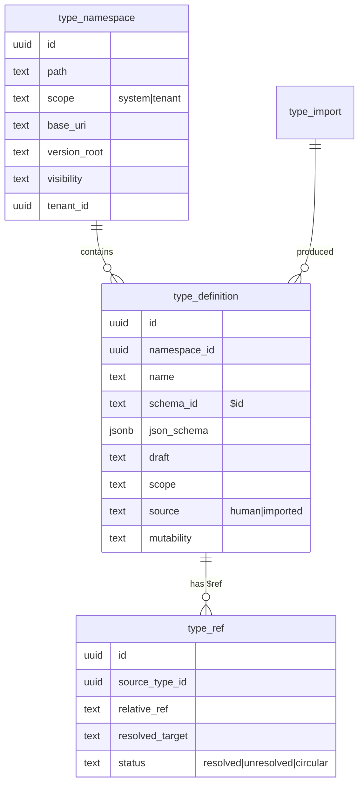
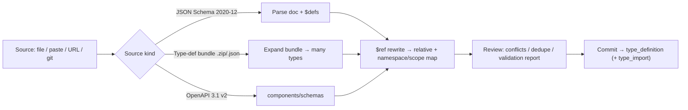
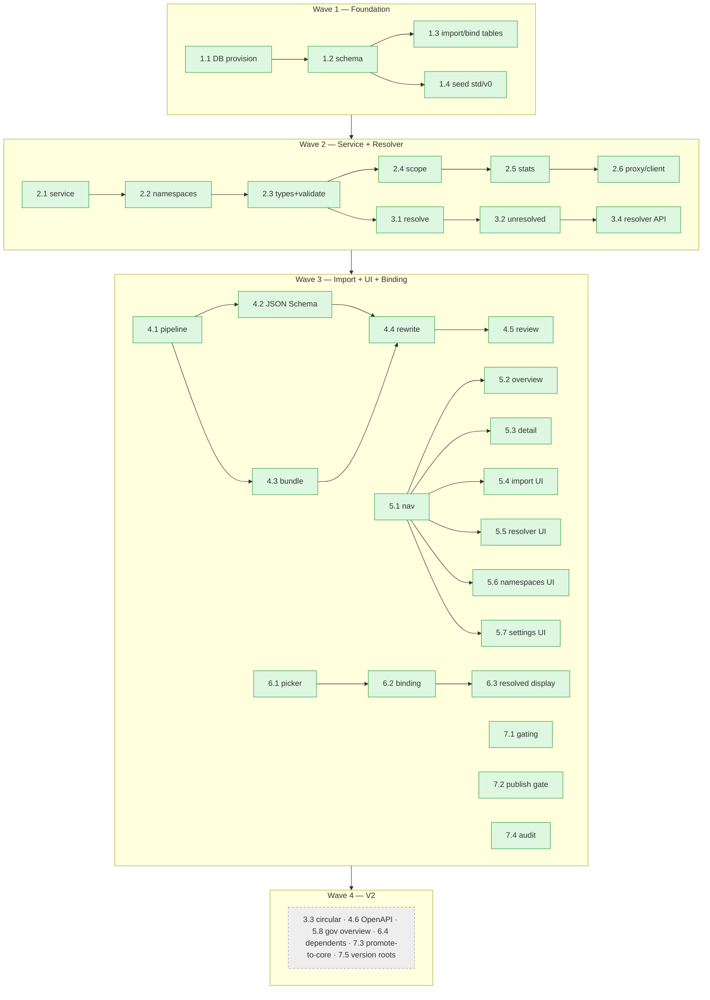

# Objectified Primitives — JSON Schema 2020-12 Governance Roadmap

## 1. Source Description

> `docs/planning/mockups/governance` and `docs/planning/mockups/types` for the types roadmap
> and governance setup but only for the JSON Schema types and schemas as discussed in this
> conversation.

This roadmap extends the **Primitives** capability under **Control Panel → Governance** in
`objectified-ui`. It is scoped *strictly* to JSON Schema **types and schemas** — reusable type
definitions, namespace/`$ref` resolution, import surfaces, and property bindings. It does **not**
cover the broader Authoring platform (Scribe/Slate), documentation, or marketing — those are
tracked separately in `docs/ROADMAP_AUTHORING_PLATFORM.md`.

**Codename:** Primitives (formerly Atlas). In-app label: **Primitives** (`/ade/dashboard/primitives`).

**Design sources (built earlier this conversation):**
- App-accurate, in-application mockups: `docs/planning/mockups/governance/` (+ its `README.md`,
  which sketches routes/entities) — the Type Registry rendered inside the real Control Panel
  shell under the Governance section.
- Standalone product mockups: `docs/planning/mockups/types/` (legacy Atlas mockups — map to Primitives UI).

---

## 1b. Existing Primitives Baseline (shipped)

Before implementing net-new registry mechanics, account for what is **already live**:

| Layer | Implementation | Gap vs this roadmap |
|---|---|---|
| Storage | `odb.primitives` in **objectified-db** | No separate `objectified-types-db`; no `type_namespace` / `type_ref` |
| System seed | 36 ISO-aligned system primitives (`20260124-140000.sql`) | Flat schemas; no `std/v0` namespace or composite `$ref` chains (`money` → `decimal`) |
| REST | `/v1/primitives/{tenant_slug}` CRUD + `/import` from `$defs` | No namespaces, resolver, stats, or server-side draft 2020-12 gate |
| UI proxy | `/api/primitives/*` | ✅ **Done** — closed as duplicate (#3455) |
| Management UI | `/ade/dashboard/primitives` — stats, table, CRUD, import dialog | ✅ Nav done (#3466 closed); overview/import are **partial** — extend, don't rebuild |
| Designer | `PrimitiveSelector` — merges primitive schema onto property | No persisted `$ref` binding (#3475); picker lacks namespace tabs (#3474) |
| Validation | AJV in `PrimitiveEditorDialog` (client) | REST persist not strictly validated (#3452) |
| Scope | `is_system` immutability, tenant rows | No namespace visibility or core→tenant `$ref` rules (#3453) |

**Tickets closed as duplicates:** #3455 (UI proxy), #3466 (Governance nav). All other #3446–#3481
issues remain open with scopes adjusted to **extend** Primitives toward full JSON Schema 2020-12 support.

**What the registry must do (from the mockups & conversation):**
- Store JSON Schema **draft 2020-12** types in a **separate database** (`objectified-types-db`),
  distinct from `objectified-db`.
- Address types by **relative `$ref`** rooted at each type's **import-source base URL** in the
  API server. Canonical example: `std/v0/types/date` → `"$ref": "../primitives/string"`, base
  `api.objectified.dev/types/std/v0/types/` → resolves to `std/v0/primitives/string`.
- Provide **core system types** (`std/v0/*`) visible to **all tenants**, and **per-tenant**
  private types (`tenant/<slug>/*`). A tenant type may `$ref` a core type; a core type may not
  `$ref` a tenant type.
- **Import** both raw **JSON Schema** documents (single or `$defs`-bundled) *and* **Objectified
  type-definition bundles** (`.zip`/`.json`). (OpenAPI 3.1 components is a V2 extension.)
- Let the **visual editor** (Designer) bind a property to a **standard** (primitive) or
  **custom** (imported/tenant/core) type, on a per-tenant and per-system basis, storing a `$ref`.

---

## 2. MVP Definition

The MVP delivers a **working type registry loop**: a separate registry database seeded with
core system types; a service+API to manage namespaces and draft-2020-12 types with scope rules;
a relative-`$ref` resolver that flags unresolved references; an import surface that ingests JSON
Schemas **and** type-definition bundles; a Governance → Type Registry UI (overview, type detail,
import, resolver, namespaces, settings); and the Designer property→type binding that writes a
`$ref`.

**In scope for MVP**

| Area | MVP capability |
|---|---|
| Database | Separate `objectified-types-db`; namespaces, type-definitions, type-refs, import & binding tables; seeded `std/v0` core types |
| Service/API | Namespace CRUD; type CRUD with draft-2020-12 validation; system-core vs tenant scope enforcement; coverage stats; UI proxy + client |
| Resolution | Relative `$ref` resolution against import-source base; unresolved-reference detection; resolver API + basic dependency listing |
| Import | Pipeline + ingestion (file/paste/URL/git); JSON Schema doc parser (single + `$defs`); type-definition bundle importer; `$ref` rewrite + namespace/scope mapping; conflict/dedupe + validation report |
| Governance UI | Sidebar entry under Governance; Type Registry overview; type detail; import wizard; reference resolver; namespaces & scopes; settings |
| Designer integration | Type picker (Standard/Core/Tenant/Custom); property→type `$ref` binding storage + read; resolved-type display in Designer |
| Governance | Entitlement gating; publish/validation gate; basic audit log |

**Deferred to V2**

| Area | V2 capability |
|---|---|
| Import | OpenAPI 3.1 components importer; Avro/Protobuf (experimental); advanced conflict UX |
| Resolution | Circular-reference detection; remote `$ref` allowlist; resolution-depth policy; full graph visualization |
| Governance | Promote-tenant-type-to-core (CAB) workflow; version roots (`v1` draft) management & deprecation lifecycle; Governance-area overview landing |
| Designer | "Used by properties" dependents/impact analysis |

The MVP/V2 flag for every issue is in each epic table (**MVP** column) and summarized in §13.

---

## 3. Architecture (target state)

```mermaid
flowchart TB
  subgraph UI["objectified-ui (Control Panel → Governance)"]
    nav["DashboardSideNav → Governance → Type Registry"]
    pages["/ade/dashboard/governance/types/* (overview·detail·import·resolver·namespaces·settings)"]
    picker["Designer property editor → Type picker"]
    proxy["Next.js /api/types/* proxy"]
    nav --> pages --> proxy
    picker --> proxy
  end

  subgraph REST["objectified-rest — Type Registry service"]
    api["Namespace + Type CRUD\n(draft 2020-12 validation, scope rules)"]
    resolver["Relative $ref resolver\n(unresolved / circular)"]
    import["Import: JSON Schema + type-def bundle (+ OpenAPI 3.1 v2)"]
    bind["Property↔type binding read model"]
  end

  subgraph TDB[("objectified-types-db (separate)")]
    ns[("type_namespace")]
    td[("type_definition (json_schema JSONB)")]
    tr[("type_ref")]
    imp[("type_import")]
  end

  proxy --> api & resolver & import & bind
  api --> ns & td
  resolver --> tr
  resolver --> td
  import --> td & ns & imp
  bind -->|$ref| coreDB[("objectified-db: class_property")]
  api -. seeds .-> seed["std/v0 core types\n(primitives + std types)"]
```

**Conventions inherited from the codebase (verified):**
- UI: Next.js 16 App Router; nav in `DashboardSideNav.tsx` (already has a **Governance**
  section containing *Primitives*); routes under `/ade/dashboard/*`; client → `/api/*` proxy →
  `objectified-rest` with `createRestAuthHeaders()`.
- REST: FastAPI; tenant-scoped `/v1/...` with `validate_authentication()`.
- DB: PostgreSQL `odb` schema, UUID PKs, soft deletes, JSONB; migrations in
  `objectified-db/scripts/<timestamp>.sql`. The registry is a **new, separate database**.
- Brand: in-app the feature uses the Control Panel **indigo** accent; the standalone Atlas
  mockups use teal.

---

## 4. Relationship to Existing Issues (de-duplication)

These open issues are *adjacent* and must be cross-linked, **not duplicated**:

| Existing | Relationship |
|---|---|
| #624–#636 (`registry` "Schema Registry": centralized repo, namespacing #627, dependency tracking #630, versioning #626, search #629/#631) | The Type Registry is the concrete, draft-2020-12 **type** layer of this vision. Reuse the `registry` label; this roadmap supersedes the generic stubs for the *type* scope. Namespacing (#627) and dependency tracking (#630) are realized here for types. |
| #719–#728 (`governance`: approval workflows, naming, gates, dashboard) | The Type Registry's publish/validation gate (7.2) and audit (7.4) align; promote-to-core (7.3) is a governed workflow consistent with #722/#724. |
| #2299 Import History Data Model · #2305 User Attribution on Import · #2316 REST API for Import (`import`) | The Type Registry import (Epic 4) should **reuse** the existing import history/attribution infrastructure rather than re-implement it; this roadmap adds the type-specific source parsers + `$ref` rewrite. |
| #1130 Type Mapping Registry (mobile-sdk) | Different concern (code-gen type mapping). No overlap beyond the word "type". |

No existing issue implements a JSON Schema 2020-12 **type registry with a separate database and
relative `$ref` resolution**, so the core of this roadmap is net-new.

---

## 5. Epic Index

| # | Epic | Theme | Primary module(s) |
|---|---|---|---|
| 1 (#3439) | Type Registry Database | Separate `objectified-types-db`, entities, core-type seed | objectified-db (new DB) |
| 2 (#3440) | Registry Service & API | Namespace/type CRUD, scope rules, validation, proxy | objectified-rest, objectified-ui |
| 3 (#3441) | Reference Resolution Engine | Relative `$ref` resolve, unresolved/circular, graph | objectified-rest |
| 4 (#3442) | Import System | JSON Schema + type-def bundle (+ OpenAPI 3.1 v2) | objectified-rest |
| 5 (#3443) | Governance UI: Type Registry | Nav + overview/detail/import/resolver/namespaces/settings | objectified-ui |
| 6 (#3444) | Designer Property Binding | Type picker, property→`$ref` binding, resolved display | objectified-ui, objectified-rest |
| 7 (#3445) | Scopes, Governance & Publishing | Entitlements, publish gate, promote-to-core, audit | objectified-rest, objectified-ui |

**Labels.** Reuse: `epic`, `mvp`, `enhancement`, `governance`, `registry`, `rest`, `ui`,
`import`, `versions`, `schema-designer`. **New labels to create:**

| Label | Color | Description |
|---|---|---|
| `type-registry` | `#0E7490` | Objectified Primitives — JSON Schema 2020-12 types (extends `/ade/dashboard/primitives`) |
| `types-db` | `#0B5563` | Separate type registry database (objectified-types-db) |
| `roadmap-type-registry` | `#BFDADC` | ROADMAP_TYPE_REGISTRY_GOVERNANCE.md ticket pack |

Issue naming: `Primitives: [<epic#.issue#>] <title>`.

---

## 6. Epic 1 — Type Registry Database (`objectified-types-db`)

A dedicated registry database, its entity model, and a seed of the core system types. This is
the foundation everything else builds on.



| Issue | Title | Summary | Labels | Parallel | MVP | Complexity | Affected Modules |
|---|---|---|---|:---:|:---:|---|---|
| 1.1 #3446 | ~~Provision separate registry database & connection~~ ✅ **Done** | Stand up `objectified-types-db` + connection/pool config | `type-registry`,`types-db`,`mvp`,`roadmap-type-registry` | N | Y | M | objectified-db, objectified-rest |
| 1.2 #3447 | ~~Core registry schema (namespaces, types, refs)~~ ✅ **Done** | Migrations for `type_namespace`, `type_definition`, `type_ref` | `type-registry`,`types-db`,`mvp`,`roadmap-type-registry` | N | Y | M | objectified-db |
| 1.3 #3448 | Import & binding tables | `type_import` records + property↔type binding link model | `type-registry`,`types-db`,`import`,`mvp`,`roadmap-type-registry` | Y | Y | M | objectified-db |
| 1.4 #3449 | Seed core system types (`std/v0`) | Seed 8 primitives + std types (date, uuid, money, …) as system-core | `type-registry`,`registry`,`mvp`,`roadmap-type-registry` | Y | Y | M | objectified-db, objectified-rest |

### Issue 1.1 — Provision separate registry database & connection ✅ Done (#3446)
- **Delivered.** Separate logical database `objectified-types-db` (its own `otr` schema)
  provisioned on the core Postgres instance. `objectified-db` gained a `registry` command
  group (`provision` / `migrate` / `migrate status` / `ping`) with an independent
  `registry-scripts/` migration directory; docker-compose adds a `types-migrate` service that
  self-provisions and migrates it. `objectified-rest` connects to it independently
  (`registry_database.py`, `OBJECTIFIED_TYPES_DB` / `OBJECTIFIED_TYPES_DB_URL`) and `GET /health`
  reports its status. Existing `/v1/primitives` (`odb.primitives`) is untouched.
- **Problem.** The registry must live in its own database (`objectified-types-db`), separate
  from `objectified-db`, per the Settings mockup and conversation.
- **Solution/Scope.** Add the new database (docker-compose service + env), a dedicated
  connection/pool in `objectified-rest`, and migration tooling targeting it (mirroring the
  `objectified-db/scripts/<timestamp>.sql` convention but in a separate schema/DB). Source:
  `governance/type-settings.html` (Registry database card), `governance/README.md`.
- **Acceptance Criteria.** Service connects to `objectified-types-db` independently of
  `objectified-db`; health check reports "Connected"; credentials are configurable + not logged.
- **Parallelism/Dependencies.** Foundational — blocks 1.2/1.3 and Epic 2.
- **Technical Stack.** PostgreSQL, docker-compose, FastAPI DB pool.

### Issue 1.2 — Core registry schema (namespaces, types, refs) ✅ Done (#3447)
- **Delivered.** Migrations under `objectified-db/registry-scripts/` create the three core
  entity tables inside the `otr` schema of `objectified-types-db`: `type_namespace`
  (path, scope, base_uri, version_root, visibility, tenant_id, is_default; scope/tenant
  check; path unique per scope), `type_definition` (namespace_id, name, schema_id=`$id`,
  `json_schema` JSONB, draft, scope, source, mutability, soft delete; **unique
  `(namespace_id, name)`**), and `type_ref` (source_type_id, relative_ref, resolved_target,
  status ∈ {resolved, unresolved, circular}). UUID PKs, soft deletes, partial unique
  indices, and cascade FKs throughout; no cross-database FK to `odb`. Verified against a
  live Postgres 16: migrations apply, a type with an internal `$ref` round-trips its
  `type_ref` rows, and the uniqueness/scope constraints reject violations.
- **Problem.** No storage exists for namespaces, type definitions, or their references.
- **Solution/Scope.** Migrations creating: `type_namespace` (path, `scope` ∈ {system, tenant},
  `base_uri`, `version_root`, `visibility`, `tenant_id` nullable, `is_default`); `type_definition`
  (namespace_id, name, `schema_id` = `$id`, `json_schema` JSONB, `draft`, `scope`, `source` ∈
  {human, imported}, `mutability`, soft delete, unique `(namespace_id, name)`); `type_ref`
  (source_type_id, `relative_ref`, `resolved_target`, `status` ∈ {resolved, unresolved,
  circular}). Source: `governance/type-namespaces.html`, `types/*` entity tags.
- **Acceptance Criteria.** Migrations apply to `objectified-types-db`; constraints + indices in
  place; a type with a `$ref` round-trips with its `type_ref` rows.
- **Parallelism/Dependencies.** Depends on 1.1; blocks Epic 2/3/4.
- **Technical Stack.** PostgreSQL, JSONB.

### Issue 1.3 — Import & binding tables
- **Problem.** Imports and property bindings need durable records.
- **Solution/Scope.** `type_import` (source_kind ∈ {json-schema, type-def-bundle, openapi},
  target namespace/scope, options JSONB, report JSONB, attribution, timestamps) — reuse existing
  import-history/attribution infra (#2299/#2305) where possible; and a **binding link** read by
  the Designer associating an `objectified-db` `class_property` with a registry type (`$ref` +
  resolved target). Source: `governance/type-import.html`, `governance/property-binding.html`.
- **Acceptance Criteria.** An import persists a `type_import` row with its report; a property
  binding persists and is queryable from the Designer read path.
- **Parallelism/Dependencies.** Depends on 1.2; parallel with 1.4.
- **Technical Stack.** PostgreSQL, JSONB; cross-DB reference by id (no FK across databases).

### Issue 1.4 — Seed core system types (`std/v0`)
- **Problem.** Tenants need a baseline of core types available to all.
- **Solution/Scope.** Seed `std/v0/primitives` (string, number, integer, boolean, null, array,
  object) and `std/v0/types` (date, date-time, uuid, email, uri, decimal, currency-code, money,
  …) as **system-core**, with correct relative `$ref`s (e.g. `date` → `../primitives/string` +
  `format: date`; `money` → `./decimal`, `./currency-code`). Idempotent seeding migration/script.
  Source: `types/browser.html`, `types/type-detail.html` (money), `governance/type-detail.html`.
- **Acceptance Criteria.** After seed, core namespaces resolve fully (0 unresolved); `money` and
  `date` match the canonical schemas; re-running the seed is idempotent.
- **Parallelism/Dependencies.** Depends on 1.2; uses 3.1 for resolution verification.
- **Technical Stack.** SQL/Python seed, JSON Schema 2020-12.

---

## 7. Epic 2 — Registry Service & API

The FastAPI service exposing namespace/type CRUD with draft-2020-12 validation and scope
enforcement, plus the `objectified-ui` proxy + typed client.

| Issue | Title | Summary | Labels | Parallel | MVP | Complexity | Affected Modules |
|---|---|---|---|:---:|:---:|---|---|
| 2.1 #3450 | Registry service skeleton + auth/scoping | New `/v1/types/*` surface, tenant/scope auth, DB wiring | `type-registry`,`rest`,`mvp`,`roadmap-type-registry` | N | Y | M | objectified-rest |
| 2.2 #3451 | Namespace CRUD API | Create/list/update namespaces with scope, base URI, version root | `type-registry`,`registry`,`rest`,`mvp`,`roadmap-type-registry` | N | Y | M | objectified-rest |
| 2.3 #3452 | Type definition CRUD + draft 2020-12 validation | CRUD types; validate `json_schema` against draft 2020-12 | `type-registry`,`rest`,`mvp`,`roadmap-type-registry` | N | Y | L | objectified-rest |
| 2.4 #3453 | Scope & visibility enforcement | System-core vs tenant access + ref-direction rules | `type-registry`,`governance`,`rest`,`mvp`,`roadmap-type-registry` | Y | Y | M | objectified-rest |
| 2.5 #3454 | Registry coverage/stats endpoint | Counts by scope, imported, unresolved (for dashboard KPIs) | `type-registry`,`rest`,`mvp`,`roadmap-type-registry` | Y | Y | S | objectified-rest |
| 2.6 #3455 | ~~UI proxy routes + typed client~~ | **CLOSED — duplicate** (`/api/primitives/*` shipped) | `type-registry`,`ui`,`mvp`,`roadmap-type-registry` | N | Y | S | objectified-ui |

### Issue 2.1 — Registry service skeleton + auth/scoping
- **Problem.** No service entrypoint exists for the registry DB.
- **Solution/Scope.** Add `types_routes.py` (or a dedicated module) with `/v1/types/{tenant_slug}/...`
  base, `validate_authentication()`, and a connection to `objectified-types-db` (1.1). Pydantic
  DTOs in `models.py`.
- **Acceptance Criteria.** Authenticated, tenant-scoped requests reach the registry DB; a health/
  ping endpoint returns DB status.
- **Parallelism/Dependencies.** Depends on 1.1/1.2; blocks 2.2–2.6.
- **Technical Stack.** FastAPI, asyncpg/pg, Pydantic.

### Issue 2.2 — Namespace CRUD API
- **Problem.** Namespaces (system/tenant, base URI, version root) must be managed.
- **Solution/Scope.** `GET/POST/PUT /v1/types/{tenant_slug}/namespaces` honoring scope rules
  (only platform admins create system namespaces; tenant admins create tenant namespaces).
  Source: `governance/type-namespaces.html`.
- **Acceptance Criteria.** Create/list/update namespaces; defaults + visibility persisted; system
  namespaces are read-only to non-platform-admins.
- **Parallelism/Dependencies.** Depends on 2.1; blocks 4.x, 5.6.
- **Technical Stack.** FastAPI, Pydantic.

### Issue 2.3 — Type definition CRUD + draft 2020-12 validation
- **Problem.** Types must be created/edited with valid JSON Schema 2020-12.
- **Solution/Scope.** CRUD `/v1/types/{tenant_slug}/{namespace}/types`; validate `json_schema`
  against **draft 2020-12** (strict mode configurable, annotations allowed) before persist;
  compute/store `$id`. Source: `types/create-type.html`, `governance/type-detail.html`,
  `governance/type-settings.html` (dialect).
- **Acceptance Criteria.** A valid 2020-12 type persists; an invalid one is rejected with a
  structured error; `$id` is derived from namespace base + name.
- **Parallelism/Dependencies.** Depends on 2.1/2.2; blocks 5.2/5.3, 6.x.
- **Technical Stack.** FastAPI, a 2020-12 validator (e.g. `jsonschema`), JSONB.

### Issue 2.4 — Scope & visibility enforcement
- **Problem.** Core types are shared with all tenants; tenant types are private; a core type must
  never reference a tenant type.
- **Solution/Scope.** Centralize scope/visibility checks: reads resolve **system-core ∪
  current-tenant**; writes restricted by scope; reject saving a core type whose `$ref` targets a
  tenant namespace. Source: `governance/type-namespaces.html` (precedence + rule box).
- **Acceptance Criteria.** Tenant A cannot see Tenant B types; all tenants see `std/*`; a
  core→tenant `$ref` is rejected; tenant→core `$ref` is allowed.
- **Parallelism/Dependencies.** Depends on 2.2/2.3; reinforced by 3.1.
- **Technical Stack.** FastAPI authorization layer.

### Issue 2.5 — Registry coverage/stats endpoint
- **Problem.** The overview KPIs need aggregate counts.
- **Solution/Scope.** `GET /v1/types/{tenant_slug}/stats` → core type count, tenant type count,
  imported count, properties bound, unresolved `$ref` count. Source:
  `governance/type-registry.html` (KPI strip).
- **Acceptance Criteria.** Numbers match fixtures and the resolver/binding state.
- **Parallelism/Dependencies.** Depends on 2.3, 3.2, 6.2; parallel otherwise.
- **Technical Stack.** FastAPI, SQL aggregation.

### Issue 2.6 — UI proxy routes + typed client
- **Problem.** Browser calls must proxy through Next.js with JWT injection.
- **Solution/Scope.** `/api/types/*` route handlers + a typed client in `objectified-ui/lib/api/`
  using `createRestAuthHeaders()`.
- **Acceptance Criteria.** Client covers namespaces, types, stats, resolver, import; typed errors.
- **Parallelism/Dependencies.** Depends on 2.2–2.5; blocks Epic 5/6 UI.
- **Technical Stack.** Next.js route handlers, TypeScript.

---

## 8. Epic 3 — Reference Resolution Engine

The defining mechanic: resolve relative `$ref` against each type's import-source base URL, and
report unresolved/circular references.

```
base      = api.objectified.dev/types/std/v0/types/      (source: date)
$ref      = ../primitives/string
resolved  = api.objectified.dev/types/std/v0/primitives/string   ✓
```

| Issue | Title | Summary | Labels | Parallel | MVP | Complexity | Affected Modules |
|---|---|---|---|:---:|:---:|---|---|
| 3.1 #3456 | Relative `$ref` resolution against base | Resolve relative refs to absolute registry targets | `type-registry`,`rest`,`mvp`,`roadmap-type-registry` | N | Y | L | objectified-rest |
| 3.2 #3457 | Unresolved-reference detection & flags | Detect & persist unresolved refs (status on `type_ref`) | `type-registry`,`rest`,`mvp`,`roadmap-type-registry` | Y | Y | M | objectified-rest |
| 3.3 #3458 | Circular-reference detection | Detect cycles (A→B→A) and flag | `type-registry`,`rest`,`roadmap-type-registry` | Y | N | M | objectified-rest |
| 3.4 #3459 | Resolver API + dependency listing | `/resolve` + dependency edges for resolver UI | `type-registry`,`rest`,`mvp`,`roadmap-type-registry` | Y | Y | M | objectified-rest |

### Issue 3.1 — Relative `$ref` resolution against base
- **Problem.** Types reference each other by relative URL rooted at their import source.
- **Solution/Scope.** Implement URL-base resolution (`base + relative → absolute`), mapping the
  absolute target to a registry `type_definition`; honor scope rules (2.4). Handle `../`, `./`,
  and cross-scope `../../std/...`. Source: `types/resolver.html`, `governance/type-resolver.html`,
  `types/type-detail.html`.
- **Acceptance Criteria.** `date`→`../primitives/string`, `money`→`./decimal`/`./currency-code`,
  `tenant/acme/.../sku`→`../../std/v0/types/string` all resolve to the correct targets.
- **Parallelism/Dependencies.** Depends on 1.2/2.3; blocks 3.2/3.4, 6.3.
- **Technical Stack.** FastAPI, URL resolution.

### Issue 3.2 — Unresolved-reference detection & flags
- **Problem.** Imports/edits can leave references that point at not-yet-present types.
- **Solution/Scope.** On save/import, mark `type_ref.status = unresolved` for targets not found;
  expose counts (feeds 2.5) and a list. Source: resolver mockups (amber unresolved rows).
- **Acceptance Criteria.** A ref to a missing type is flagged unresolved; resolving the target
  clears it on re-resolve.
- **Parallelism/Dependencies.** Depends on 3.1.
- **Technical Stack.** FastAPI, SQL.

### Issue 3.3 — Circular-reference detection — V2
- **Problem.** Cycles (e.g. `node ↔ edge`) must be detected.
- **Solution/Scope.** Graph cycle detection over `type_ref`; flag `status = circular`. Source:
  resolver mockups (red circular row).
- **Acceptance Criteria.** A 2-node and 3-node cycle are detected and flagged; acyclic graphs
  are unaffected.
- **Parallelism/Dependencies.** Depends on 3.1/3.4.
- **Technical Stack.** FastAPI, graph traversal.

### Issue 3.4 — Resolver API + dependency listing
- **Problem.** The resolver UI needs resolution results + dependency edges.
- **Solution/Scope.** `POST /v1/types/{tenant_slug}/resolve` (optionally namespace-scoped)
  returning per-ref status + the dependency edge list for the graph/table. Source:
  `governance/type-resolver.html` (table + graph).
- **Acceptance Criteria.** Returns resolved/unresolved (and circular when 3.3 lands) with edges;
  matches the resolver UI's table.
- **Parallelism/Dependencies.** Depends on 3.1/3.2; blocks 5.5.
- **Technical Stack.** FastAPI.

---

## 9. Epic 4 — Import System (Schemas + Type Definitions)

Ingest external types. The conversation explicitly requires importing **both JSON Schemas and
type definitions**; OpenAPI 3.1 is a V2 add-on. Reuse existing import history/attribution
(#2299/#2305) rather than re-building it.



| Issue | Title | Summary | Labels | Parallel | MVP | Complexity | Affected Modules |
|---|---|---|---|:---:|:---:|---|---|
| 4.1 #3460 | Import pipeline core + ingestion | Orchestrator + file/paste/URL/git source intake | `type-registry`,`import`,`rest`,`mvp`,`roadmap-type-registry` | N | Y | M | objectified-rest |
| 4.2 #3461 | JSON Schema 2020-12 parser | Parse single doc + `$defs` into discrete types | `type-registry`,`import`,`rest`,`mvp`,`roadmap-type-registry` | Y | Y | L | objectified-rest |
| 4.3 #3462 | Type-definition bundle importer | Expand `.zip`/`.json` bundle into many interlinked types | `type-registry`,`import`,`rest`,`mvp`,`roadmap-type-registry` | Y | Y | L | objectified-rest |
| 4.4 #3463 | `$ref` rewrite + namespace/scope mapping | Rewrite refs relative to import source; map to namespace/scope | `type-registry`,`import`,`rest`,`mvp`,`roadmap-type-registry` | N | Y | L | objectified-rest |
| 4.5 #3464 | Import review: conflicts, dedupe, report | Conflict resolution, dedupe identical, validation report | `type-registry`,`import`,`rest`,`mvp`,`roadmap-type-registry` | Y | Y | M | objectified-rest |
| 4.6 #3465 | OpenAPI 3.1 components importer | Extract `components/schemas` as types | `type-registry`,`import`,`rest`,`roadmap-type-registry` | Y | N | M | objectified-rest |

### Issue 4.1 — Import pipeline core + ingestion
- **Problem.** A single orchestration path is needed for all source kinds.
- **Solution/Scope.** Pipeline that accepts source kind (JSON Schema / type-def bundle / OpenAPI)
  and method (file/paste/URL/git), records a `type_import` (1.3), and stages parsed types for
  rewrite/review. Source: `governance/type-import.html` (source-type cards + method tabs).
- **Acceptance Criteria.** Each source kind/method reaches a staged result with an import record.
- **Parallelism/Dependencies.** Depends on 1.3, 2.2; blocks 4.2–4.6.
- **Technical Stack.** FastAPI, file/zip handling, git/http fetch.

### Issue 4.2 — JSON Schema 2020-12 parser
- **Problem.** Must ingest raw JSON Schemas, including `$defs`-bundled documents.
- **Solution/Scope.** Parse a 2020-12 document; optionally treat each `$defs` entry as an
  individual type; capture intra-doc refs (`#/$defs/...`) for rewrite (4.4). Source:
  `governance/type-import.html` (detected-document panel).
- **Acceptance Criteria.** A doc with 3 `$defs` yields 3 types with their internal refs captured.
- **Parallelism/Dependencies.** Depends on 4.1; parallel with 4.3.
- **Technical Stack.** FastAPI, JSON Schema parsing.

### Issue 4.3 — Type-definition bundle importer
- **Problem.** Must ingest Objectified type-definition bundles containing many types.
- **Solution/Scope.** Expand `.zip`/`.json` bundles into multiple interlinked `type_definition`s,
  preserving inter-type refs for rewrite. Source: `governance/type-import.html` (Type Definition
  Bundle card), conversation requirement ("import them as well").
- **Acceptance Criteria.** A bundle of N types imports all N with refs intact; a malformed bundle
  reports a clear error.
- **Parallelism/Dependencies.** Depends on 4.1; parallel with 4.2.
- **Technical Stack.** FastAPI, zip/json.

### Issue 4.4 — `$ref` rewrite + namespace/scope mapping
- **Problem.** External refs (`#/$defs/Money`, absolute URLs) must become **relative** refs
  rooted at the import source, mapped into a target namespace + scope.
- **Solution/Scope.** Rewrite engine: `#/$defs/Money → ./money`, external known refs → core
  types where possible; assign target namespace + scope (system/tenant). Source:
  `governance/type-import.html` (options), `types/import-review.html` ($ref rewrite table).
- **Acceptance Criteria.** Imported refs are stored relative and resolve via Epic 3; mapping to
  core types works for recognized formats.
- **Parallelism/Dependencies.** Depends on 4.2/4.3; uses 3.1.
- **Technical Stack.** FastAPI.

### Issue 4.5 — Import review: conflicts, dedupe, report
- **Problem.** Imports collide with existing types and may duplicate.
- **Solution/Scope.** Detect New/Conflict/Identical per type; offer keep/overwrite/rename; dedupe
  identical; produce a validation report (draft 2020-12: valid/errors/warnings) and unresolved-ref
  mapping. Source: `types/import-review.html`.
- **Acceptance Criteria.** Conflicts are surfaced with resolution choices; committing applies them;
  the report matches outcomes.
- **Parallelism/Dependencies.** Depends on 4.4; feeds 5.4.
- **Technical Stack.** FastAPI.

### Issue 4.6 — OpenAPI 3.1 components importer — V2
- **Problem.** Teams want to import OpenAPI `components/schemas`.
- **Solution/Scope.** Extract `components/schemas` as types (2020-12-compatible), reusing 4.4/4.5.
  Source: `governance/type-import.html` (OpenAPI card), `types/import-review.html` (stripe.openapi).
- **Acceptance Criteria.** An OpenAPI 3.1 doc yields registry types with rewritten refs.
- **Parallelism/Dependencies.** Depends on 4.4/4.5.
- **Technical Stack.** FastAPI, OpenAPI parsing.

---

## 10. Epic 5 — Governance UI: Type Registry

The in-app surface under **Control Panel → Governance**, matching the `governance/` mockups.

| Issue | Title | Summary | Labels | Parallel | MVP | Complexity | Affected Modules |
|---|---|---|---|:---:|:---:|---|---|
| 5.1 #3466 | ~~Governance nav entry + route group~~ | **CLOSED — duplicate** (`/ade/dashboard/primitives` in nav) | `type-registry`,`ui`,`governance`,`mvp`,`roadmap-type-registry` | N | Y | S | objectified-ui |
| 5.2 #3467 | Enhance Primitives overview (registry KPIs) | Extend existing page: KPIs, namespace collections, activity | `type-registry`,`ui`,`mvp`,`roadmap-type-registry` | Y | Y | M | objectified-ui |
| 5.3 #3468 | Type detail page | Schema, resolved refs, dependents, metadata | `type-registry`,`ui`,`mvp`,`roadmap-type-registry` | Y | Y | M | objectified-ui |
| 5.4 #3469 | Import UI (wizard) | Source/options/review wired to Epic 4 | `type-registry`,`ui`,`import`,`mvp`,`roadmap-type-registry` | Y | Y | L | objectified-ui |
| 5.5 #3470 | Reference Resolver UI | Graph + table, base, unresolved/circular | `type-registry`,`ui`,`mvp`,`roadmap-type-registry` | Y | Y | M | objectified-ui |
| 5.6 #3471 | Namespaces & Scopes UI | Manage namespaces, scope, base URI, version root | `type-registry`,`ui`,`registry`,`mvp`,`roadmap-type-registry` | Y | Y | M | objectified-ui |
| 5.7 #3472 | Type Registry Settings UI | DB status, dialect, resolution & validation policy | `type-registry`,`ui`,`mvp`,`roadmap-type-registry` | Y | Y | S | objectified-ui |
| 5.8 #3473 | Governance area overview page | Governance landing positioning Type Registry + tools | `type-registry`,`ui`,`governance`,`roadmap-type-registry` | Y | N | S | objectified-ui |

### Issue 5.1 — Governance nav entry + route group
- **Problem.** No Type Registry surface exists in the app nav.
- **Solution/Scope.** Add a **Type Registry** item to the existing **Governance** section of
  `DashboardSideNav.tsx` (next to Primitives), gated by `hasTenant`; create the route group
  `/ade/dashboard/governance/types` with an auth-guarded layout + in-page tabs. Source:
  `governance/type-registry.html` (sidebar + tabs), `governance/README.md`.
- **Acceptance Criteria.** Type Registry appears under Governance and routes correctly; active
  state highlights; tabs (Overview/Import/Resolver/Namespaces/Settings) switch views.
- **Parallelism/Dependencies.** Depends on 2.6; blocks 5.2–5.8.
- **Technical Stack.** Next.js App Router, React, Tailwind, lucide.

### Issue 5.2 — Type Registry overview page
- **Problem.** Users need the registry's at-a-glance state.
- **Solution/Scope.** KPI cards (core/tenant/imported/bound/unresolved), collections table by
  scope with filters, recent activity, resolution-base explainer. Source:
  `governance/type-registry.html`.
- **Acceptance Criteria.** Reflects 2.5 stats and 2.2 collections; row click → type detail.
- **Parallelism/Dependencies.** Depends on 5.1, 2.5; parallel with 5.3–5.7.
- **Technical Stack.** Next.js, Tailwind.

### Issue 5.3 — Type detail page
- **Problem.** Users need a single type's full view.
- **Solution/Scope.** JSON Schema source, reference-resolution table, example instance,
  dependents, metadata, base chain; actions (edit, bind, export, deprecate). Source:
  `governance/type-detail.html`, `types/type-detail.html`.
- **Acceptance Criteria.** Renders a type (e.g. `money`) with resolved refs and dependents.
- **Parallelism/Dependencies.** Depends on 5.1, 2.3, 3.4; parallel.
- **Technical Stack.** Next.js, Tailwind.

### Issue 5.4 — Import UI (wizard)
- **Problem.** Users need to drive imports.
- **Solution/Scope.** Source-type cards (JSON Schema / type-def bundle / OpenAPI), method tabs,
  target namespace/scope, options (`$ref` rewrite, dedupe, etc.), and a review step wired to
  Epic 4. Source: `governance/type-import.html`, `types/import.html`, `types/import-review.html`.
- **Acceptance Criteria.** A JSON Schema and a type-def bundle import end-to-end with review and
  result; conflicts resolvable.
- **Parallelism/Dependencies.** Depends on 5.1, Epic 4; parallel.
- **Technical Stack.** Next.js, Tailwind.

### Issue 5.5 — Reference Resolver UI
- **Problem.** Users need to see/resolve references.
- **Solution/Scope.** Resolution base control, dependency graph, resolution table with
  resolved/unresolved/(circular) states, re-resolve. Source: `governance/type-resolver.html`.
- **Acceptance Criteria.** Shows resolver output (3.4); re-resolve updates statuses.
- **Parallelism/Dependencies.** Depends on 5.1, 3.4; parallel.
- **Technical Stack.** Next.js, Tailwind.

### Issue 5.6 — Namespaces & Scopes UI
- **Problem.** Users need to manage namespaces and understand scope.
- **Solution/Scope.** Namespaces table (scope, base URI, version root, visibility, default),
  scope precedence/rule cards, new-namespace; promote-to-core entry (governed, 7.3). Source:
  `governance/type-namespaces.html`.
- **Acceptance Criteria.** Reflects 2.2; create/edit namespaces; scope rules explained.
- **Parallelism/Dependencies.** Depends on 5.1, 2.2; parallel.
- **Technical Stack.** Next.js, Tailwind.

### Issue 5.7 — Type Registry Settings UI
- **Problem.** Users configure registry behavior.
- **Solution/Scope.** Registry DB status, default draft, `$ref` resolution policy (relative,
  remote allowlist, depth, circular policy), import defaults, validation/publishing governance.
  Source: `governance/type-settings.html`.
- **Acceptance Criteria.** Settings persist and affect service behavior where applicable.
- **Parallelism/Dependencies.** Depends on 5.1; relates to 7.x.
- **Technical Stack.** Next.js, FastAPI.

### Issue 5.8 — Governance area overview page — V2
- **Problem.** The Governance section deserves a landing that frames its capabilities.
- **Solution/Scope.** A Governance overview positioning Type Registry + Primitives (Live) and
  planned tools; KPI strip; Type Registry callout. Source: `governance/overview.html`.
- **Acceptance Criteria.** Reachable from Governance; links into Type Registry views.
- **Parallelism/Dependencies.** Depends on 5.1/5.2.
- **Technical Stack.** Next.js, Tailwind.

---

## 11. Epic 6 — Designer Property Binding Integration

Connects the registry to the visual editor: properties reference standard or custom types via
`$ref`, per-tenant/per-system.

```mermaid
flowchart LR
  prop["Designer · Customer.birthDate"] --> picker["Type picker\nStandard · Core · Tenant · Custom"]
  picker -->|select std/v0/types/date| ref['"$ref": "std/v0/types/date"']
  ref --> store[("class_property binding")]
  store --> resolve["resolve via Epic 3 → schema at design/runtime"]
```

| Issue | Title | Summary | Labels | Parallel | MVP | Complexity | Affected Modules |
|---|---|---|---|:---:|:---:|---|---|
| 6.1 #3474 | Type picker component | Standard/Core/Tenant/Custom tabs, search, scope chips | `type-registry`,`ui`,`schema-designer`,`mvp`,`roadmap-type-registry` | Y | Y | M | objectified-ui |
| 6.2 #3475 | Property→type `$ref` binding storage | Persist & read property bindings (1.3) | `type-registry`,`ui`,`rest`,`mvp`,`roadmap-type-registry` | N | Y | M | objectified-ui, objectified-rest |
| 6.3 #3476 | Resolved-type display in Designer/Paths | Show resolved schema + validate against it | `type-registry`,`ui`,`schema-designer`,`mvp`,`roadmap-type-registry` | Y | Y | M | objectified-ui |
| 6.4 #3477 | "Used by properties" dependents/impact | Reverse index: which properties use a type | `type-registry`,`rest`,`roadmap-type-registry` | Y | N | M | objectified-rest, objectified-ui |

### Issue 6.1 — Type picker component
- **Problem.** The property editor needs to pick a registry type.
- **Solution/Scope.** A picker with tabs **Standard** (primitives), **Core System Types**
  (`std/*`), **Tenant Types** (`tenant/<slug>/*`), **Custom · Imported**; search; scope chips;
  shows the resulting `$ref`. Honors visibility (core to all, tenant private). Source:
  `governance/property-binding.html`, `types/property-binding.html`.
- **Acceptance Criteria.** Selecting `std/v0/types/date` yields `$ref: std/v0/types/date`; tenant
  types only appear for their tenant.
- **Parallelism/Dependencies.** Depends on 2.6; parallel with 6.3.
- **Technical Stack.** Next.js, Tailwind, Radix.

### Issue 6.2 — Property→type `$ref` binding storage
- **Problem.** A bound property must persist its type reference.
- **Solution/Scope.** Write/read the property↔type binding (1.3), storing the `$ref` + resolved
  target on the `objectified-db` `class_property` (or the binding link). Source:
  `governance/property-binding.html` (binding preview).
- **Acceptance Criteria.** Binding persists and reloads; resolves via Epic 3.
- **Parallelism/Dependencies.** Depends on 1.3, 3.1, 6.1; blocks 6.3.
- **Technical Stack.** Next.js, FastAPI, PostgreSQL.

### Issue 6.3 — Resolved-type display in Designer/Paths
- **Problem.** The Designer must render the resolved type and validate values against it.
- **Solution/Scope.** Resolve a property's `$ref` to its effective schema and display it (type,
  format, constraints); use it for client-side validation/preview. Source: property-binding +
  type-detail mockups.
- **Acceptance Criteria.** A bound property shows its resolved type; an example value validates.
- **Parallelism/Dependencies.** Depends on 6.2, 3.1; parallel with 6.1.
- **Technical Stack.** Next.js, 2020-12 validation.

### Issue 6.4 — "Used by properties" dependents/impact — V2
- **Problem.** Type owners need to see/assess impact before changing a type.
- **Solution/Scope.** Reverse index of properties/types referencing a type; surface on type
  detail ("used by N properties"). Source: type-detail mockups (dependents/used-in).
- **Acceptance Criteria.** Type detail lists dependents accurately across tenants (scope-aware).
- **Parallelism/Dependencies.** Depends on 6.2.
- **Technical Stack.** FastAPI, SQL, Next.js.

---

## 12. Epic 7 — Scopes, Governance & Publishing

Governance controls around the registry: entitlements, publish gates, promotion, audit.

| Issue | Title | Summary | Labels | Parallel | MVP | Complexity | Affected Modules |
|---|---|---|---|:---:|:---:|---|---|
| 7.1 #3478 | Entitlement & feature gating | Gate Type Registry behind tenant entitlement | `type-registry`,`governance`,`rest`,`ui`,`mvp`,`roadmap-type-registry` | Y | Y | S | objectified-rest, objectified-ui |
| 7.2 #3479 | Type publishing & validation gate | Validate on save; block publish on errors | `type-registry`,`governance`,`rest`,`mvp`,`roadmap-type-registry` | Y | Y | M | objectified-rest |
| 7.3 #3480 | Promote tenant type → core (CAB) | Governed promotion of a vetted tenant type to `std/*` | `type-registry`,`governance`,`rest`,`ui`,`roadmap-type-registry` | Y | N | M | objectified-rest, objectified-ui |
| 7.4 #3481 | Registry audit log | Record create/update/import/publish/bind events | `type-registry`,`governance`,`rest`,`mvp`,`roadmap-type-registry` | Y | Y | S | objectified-rest |
| 7.5 #3482 | Version roots & deprecation lifecycle | Manage `v0`/`v1` roots; deprecate/sunset types | `type-registry`,`versions`,`governance`,`roadmap-type-registry` | Y | N | M | objectified-rest, objectified-ui |

### Issue 7.1 — Entitlement & feature gating
- **Solution/Scope.** Add a `type-registry` entitlement; gate nav, routes, and API. Source:
  `governance/README.md`.
- **Acceptance Criteria.** Non-entitled tenants cannot see/reach the feature; entitled can.
- **Parallelism/Dependencies.** Parallel; soft-blocks 5.1 visibility.
- **Technical Stack.** FastAPI entitlements, Next.js checks.

### Issue 7.2 — Type publishing & validation gate
- **Solution/Scope.** Validate on save (2020-12); block publish on validation errors per Settings
  policy. Source: `governance/type-settings.html` (Validation & publishing).
- **Acceptance Criteria.** Invalid types cannot be published when the gate is on.
- **Parallelism/Dependencies.** Depends on 2.3; relates to 5.7.
- **Technical Stack.** FastAPI.

### Issue 7.3 — Promote tenant type → core (CAB) — V2
- **Solution/Scope.** Governed workflow to promote a vetted tenant type into `std/*` (visible to
  all tenants), with request + platform-admin approval; aligns with governance issues #722/#724.
  Source: `governance/type-namespaces.html` (promote-to-core).
- **Acceptance Criteria.** A promotion request requires approval; on approval the type moves to a
  system namespace and becomes visible to all tenants.
- **Parallelism/Dependencies.** Depends on 2.2/2.4, 7.4.
- **Technical Stack.** FastAPI, Next.js.

### Issue 7.4 — Registry audit log
- **Solution/Scope.** Append-only audit of registry events (create/update/import/publish/bind/
  promote), with actor + timestamp; reuse existing audit infra where available.
- **Acceptance Criteria.** Each governed action writes an audit record; queryable per tenant.
- **Parallelism/Dependencies.** Parallel; consumed by 7.3.
- **Technical Stack.** FastAPI, PostgreSQL.

### Issue 7.5 — Version roots & deprecation lifecycle — V2
- **Solution/Scope.** Manage version roots (`v0` stable, `v1` draft) and type deprecation/sunset;
  aligns with `versions`/governance lifecycle (#739/#748). Source: `governance/type-namespaces.html`
  (version roots), type-detail (deprecate action).
- **Acceptance Criteria.** A type can be deprecated with a sunset date; draft roots are managed
  separately from stable.
- **Parallelism/Dependencies.** Depends on 2.2/2.3.
- **Technical Stack.** FastAPI, Next.js.

---

## 13. MVP vs V2 Summary

**MVP issues (open):** 1.1–1.4, 2.1–2.5, 3.1, 3.2, 3.4, 4.1–4.5, 5.2–5.7, 6.1–6.3, 7.1, 7.2, 7.4.

**Closed duplicates (shipped):** 2.6 (#3455 UI proxy), 5.1 (#3466 nav entry).

**V2 issues:** 3.3, 4.6, 5.8, 6.4, 7.3, 7.5.

---

## 14. Work Order (sequencing)



1. **Wave 1 — Foundation (Epic 1).** Provision `objectified-types-db` (1.1) → core schema (1.2)
   → import/binding tables (1.3) + seed `std/v0` core types (1.4).
2. **Wave 2 — Service + Resolver (Epics 2 & 3).** Service (2.1) → namespaces (2.2) → types +
   validation (2.3) → scope (2.4) → stats (2.5) → proxy/client (2.6); resolver
   (3.1→3.2→3.4) in parallel once 2.3 lands.
3. **Wave 3 — Import + UI + Binding (Epics 4, 5, 6, 7-core).** Import pipeline + parsers + rewrite
   + review (4.1→4.2/4.3→4.4→4.5); Governance UI (5.1 then 5.2–5.7 in parallel); Designer
   binding (6.1→6.2→6.3); gating/publish/audit (7.1/7.2/7.4). **MVP complete.**
4. **Wave 4 — V2.** Circular detection (3.3), OpenAPI import (4.6), Governance overview (5.8),
   dependents/impact (6.4), promote-to-core (7.3), version roots/deprecation (7.5).

---

## 15. Issue Count & Naming

This roadmap defines **37 issues** across **7 epics** (29 MVP open + 2 closed duplicates + 6 V2). Issues follow
`Primitives: [<epic#.issue#>] <title>`, e.g.:

- `Primitives: [1.1] Provision separate registry database & connection`
- `Primitives: [3.1] Relative $ref resolution against import-source base`
- `Primitives: [4.3] Type-definition bundle importer`
- `Primitives: [6.1] Type picker component (Standard/Core/Tenant/Custom)`

Each epic should also get an umbrella `epic`-labeled issue. New labels to create:
`type-registry`, `types-db`, `roadmap-type-registry` (reuse `governance`, `registry`, `rest`,
`ui`, `import`, `versions`, `schema-designer`). Cross-link related existing issues per §4.

## 16. Created GitHub Issues (status: ✅ created)

All issues and the new labels (`type-registry`, `types-db`, `roadmap-type-registry`) were
created in `objectified-project/objectified`. Each child issue is a GitHub **sub-issue** of its
epic.

**Epics:** #3439 (E1) · #3440 (E2) · #3441 (E3) · #3442 (E4) · #3443 (E5) · #3444 (E6) · #3445 (E7).

**Renamed:** All child issues #3446–#3481 use the `Primitives:` prefix (formerly `Atlas:`).

**Closed as duplicates of shipped Primitives:** #3455 (UI proxy), #3466 (nav entry).

| Epic | Child issues (issue# → roadmap id) |
|---|---|
| #3439 E1 | #3446 (1.1) · #3447 (1.2) · #3448 (1.3) · #3449 (1.4) |
| #3440 E2 | #3450 (2.1) · #3451 (2.2) · #3452 (2.3) · #3453 (2.4) · #3454 (2.5) · ~~#3455 (2.6)~~ ✅ closed |
| #3441 E3 | #3456 (3.1) · #3457 (3.2) · #3458 (3.3) · #3459 (3.4) |
| #3442 E4 | #3460 (4.1) · #3461 (4.2) · #3462 (4.3) · #3463 (4.4) · #3464 (4.5) · #3465 (4.6) |
| #3443 E5 | ~~#3466 (5.1)~~ ✅ closed · #3467 (5.2) · #3468 (5.3) · #3469 (5.4) · #3470 (5.5) · #3471 (5.6) · #3472 (5.7) · #3473 (5.8) |
| #3444 E6 | #3474 (6.1) · #3475 (6.2) · #3476 (6.3) · #3477 (6.4) |
| #3445 E7 | #3478 (7.1) · #3479 (7.2) · #3480 (7.3) · #3481 (7.4) · #3482 (7.5) |

**Totals:** 7 epics + 37 child issues = **44 GitHub issues** (29 MVP open, 2 closed duplicates, 6 V2). Related existing
issues cross-linked per §4 (#624–636, #719–728, #2299/#2305/#2316, #739/#748).

> **Next step:** validate this document, then run `/create-issues docs/ROADMAP_TYPE_REGISTRY_GOVERNANCE.md`
> to create the labels + issues and back-fill issue numbers here.
