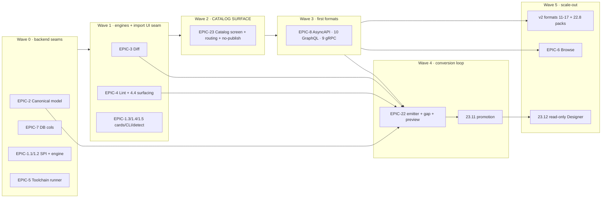

# Work Order — Multi-Format API Import & Cataloging (MFI)

> **Purpose.** A wave-based build sequence for the MFI roadmap
> (`docs/ROADMAP_MULTI_FORMAT_IMPORT.md`, umbrella **#3715**) that keeps the **UI** and the
> **import/backend** pieces in lockstep and prevents anything from being designed out-of-order.
> This is a sequencing companion to the roadmap — it does not redefine scope, it orders it.

---

## 0. The one structural fact that drives the order

**The Catalog screen (MFI-EPIC-23, #4001) is the UI landing pad for every non-OpenAPI import.**
A non-OpenAPI artifact is *not* a publishable Project — so if a format importer ships before the
Catalog screen exists, it produces artifacts no user can see, lint, or act on.

> **Sync rule #0:** never expose a format importer ahead of the surface that displays its output.

Everything below is a consequence of pairing each backend seam with the UI that consumes it, in
the same wave.



---

## 1. Waves at a glance

| Wave | Theme | Epics / key issues | Ships (import) | Ships (UI) — same wave |
|---|---|---|---|---|
| **0** | Seams & storage | EPIC-2, EPIC-7 (7.1/7.2), EPIC-1 (1.1/1.2), EPIC-5 | Canonical model + persistence, normalizer SPI, import-source SPI, generalized job engine, toolchain runner | *(none — nothing user-facing yet)* |
| **1** | Engines + import seam | EPIC-3, EPIC-4 (4.1/4.2/**4.4**), EPIC-1 (**1.3**/1.4/1.5) | Fingerprint/diff/breaking, lint/score engine | Dynamic source cards (1.3), CLI dispatch (1.4), **lint surfacing (4.4)** |
| **2** | **Catalog surface** ⟵ *sync gate* | **EPIC-23 catalog-MVP** | Catalog entity + `publishable=false`, `/catalog` API, **import routing (23.7)** | Catalog screen + card + format/source pills + nav + non-publishable enforcement + detail + lint parity |
| **3** | First formats | EPIC-8, EPIC-10, EPIC-9 | parse → normalize → discover → lint → breaking | Each format's source card + CLI (8.5/10.6/9.6) registers into the Wave-1 seam |
| **4** | Conversion loop | **EPIC-22 conv-MVP**, EPIC-23 **23.11** | Emitter, projections, gap analyzer, convert job/API, passthrough | **Fidelity preview (22.4)** paired with **Catalog "Convert to OpenAPI" promotion (23.11)** |
| **5** | Scale-out | EPIC-6, EPIC-22 (22.8), v2 formats 11–17, 23.12, 7.3 | Per-format conversion packs, remaining importers, backfill | Browse/search facets, read-only Designer view (23.12) |

---

## 2. Wave detail (with filed issue numbers)

### Wave 0 — Backend seams & storage
*No UI; safe to build fully headless — nothing is exposed, so no UI-drift risk.*

- **EPIC-2 Normalized Internal API Model** (#3717): 2.1 canonical schema (#3738) → 2.2 persistence (#3739) → 2.3 normalizer SPI (#3740); 2.4 fidelity tests (#3741).
- **EPIC-7 DB additions** (#3722): 7.1 format/protocol columns (#3756), 7.2 format metadata (#3757). *(7.3 backfill deferred to Wave 5.)*
- **EPIC-1 (backend half)** (#3716): 1.1 ImportSource SPI (#3733) → 1.2 generalized job engine (#3734).
- **EPIC-5 Polyglot Toolchain Runner** (#3720): 5.1 runner (#3750) → 5.2 packaging (#3751) → 5.3 sandbox (#3752).

**Exit criteria:** a sample adapter parses → normalizes → persists a canonical model; runner executes a pinned external tool in the sandbox.

### Wave 1 — Cross-cutting engines + the import UI seam
- **EPIC-3 Versioning/Diff** (#3718): 3.1 fingerprint (#3742) → 3.2 compare-any-two (#3743) → 3.3 breaking SPI (#3744); 3.4 tagging reuse (#3745).
- **EPIC-4 Lint/Score** (#3719): 4.1 engine+rule-pack SPI (#3746) → 4.2 score/grade (#3747) → **4.4 REST/UI/CLI surfacing (#3749)**. *(4.3 external-linter adapter as needed by formats.)*
- **EPIC-1 (UI/CLI half)** (#3716): **1.3 dynamic source cards (#3735)**, 1.4 CLI dispatch (#3736), 1.5 auto-detect (#3737).

**Why paired:** 1.3 makes any newly-registered importer self-appear in `ImportDialog`; 4.4 means lint/score is visible the moment the first artifact lands.

**Exit criteria:** registering an adapter server-side surfaces a card with no UI code change; lint findings render in REST + UI + CLI.

### Wave 2 — Catalog surface (the sync gate)
Build the landing pad **before/with** the first format so imports have a home and cannot leak to publish. Ship with an empty state; Wave 3 fills it.

- **EPIC-23 catalog-MVP** (#4001):
  - 23.1 catalog entity + `publishable=false` (#4010) → 23.2 `/catalog` API (#4011)
  - **23.7 import routing → catalog (#4016)** — the branch that sends non-OpenAPI/OpenAPI-worthy imports to the catalog
  - 23.3 screen (#4012), 23.4 card (#4013), 23.5 format/protocol/source pills (#4014), 23.6 nav (#4015)
  - 23.8 non-publishable enforcement, UI + REST (#4017)
  - 23.9 detail + source-material panel (#4018), 23.10 lint/quality parity (#4019)

**Exit criteria:** importing a non-OpenAPI fixture appears as a catalog item with a format pill + source, is viewable + lintable like a project, and has **no publish path** anywhere (UI hidden + REST refuses).

### Wave 3 — First formats (prove the seam across paradigms)
Each format now has a UI home (Catalog) and a self-registering source card. Order by reuse and live-discovery value:

- **EPIC-8 AsyncAPI** (#3723) — event paradigm; file-only; Spectral + `@asyncapi/diff`.
- **EPIC-10 GraphQL** (#3725) — graph paradigm; **live introspection**; graphql-core + GraphQL-Inspector.
- **EPIC-9 gRPC/Protobuf** (#3724) — RPC paradigm; **live reflection**; buf build/lint/breaking.

Each ends with its `source card + CLI + fixtures` issue (8.5 #3763 / 10.6 #3775 / 9.6 #3769), which only register into the Wave-1 seam.

**Exit criteria:** importing any of the three from UI + CLI yields a cataloged, lintable, diffable version with score.

### Wave 4 — Close the loop to publishable
- **EPIC-22 conv-MVP** (#4000): 22.1 emitter (#4002) → 22.2 projections (#4003) → 22.3 gap analyzer (#4004) → 22.5 convert job (#4006) → 22.6 convert API (#4007) → **22.4 preview + fidelity warning (#4005)**; 22.7 passthrough (#4008).
- **EPIC-23 bridge:** **23.11 Convert-to-Project promotion (#4020)** — the Catalog "Convert to OpenAPI" action that opens 22.4 and, on confirm, creates a publishable Project.

**Why paired:** 22.4's preview has no entry point without the catalog action (23.11); 23.11 is meaningless without the preview. They ship together.

**Exit criteria:** a cataloged item converts (with eyes-open fidelity preview) into a linked, publishable OpenAPI project; OpenAPI/Swagger/TypeSpec sources skip lossy conversion via 22.7.

### Wave 5 — Scale-out
- **EPIC-6 Browse/Search** (#3721) — lands once ≥3 formats populate the model (align with #3489/#3496).
- **EPIC-22 22.8 per-format packs (#4009)** — add incrementally as each v2 format's normalizer ships (OData/Smithy high-fidelity first).
- **v2 formats** 11 OData, 12 Avro, 13 WSDL, 14 TypeSpec, 15 RAML, 16 API Blueprint, 17 Smithy — each adds a 22.8 conversion pack and replaces its old per-epic migrate-to-OpenAPI note.
- **23.12 read-only Designer view (#4021)**, **7.3 backfill (#3758)**.

---

## 3. Guardrails — where it goes out-of-sync if you reorder

1. **Catalog screen (EPIC-23) before any non-OpenAPI importer reaches users.** #1 sync rule — output is invisible otherwise. *(Refines the roadmap's §5, which left EPIC-23 implicitly late.)*
2. **Source cards (1.3) ship with the registry (1.1/1.2).** Never hard-code a card per format, or UI lags every importer.
3. **Lint surfacing (4.4) before format imports.** So the grade/quality orbs on the Catalog card aren't dead on arrival.
4. **Preview UI (22.4) and promotion (23.11) are one unit.** Same wave — or you get a button with no screen, or a screen with no button.
5. **DB format/protocol columns (7.1) + catalog entity (23.1) before the `/catalog` API (23.2) and routing (23.7).** The format pill needs data behind it.
6. **Non-publishable enforcement (23.8) is UI + REST together, with the screen.** Otherwise incomplete imports can leak to the published surface.
7. **Toolchain runner (5.1–5.3) is Wave 0, on the critical path.** It gates every format that shells out to buf / Spectral / graphql-eslint / AMF / smithy / drafter.

---

## 4. Critical-path summary (one line per wave)

```
W0  2.1→2.2→2.3 ‖ 1.1→1.2 ‖ 5.1→5.2→5.3 ‖ 7.1/7.2
W1  3.1→3.2→3.3 ‖ 4.1→4.2→4.4 ‖ 1.3/1.4/1.5
W2  23.1→23.2→23.7 ‖ 23.3/23.4/23.5/23.6 ‖ 23.8 ‖ 23.9/23.10      ← Catalog ready (empty state)
W3  EPIC-8 ‖ EPIC-10 ‖ EPIC-9   (each: parse→normalize→discover→lint→breaking→card+CLI)
W4  22.1→22.2→22.3→22.5→22.6→22.4  then  23.11   (+ 22.7 passthrough)
W5  EPIC-6 ‖ v2 formats 11-17 (+22.8 each) ‖ 23.12 ‖ 7.3
```

`‖` = parallelizable within the wave · `→` = strict order.
