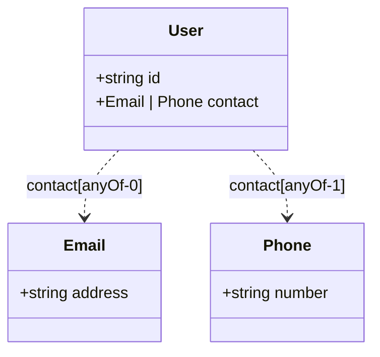

# Mermaid anyOf Property Support - Fix Documentation

## Issue
The Mermaid diagram generation did not properly capture `anyOf` (and `oneOf`, `allOf`) when used at the property level in the Canvas.

## Fix Applied

### Property Type Display
Properties with composition types now show their types using union/intersection notation:

#### anyOf (Union Types)
```typescript
// Property data:
{
  "anyOf": [
    { "$ref": "#/components/schemas/User" },
    { "$ref": "#/components/schemas/Admin" }
  ]
}

// Mermaid output:
+User | Admin propertyName
```

#### oneOf (Exclusive Union)
```typescript
// Property data:
{
  "oneOf": [
    { "type": "string" },
    { "type": "number" }
  ]
}

// Mermaid output:
+string | number propertyName
```

#### allOf (Intersection/Merge)
```typescript
// Property data:
{
  "allOf": [
    { "$ref": "#/components/schemas/BaseEntity" },
    { "$ref": "#/components/schemas/Timestamped" }
  ]
}

// Mermaid output:
+BaseEntity & Timestamped propertyName
```

#### anyOf in Arrays
```typescript
// Property data:
{
  "type": "array",
  "items": {
    "anyOf": [
      { "$ref": "#/components/schemas/Car" },
      { "$ref": "#/components/schemas/Bike" }
    ]
  }
}

// Mermaid output:
+(Car | Bike)[] propertyName
```

### Relationship Lines
Properties with composition types now generate appropriate relationship lines in the Mermaid diagram:

#### anyOf Relationships
```mermaid
ClassA ..> ClassB : propertyName[anyOf-0]
ClassA ..> ClassC : propertyName[anyOf-1]
```

Uses dashed arrows (`..>`) to indicate the alternative relationship, with indexed labels to show multiple options.

#### oneOf Relationships
```mermaid
ClassA ..> ClassB : propertyName[oneOf-0]
ClassA ..> ClassC : propertyName[oneOf-1]
```

Similar to anyOf but labeled as `oneOf` to indicate exclusivity.

#### allOf Relationships
```mermaid
ClassA ..> ClassB : propertyName[allOf-0]
ClassA ..> ClassC : propertyName[allOf-1]
```

Uses dashed arrows to indicate composition/merging.

## Example: Complete Diagram

Given the following classes:

### User Class
```json
{
  "name": "User",
  "properties": [
    {
      "name": "id",
      "data": { "type": "string" }
    },
    {
      "name": "contact",
      "data": {
        "anyOf": [
          { "$ref": "#/components/schemas/Email" },
          { "$ref": "#/components/schemas/Phone" }
        ]
      }
    }
  ]
}
```

### Email & Phone Classes
```json
{
  "name": "Email",
  "properties": [
    { "name": "address", "data": { "type": "string" } }
  ]
},
{
  "name": "Phone",
  "properties": [
    { "name": "number", "data": { "type": "string" } }
  ]
}
```

### Generated Mermaid Diagram


## Benefits

1. **Accurate Representation**: Properties with composition types are now properly displayed
2. **Type Unions**: Union types are shown with `|` operator (anyOf, oneOf)
3. **Type Intersections**: Intersection types are shown with `&` operator (allOf)
4. **Relationship Clarity**: Dashed lines distinguish composition relationships from regular associations
5. **Indexing**: Multiple alternatives are clearly indexed for clarity

## Implementation Details

### Code Changes in `generateMermaidDiagram()`

#### 1. Enhanced Property Type Detection
The property type detection now checks for:
- Direct `anyOf`, `oneOf`, `allOf` in property data
- Composition types within array items (`propData.items.anyOf`, etc.)
- Fallback to simple `$ref` or `type` handling

#### 2. Relationship Generation Refactored
- Created `addRelationship()` helper function
- Handles composition types with special dashed arrow syntax
- Iterates through all items in `anyOf`, `oneOf`, `allOf` arrays
- Maintains backward compatibility with simple `$ref` properties

### Testing Scenarios

1. **Property with anyOf referencing classes**
   - Should show union type in property list
   - Should create dashed relationships to each class

2. **Array property with anyOf items**
   - Should show `(Type1 | Type2)[]` notation
   - Should create relationships for each alternative

3. **Property with anyOf including primitive types**
   - Should show `string | number` notation
   - No relationships (primitives don't create edges)

4. **Mixed: anyOf with refs and primitives**
   - Should show all types in union
   - Only create relationships for ref types

5. **Property with oneOf (exclusive alternatives)**
   - Similar to anyOf but indicates exclusivity
   - Should use oneOf labeling

6. **Property with allOf (composition)**
   - Should show intersection with `&`
   - Should create relationships with allOf labels

## Backward Compatibility

All existing property types continue to work:
- Simple `$ref` properties
- Simple `type` properties (string, number, etc.)
- Array properties with simple items
- Regular association relationships

## Future Enhancements

Potential improvements:
1. Add notes/annotations for composition constraints
2. Support nested composition (anyOf within oneOf, etc.)
3. Color-code different composition types
4. Add legend explaining relationship line types

