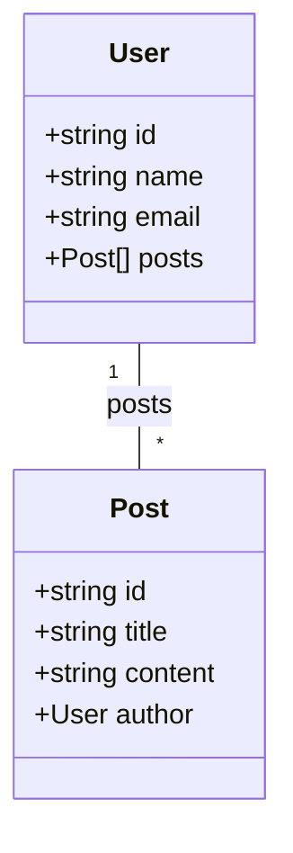

# Mermaid Diagram Feature

This document demonstrates the new Mermaid diagram view feature for the Canvas layout.

## Feature Overview

The Studio page now includes a "Mermaid" view mode that generates a Mermaid class diagram representation of your Canvas layout. This provides an alternative way to visualize and document your data models.

## How to Use

1. Open the Studio page and select a project and version
2. Click on the "Mermaid" button in the view switcher (next to "Canvas" and "Code")
3. The Mermaid diagram code will be displayed in the Monaco editor
4. Use the "Copy" button to copy the diagram code to your clipboard
5. Use the "Export" button to download the diagram as a `.mmd` file

## Example Output

For a simple data model with User and Post classes, the Mermaid output would look like:



## Relationship Types

The Mermaid generator handles the following relationship types:

### Property References (Associations)
- **One-to-One**: `Class1 "1" -- "1" Class2`
- **One-to-Many**: `Class1 "1" -- "*" Class2`
- **Many-to-Many**: `Class1 "*" -- "*" Class2`
- **Unidirectional**: `Class1 "1" --> Class2`

### Composition Relationships
- **allOf (Inheritance)**: `ParentClass <|-- ChildClass : inherits`
- **anyOf (Alternatives)**: `BaseClass <.. AlternativeClass : anyOf`
- **oneOf (Exclusive)**: `BaseClass <.. ExclusiveClass : oneOf`

## Implementation Details

The Mermaid diagram is generated from the same data structure used by the Canvas view:
- Class definitions include all properties with their types
- Array types are shown with `[]` notation
- Reference types are shown with the referenced class name
- Bidirectional relationships are detected and properly represented
- Class names are sanitized to be valid Mermaid identifiers

## Benefits

1. **Documentation**: Easily document your data models in markdown files
2. **Portability**: Mermaid diagrams can be embedded in GitHub, GitLab, and many other platforms
3. **Version Control**: Track changes to your data model structure in a text format
4. **Integration**: Use the diagram code in documentation tools like MkDocs, Docusaurus, etc.

## File Format

The exported `.mmd` file is a plain text file containing the Mermaid diagram code. It can be:
- Embedded in markdown files using ` ```mermaid ` code blocks
- Rendered using Mermaid CLI tools
- Viewed in any Mermaid-compatible editor or viewer
- Stored in version control systems

